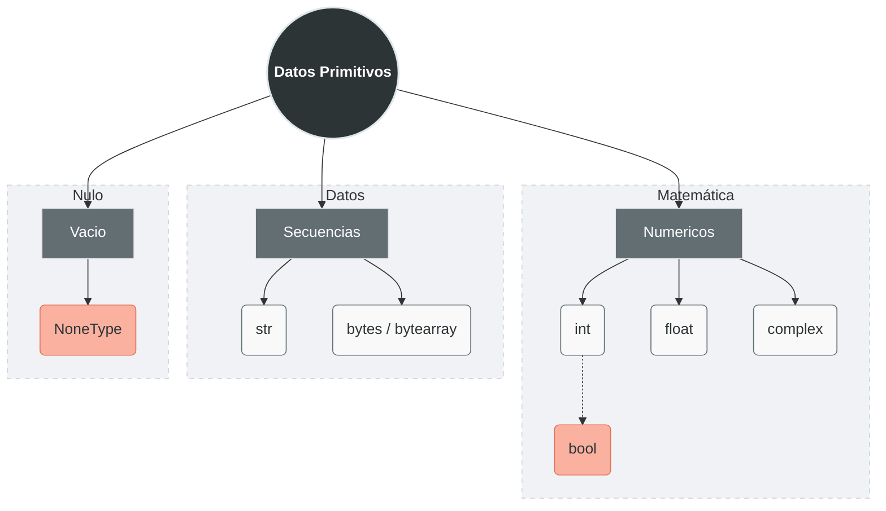

**Datos Primitivos** o **Tipos Primitivos** se refiere a los *bloques de construcción* mas básicos y fundamentales para la manipulación de datos.
Son los tipos de información más simples que el lenguaje puede procesar y que no pueden descomponerse en algo más sencillo.
# Tipos de Datos Primitivos
Aunque en Python técnicamente *todo es un objeto*, solemos categorizar como primitivos a aquellos que representan valores únicos y directos.
Podemos clasificaros en:


## Numéricos

### Entero-`int`
Es un tipo de dato que representa **números abstractos sin parte fraccionaria**. Incluye números positivos, negativos y el cero. En Python, los enteros tienen **precisión arbitraria**, lo que significa que el único límite para el tamaño de un número es la memoria disponible de tu computadora.
#### Representación
Python permite escribir enteros en diferentes bases numéricas, lo cual es muy útil para [[programación de bajo nivel o sistemas|programación de bajo nivel o sistemas]]:

| Tipo                      | Funcionamiento      | Ejemplo                  |
| ------------------------- | ------------------- | ------------------------ |
| **Decimal (Base 10)**     | El estándar         | `10`,`-50`               |
| **Binario (Base 2)**      | Se le antepone `0b` | `0b1010` (10 en decimal) |
| **Octal (Base 8)**        | Se le antepone `0o` | `0o12` (10 en decimal)   |
| **Hexadecimal (Base 16)** | Se le antepone `0x` | `0xA` (10 en decimal)    |
> [!tip] Tip
> Se puede usar guiones bajos como separadores visuales para mejorar la legibilidad: `1_000_000` es lo mismo que `1000000`. 

#### Operaciones Básicas
Los enteros soportan las operaciones aritméticas estándar. Es vital distinguir entre los dos tipos de división:


| Operacion                                         | Función                                              | Ejemplo                   |
| ------------------------------------------------- | ---------------------------------------------------- | ------------------------- |
| **Suma (`+`), Resta (`-`), Multiplicación (`*`)** | Resultados predecibles.                              |                           |
| **División Flotante (`/`)**                       | Siempre devuelve un `float`.                         | `10 / 2` resulta en `5.0` |
| **División Entera (`//`)**                        | Trunca el resultado y devuelve solo la parte entera. | `7 // 2` resulta en `3`   |
| **Módulo (`%`)**                                  | Devuelve el residuo de la división.                  | `7 % 2` resulta en `1`    |
| **Exponente** **(**`**`**)**                      | Eleva un número a una potencia.                      | `2 ** 3` resulta en `8`   |
> [!note] Nota
> Para ver mas Operaciones revisar [[Operadores de Variables]]
#### Enteros Grandes (Arbitrary Precision)
Esta es una de las características interesante de Python. Mientras que lenguajes como Java o C++ tienen un límite máximo para un entero (usualmente $2^{63}-1$ para un _long_ de 64 bits), Python maneja el crecimiento de forma dinámica.

**Funcionamiento:**
Cuando un número supera el tamaño de palabra estándar del procesador, Python expande automáticamente la cantidad de memoria utilizada para almacenarlo.

- **Sin desbordamiento (Overflow):** No recibirás un error de `OverflowError` al realizar cálculos masivos con enteros.
    
- **Ejemplo:** Puedes calcular 21000 y Python te entregará el número exacto con todos sus dígitos sin despeinarse.
$$
2^{1000}=107150860718626732094842504906...
$$

### Flotantes-`float`
Es un tipo de dato que representa números con **punto decimal**. Se llaman "punto flotante" porque el punto decimal puede "flotar" entre los dígitos significativos, permitiendo representar números muy grandes o muy pequeños.

> [!note] Nota
> En Python, los `float` se implementan usando el formato de "doble precisión" (64 bits)

#### Precisión
La precisión de un flotante no es infinita. Al tener solo 64 bits de espacio, Python puede representar aproximadamente **15 a 17 dígitos significativos**.
- Si intentas manejar un número con 30 decimales, Python "cortará" el resto.
- Esto es suficiente para la mayoría de los cálculos científicos, pero crítico en sistemas financieros (donde se prefiere usar el módulo `decimal`).

#### Limites
A diferencia de los enteros, los flotantes **sí tienen un límite máximo y mínimo**. Si intentas superar estos límites, Python te devolverá errores o valores especiales:

- **Límite superior:** Aproximadamente $1.8 \times 10^{308}$. Si lo superas, obtendrás `inf` (infinito). 
- **Límite inferior (Cercano a cero):** Aproximadamente $5.0 \times 10^{-324}$. Más allá de esto, el número se convierte en `0.0`.
- **NaN (Not a Number):** Resultado de operaciones matemáticas imposibles (como `inf - inf`).

#### Problemas de Punto Flotante
Este es el apartado más importante para un desarrollador. El problema principal nace de que las computadoras cuentan en base 2 (binario), pero nosotros contamos en base 10 (decimal).

##### El Dilema del `0.1 + 0.2`

En base 10, 0.1 es una fracción simple ($\frac{1}{10}$). Sin embargo, en binario, 0.1 es una **fracción periódica infinita** (como $\frac{1}{3}=0.3333\dots$ en decimal). La computadora debe cortar esa secuencia infinita, lo que genera un pequeño error de redondeo.

```python
print(0.1 + 0.2) 
# Resultado: 0.30000000000000004
```

##### Consecuencias prácticas:

1. **Nunca compares flotantes con `==`:** * _Mal:_ `if x == 0.3:` (Puede fallar por el error de redondeo).
    - _Bien:_ `if abs(x - 0.3) < 0.00001:` (Comprobar si son "suficientemente cercanos").
2. **Pérdida de importancia:** Al sumar un número muy pequeño a uno muy grande, el pequeño puede desaparecer por completo debido a la limitación de los 15-17 dígitos de precisión.


> [!tip] tip 
> Si se desea un mejor precision y se desea trabajar con decimales existe un [[Modulo y Paquetes |Modulo]] de python que permite incluir un dato numerico nuevo que posee mayores ventajas:
> ```python
> from decimal import Decimal
> ```

### Complejos-`complex`
Un número complejo es un número que consta de dos partes: una **parte real** y una **parte imaginaria**. En matemáticas, la unidad imaginaria se representa con una `i` ($\sqrt{ -1 }$), pero Python (siguiendo la tradición de los ingenieros electricistas) se utiliza la letra **`j`**.

Son fundamentales en campos como la física, el procesamiento de señales, la ingeniería y el análisis de datos científicos.

#### Representación

En Python, puedes crear un número complejo de dos maneras:
1. **Literal directa:** Escribiendo la parte real seguida de la imaginaria con el sufijo `j`.
    - `z = 3 + 5j`
2. **Constructor `complex()`:** Usando la función integrada.
    - `z = complex(3, 5)`
 
**Acceso a sus partes**

Un objeto `complex` tiene dos propiedades inmutables que puedes consultar:

- `z.real`: Devuelve la parte real como un `float` (`3.0`).
- `z.imag`: Devuelve la parte imaginaria como un `float` (`5.0`).

Ejemplo
```python
numero = complex(3,5)
re = numero.real
im = numero.imag
print (re) # Imprime 3.0
print (im) # Imprime 5.0
```

#### Operaciones Básicas

Python maneja el álgebra de números complejos de forma automática, respetando las reglas matemáticas:

- **Suma y Resta:** Se suman/restan las partes reales con las reales e imaginarias con las imaginarias.
    - `(1 + 2j) + (3 + 4j)` → `4 + 6j`    
- **Multiplicación:** Se aplica la propiedad distributiva teniendo en cuenta que j2=−1.
    - `(1j * 1j)` → `(-1 + 0j)`    
- **División:** Python realiza la multiplicación por el conjugado internamente para resolverla.
- **Conjugado:** Puedes obtener el conjugado (cambiar el signo de la parte imaginaria) con el método `.conjugate()`.
    - `(3 + 5j).conjugate()` → `3 - 5j`

```python
num1 = (1+2j)+(3+4j)     # num1 = 4+6j    
num2 = (1j + 1j)         # num2 = -1+0j
num3 = num1 / num2       # num3 = -4-6j
num4 = num1.conjugate()  # num4 = 4-6j
```

> [!note] Nota
> Para ver mas Operaciones revisar [[Operadores de Variables]]


### Booleanos-`bool`
El tipo `bool` representa valores de **lógica binaria**. Se utiliza para evaluar si una condición es verdadera o falsa, siendo la base de todas las [[100 Programación Orientada a Procesos/20 Estructuras de Control/index|estructuras de control]] (como los `if` y los `while`). Solo puede tener dos valores:
- **`True`** (Verdadero)
- **`False`** (Falso)

> [!note] Notate
>  En Python, los valores booleanos deben escribirse siempre con la **primera letra en mayúscula**caso contrario lanzará un error de nombre.
>  ```python
>  a = True   # True con mayusculas, Bien
>  b = true   # true con minusculas, Mal
>  ```

#### True/False como subclase de `int`
Python se diferencia de otros lenguajes: **un booleano es técnicamente un número entero**.

Históricamente, Python no tenía un tipo booleano dedicado y usaba `0` para falso y `1` para verdadero. Cuando se introdujo el tipo `bool`, se hizo como una **subclase de `int`** para mantener la compatibilidad hacia atrás.

**Evidencias de esta relación:**

1. **Valores numéricos:** `True` equivale a `1` y `False` equivale a `0`.
2. **Operaciones aritméticas:** Puedes realizar cálculos matemáticos con booleanos (aunque no es una práctica recomendada por legibilidad).
    - `True + True` → `2`
    - `True * 10` → `10`    
    - `False - 5` → `-5`


#### La lógica de la "Verdad" ([[Valores Truthy y Falsy|Truthiness]])

Dado que los booleanos son números, Python extiende este concepto a otros tipos de datos. Casi cualquier objeto en Python puede evaluarse en un contexto booleano:

- **Valores que equivalen a `False`:**
    - El número `0` (`0`, `0.0`, `0j`).
    - [[Estructuras de Datos|Contenedores vacíos]] (`""`, `[]`, `()`, `{}`).
    - El valor `None`.
- **Valores que equivalen a `True`:**
    - Cualquier número distinto de cero.
    - Cualquier cadena o contenedor que no esté vacío.

> [!note] Nota
> Si se desea entender mejor la logica de "Verdad" de Python, revisar: [[Valores Truthy y Falsy|Valores Truthy y Falsy]]
## Secuencias

### Dato Cadena-`str`
Una cadena (**string**) es una **secuencia inmutable de caracteres**. "Inmutable" significa que, una vez creada, no puedes cambiar una letra individual de esa cadena; para "modificarla", Python en realidad crea una nueva cadena en memoria.

Se definen usando comillas simples (`'...'`), dobles (`"..."`) o triples (`'''...'''` o `"""..."""`) para textos de múltiples líneas.
#### Caracteres
A diferencia de lenguajes como C o Java, Python **no tiene un tipo de dato "Char"** (carácter único).

- Un carácter individual en Python es simplemente una cadena con longitud 1 (`len(s) == 1`).
- Cada elemento de la secuencia tiene un **índice** (empezando desde 0).
- Puedes acceder a ellos mediante _slicing_ o indexación: `cadena[0]`.

#### Codificación UTF-8

Este es el punto técnico más importante: **En Python 3, todas las cadenas son Unicode.**
> [!info] Información
> Antiguamente, las computadoras usaban ASCII (que solo cubría el alfabeto inglés). Unicode es un estándar que asigna un número único (punto de código) a cada símbolo de cada idioma del mundo, incluyendo emojis y símbolos matemáticos.
> - **Unicode** es el "mapa" (qué número corresponde a qué letra).
> - **UTF-8** es el "formato de almacenamiento" (cómo se traducen esos números a bits).
    

Python utiliza UTF-8 de forma predeterminada para leer y escribir archivos de código fuente. 

Ejemplo:

```python
variable = "Mañana"  # La 'ñ' es un carácter Unicode
emoji = "🐍"         # Los emojis también son caracteres válidos
```


### Datos Binarios
En Python, los datos binarios son secuencias de números enteros en el rango **0 ≤ x < 256**. Cada número representa un **byte** (8 bits). Son esenciales cuando trabajas con:

- Imágenes o archivos de audio.
- Información enviada a través de una red (sockets).
- Archivos comprimidos o encriptados.
    
#### Bytes-`bytes`

Es la versión **inmutable** de los datos binarios. Una vez que creas un objeto de bytes, no puedes modificar sus elementos.

- **Representación:** Se definen anteponiendo una `b` a las comillas.
    - `datos = b"Hola"`    
- **Comportamiento:** Si intentas acceder a un índice, Python te devolverá el valor entero ASCII/Unicode del carácter.

    ```python
    b_msg = b"ABC"
    print(b_msg[0]) # Resultado: 65 (el código de la 'A')
    ```
 
#### Bytearray-`bytearray`

Es la versión **mutable** de los bytes. Es muy útil cuando necesitas recibir datos binarios y modificarlos sin tener que crear una copia nueva en memoria cada vez (lo que ahorra muchos recursos).

- **Representación:** Se crea mediante el constructor `bytearray()`.
    - `ba = bytearray(b"Hola")`
- **Flexibilidad:** Puedes cambiar valores directamente usando su índice.
    ```python
    ba = bytearray(b"Hola")
    ba[0] = 77 # 77 es el código ASCII de 'M'
    print(ba)  # Resultado: bytearray(b'Mola')
    ```
 
### Comparativa: `str` - `bytes` - `bytearray`

|Característica|`str`|`bytes`|`bytearray`|
|---|---|---|---|
|**Contenido**|Caracteres Unicode|Enteros (0-255)|Enteros (0-255)|
|**Mutable**|No|**No**|**Sí**|
|**Uso común**|Texto legible|Almacenamiento/Red|Manipulación de buffers|

## Vació-`None`
En Python, **`None`** es un objeto especial que se utiliza para señalar la **ausencia de valor** o un estado de **vacío definido**. A diferencia de otros lenguajes que usan `null` o `nil`, en Python `None` es un objeto único (un _singleton_), lo que significa que todas las variables que valen `None` apuntan exactamente al mismo lugar en la memoria.

Su tipo de dato oficial es `NoneType`.

### Representación y Uso

`None` no es lo mismo que el número `0`, no es lo mismo que una cadena vacía `""`, y no es lo mismo que `False`. Es, simplemente, la falta de datos.

**Casos de uso comunes:**
- **Inicialización:** Cuando declaras una variable pero aún no tienes un valor real para ella.
- **Retorno por defecto:** Si una [[Funciones|función]] no tiene una sentencia `return` explícita, Python devuelve `None` automáticamente.
- **Parámetros opcionales:** Se usa para identificar si un usuario pasó o no un argumento a una función.

### Identidad y Comparación

Debido a que `None` es un objeto único en todo el programa, la documentación oficial recomienda **siempre** usar el operador de identidad `is` en lugar del operador de igualdad `==`.

- **Correcto:** `if variable is None:` (Pregunta: "¿Es este objeto exactamente el mismo que el objeto None?")
- **Incorrecto:** `if variable == None:` (Pregunta: "¿El valor de este objeto es igual a None?")
    
