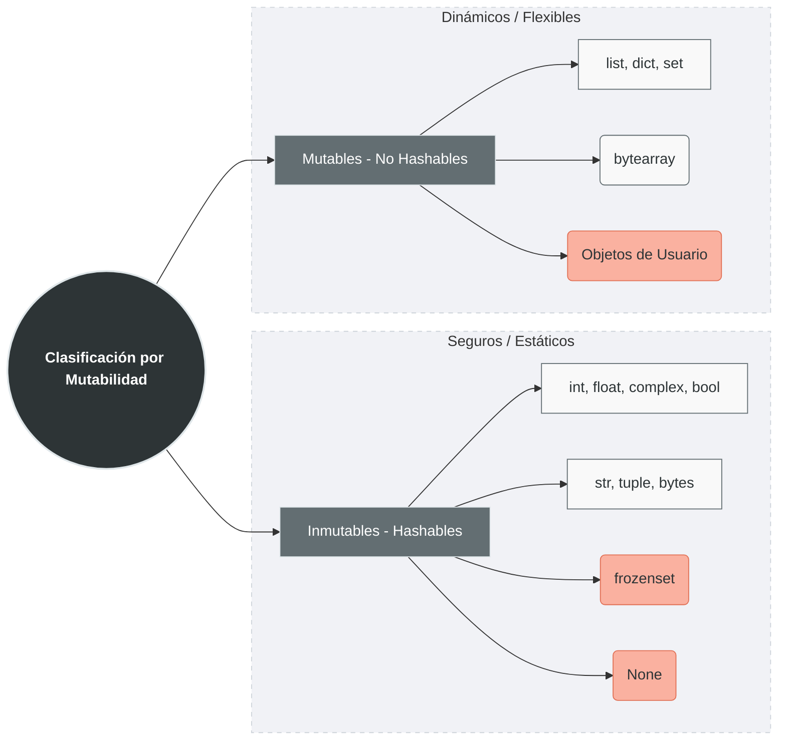

La mutabilidad en Python es una propiedad del **tipo de dato**, no del valor. El intérprete CPython implementa esta distinción a nivel de C, donde cada tipo define si sus instancias pueden ser modificadas *in-place*.

- **Inmutable:** Es un objeto cuyo contenido **no puede cambiar** después de ser creado. Si intentas "modificarlo", Python en realidad crea un objeto nuevo en una dirección de memoria distinta.
- **Mutable:** Es un objeto que **permite cambiar su contenido** interno sin cambiar su identidad (su dirección en memoria).


> [!tip] Tip
> Puedes comprobar esto con la función `id(objeto)`. Si el `id` cambia tras una operación, el dato es inmutable.
> ```python
># Verificación de identidad y mutabilidad
>a = (1, 2, 3)  # Tupla - inmutable
>b = [1, 2, 3]  # Lista - mutable
>
>print(f"id(a) antes: {id(a)}")  # Ej: 140245...
>a = a + (4,)  # Crea NUEVA tupla
>print(f"id(a) después: {id(a)}")  # DIFERENTE id
>
>print(f"\nid(b) antes: {id(b)}")  # Ej: 140123...
>b.append(4)  # Modifica EN SITIO
>print(f"id(b) después: {id(b)}")  # MISMO id
>```


# Clasificación de Datos



## I. Tipos Inmutables (Hashables)

Son seguros y predecibles. Se pueden usar como claves en [[03 Diccionarios|diccionarios]].

- **Numéricos:** `int`, `float`, `complex`, `bool`.
- **Secuencias:** `str`, `tuple`, `bytes`.
- **Conjuntos especiales:** `frozenset` (la versión inmutable del `set`).
- **Constantes:** `None`.

## II. Tipos Mutables (No Hashables)

Son potentes pero requieren cuidado, ya que los cambios en una variable pueden afectar a otras que apunten al mismo objeto.

- **Colecciones:** `list`, `dict`, `set`.
- **Binarios:** `bytearray`.
- **Estructuras de usuario:** La mayoría de los **Objetos personalizados** (clases) son mutables por defecto.

## Niveles de Inmutabilidad: Los Matices

### 1. **Inmutabilidad Estricta vs. Relativa**
- **Estricta**: `int`, `float`, `str`, `bytes`, `tuple` (de elementos inmutables)
- **Relativa**: `tuple` con elementos mutables (la tupla no cambia, pero su contenido sí)

```python
# Tupla con lista - inmutabilidad "superficial"
t = ([1, 2], 3)
print(f"id(t): {id(t)}")  # Constante
t[0].append(3)  # ¡PERMITIDO! La lista dentro cambia
print(f"t después: {t}")  # ([1, 2, 3], 3)
```

### 2. **`frozenset`: El Conjunto Inmutable**
```python
fs = frozenset([1, 2, 3])
# fs.add(4)  # Error: 'frozenset' object has no attribute 'add'

# Pero puede contener otros frozensets
fs2 = frozenset([fs, frozenset([4, 5])])
print(fs2)  # frozenset({frozenset({1, 2, 3}), frozenset({4, 5})})
```

## Mecanismos Internos: Cómo Python Gestiona la Mutabilidad

### 1. **Pool de Enteros y Caché de Strings**
```python
# Python cachea enteros pequeños (-5 a 256) y strings cortos
a = 100
b = 100
print(a is b)  # True - MISMO objeto

c = 1000
d = 1000
print(c is d)  # False (en modo interactivo) o True (en scripts)
```

### 2. **Interning de Strings**
```python
s1 = "hello"
s2 = "hello"
print(s1 is s2)  # True - mismo objeto por interning

# No todos los strings son internados
s3 = "hello world!"
s4 = "hello world!"
print(s3 is s4)  # False (depende del contexto)
```

## Implicaciones en el Rendimiento

### **Ventajas de los Inmutables:**
- **Seguridad en hilos**: No requieren bloqueos (thread-safe)
- **Cacheabilidad**: Pueden ser cacheados por su hash
- **Claves de diccionario**: Acceso O(1) garantizado
- **Compartición de memoria**: Múltiples referencias al mismo objeto

### **Costes de los Mutables:**
- **Aliasing problemático**: Cambios inesperados
- **No thread-safe**: Requieren sincronización
- **No hashables**: No pueden ser claves de dict


## Tabla Comparativa Detallada

| Tipo | Mutable | Hashable | Thread-safe | Copia por defecto | Uso memoria |
|------|---------|----------|-------------|-------------------|-------------|
| `int`, `float` | ❌ | ✅ | ✅ | Por valor | Optimizado |
| `str` | ❌ | ✅ | ✅ | Por valor | Interning |
| `tuple` | ❌* | ✅ | ✅ | Por valor | Eficiente |
| `list` | ✅ | ❌ | ❌ | Por referencia | Dinámico |
| `dict` | ✅ | ❌ | ❌ | Por referencia | Hash table |
| `set` | ✅ | ❌ | ❌ | Por referencia | Hash table |
| `frozenset` | ❌ | ✅ | ✅ | Por valor | Hash table |


# Temas Avanzados
> [!warning] Advertencia
> Estos parte se recomienda buscar información extra dado que se requiere de temas de los que aun no se hablaran

## Casos Especiales y Excepciones

### 1. **`array.array` y `collections.deque`**
```python
import array
arr = array.array('i', [1, 2, 3])
arr[0] = 99  # Mutable como lista, pero tipo homogéneo
```

### 2. **Namedtuples y Dataclasses Inmutables**
```python
from collections import namedtuple
from dataclasses import dataclass

Point = namedtuple('Point', ['x', 'y'])
p = Point(1, 2)
# p.x = 3  # Error: can't set attribute

@dataclass(frozen=True)
class InmutableData:
    name: str
    value: int

data = InmutableData("test", 42)
# data.value = 99  # Error: frozen instance
```

## Patrones de Diseño Basados en Mutabilidad

### 1. **Builder Pattern con Inmutables**
```python
# Creación incremental de strings (eficiente con join)
parts = []
for i in range(1000):
    parts.append(f"item_{i}")
result = "".join(parts)  # Una sola asignación
```

### 2. **Inmutabilidad Funcional**
```python
def procesar_datos(datos_inmutables):
    # En lugar de modificar, crear nuevo
    return tuple(x * 2 for x in datos_inmutables)

original = (1, 2, 3)
procesado = procesar_datos(original)
# 'original' permanece sin cambios
```
