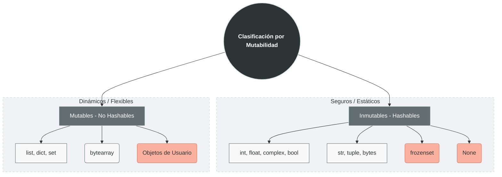

En Python, cada vez que creas un dato, se genera un **objeto** en memoria con un identificador único. La mutabilidad se define así:

- **Inmutable:** Es un objeto cuyo contenido **no puede cambiar** después de ser creado. Si intentas "modificarlo", Python en realidad crea un objeto nuevo en una dirección de memoria distinta.
- **Mutable:** Es un objeto que **permite cambiar su contenido** interno sin cambiar su identidad (su dirección en memoria).
    

> [!tip] Tip
> Puedes comprobar esto con la función `id(objeto)`. Si el `id` cambia tras una operación, el dato es inmutable.

# Clasificación de Datos



## I. Tipos Inmutables (Hashables)

Son seguros y predecibles. Se pueden usar como claves en [[Diccionarios|diccionarios]].

- **Numéricos:** `int`, `float`, `complex`, `bool`.
- **Secuencias:** `str`, `tuple`, `bytes`.
- **Conjuntos especiales:** `frozenset` (la versión inmutable del `set`).
- **Constantes:** `None`.

## II. Tipos Mutables (No Hashables)

Son potentes pero requieren cuidado, ya que los cambios en una variable pueden afectar a otras que apunten al mismo objeto.

- **Colecciones:** `list`, `dict`, `set`.
- **Binarios:** `bytearray`.
- **Estructuras de usuario:** La mayoría de los **Objetos personalizados** (clases) son mutables por defecto.

# Implicaciones Prácticas

## A. Asignación vs. Modificación

Cuando "modificas" un inmutable, estás reasignando una etiqueta:

```python
x = 10
x = x + 1  # No cambiaste el 10, creaste un 11 y x ahora apunta allí.
```

En un mutable, cambias el interior:

```python
lista = [1, 2]
lista.append(3) # El objeto 'lista' sigue siendo el mismo, pero ahora es más grande.
```

## B. Copia Superficial (Shallow) vs. Profunda (Deep)

Esto es vital en tipos mutables:

- **Copia Superficial:** Copia el contenedor, pero si dentro hay otros objetos mutables, ambos comparten la misma referencia.
    
- **Copia Profunda:** Crea una réplica exacta e independiente de absolutamente todo el contenido.
    

## C. Uso como claves en Diccionarios

Los diccionarios en Python usan una "Tabla Hash" para encontrar valores rápido.

- **Regla de oro:** Solo los tipos **Inmutables** pueden ser claves de un diccionario.
- _¿Por qué?_ Si usaras una lista como clave y luego la modificaras, el diccionario "perdería" la ubicación del dato porque su hash habría cambiado.
    


