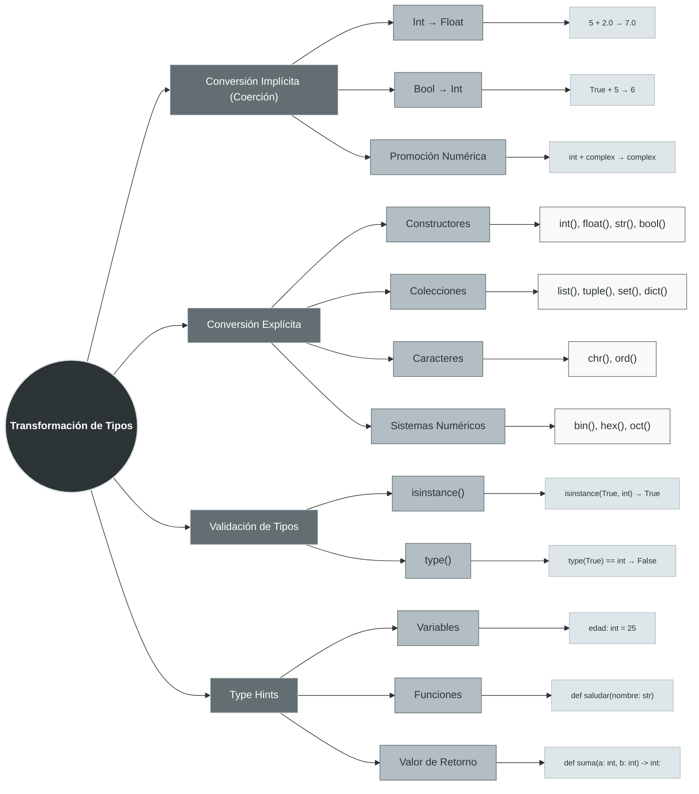
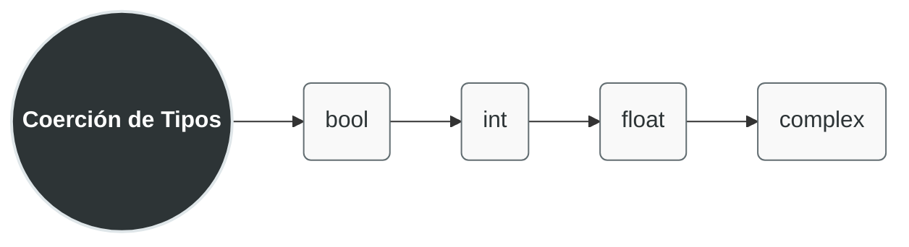

## Conversión Implícita (Coerción)

La **coerción** ocurre automáticamente cuando Python realiza una operación entre tipos diferentes. El intérprete sigue reglas de **promoción de tipos** para evitar pérdida de información.

### Reglas de Promoción Jerárquica

**Jerarquía de promoción (de menor a mayor capacidad):**


**`str` mantiene su propio espacio**

# Ejemplos detallados:

```python
# 1. Int + Float → Float
resultado = 5 + 2.0        # 7.0 (int promovido a float)
print(type(resultado))     # <class 'float'>

# 2. Booleanos como enteros
print(True + 5)           # 6 (True = 1)
print(False * 10)         # 0 (False = 0)
print(True + True)        # 2

# 3. Promoción completa
print(type(True + 3.14))  # <class 'float'>
print(type(5 + 3j))       # <class 'complex'> (int + complex → complex)

# 4. Strings NO se convierten implícitamente
# print("5" + 3)          # Error: can only concatenate str to str
```

### Tabla de Coerción Automática

| Operación | Tipo Resultado | Ejemplo | Valor Resultante |
|-----------|----------------|---------|------------------|
| `bool` + `int` | `int` | `True + 5` | `6` |
| `bool` + `float` | `float` | `False + 3.14` | `3.14` |
| `int` + `float` | `float` | `7 + 2.5` | `9.5` |
| `int/float` + `complex` | `complex` | `5 + 3j` | `5+3j` |
| `bool` en contexto aritmético | `int` | `sum([True, False, True])` | `2` |

## Conversión Explícita (Casting)

Cuando necesitas control total sobre la transformación de tipos, usas **conversión explícita** mediante [[Funciones Constructoras|funciones constructoras]].

### A. Constructores Fundamentales
#### `int()`-Conversión a entero

```python
print(int(3.9))           # 3 (trunca, NO redondea)
print(int(-2.7))          # -2 (trunca hacia cero)
print(int("100"))         # 100
print(int("101", 2))      # 5 (convierte binario "101" a decimal)
print(int("FF", 16))      # 255 (hexadecimal a decimal)
```

#### `float()`-Conversión a punto flotante

```python
print(float("10.5"))      # 10.5
print(float(7))           # 7.0
print(float("inf"))       # inf (infinito positivo)
print(float("-inf"))      # -inf (infinito negativo)
print(float("nan"))       # nan (Not a Number)
```

#### `str()`-Representación textual

```python
print(str(42))            # "42"
print(str([1, 2, 3]))     # "[1, 2, 3]"
print(str(3.14159))       # "3.14159"
```

#### `bool()`-Evaluación de [[Valores Truthy y Falsy|truthiness]]

```python
print(bool(0))            # False
print(bool(1))            # True
print(bool(""))           # False (string vacío)
print(bool("Hola"))       # True
print(bool([]))           # False (lista vacía)
print(bool([1, 2]))       # True
print(bool(None))         # False
```

### B. Constructores de Colecciones
# `list()` - Crea [[01 Listas|lista]] desde iterable

```python
print(list("Python"))           # ['P', 'y', 't', 'h', 'o', 'n']
print(list((1, 2, 3)))          # [1, 2, 3]
print(list({1, 2, 3}))          # [1, 2, 3] (orden puede variar)
print(list(range(5)))           # [0, 1, 2, 3, 4]
```

# `tuple()` - Crea [[02 Tuplas|tupla]] desde iterable

```python
print(tuple([1, 2, 3]))         # (1, 2, 3)
print(tuple("abc"))             # ('a', 'b', 'c')
```

# `set()` - Crea [[04 Conjunto|conjunto]] (elimina duplicados)

```python
print(set([1, 2, 2, 3, 3]))     # {1, 2, 3}
print(set("banana"))            # {'b', 'a', 'n'}
```

# `dict()` - Crea [[03 Diccionarios|diccionario]]

```python
print(dict([('a', 1), ('b', 2)]))  # {'a': 1, 'b': 2}
print(dict(a=1, b=2))               # {'a': 1, 'b': 2}
print(dict(zip(['x', 'y'], [5, 6]))) # {'x': 5, 'y': 6}
```

### C. Caracteres y Sistemas Numéricos


#### `chr()` - Entero a carácter Unicode

```python
print(chr(65))            # 'A'
print(chr(8364))          # '€' (símbolo del euro)
print(chr(128512))        # '😀' (emoji)
```

#### `ord()` - Carácter a código Unicode

```python
print(ord('A'))           # 65
print(ord('€'))           # 8364
print(ord('😀'))          # 128512
```

#### Sistemas numéricos (devuelven strings)

```python
print(bin(10))            # '0b1010'
print(hex(255))           # '0xff'
print(oct(64))            # '0o100'
```


#### Convertir de nuevo a entero

```python
print(int('0b1010', 2))   # 10
print(int('0xff', 16))    # 255
print(int('0o100', 8))    # 64
```

## Validación de Tipos

### `isinstance()` vs `type()`  DIFERENCIA FUNDAMENTAL:

```python
# type() - Comparación exacta
x = True
print(type(x))                # <class 'bool'>
print(type(x) == int)         # False
print(type(x) == bool)        # True

# isinstance() - Verifica tipo O subtipo
print(isinstance(x, bool))    # True
print(isinstance(x, int))     # True (bool ES subclase de int)
print(isinstance(x, (int, float, complex)))  # True (puede verificar múltiples tipos)

# Ejemplos prácticos
valores = [10, 3.14, "texto", True, [1, 2], None]

for valor in valores:
    if isinstance(valor, (int, float)):
        print(f"{valor} es numérico")
    elif isinstance(valor, str):
        print(f"{valor} es texto")
    elif isinstance(valor, bool):
        print(f"{valor} es booleano")
    else:
        print(f"{valor} es otro tipo")

# Verificación de colecciones
lista = [1, 2, 3]
print(isinstance(lista, list))      # True
print(isinstance(lista, (list, tuple, set)))  # True
```

### Tabla Comparativa: `type()` vs `isinstance()`

| Aspecto | `type(obj)` | `isinstance(obj, tipo)` |
|---------|-------------|-------------------------|
| **Herencia** | Ignora herencia | Considera herencia |
| **Múltiples tipos** | No directo | `isinstance(obj, (tipo1, tipo2))` |
| **Performance** | Ligeramente más rápido | Ligeramente más lento |
| **Uso recomendado** | Cuando necesitas tipo EXACTO | En la mayoría de casos |
| **Funciona con ABCs** | No | Sí (con clases abstractas) |

## Type Hints (Sugerencias de Tipo)

```python
# Variables con type hints
nombre: str = "Ana"
edad: int = 30
precio: float = 19.99
activo: bool = True
calificaciones: list[float] = [4.5, 3.8, 4.0]  # Python 3.9+
config: dict[str, any] = {"tema": "oscuro", "notificaciones": True}

# Funciones con type hints
def calcular_iva(monto: float, porcentaje: float = 0.16) -> float:
    """Calcula el IVA de un monto."""
    return monto * porcentaje

# Tipos opcionales (Union Types)
from typing import Optional, Union

def buscar_usuario(id_usuario: int) -> Optional[str]:
    """Devuelve nombre o None si no existe."""
    # Implementación...
    return None

# Múltiples tipos posibles
def procesar(valor: Union[int, float, str]) -> float:
    """Convierte diferentes tipos a float."""
    return float(valor)

# Python 3.10+ (usando | en lugar de Union)
def procesar_moderno(valor: int | float | str) -> float:
    return float(valor)

# Type hints para listas y diccionarios (forma antigua)
from typing import List, Dict, Tuple

def procesar_datos(datos: List[Dict[str, float]]) -> Tuple[float, float]:
    """Procesa una lista de diccionarios."""
    # Implementación...
    return (0.0, 0.0)
```

### Ventajas de los Type Hints

1. **Documentación automática**: Los editores muestran tipos esperados
2. **Mejor autocompletado**: IDE sugiere métodos apropiados
3. **Herramientas de análisis estático**: mypy, pylint, pyright
4. **Menos errores en tiempo de ejecución**: Detecta problemas antes
5. **Código más mantenible**: Clarifica intenciones

## Ejercicios Prácticos y Casos Comunes

### 1. Conversiones Seguras con Manejo de Errores

```python
def convertir_a_entero_seguro(valor):
    """Intenta convertir a entero, devuelve None si falla."""
    try:
        return int(valor)
    except (ValueError, TypeError):
        return None

# Pruebas
print(convertir_a_entero_seguro("123"))     # 123
print(convertir_a_entero_seguro("12.3"))    # None (float string)
print(convertir_a_entero_seguro("abc"))     # None
print(convertir_a_entero_seguro(None))      # None

def convertir_cadena_numerica(valor: str) -> Union[int, float, None]:
    """Convierte string a número manteniendo tipo."""
    try:
        if '.' in valor or 'e' in valor.lower():
            return float(valor)
        else:
            return int(valor)
    except ValueError:
        return None
```

### 2. Validación de Datos de Entrada

```python
def validar_formulario(datos: dict) -> tuple[bool, list[str]]:
    """Valida tipos en formulario."""
    errores = []
    
    if not isinstance(datos.get('nombre'), str):
        errores.append("Nombre debe ser texto")
    
    if not isinstance(datos.get('edad'), int) or datos.get('edad', 0) <= 0:
        errores.append("Edad debe ser entero positivo")
    
    if not isinstance(datos.get('precio'), (int, float)):
        errores.append("Precio debe ser numérico")
    
    return len(errores) == 0, errores

# Uso
resultado, mensajes = validar_formulario({
    'nombre': 'Carlos',
    'edad': 25,
    'precio': 99.99
})
```

### 3. Conversiones en Procesamiento de Datos

```python
def normalizar_datos(fila: list) -> list:
    """Normaliza tipos en una fila de datos."""
    normalizada = []
    
    for elemento in fila:
        if isinstance(elemento, str):
            # Intenta convertir strings numéricos
            elemento = elemento.strip()
            if elemento.replace('.', '', 1).isdigit():
                normalizada.append(float(elemento))
            elif elemento.isdigit():
                normalizada.append(int(elemento))
            else:
                normalizada.append(elemento)
        else:
            normalizada.append(elemento)
    
    return normalizada

# Ejemplo
datos_crudos = ["123", "45.67", "texto", "  89  ", "0.5e-2"]
print(normalizar_datos(datos_crudos))
# [123, 45.67, 'texto', 89, 0.005]
```

## Tabla de Referencia Rápida

| Conversión | Función | Ejemplo | Resultado |
|------------|---------|---------|-----------|
| **A Entero** | `int()` | `int("100")` | `100` |
| **A Float** | `float()` | `float(7)` | `7.0` |
| **A String** | `str()` | `str([1,2])` | `"[1, 2]"` |
| **A Bool** | `bool()` | `bool("")` | `False` |
| **A Lista** | `list()` | `list("abc")` | `['a','b','c']` |
| **A Tupla** | `tuple()` | `tuple([1,2])` | `(1, 2)` |
| **A Conjunto** | `set()` | `set([1,1,2])` | `{1, 2}` |
| **A Binario** | `bin()` | `bin(10)` | `'0b1010'` |
| **Carácter** | `chr()` | `chr(65)` | `'A'` |
| **Código** | `ord()` | `ord('A')` | `65` |

## Buenas Prácticas

1. **Prefiere `isinstance()` sobre `type()`** para mayor flexibilidad
2. **Usa try-except** para conversiones que pueden fallar
3. **Documenta con type hints** en funciones complejas
4. **Considera el contexto** antes de convertir (¿es necesario?)
5. **Valida entradas temprano** para evitar errores posteriores
6. **Usa herramientas de análisis estático** como mypy con type hints

## Errores Comunes a Evitar

```python
# MAL: Asumir que float() siempre funciona
# valor = float(input_usuario)  # Puede lanzar ValueError

# BIEN: Validar antes
entrada = input_usuario
if entrada.replace('.', '', 1).isdigit():
    valor = float(entrada)
else:
    # Manejar error

# MAL: type() para verificar herencia
if type(True) == int:  # False (bool ≠ int)
    pass

# BIEN: isinstance() considera herencia
if isinstance(True, int):  # True (bool es subclase de int)
    pass

# MAL: Conversiones implícitas arriesgadas
# resultado = "10" * 2  # "1010" (repetición, no multiplicación)

# BIEN: Conversión explícita
resultado = int("10") * 2  # 20
```
