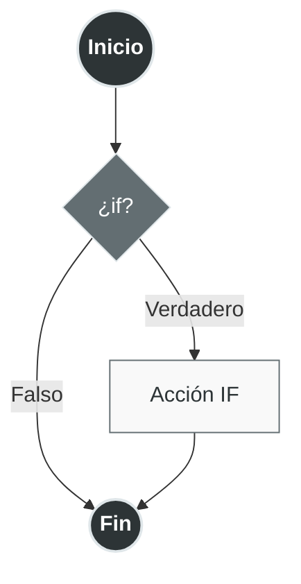
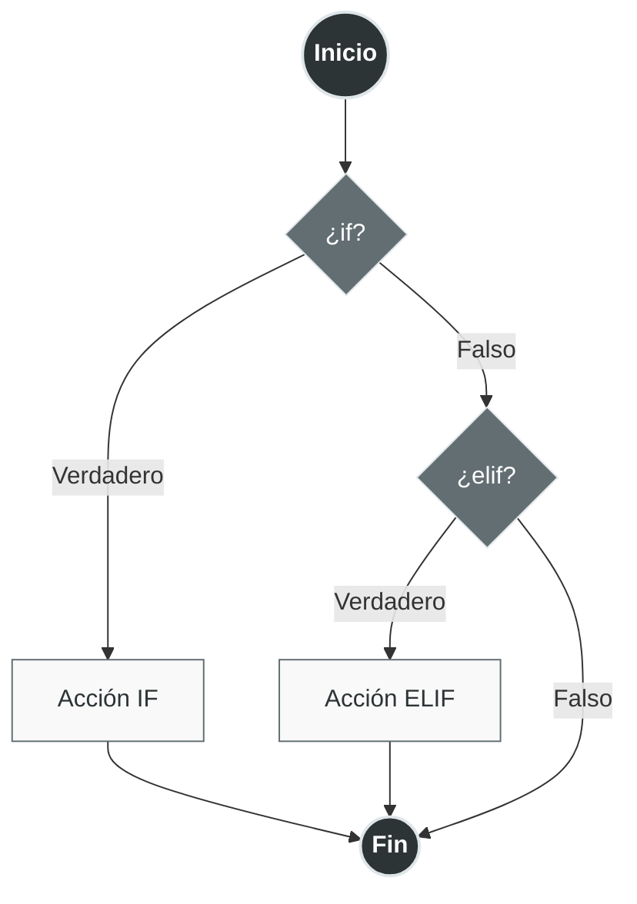
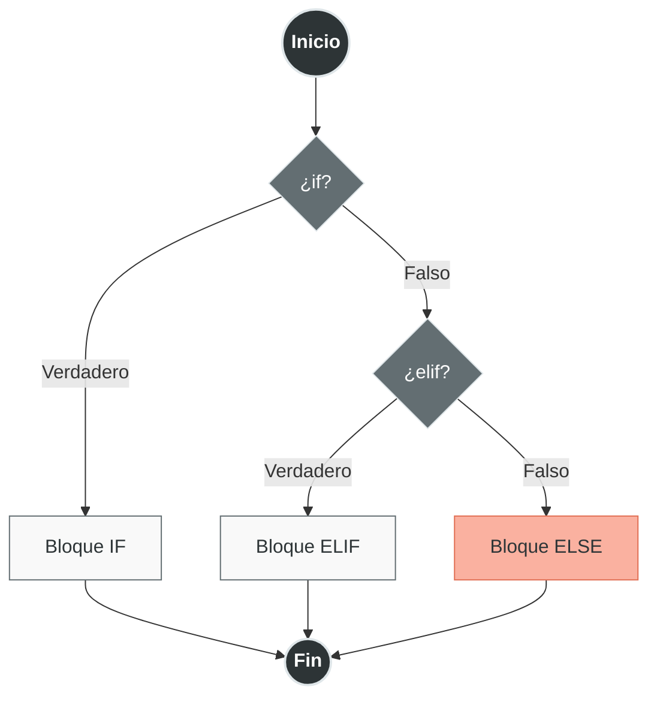
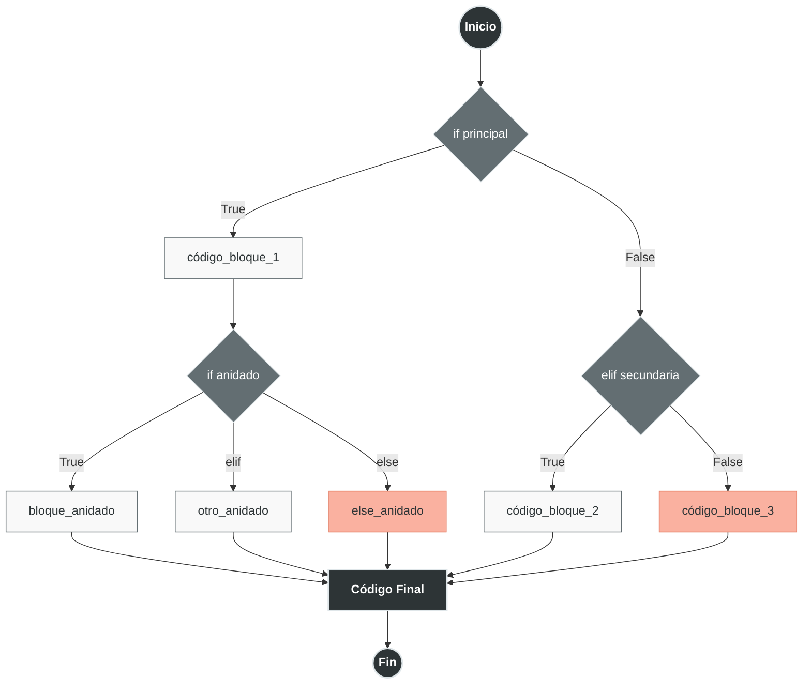

Un bloque condicional es una estructura de control que permite ejecutar diferentes fragmentos de código dependiendo de si una o varias condiciones se cumplen o no. Los condicionales son fundamentales para crear lógica en los programas, permitiendo que el flujo de ejecución se adapte a diferentes situaciones.

# Clasificación de Condicionales

## **`if` (Si)**
Evalúa una condición y ejecuta el bloque de código solo si la condición es verdadera.

```python
# Sintaxis básica
if condición:
    # código a ejecutar si la condición es True
```



## **`elif` (Sino-Si)**
Evalúa una condición alternativa si todas las condiciones anteriores fueron falsas. Puede haber múltiples `elif`.

```python
if condición_1:
    # código si condición_1 es True
elif condición_2:
    # código si condición_1 es False y condición_2 es True
```



## **`else` (Sino)**
Ejecuta un bloque de código si todas las condiciones anteriores fueron falsas. Es opcional y solo puede haber uno por estructura `if`.

```python
if condición_1:
    # código si condición es True
elif condición_2
	# código si condición es True
else:
    # código si las condiciones son False
```



# Sintaxis Anidada (Forma Completa)

```python
# Estructura completa
if condición_principal:
    # Bloque 1 - se ejecuta si condición_principal es True
    código_bloque_1
    
    # Condicionales anidados
    if condición_anidada:
        código_bloque_anidado
    elif otra_condición_anidada:
        otro_código_anidado
    else:
        código_else_anidado
    
elif condición_secundaria:
    # Bloque 2 - se ejecuta si condición_principal es False
    # y condición_secundaria es True
    código_bloque_2
    
else:
    # Bloque 3 - se ejecuta si todas las condiciones anteriores son False
    código_bloque_3

# Código que se ejecuta siempre (fuera del condicional)
```



## Partes Sintácticas de la Forma Anidada

```python
# Componentes sintácticos detallados
if condición:          # 1. Palabra clave 'if' + expresión booleana + ':'
    instrucción_1      # 2. Bloque indentado (4 espacios o tab)
    instrucción_2
elif condición_2:      # 3. Palabra clave 'elif' (opcional, múltiples)
    instrucción_3
else:                  # 4. Palabra clave 'else' (opcional, único)
    instrucción_4
```

# Sintaxis del [[Operadores de Variables|Operador Ternario]]

El operador ternario es una forma concisa de escribir condicionales simples en una sola línea.

## Forma Básica
```python
valor_si_true if condición else valor_si_false
```

## Partes Sintácticas del Ternario
```python
# Estructura completa
resultado = expresión_true if condición else expresión_false
#           ↑                      ↑             ↑
#     Se evalúa si           Condición a   Se evalúa si
#     condición es True      evaluar        condición es False

# Ejemplo práctico
edad = 18
status = "Mayor" if edad >= 18 else "Menor"
# status = "Mayor" (porque 18 >= 18 es True)
```

## Ejemplos de Operador Ternario

- **Ejemplo 1:** Asignación simple
  ```python
  # Ejemplo 1: Asignación simple
  numero = 10
  tipo = "Par" if numero % 2 == 0 else "Impar"
  print(tipo)  # "Par"
  ```

- **Ejemplo 2:** Cálculo condicional
  ```python
  precio = 100
  descuento = precio * 0.9 if precio > 50 else precio
  print(descuento)  # 90.0
  ```

- **Ejemplo 3:** Anidación de ternarios (no recomendado para casos complejos)
  ```python
  x = 5
  y = 10
  z = 15
  mayor = x if x > y and x > z else (y if y > z else z)
  print(mayor)  # 15
  ```

- **Ejemplo 4:** Con [[Funciones|funciones]]
  ```python
  def positivo_o_negativo(n):
     return "Positivo" if n > 0 else ("Cero" if n == 0 else "Negativo")

  print(positivo_o_negativo(5))   # "Positivo"
  print(positivo_o_negativo(0))   # "Cero"
  print(positivo_o_negativo(-3))  # "Negativo"
  ```

  > [!Important] Importante
  > Si desea entender la sintaxis `def`, `return`, etc. Revisar: [[Funciones|Funciones]] 

# Patrones de Comparación Especiales

## **Identidad (`is`, `is not`)**
Compara si dos variables se refieren al **mismo objeto** en memoria.

```python
# Comparación de identidad
a = [1, 2, 3]
b = [1, 2, 3]
c = a

print(a == b)  # True (mismo contenido)
print(a is b)  # False (objetos diferentes en memoria)
print(a is c)  # True (mismo objeto)

# Uso común: comparar con None
valor = None
if valor is None:
    print("Valor no asignado")

if valor is not None:
    print("Valor asignado")
```

## **Igualdad (`==`, `!=`)**
Compara si dos variables tienen el **mismo valor** o contenido.

```python
# Comparación de igualdad
lista1 = [1, 2, 3]
lista2 = [1, 2, 3]
lista3 = [3, 2, 1]

print(lista1 == lista2)  # True (mismo contenido)
print(lista1 == lista3)  # False (contenido diferente)
print(lista1 != lista3)  # True

# Comparaciones encadenadas
edad = 25
if 18 <= edad <= 65:
    print("Edad laboral")

# Comparación de estructuras complejas
persona1 = {"nombre": "Ana", "edad": 25}
persona2 = {"nombre": "Ana", "edad": 25}
print(persona1 == persona2)  # True
```

## **Membresía (`in`, `not in`)**
Verifica si un elemento está presente en una secuencia (lista, tupla, string, diccionario, etc.).

```python
# En listas/tuplas/conjuntos
frutas = ["manzana", "banana", "naranja"]
print("manzana" in frutas)    # True
print("uva" not in frutas)    # True

# En strings
texto = "Hola Mundo"
print("Hola" in texto)        # True
print("mundo" in texto)       # False (case-sensitive)

# En diccionarios (busca en las claves)
persona = {"nombre": "Carlos", "edad": 30}
print("nombre" in persona)    # True
print("Carlos" in persona)    # False (solo busca en claves)
print("edad" not in persona)  # False

# En rangos
print(5 in range(10))         # True
print(15 in range(0, 10, 2))  # False
```

# Diferencias Clave y Mejores Prácticas

## `is` vs `==`

```python
# Para valores inmutables (enteros pequeños, strings), Python optimiza
a = 256
b = 256
print(a == b)  # True
print(a is b)  # True (optimización de Python)

a = 257
b = 257
print(a == b)  # True
print(a is b)  # False (puede variar según implementación)

# REGLA: Usar 'is' para None, True, False; '==' para valores
valor = None
# CORRECTO:
if valor is None:    # ✓
    pass
# INCORRECTO:
if valor == None:    # ✗ (funciona pero no es idiomático)
    pass
```

## Patrones Avanzados de Comparación

```python
# Comparaciones de intervalos
temperatura = 22
if 20 <= temperatura <= 25:
    print("Temperatura ideal")

# Múltiples condiciones con 'in'
dia = "lunes"
if dia in ["lunes", "miércoles", "viernes"]:
    print("Día de ejercicio")

# Patrón de guardia (guard clause)
def procesar_datos(datos):
    if datos is None:
        return None
    if not datos:  # Si está vacío
        return []
    # Procesamiento normal...
    return datos_procesados
```

## Condicionales con Asignación (Walrus Operator :=)

Python 3.8+ introduce el operador morsa que permite asignar y evaluar en la misma expresión:

```python
# Sintaxis tradicional
entrada = input("Ingresa un número: ")
if entrada.isdigit():
    numero = int(entrada)
    print(f"Número ingresado: {numero}")

# Con operador morsa
if (entrada := input("Ingresa un número: ")).isdigit():
    numero = int(entrada)
    print(f"Número ingresado: {numero}")

# Otro ejemplo
lista = [1, 2, 3, 4, 5]
if (n := len(lista)) > 3:
    print(f"La lista tiene {n} elementos, más de 3")
```

# Ejemplos Complejos Integrando Todo

```python
def clasificar_persona(edad, es_estudiante=False, tiene_descuento=False):
    """
    Clasifica a una persona según múltiples condiciones
    """
    # Patrón de guardia
    if edad is None:
        return "Edad no proporcionada"
    
    # Condicionales anidados con múltiples factores
    if edad < 0:
        categoria = "Edad inválida"
    elif edad < 12:
        categoria = "Niño"
        if es_estudiante:
            categoria += " (estudiante)"
    elif edad < 18:
        categoria = "Adolescente"
        if es_estudiante:
            categoria += " (estudiante)"
            if tiene_descuento:
                categoria += " con descuento"
    elif edad < 65:
        categoria = "Adulto"
        if es_estudiante:
            categoria += " (estudiante adulto)"
    else:
        categoria = "Adulto mayor"
        if tiene_descuento:
            categoria += " (descuento aplicado)"
    
    # Operador ternario para mensaje adicional
    mensaje_extra = "¡Bienvenido!" if edad >= 0 else "Revisar datos"
    
    return f"{categoria}. {mensaje_extra}"

# Pruebas
print(clasificar_persona(10, es_estudiante=True))      # Niño (estudiante). ¡Bienvenido!
print(clasificar_persona(16, True, True))             # Adolescente (estudiante) con descuento. ¡Bienvenido!
print(clasificar_persona(30, False))                  # Adulto. ¡Bienvenido!
print(clasificar_persona(70, False, True))            # Adulto mayor (descuento aplicado). ¡Bienvenido!
print(clasificar_persona(None))                       # Edad no proporcionada
```

# Buenas Prácticas con Condicionales

1. **Usa `is` para comparar con `None`, `True`, `False`**
2. **Preferir `==` para comparaciones de valor**
3. **Utiliza `in` para verificar membresía en colecciones**
4. **Mantén los condicionales simples y legibles**
5. **Usa el operador ternario solo para casos simples**
6. **Aplica patrones de guardia para validaciones tempranas**
7. **Evita anidaciones excesivas (máximo 2-3 niveles)**
8. **Comenta condiciones complejas para claridad**