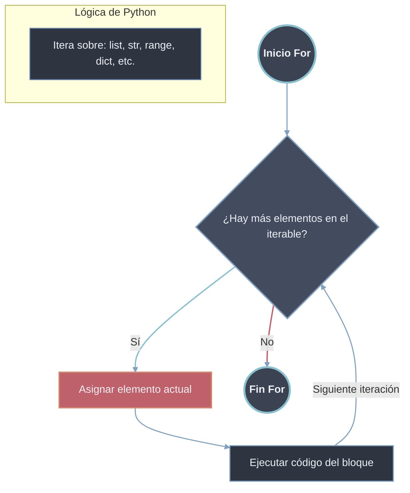
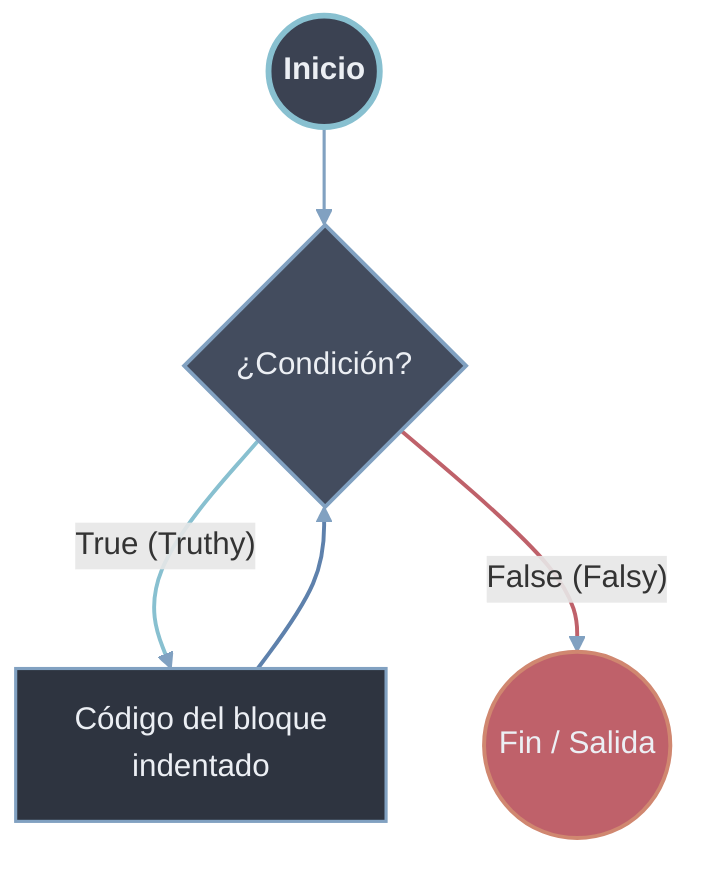
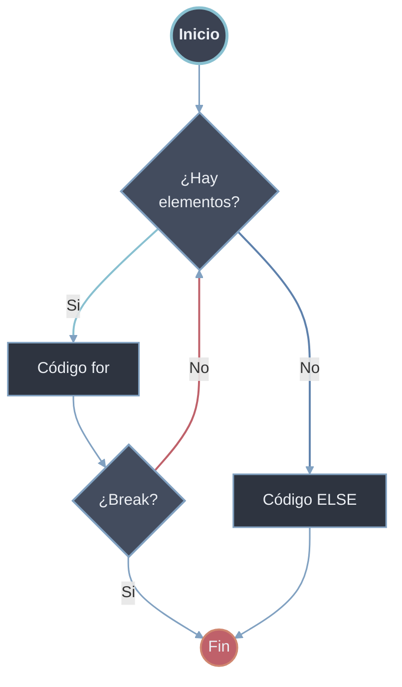
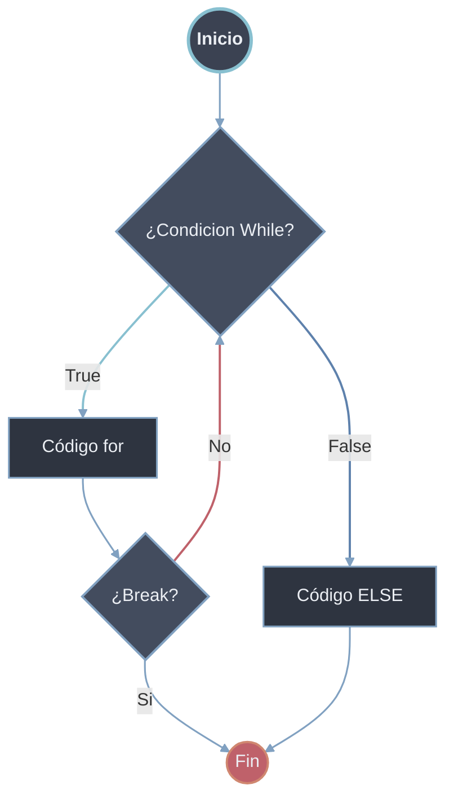

Un bucle (o ciclo) es una estructura de control que permite ejecutar un bloque de código repetidamente mientras se cumple una condición específica o para cada elemento de una secuencia. Los bucles son fundamentales para automatizar tareas repetitivas y procesar colecciones de datos.

# 1. Bucle `for` - Iteración Sobre Secuencias

El bucle `for` en Python itera sobre los elementos de cualquier objeto iterable.

## Iteración Básica Sobre Secuencias

```python
# Sintaxis básica
for elemento in iterable:
    # código a ejecutar para cada elemento
```




### Iteración sobre [[01 Listas|Listas]]
```python
frutas = ["manzana", "banana", "naranja"]

for fruta in frutas:
    print(f"Fruta: {fruta}")
    print(f"Tiene {len(fruta)} letras")
# Salida:
# Fruta: manzana
# Tiene 7 letras
# Fruta: banana
# Tiene 6 letras
# Fruta: naranja
# Tiene 7 letras
```

### Iteración sobre [[02 Tuplas|Tuplas]]
```python
coordenadas = (10, 20, 30)

for coord in coordenadas:
    print(f"Coordenada: {coord}")
# Salida:
# Coordenada: 10
# Coordenada: 20
# Coordenada: 30


```

### Iteración sobre [[05 Cadenas|Cadenas (Strings)]]
```python
texto = "Python"

for caracter in texto:
    print(caracter.upper())
# Salida:
# P
# Y
# T
# H
# O
# N
```

### Iteración sobre [[03 Diccionarios|Diccionarios]]
```python
persona = {
    "nombre": "Ana",
    "edad": 25,
    "ciudad": "Madrid"
}

# Iterar sobre claves (por defecto)
for clave in persona:
    print(f"Clave: {clave}")
# Salida: nombre, edad, ciudad

# Iterar sobre valores
for valor in persona.values():
    print(f"Valor: {valor}")

# Iterar sobre pares clave-valor
for clave, valor in persona.items():
    print(f"{clave}: {valor}")
# Salida:
# nombre: Ana
# edad: 25
# ciudad: Madrid
```

## Función `enumerate()` - Obtener Índice y Elemento

```python
# enumerate() devuelve pares (índice, elemento)
frutas = ["manzana", "banana", "naranja"]

# Forma tradicional (no recomendada)
for i in range(len(frutas)):
    print(f"Índice {i}: {frutas[i]}")

# Forma con enumerate()
for indice, fruta in enumerate(frutas):
    print(f"Índice {indice}: {fruta}")

# Con índice personalizado
for indice, fruta in enumerate(frutas, start=1):
    print(f"Fruta #{indice}: {fruta}")
# Salida:
# Índice 0: manzana
# Índice 1: banana
# Índice 2: naranja
# Índice 0: manzana
# Índice 1: banana
# Índice 2: naranja
# Fruta #1: manzana
# Fruta #2: banana
# Fruta #3: naranja
```

## Función `range()` - Generación de Secuencias Numéricas

```python
# range(stop) - de 0 a stop-1
print("range(5):")
for i in range(5):
    print(i)  # 0, 1, 2, 3, 4

# range(start, stop) - de start a stop-1
print("\nrange(2, 7):")
for i in range(2, 7):
    print(i)  # 2, 3, 4, 5, 6

# range(start, stop, step) - con paso
print("\nrange(1, 10, 2):")
for i in range(1, 10, 2):
    print(i)  # 1, 3, 5, 7, 9

# Paso negativo (decremento)
print("\nrange(10, 0, -2):")
for i in range(10, 0, -2):
    print(i)  # 10, 8, 6, 4, 2

# Uso común: iterar con índice
nombres = ["Ana", "Carlos", "Beatriz"]
for i in range(len(nombres)):
    print(f"Posición {i}: {nombres[i]}")
```

## Iteración Múltiple con `zip()`

```python
# zip() combina múltiples iterables
nombres = ["Ana", "Carlos", "Beatriz"]
edades = [25, 30, 28]
ciudades = ["Madrid", "Barcelona", "Valencia"]

for nombre, edad, ciudad in zip(nombres, edades, ciudades):
    print(f"{nombre} ({edad} años) vive en {ciudad}")
# Salida:
# Ana (25 años) vive en Madrid
# Carlos (30 años) vive en Barcelona
# Beatriz (28 años) vive en Valencia

# zip() termina cuando el iterable más corto se acaba
for a, b in zip(range(3), range(5)):
    print(a, b)  # Solo 3 iteraciones
```

# 2. Bucle `while` - Ejecución Condicional

El bucle `while` ejecuta un bloque de código mientras una condición sea verdadera.

## Sintaxis Básica
```python
# Sintaxis básica
while condición:
    # código a ejecutar mientras condición sea True
```


## Ejemplos Básicos
```python
# Contador básico
contador = 0
while contador < 5:
    print(f"Contador: {contador}")
    contador += 1  # Incremento CRUCIAL para evitar bucle infinito
# Salida: 0, 1, 2, 3, 4

# Validación de entrada de usuario
respuesta = ""
while respuesta != "salir":
    respuesta = input("Escribe 'salir' para terminar: ")
    print(f"Escribiste: {respuesta}")
```

## Evitar Bucles Infinitos
### Mal

- **Falta incremento**
  ```python
  contador = 0
  while contador < 5:
      print(f"Contador: {contador}")
      # Falta contador += 1
  ```

- **Condición siempre True**
  ```python
  while True:
      print("Esto nunca termina")

  ```

### Correcto

- **Siempre asegurar que la condición pueda cambiar a False**
  ```python
  contador = 0
  while contador < 5:
      print(contador)
      contador += 1  # Esto asegura que eventualmente contador >= 5
  ```

- **Patrón de bucle controlado con [[03 Control de Flujo|break]]**
  
  ```python
  while True:
      entrada = input("Ingresa un número (0 para salir): ")
      if entrada == "0":
          break  # Sale del bucle
      print(f"Cuadrado: {int(entrada) ** 2}")
  ```

## Inicialización y Actualización Correctas

```python
# Ejemplo completo de control de bucle while
# 1. INICIALIZACIÓN
total = 0
contador = 0

# 2. CONDICIÓN
while contador < 5:
    # 3. PROCESAMIENTO
    numero = float(input(f"Ingresa número {contador + 1}: "))
    total += numero
    
    # 4. ACTUALIZACIÓN (IMPORTANTE)
    contador += 1

# 5. RESULTADO
print(f"Total: {total}")
print(f"Promedio: {total / contador}")

# Ejemplo con múltiples condiciones
temperatura = 25
tiempo = 0
while temperatura > 15 and tiempo < 10:
    print(f"Tiempo: {tiempo}h, Temp: {temperatura}°C")
    temperatura -= 1  # Enfriamiento
    tiempo += 1       # Pasa el tiempo
```

# 3. Bucle `for-else` y `while-else`

La cláusula `else` en bucles se ejecuta **solo si el bucle termina normalmente** (sin usar `break`).

## Sintaxis
### `for-else`

```python
for elemento in iterable:
    # código del bucle
    if condición:
        break
else:
    # Se ejecuta si NO se usó break
    print("Bucle completado normalmente")
```



### `while-else`

```python
while condición:
    # código del bucle
    if condición_especial:
        break
else:
    # Se ejecuta si NO se usó break
    print("Bucle completado normalmente")
```


## Ejemplos con `for-else`

```python
# Buscar un elemento en lista
numeros = [1, 3, 5, 7, 9]
busqueda = 6

for num in numeros:
    if num == busqueda:
        print(f"Encontrado {busqueda}")
        break
else:
    # Solo se ejecuta si NO se encontró el número
    print(f"{busqueda} no está en la lista")
# Salida: 6 no está en la lista

# Verificar si todos cumplen condición
edades = [18, 22, 25, 17, 30]
for edad in edades:
    if edad < 18:
        print("Hay menores de edad")
        break
else:
    print("Todos son mayores de edad")
# Salida: Hay menores de edad
```

## Ejemplos con `while-else`

```python
# Búsqueda con while
intentos = 3
objetivo = 7

while intentos > 0:
    adivina = int(input("Adivina el número (1-10): "))
    if adivina == objetivo:
        print("Correcto")
        break
    intentos -= 1
    print(f"Fallaste. Te quedan {intentos} intentos")
else:
    # Se ejecuta si se agotan los intentos sin acertar
    print(f"¡Perdiste! El número era {objetivo}")

# Validación de entrada segura
intentos = 0
while intentos < 3:
    entrada = input("Ingresa 'ok' para continuar: ")
    if entrada.lower() == "ok":
        print("Contraseña aceptada")
        break
    print("Intento fallido")
    intentos += 1
else:
    print("Demasiados intentos fallidos. Cerrando...")
```

## Casos de Uso Comunes

```python
# 1. Búsqueda con mensaje de "no encontrado"
productos = ["manzana", "banana", "naranja"]
buscar = "pera"

for producto in productos:
    if producto == buscar:
        print(f"Producto '{buscar}' disponible")
        break
else:
    print(f"Producto '{buscar}' no disponible")

# 2. Validación de lista vacía/inexistente
lista_datos = None

if lista_datos:
    for dato in lista_datos:
        print(dato)
    else:
        print("Lista procesada completamente")
else:
    print("No hay datos para procesar")

# 3. Verificar si todos los elementos cumplen condición
calificaciones = [8, 7, 9, 6, 8]

for calif in calificaciones:
    if calif < 6:
        print("Hay reprobados")
        break
else:
    print("Todos aprobaron")
```

# Comparación y Mejores Prácticas

## ¿`for` o `while`?

```python
# USAR FOR CUANDO:
# 1. Sabes cuántas iteraciones necesitas
for i in range(10):
    print(i)

# 2. Estás iterando sobre elementos de una colección
for elemento in lista:
    procesar(elemento)

# 3. Necesitas procesar cada elemento una vez
for char in "Python":
    print(char)

# USAR WHILE CUANDO:
# 1. No sabes cuántas iteraciones necesitas
respuesta = ""
while respuesta != "salir":
    respuesta = input("Comando: ")

# 2. La condición depende de un estado cambiante
segundos = 10
while segundos > 0:
    print(f"Tiempo restante: {segundos}s")
    segundos -= 1
    time.sleep(1)

# 3. Necesitas un bucle infinito controlado
while True:
    evento = obtener_evento()
    if evento == "terminar":
        break
    procesar(evento)
```

## Patrones Comunes

```python
# 1. Procesar con índice
lista = ['a', 'b', 'c']
for i, valor in enumerate(lista):
    print(f"Índice {i}: {valor}")

# 2. Iterar en reversa
for i in reversed(range(5)):
    print(i)  # 4, 3, 2, 1, 0

for elemento in reversed(lista):
    print(elemento)

# 3. Iterar sobre rangos con pasos
for i in range(0, 100, 10):
    print(i)  # 0, 10, 20, ..., 90

# 4. Diccionarios con items()
persona = {"nombre": "Ana", "edad": 25}
for clave, valor in persona.items():
    print(f"{clave}: {valor}")

# 5. Nested loops (bucles anidados)
for i in range(3):
    for j in range(2):
        print(f"({i}, {j})")
# Salida: (0,0), (0,1), (1,0), (1,1), (2,0), (2,1)
```

## Ejemplo Completo Integrado

```python
def procesar_inventario(inventario):
    """
    Procesa un inventario usando diferentes tipos de bucles
    """
    print("=== PROCESANDO INVENTARIO ===")
    
    # for con enumerate para mostrar posición
    for idx, (producto, cantidad) in enumerate(inventario.items(), 1):
        print(f"{idx}. {producto}: {cantidad} unidades")
    
    print("\n=== PRODUCTOS BAJOS EN STOCK ===")
    # for-else para buscar productos con stock bajo
    for producto, cantidad in inventario.items():
        if cantidad < 5:
            print(f"ALERTA: {producto} tiene solo {cantidad} unidades")
            break
    else:
        print("Todos los productos tienen stock suficiente")
    
    print("\n=== ACTUALIZANDO STOCK ===")
    # while para reponer stock
    productos_a_reponer = ["manzanas", "naranjas"]
    
    for producto in productos_a_reponer:
        if producto in inventario:
            stock_actual = inventario[producto]
            objetivo = 20
            
            print(f"\nReponiendo {producto}...")
            while stock_actual < objetivo:
                print(f"  Stock actual: {stock_actual}, agregando 5...")
                stock_actual += 5
                inventario[producto] = stock_actual
            
            print(f"  {producto} repuesto a {stock_actual} unidades")
    
    return inventario

# Inventario inicial
inventario = {
    "manzanas": 15,
    "bananas": 8,
    "naranjas": 3,
    "peras": 10
}

# Procesar
inventario_actualizado = procesar_inventario(inventario)

print("\n=== INVENTARIO FINAL ===")
for producto, cantidad in inventario_actualizado.items():
    print(f"{producto}: {cantidad} unidades")
```

# Resumen de Mejores Prácticas

1. **Usa `for` para iterar sobre elementos conocidos**
2. **Usa `while` para condiciones dinámicas o desconocidas**
3. **Siempre inicializa y actualiza variables en `while`**
4. **Utiliza `enumerate()` para obtener índice y valor**
5. **Usa `zip()` para iterar múltiples secuencias**
6. **Aprovecha `for-else`/`while-else` para casos de "no encontrado"**
7. **Evita bucles infinitos asegurando condiciones de salida**
8. **Prefiere `range()` con `len()` en lugar de índices manuales**
9. **Documenta bucles complejos**
10. **Considera comprensiones de listas para transformaciones simples**
