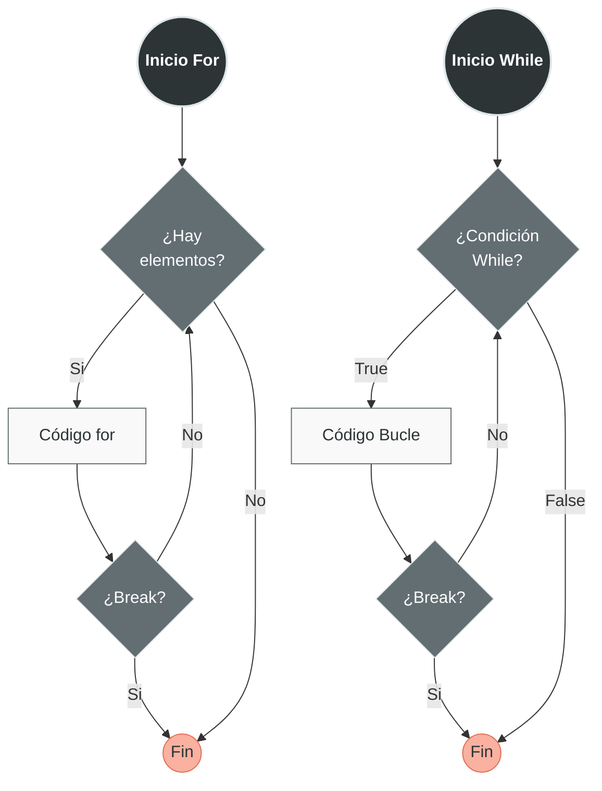

Los controles de flujo `break`, `continue` y `pass` son palabras clave que modifican el comportamiento normal de los [[02 Bucles|bucles]] en Python. Permiten un control más granular sobre la ejecución de iteraciones y son esenciales para escribir código eficiente.

# 1. `break` - Salida Temprana del Bucle

La declaración `break` termina inmediatamente el bucle más interno en el que se encuentra, sin importar si la condición del [[02 Bucles|bucle]] aún se cumple.

## Sintaxis y Comportamiento
```python
# break sale COMPLETAMENTE del bucle
while condición:
    # código antes
    if condición_especial:
        break  # Sale del bucle inmediatamente
    # código después (no se ejecuta si break se activa)

# Lo mismo aplica para for
for elemento in iterable:
    if condición:
        break  # Termina el bucle for
```




## Ejemplos Prácticos

### Búsqueda de Elemento
```python
# Ejemplo 1: Buscar un número en una lista
numeros = [3, 7, 2, 9, 4, 6]
buscar = 9
encontrado = False

for num in numeros:
    print(f"Revisando: {num}")
    if num == buscar:
        print(f"¡Encontrado {buscar}!")
        encontrado = True
        break  # Salimos del bucle al encontrar

print(f"¿Encontrado? {encontrado}")

# Sin break tendríamos que procesar todos los elementos
# Con break ahorramos procesamiento innecesario
```

### Validación de Entrada con Límite
```python
# Ejemplo 2: Validar contraseña con intentos limitados
contrasena_correcta = "python123"
intentos_maximos = 3

for intento in range(1, intentos_maximos + 1):
    entrada = input(f"Intento {intento}/{intentos_maximos}: ")
    
    if entrada == contrasena_correcta:
        print("¡Acceso concedido!")
        break  # Salimos si la contraseña es correcta
    
    print("Contraseña incorrecta")
else:
    # Este else se ejecuta si NO se usó break
    print("Demasiados intentos fallidos. Cuenta bloqueada.")
```

### Procesamiento Hasta Condición
```python
# Ejemplo 3: Sumar números hasta encontrar un negativo
numeros = [5, 3, 8, -2, 7, 4]
suma = 0

for num in numeros:
    if num < 0:
        print("¡Número negativo encontrado! Deteniendo suma...")
        break
    suma += num
    print(f"Sumando {num}. Total parcial: {suma}")

print(f"Suma total (antes del negativo): {suma}")
```

# 2. `continue` - Saltar a la Siguiente Iteración

La declaración `continue` salta el resto del código en la iteración actual y pasa inmediatamente a la siguiente iteración del bucle.

## Sintaxis y Comportamiento
```python
# continue salta a la siguiente iteración
for elemento in iterable:
    # código antes
    if condición_para_omitir:
        continue  # Salta al siguiente elemento
    # código después (solo se ejecuta si NO se usó continue)

while condición:
    if condición_para_omitir:
        continue  # Salta a la siguiente evaluación
    # resto del código
```


## Ejemplos Prácticos

### Procesar Solo Elementos Válidos
```python
# Ejemplo 1: Procesar solo números positivos
numeros = [5, -3, 0, 8, -1, 2]
total = 0

for num in numeros:
    if num <= 0:
        print(f"Omitiendo {num} (no es positivo)")
        continue  # Salta números no positivos
    
    # Solo llegamos aquí para números positivos
    cuadrado = num ** 2
    total += cuadrado
    print(f"Procesando {num}: cuadrado = {cuadrado}")

print(f"Suma de cuadrados positivos: {total}")
```

### Filtrar Datos Incompletos
```python
# Ejemplo 2: Procesar solo usuarios con email válido
usuarios = [
    {"nombre": "Ana", "email": "ana@example.com"},
    {"nombre": "Carlos", "email": ""},
    {"nombre": "Beatriz", "email": "beatriz@correo.com"},
    {"nombre": "David", "email": None},
]

print("Enviando emails a usuarios válidos:")
for usuario in usuarios:
    email = usuario.get("email")
    
    # Validar email
    if not email or "@" not in email:
        print(f"  Omitiendo {usuario['nombre']}: email inválido")
        continue
    
    # Solo para emails válidos
    print(f"  Enviando email a {usuario['nombre']} ({email})")
    # Aquí iría el código real de envío
```

### Saltar Iteraciones Específicas
```python
# Ejemplo 3: Procesar días de semana excepto fines de semana
dias = ["lunes", "martes", "miércoles", "jueves", "viernes", "sábado", "domingo"]

print("Días laborables:")
for dia in dias:
    if dia in ["sábado", "domingo"]:
        continue  # Saltamos fines de semana
    
    print(f"  {dia.capitalize()}: reunión de equipo")
    # Aquí irían las tareas laborales específicas
```

# 3. `pass` - Declaración Nula

La declaración `pass` es una operación nula — no hace nada cuando se ejecuta. Se usa como *placeholder* cuando se requiere una declaración sintácticamente pero no se quiere ejecutar ningún código.

## Sintaxis y Comportamiento
```python
# pass no hace nada, solo mantiene la sintaxis
if condición:
    pass  # TODO: implementar más tarde

class MiClase:
    pass  # Clase vacía por ahora

def funcion_sin_implementar():
    pass  # Por implementar
```

## Diferencias Clave

| Característica   | `pass`                  | Comentario (`#`)         |
| ---------------- | ----------------------- | ------------------------ |
| **Propósito**    | Placeholder sintáctico  | Comentario/documentación |
| **Sintaxis**     | Parte del código Python | No es código ejecutable  |
| **En bucles**    | Permite bucle vacío     | No permite bucle vacío   |
| **En funciones** | Permite función vacía   | No permite función vacía |

## Ejemplos Prácticos

### Desarrollo Incremental
```python
# Ejemplo 1: Esqueleto de funciones por implementar
def procesar_datos(datos):
    """Función para procesar datos (en desarrollo)"""
    pass  # TODO: implementar lógica de procesamiento

def generar_reporte():
    """Genera reporte (pendiente)"""
    pass  # Por implementar en la siguiente iteración

# Mientras tanto, el código puede ejecutar sin errores
print("Sistema en desarrollo...")
```

### Estructuras Temporales
```python
# Ejemplo 2: Clase base abstracta (simplificada)
class FiguraGeometrica:
    """Clase base para figuras geométricas"""
    
    def area(self):
        """Calcula el área (debe implementarse en subclases)"""
        pass
    
    def perimetro(self):
        """Calcula el perímetro (debe implementarse en subclases)"""
        pass

class Cuadrado(FiguraGeometrica):
    def __init__(self, lado):
        self.lado = lado
    
    def area(self):
        return self.lado ** 2
    
    def perimetro(self):
        return 4 * self.lado

# Cuadrado implementa los métodos, FiguraGeometrica usa pass
```

### Bucles con Lógica Pendiente
```python
# Ejemplo 3: Bucle con estructura definida
configuraciones = ["modo1", "modo2", "modo3"]

for modo in configuraciones:
    # Estructura definida, lógica pendiente
    if modo == "modo1":
        pass  # TODO: implementar configuración modo1
    elif modo == "modo2":
        pass  # TODO: implementar configuración modo2
    else:
        print(f"Modo desconocido: {modo}")

# Esto compila y ejecuta sin errores mientras se desarrolla
```

# 4. Uso Combinado en Bucles Anidados

Cuando trabajamos con bucles anidados, es crucial entender cómo `break` y `continue` afectan solo al bucle más interno.

## Ejemplos Complejos

### Búsqueda en Matriz
```python
# Ejemplo 1: Buscar valor en matriz 2D
matriz = [
    [1, 2, 3],
    [4, 5, 6],
    [7, 8, 9]
]
valor_buscado = 5
encontrado = False

print("Buscando en matriz:")
for i, fila in enumerate(matriz):
    print(f"  Revisando fila {i}: {fila}")
    
    for j, valor in enumerate(fila):
        print(f"    Celda ({i},{j}): {valor}")
        
        if valor == valor_buscado:
            print(f"    ¡Encontrado en posición ({i},{j})!")
            encontrado = True
            break  # Este break solo sale del bucle interno (columnas)
    
    # Podemos agregar otro break aquí si encontramos el valor
    if encontrado:
        print(f"  Valor encontrado en fila {i}, terminando búsqueda...")
        break  # Este break sale del bucle externo (filas)

if not encontrado:
    print("Valor no encontrado en la matriz")
```

### Procesamiento Selectivo en Estructuras Anidadas
```python
# Ejemplo 2: Procesar estudiantes y sus calificaciones
estudiantes = {
    "Ana": [8, 7, 9],
    "Carlos": [4, 5, 3],  # Tiene una calificación baja
    "Beatriz": [9, 9, 8],
    "David": [6, 7, 5],
}

print("Analizando calificaciones:")
for estudiante, calificaciones in estudiantes.items():
    print(f"\n{estudiante}: {calificaciones}")
    
    # Verificar si hay alguna calificación reprobatoria (< 6)
    for calif in calificaciones:
        if calif < 6:
            print(f"  ¡Atención! {estudiante} tiene calificación {calif}")
            # Podríamos usar continue aquí si solo queremos marcar y seguir
            # O break si queremos detener el análisis de este estudiante
    
    # continue aquí afectaría solo al bucle externo
    # break aquí afectaría solo al bucle externo
```

### Uso de `break` con Etiquetas (Patrón Alternativo)
```python
# Ejemplo 3: Salir de múltiples bucles usando una bandera
datos = [
    [1, 2, 3],
    [4, -1, 6],  # Valor negativo aquí
    [7, 8, 9]
]

# Patrón usando bandera para salir de bucles anidados
encontrado_negativo = False

for i, fila in enumerate(datos):
    if encontrado_negativo:
        break  # Salir del bucle externo si ya encontramos
    
    for j, valor in enumerate(fila):
        if valor < 0:
            print(f"¡Negativo encontrado en ({i},{j}): {valor}")
            encontrado_negativo = True
            break  # Salir del bucle interno

print(f"¿Encontró negativo? {encontrado_negativo}")
```

### Combinación Compleja
```python
# Ejemplo 4: Sistema de procesamiento de pedidos
pedidos = [
    {"id": 1, "items": ["manzana", "banana"], "urgente": True},
    {"id": 2, "items": [], "urgente": False},  # Pedido vacío
    {"id": 3, "items": ["naranja"], "urgente": True},
    {"id": 4, "items": ["pera", "uva"], "urgente": False},
]

print("Procesando pedidos:")
for pedido in pedidos:
    # Usar continue para saltar pedidos vacíos
    if not pedido["items"]:
        print(f"  Saltando pedido {pedido['id']}: lista vacía")
        continue
    
    print(f"  Procesando pedido {pedido['id']}:")
    
    # Procesar cada item
    for item in pedido["items"]:
        # Simular error en procesamiento
        if item == "uva" and not pedido["urgente"]:
            print(f"    Error procesando '{item}' en pedido no urgente")
            # Podemos usar break para detener procesamiento de este pedido
            print(f"    Deteniendo procesamiento del pedido {pedido['id']}")
            break
        
        print(f"    Procesando: {item}")
    
    else:
        # Este else se ejecuta si NO se usó break en el bucle interno
        print(f"    Pedido {pedido['id']} completado exitosamente")
    
    # Si es urgente y hay error, podríamos querer detener todo
    if pedido["urgente"] and "uva" in pedido["items"]:
        print("  ¡Error en pedido urgente! Deteniendo sistema...")
        break  # Sale del bucle externo completamente

print("\nProcesamiento terminado.")
```

# Patrones y Mejores Prácticas

## Patrón 1: Búsqueda Eficiente con `break`
```python
# Buscar primer elemento que cumpla condición
numeros = [1, 3, 5, 7, 9, 11, 13]
primer_par = None

for num in numeros:
    if num % 2 == 0:
        primer_par = num
        break  # ¡Eficiente! No revisamos el resto

print(f"Primer número par: {primer_par}")
```

## Patrón 2: Filtrar con `continue`
```python
# Procesar solo elementos válidos
datos = [10, 0, 15, "texto", 20, None, 25]
suma = 0

for valor in datos:
    if not isinstance(valor, (int, float)):
        continue  # Salta no-números
    if valor == 0:
        continue  # Salta ceros
    
    suma += 1 / valor  # Solo para números no-cero

print(f"Suma de inversos válidos: {suma:.2f}")
```

## Patrón 3: `pass` para Estructuras Temporales
```python
# Esqueleto de sistema con funciones por implementar
def inicializar_sistema():
    pass  # TODO: agregar inicialización

def procesar_entrada(entrada):
    # Estructura con múltiples casos
    if entrada.startswith("comando_"):
        pass  # Por implementar
    elif entrada == "ayuda":
        pass  # Por implementar
    else:
        print(f"Entrada no reconocida: {entrada}")

def cerrar_sistema():
    pass  # Por implementar

# El sistema puede ejecutarse mientras se desarrolla
```

## Patrón 4: Bucles Anidados con Control Preciso
```python
# Juego de búsqueda en tablero
tablero = [
    ['.', '.', 'X', '.'],
    ['.', 'O', '.', '.'],
    ['.', '.', '.', 'X'],
    ['O', '.', '.', '.']
]

# Buscar primer 'X' pero omitir filas que comienzan con 'O'
for i, fila in enumerate(tablero):
    if fila[0] == 'O':  # Si la fila empieza con O
        print(f"Saltando fila {i} (comienza con O)")
        continue
    
    for j, celda in enumerate(fila):
        if celda == 'X':
            print(f"¡Encontrado X en ({i},{j})!")
            # break aquí solo sale del bucle interno
            break
    else:
        # Se ejecuta si no se encontró X en esta fila
        continue
    
    # break aquí sale del bucle externo después de encontrar
    break
```

# Reglas y Consideraciones Importantes

1. **`break` solo afecta al bucle más interno**
   - En bucles anidados, `break` solo sale del bucle actual
   - Use una bandera para salir de múltiples bucles

2. **`continue` salta a la siguiente iteración**
   - No termina el bucle, solo la iteración actual
   - Útil para filtrar elementos sin procesar

3. **`pass` es para sintaxis, no para lógica**
   - No confundir con comentarios
   - Úselo como placeholder temporal

4. **`else` en bucles se ejecuta si no hubo `break`**
   - El `else` no se ejecuta si el bucle termina con `break`

5. **Evite usar `pass` en producción**
   - Reemplace `pass` con implementación real
   - Use `pass` solo durante desarrollo

# Ejemplo Final Integrado

```python
def analizar_ventas(ventas, umbral_alto=1000, umbral_bajo=100):
    """
    Analiza ventas usando break, continue y pass estratégicamente
    """
    total = 0
    ventas_altas = 0
    primera_venta_baja = None
    
    print("=== ANÁLISIS DE VENTAS ===")
    
    for i, venta in enumerate(ventas, 1):
        # Validación básica con continue
        if venta is None:
            print(f"Venta {i}: Datos faltantes - OMITIDA")
            continue
        
        if not isinstance(venta, (int, float)):
            print(f"Venta {i}: Tipo inválido {type(venta)} - OMITIDA")
            continue
        
        # Procesamiento normal
        print(f"Venta {i}: ${venta:.2f}")
        total += venta
        
        # Identificar ventas altas
        if venta >= umbral_alto:
            ventas_altas += 1
            print(f"  ¡VENTA ALTA! (>${umbral_alto})")
        
        # Encontrar primera venta baja con break
        if venta < umbral_bajo and primera_venta_baja is None:
            primera_venta_baja = (i, venta)
            print(f"  Primera venta baja encontrada en posición {i}")
            # Podríamos usar break aquí si solo quisiéramos la primera
        
        # Placeholder para análisis futuro
        if 500 <= venta < 800:
            pass  # TODO: análisis especial para rango medio-alto
    
    # Resultados
    print(f"\n=== RESUMEN ===")
    print(f"Total ventas: ${total:.2f}")
    print(f"Ventas altas (>${umbral_alto}): {ventas_altas}")
    
    if primera_venta_baja:
        print(f"Primera venta baja (<${umbral_bajo}): posición {primera_venta_baja[0]}, ${primera_venta_baja[1]:.2f}")
    else:
        print("No se encontraron ventas bajas")

# Datos de prueba
ventas_mes = [1200, 850, None, 95, 450, "error", 1100, 75, 1500, 200]

# Ejecutar análisis
analizar_ventas(ventas_mes)
```

