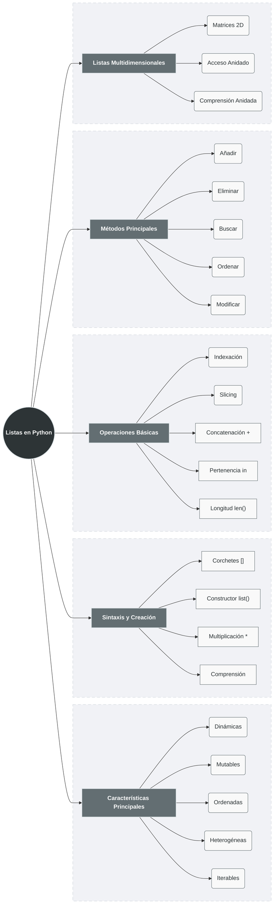

# Definición y Características

Una **lista** en Python es una **colección ordenada, mutable y dinámica** que puede contener elementos de diferentes tipos. Es la estructura de datos más versátil y utilizada en Python.

## Características Principales:

1. **Dinámicas**: Pueden crecer o reducirse durante la ejecución
2. **Mutables**: Sus elementos pueden modificarse después de la creación
3. **Ordenadas**: Mantienen el orden de inserción de los elementos
4. **Heterogéneas**: Pueden contener diferentes tipos de datos
5. **Iterables**: Se pueden recorrer con bucles `for`
6. **Indexables**: Acceso directo por posición (índice)

```python
# Ejemplo que muestra todas las características
lista_ejemplo = [10, "texto", 3.14, True, [1, 2, 3]]
print(f"Lista: {lista_ejemplo}")
print(f"Es mutable: {id(lista_ejemplo)}")  # Misma referencia
lista_ejemplo[0] = 20  # Modificación permitida
print(f"Después de modificar: {lista_ejemplo}")
print(f"Misma referencia: {id(lista_ejemplo)}")
```

**Salida:**
```bash
Lista: [10, 'texto', 3.14, True, [1, 2, 3]]
Es mutable: 140047275151616
Después de modificar: [20, 'texto', 3.14, True, [1, 2, 3]]
Misma referencia: 140047275151616
```

# Sintaxis y Creación

## 1. **Creación Básica con Corchetes**
### Sintaxis:

```python
# Lista vacía
lista_vacia = []
print(f"Lista vacía: {lista_vacia}")  # []

# Lista con elementos
numeros = [1, 2, 3, 4, 5]
textos = ["a", "b", "c"]
mixta = [1, "dos", 3.0, True, None]

# Lista con elementos duplicados
repetidos = [0] * 5  # [0, 0, 0, 0, 0]
saludos = ["Hola"] * 3  # ["Hola", "Hola", "Hola"]
```

## 2. **Uso del Constructor `list()`**
### Sintaxis:

```python
# Desde una cadena (iterable)
lista_de_cadena = list("Python")
print(lista_de_cadena)  # ['P', 'y', 't', 'h', 'o', 'n']

# Desde una tupla
lista_de_tupla = list((1, 2, 3))
print(lista_de_tupla)  # [1, 2, 3]

# Desde un rango
lista_de_rango = list(range(5))
print(lista_de_rango)  # [0, 1, 2, 3, 4]

# Desde un diccionario (solo claves por defecto)
lista_de_dict = list({"a": 1, "b": 2})
print(lista_de_dict)  # ['a', 'b']

# Con elementos de diccionario
lista_de_items = list({"a": 1, "b": 2}.items())
print(lista_de_items)  # [('a', 1), ('b', 2)]
```

## 3. **Creación con Multiplicación**
### Sintaxis:

```python
# Cuidado: Esto crea referencias al MISMO objeto
lista_problema = [[]] * 3
print(lista_problema)  # [[], [], []]
lista_problema[0].append(1)
print(lista_problema)  # [[1], [1], [1]] TODOS modificados

# Solución: Usar list comprehension
lista_correcta = [[] for _ in range(3)]
lista_correcta[0].append(1)
print(lista_correcta)  # [[1], [], []]
```
**Salida:**
```bash
[[], [], []]
[[1], [1], [1]]
[[1], [], []]
```

> [!warning] Aclaración
>  Cuando haces esto:
>
>```python
>lista_problema = [[]] * 3
>```
>
>Python **NO crea tres listas distintas**.
>Lo que hace es:
>
> - Crear **UNA sola lista vacía**  
> - Repetir **la referencia** a esa misma lista 3 veces
>
>Es equivalente a esto:
>```python
>a = []
>lista_problema = [a, a, a]
># cuando se hace lista_problema[0].append(1) equivale a:
>a.append(1) # a = [1]
># Por lo cual 
>print(lista_problema) # [[1], [1], [1]] <-- [a,a,a]
>```
>


## 4. **Listas por Comprensión (List Comprehension)**

### Sintaxis:
```python
variable = [expresión for elemento in iterable if condición]
```

```python
# Cuadrados de números
cuadrados = [x**2 for x in range(1, 6)]
print(cuadrados)  # [1, 4, 9, 16, 25]

# Filtrar números pares
pares = [x for x in range(10) if x % 2 == 0]
print(pares)  # [0, 2, 4, 6, 8]

# Transformar tipos
numeros_str = [str(x) for x in range(1, 4)]
print(numeros_str)  # ['1', '2', '3']

# Anidar comprehensions
matriz = [[i * j for j in range(3)] for i in range(3)]
print(matriz)  # [[0, 0, 0], [0, 1, 2], [0, 2, 4]]
```

# Operaciones Básicas

## 1. **Indexación**

```python
lista = ["a", "b", "c", "d", "e"]

# Índices positivos (de izquierda a derecha)
print(lista[0])   # "a" - primer elemento
print(lista[2])   # "c" - tercer elemento

# Índices negativos (de derecha a izquierda)
print(lista[-1])  # "e" - último elemento
print(lista[-3])  # "c" - tercero desde el final

# IndexError si índice fuera de rango
# print(lista[10])  # IndexError: list index out of range

# Modificar por índice
lista[1] = "B"
print(lista)  # ["a", "B", "c", "d", "e"]
```

## 2. **Slicing (Rebanado)**

```python
lista = [0, 1, 2, 3, 4, 5, 6, 7, 8, 9]

# Sintaxis: lista[inicio:fin:paso]
print(lista[2:5])     # [2, 3, 4]     # desde índice 2 hasta 4
print(lista[:4])      # [0, 1, 2, 3]  # desde inicio hasta 3
print(lista[5:])      # [5, 6, 7, 8, 9] # desde 5 hasta el final
print(lista[::2])     # [0, 2, 4, 6, 8] # cada 2 elementos
print(lista[::-1])    # [9, 8, 7, 6, 5, 4, 3, 2, 1, 0] # reverso

# Slicing crea una NUEVA lista
sublista = lista[2:5]
sublista[0] = 99
print(sublista)  # [99, 3, 4]
print(lista)     # [0, 1, 2, 3, 4, 5, 6, 7, 8, 9] # Original sin cambios

# Modificar múltiples elementos con slicing
lista[1:4] = [10, 11, 12]
print(lista)  # [0, 10, 11, 12, 4, 5, 6, 7, 8, 9]
```

**Salida:**
```bash
[2, 3, 4]
[0, 1, 2, 3]
[5, 6, 7, 8, 9]
[0, 2, 4, 6, 8]
[9, 8, 7, 6, 5, 4, 3, 2, 1, 0]
[99, 3, 4]
[0, 1, 2, 3, 4, 5, 6, 7, 8, 9]
[0, 10, 11, 12, 4, 5, 6, 7, 8, 9]
```

## 3. **Concatenación y Repetición**

```python
# Concatenación con +
lista1 = [1, 2, 3]
lista2 = [4, 5, 6]
concatenada = lista1 + lista2
print(concatenada)  # [1, 2, 3, 4, 5, 6]

# Repetición con *
repetida = lista1 * 3
print(repetida)  # [1, 2, 3, 1, 2, 3, 1, 2, 3]

# Cuidado: repetición con objetos mutables
problema = [[0]] * 3
print(problema)  # [[0], [0], [0]]
problema[0][0] = 99
print(problema)  # [[99], [99], [99]] Todos modificados
```

## 4. **Pertenencia y Longitud**

```python
lista = ["manzana", "banana", "cereza","piña"]

# Operador in (pertenencia)
print("banana" in lista)     # True
print("uva" in lista)        # False
print("ana" in "banana")     # True (solo para strings dentro)

# Operador not in
print("uva" not in lista)    # True

# Función len() para longitud (Cantidad de Elementos)
print(len(lista))            # 3
print(len([]))               # 0

# Uso práctico
if "piña" in lista:
    print("Tenemos a Piñas")
    
for i in range(len(lista)):
    print(f"Índice {i}: {lista[i]}")
```

# Métodos Principales

## 1. **Métodos para Añadir Elementos**

```python
lista = [1, 2, 3]

# append() - añade al final
lista.append(4)
print(lista)  # [1, 2, 3, 4]

# extend() - añade múltiples elementos (iterable)
lista.extend([5, 6])
print(lista)  # [1, 2, 3, 4, 5, 6]

# insert() - inserta en posición específica
lista.insert(2, "nuevo")  # En índice 2
print(lista)  # [1, 2, 'nuevo', 3, 4, 5, 6]

# Comparación append vs extend
a = [1, 2]
a.append([3, 4])   # Añade lista como UN elemento
print(a)  # [1, 2, [3, 4]]

b = [1, 2]
b.extend([3, 4])   # Añade elementos de la lista
print(b)  # [1, 2, 3, 4]
```

## 2. **Métodos para Eliminar Elementos**

```python
lista = ["a", "b", "c", "d", "e", "b"]

# remove() - elimina primera aparición del valor
lista.remove("b")
print(lista)  # ["a", "c", "d", "e", "b"]
# lista.remove("z")  # ❌ ValueError si no existe

# pop() - elimina y devuelve por índice (último por defecto)
elemento = lista.pop()  # Sin índice = último
print(f"Eliminado: {elemento}, Lista: {lista}")

elemento2 = lista.pop(1)  # Con índice
print(f"Eliminado: {elemento2}, Lista: {lista}")

# del - palabra clave (no método)
del lista[0]  # Elimina por índice
print(lista)  # ["d", "e"]

del lista[1:3]  # Puede eliminar rangos
print(lista)  # ["d"]

# clear() - vacía la lista completamente
lista.clear()
print(lista)  # []
```

## 3. **Métodos para Buscar Elementos**

```python
lista = ["rojo", "verde", "azul", "verde", "amarillo"]

# index() - encuentra primera posición de un valor
pos = lista.index("verde")
print(f"'verde' encontrado en posición: {pos}")  # 1

# Con parámetros: index(valor, inicio, fin)
pos2 = lista.index("verde", 2)  # Busca desde índice 2
print(pos2)  # 3

# count() - cuenta apariciones
conteo = lista.count("verde")
print(f"'verde' aparece {conteo} veces")  # 2

conteo_inexistente = lista.count("negro")
print(f"'negro' aparece {conteo_inexistente} veces")  # 0
```

## 4. **Métodos para Ordenar**

```python
# sort() - ordena IN PLACE (modifica la lista)
numeros = [3, 1, 4, 1, 5, 9, 2]
numeros.sort()
print(numeros)  # [1, 1, 2, 3, 4, 5, 9]

# Parámetros de sort()
numeros.sort(reverse=True)  # Orden descendente
print(numeros)  # [9, 5, 4, 3, 2, 1, 1]

# Ordenar strings
palabras = ["banana", "manzana", "cereza", "uva"]
palabras.sort()
print(palabras)  # ['banana', 'cereza', 'manzana', 'uva']

# Ordenar por longitud
palabras.sort(key=len)
print(palabras)  # ['uva', 'banana', 'cereza', 'manzana']

# sorted() - devuelve NUEVA lista ordenada
original = [3, 1, 2]
ordenada = sorted(original)
print(f"Original: {original}")  # [3, 1, 2]
print(f"Ordenada: {ordenada}")  # [1, 2, 3]

# sorted() con strings
texto = "python"
lista_ordenada = sorted(texto)
print(lista_ordenada)  # ['h', 'n', 'o', 'p', 't', 'y']
```

## 5. **Métodos para Modificar**

```python
# reverse() - invierte el orden IN PLACE
lista = [1, 2, 3, 4, 5]
lista.reverse()
print(lista)  # [5, 4, 3, 2, 1]

# reversed() - devuelve iterador (no modifica)
lista = [1, 2, 3]
iterador = reversed(lista)
lista_invertida = list(iterador)
print(f"Original: {lista}")            # [1, 2, 3]
print(f"Invertida: {lista_invertida}") # [3, 2, 1]

# copy() - copia superficial
original = [1, 2, [3, 4]]
copia = original.copy()
original[0] = 99
print(f"Original: {original}")  # [99, 2, [3, 4]]
print(f"Copia: {copia}")        # [1, 2, [3, 4]]

# Cuidado: copia superficial con objetos anidados
original[2][0] = 999
print(f"Original: {original}")  # [99, 2, [999, 4]]
print(f"Copia: {copia}")        # [1, 2, [999, 4]] ¡Modificado!
```

# Listas Multidimensionales

## 1. **Matrices Bidimensionales**

```python
# Creación de matriz 3x3
matriz = [
    [1, 2, 3],
    [4, 5, 6],
    [7, 8, 9]
]

# Acceso a elementos
print(matriz[0][0])  # 1 (fila 0, columna 0)
print(matriz[1][2])  # 6 (fila 1, columna 2)
print(matriz[2][1])  # 8 (fila 2, columna 1)

# Recorrer matriz
print("Matriz completa:")
for fila in matriz:
    for elemento in fila:
        print(elemento, end=" ")
    print()  # Nueva línea

# Modificar elemento
matriz[1][1] = 99
print(f"Matriz modificada: {matriz}")
```

## 2. **Listas Jagged (Irregulares)**

```python
# Lista de listas con diferentes longitudes
jagged = [
    [1, 2, 3],
    [4, 5],
    [6, 7, 8, 9]
]

print(f"Fila 0: {jagged[0]}")  # [1, 2, 3]
print(f"Fila 1: {jagged[1]}")  # [4, 5]
print(f"Fila 2: {jagged[2]}")  # [6, 7, 8, 9]

# Longitud de cada fila
for i, fila in enumerate(jagged):
    print(f"Fila {i} tiene {len(fila)} elementos")
```

## 3. **Creación con List Comprehension**

```python
# Matriz 3x3 con ceros
matriz_ceros = [[0 for _ in range(3)] for _ in range(3)]
print("Matriz de ceros 3x3:")
print(matriz_ceros)

# Matriz identidad 4x4
identidad = [[1 if i == j else 0 for j in range(4)] for i in range(4)]
print("\nMatriz identidad 4x4:")
for fila in identidad:
    print(fila)

# Tabla de multiplicar
tabla = [[i * j for j in range(1, 6)] for i in range(1, 6)]
print("\nTabla de multiplicar 5x5:")
for fila in tabla:
    print(fila)
```

# Tabla Resumen de Métodos

| Método | Descripción | Modifica Lista | Ejemplo |
|--------|-------------|----------------|---------|
| **append(x)** | Añade x al final | ✅ | `[1,2].append(3) → [1,2,3]` |
| **extend(iter)** | Añade elementos de iter | ✅ | `[1,2].extend([3,4]) → [1,2,3,4]` |
| **insert(i,x)** | Inserta x en posición i | ✅ | `[1,3].insert(1,2) → [1,2,3]` |
| **remove(x)** | Elimina primera x | ✅ | `[1,2,1].remove(1) → [2,1]` |
| **pop([i])** | Elimina y devuelve elemento i | ✅ | `[1,2,3].pop(1) → 2` |
| **clear()** | Elimina todos elementos | ✅ | `[1,2].clear() → []` |
| **index(x)** | Devuelve índice de x | ❌ | `[1,2,1].index(2) → 1` |
| **count(x)** | Cuenta apariciones de x | ❌ | `[1,2,1].count(1) → 2` |
| **sort()** | Ordena la lista | ✅ | `[3,1,2].sort() → [1,2,3]` |
| **reverse()** | Invierte orden | ✅ | `[1,2,3].reverse() → [3,2,1]` |
| **copy()** | Copia superficial | ❌ | `[1,2].copy() → [1,2]` |

# Buenas Prácticas y Consejos

1. **Usa list comprehension** cuando sea posible (más legible y eficiente)
2. **Evita modificar listas mientras las iteras**
3. **Usa `copy()` o slicing `[:]`** para copias superficiales
4. **Usa `deepcopy` del módulo `copy`** para estructuras anidadas complejas
5. **Prefiere `enumerate()`** sobre `range(len())` para iterar con índices
6. **Considera usar tuplas** si los datos no cambiarán (más eficientes)
7. **Usa conjuntos (`set`)** para verificar pertenencia en grandes colecciones (O(1) vs O(n))

```python
# Ejemplo de buenas prácticas
from copy import deepcopy

# BIEN: List comprehension
cuadrados = [x**2 for x in range(10) if x % 2 == 0]

# BIEN: enumerate para índices
frutas = ["manzana", "banana", "cereza"]
for indice, fruta in enumerate(frutas, start=1):
    print(f"{indice}. {fruta}")

# BIEN: deepcopy para listas anidadas
original_compleja = [[1, 2], [3, 4]]
copia_profunda = deepcopy(original_compleja)
original_compleja[0][0] = 99
print(original_compleja)  # [[99, 2], [3, 4]]
print(copia_profunda)     # [[1, 2], [3, 4]]
```

