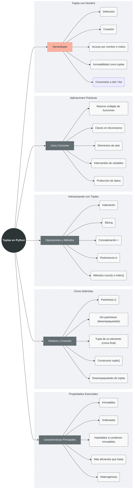

# Definición y Características

Una **tupla** en Python es una **colección ordenada e inmutable** de elementos. Es similar a una lista pero con la diferencia crucial de que no se puede modificar después de su creación.

## Características Principales:

1. **Inmutabilidad**: Los elementos no pueden modificarse después de la creación
2. **Ordenadas**: Mantienen el orden de inserción de los elementos
3. **Hashables**: Si contienen solo elementos inmutables, pueden usarse como claves en diccionarios
4. **Más eficientes**: Ocupan menos memoria y son más rápidas que las listas
5. **Heterogéneas**: Pueden contener diferentes tipos de datos
6. **Iterables**: Se pueden recorrer con bucles `for`

```python
# Demostración de características principales
tupla_ejemplo = (10, "texto", 3.14, True, [1, 2])
print(f"Tupla: {tupla_ejemplo}")
print(f"Tipo: {type(tupla_ejemplo)}")
print(f"Es iterable: {isinstance(tupla_ejemplo, tuple)}")

# Intentar modificar (demuestra inmutabilidad)
try:
    tupla_ejemplo[0] = 20  # Esto fallará
except TypeError as e:
    print(f"Error al intentar modificar: {e}")

# Pero los elementos mutables DENTRO pueden cambiar
tupla_ejemplo[4].append(3)  # La lista dentro SÍ puede modificarse
print(f"Después de modificar lista interna: {tupla_ejemplo}")
```

# Sintaxis y Creación

## 1. **Creación Básica con Paréntesis**

```python
# Tupla vacía
tupla_vacia = ()
print(f"Tupla vacía: {tupla_vacia}, Tipo: {type(tupla_vacia)}")

# Tupla con elementos
coordenadas = (10, 20)
colores = ("rojo", "verde", "azul")
mixta = (1, "dos", 3.0, True)

# Tupla sin paréntesis (tupla empaquetada)
tupla_simple = 1, 2, 3
print(f"Sin paréntesis: {tupla_simple}, Tipo: {type(tupla_simple)}")

# Tupla de un solo elemento (LA COMA ES CRUCIAL)
no_tupla = (42)      # Esto es un entero
si_tupla = (42,)     # Esto es una tupla
tambien_tupla = 42,  # También es tupla

print(f"(42): {type(no_tupla)}")    # <class 'int'>
print(f"(42,): {type(si_tupla)}")   # <class 'tuple'>
print(f"42,: {type(tambien_tupla)}") # <class 'tuple'>
```

## 2. **Uso del Constructor `tuple()`**

```python
# Desde una lista
tupla_de_lista = tuple([1, 2, 3])
print(f"De lista: {tupla_de_lista}")

# Desde una cadena
tupla_de_cadena = tuple("Python")
print(f"De cadena: {tupla_de_cadena}")  # ('P', 'y', 't', 'h', 'o', 'n')

# Desde un rango
tupla_de_rango = tuple(range(5))
print(f"De rango: {tupla_de_rango}")    # (0, 1, 2, 3, 4)

# Desde un diccionario (solo claves)
tupla_de_dict = tuple({"a": 1, "b": 2})
print(f"De diccionario: {tupla_de_dict}")  # ('a', 'b')

# Crear tupla vacía
tupla_vacia_const = tuple()
print(f"Tupla vacía constructor: {tupla_vacia_const}")
```

## 3. **Tuplas por Comprensión (Generator Expression)**

```python
# Las tuplas NO tienen list comprehension, pero sí generator expressions
# Sintaxis: tuple(expresión for elemento in iterable if condición)

# Cuadrados de números
cuadrados = tuple(x**2 for x in range(1, 6))
print(f"Cuadrados: {cuadrados}")  # (1, 4, 9, 16, 25)

# Filtrar números pares
pares = tuple(x for x in range(10) if x % 2 == 0)
print(f"Pares: {pares}")  # (0, 2, 4, 6, 8)

# Es más eficiente que convertir de lista
import time

# Versión con lista (menos eficiente)
inicio = time.time()
lista_cuadrados = [x**2 for x in range(1000000)]
tupla_de_lista = tuple(lista_cuadrados)
tiempo_lista = time.time() - inicio

# Versión directa con generator expression
inicio = time.time()
tupla_directa = tuple(x**2 for x in range(1000000))
tiempo_directo = time.time() - inicio

print(f"Tiempo con lista: {tiempo_lista:.4f}s")
print(f"Tiempo directo: {tiempo_directo:.4f}s")
print(f"¿Son iguales?: {tupla_de_lista == tupla_directa}")
```

# Operaciones Básicas

## 1. **Indexación**

```python
tupla = ("a", "b", "c", "d", "e")

# Índices positivos (0-based)
print(tupla[0])   # "a" - primer elemento
print(tupla[2])   # "c" - tercer elemento

# Índices negativos (desde el final)
print(tupla[-1])  # "e" - último elemento
print(tupla[-3])  # "c" - tercero desde el final

# IndexError si índice fuera de rango
# print(tupla[10])  # ❌ IndexError: tuple index out of range

# Las tuplas son inmutables, no se puede modificar
# tupla[1] = "B"  # ❌ TypeError: 'tuple' object does not support item assignment

# Pero se puede acceder a elementos mutables dentro
tupla_mixta = (1, 2, [3, 4])
print(f"Antes: {tupla_mixta}")
tupla_mixta[2].append(5)  # ✅ La lista DENTRO puede modificarse
print(f"Después: {tupla_mixta}")  # (1, 2, [3, 4, 5])
```

## 2. **Slicing (Rebanado)**

```python
tupla = (0, 1, 2, 3, 4, 5, 6, 7, 8, 9)

# Sintaxis: tupla[inicio:fin:paso]
print(tupla[2:5])     # (2, 3, 4)     # desde índice 2 hasta 4
print(tupla[:4])      # (0, 1, 2, 3)  # desde inicio hasta 3
print(tupla[5:])      # (5, 6, 7, 8, 9) # desde 5 hasta el final
print(tupla[::2])     # (0, 2, 4, 6, 8) # cada 2 elementos
print(tupla[::-1])    # (9, 8, 7, 6, 5, 4, 3, 2, 1, 0) # reverso

# Slicing siempre devuelve una NUEVA tupla
sublista = tupla[2:5]
print(f"Original: {tupla}, id: {id(tupla)}")
print(f"Slice: {sublista}, id: {id(sublista)}")
print(f"¿Mismo objeto?: {tupla is sublista}")  # False

# Rebanado completo crea copia superficial
copia = tupla[:]
print(f"¿Es copia?: {tupla is copia}")  # False
print(f"¿Son iguales?: {tupla == copia}")  # True
```

## 3. **Concatenación y Repetición**

```python
# Concatenación con + (crea nueva tupla)
tupla1 = (1, 2, 3)
tupla2 = (4, 5, 6)
concatenada = tupla1 + tupla2
print(f"Concatenada: {concatenada}")  # (1, 2, 3, 4, 5, 6)
print(f"Original tupla1: {tupla1}")   # (1, 2, 3) - sin cambios

# Repetición con * (crea nueva tupla)
repetida = tupla1 * 3
print(f"Repetida: {repetida}")  # (1, 2, 3, 1, 2, 3, 1, 2, 3)

# Concatenación múltiple
resultado = (1,) + (2, 3) + (4, 5, 6)
print(f"Múltiple: {resultado}")  # (1, 2, 3, 4, 5, 6)

# Cuidado con objetos mutables en repetición
problema = ([0],) * 3
print(f"Antes: {problema}")  # ([0], [0], [0])
problema[0][0] = 99
print(f"Después: {problema}")  # ([99], [99], [99]) ¡Todos modificados!
```

## 4. **Pertenencia, Longitud y Comparación**

```python
tupla = ("manzana", "banana", "cereza")

# Operador in (pertenencia)
print("banana" in tupla)     # True
print("uva" in tupla)        # False

# Operador not in
print("uva" not in tupla)    # True

# Función len() para longitud
print(len(tupla))            # 3
print(len(()))               # 0 (tupla vacía)

# Comparación de tuplas (lexicográfica)
print((1, 2, 3) < (1, 2, 4))     # True (3 < 4)
print((1, 2) < (1, 2, -1))       # True (la primera es prefijo)
print((1, 2, 3) == (1.0, 2.0, 3.0))  # True (valores iguales)
print(('a', 'b') > ('A', 'B'))   # True (comparación ASCII)

# Tuplas como claves de diccionario (por ser hashables)
diccionario = {
    (1, 2): "punto A",
    (3, 4): "punto B",
    (5, 6): "punto C"
}
print(f"Valor en (3,4): {diccionario[(3, 4)]}")
```

# Métodos Disponibles

Las tuplas tienen solo dos métodos debido a su inmutabilidad:

## 1. **`count()` - Contar apariciones**

```python
tupla = (1, 2, 3, 2, 4, 2, 5, 2)

# Contar cuántas veces aparece un valor
conteo = tupla.count(2)
print(f"El número 2 aparece {conteo} veces")  # 4

# Valores que no existen
conteo_cero = tupla.count(10)
print(f"El número 10 aparece {conteo_cero} veces")  # 0

# Con diferentes tipos
tupla_mixta = (1, "a", 1, True, "a", 1.0)
print(f"Conteo de 1: {tupla_mixta.count(1)}")      # 3 (True cuenta como 1)
print(f"Conteo de 'a': {tupla_mixta.count('a')}")  # 2
print(f"Conteo de 1.0: {tupla_mixta.count(1.0)}")  # 1
```

## 2. **`index()` - Encontrar posición**

```python
tupla = ("rojo", "verde", "azul", "verde", "amarillo")

# Encontrar primera posición de un valor
pos = tupla.index("verde")
print(f"'verde' encontrado en posición: {pos}")  # 1

# Con parámetros: index(valor, inicio, fin)
pos2 = tupla.index("verde", 2)  # Busca desde índice 2
print(f"'verde' desde posición 2: {pos2}")  # 3

# Buscar en rango específico
pos3 = tupla.index("verde", 1, 3)  # Busca entre índices 1 y 2
print(f"'verde' entre 1 y 3: {pos3}")  # 1

# ValueError si no se encuentra
try:
    pos4 = tupla.index("negro")
except ValueError as e:
    print(f"Error al buscar 'negro': {e}")
```

# Usos Comunes de las Tuplas

## 1. **Retorno Múltiple de Funciones**

```python
def operaciones_basicas(a, b):
    """Devuelve múltiples resultados como tupla."""
    suma = a + b
    resta = a - b
    multiplicacion = a * b
    division = a / b if b != 0 else None
    return suma, resta, multiplicacion, division

# Llamada a función con retorno múltiple
resultados = operaciones_basicas(10, 5)
print(f"Resultados como tupla: {resultados}")
print(f"Tipo: {type(resultados)}")

# Desempaquetado directo
s, r, m, d = operaciones_basicas(20, 4)
print(f"Suma: {s}, Resta: {r}, Multiplicación: {m}, División: {d}")

# Desempaquetado parcial
s2, *resto = operaciones_basicas(15, 3)
print(f"Suma: {s2}, Resto: {resto}")
```

## 2. **Intercambio de Variables**

```python
# Forma tradicional (con variable temporal)
a = 10
b = 20
print(f"Antes: a={a}, b={b}")

temp = a
a = b
b = temp
print(f"Después tradicional: a={a}, b={b}")

# Forma Pythonica con tuplas
a, b = b, a  # Esto crea una tupla temporal (b, a) y la desempaqueta
print(f"Después Pythonica: a={a}, b={b}")

# Intercambio múltiple
x, y, z = 1, 2, 3
print(f"Antes: x={x}, y={y}, z={z}")
x, y, z = z, x, y  # Rotación circular
print(f"Después: x={x}, y={y}, z={z}")
```

## 3. **Elementos de Conjuntos y Claves de Diccionarios**

```python
# Tuplas como elementos de conjuntos (por ser hashables)
coordenadas_set = {
    (1, 2),
    (3, 4),
    (5, 6),
    (1, 2)  # Duplicado, no se añade
}
print(f"Conjunto de coordenadas: {coordenadas_set}")

# Tuplas como claves de diccionarios
calificaciones = {
    ("Juan", "Matemáticas"): 8.5,
    ("Juan", "Historia"): 7.0,
    ("María", "Matemáticas"): 9.0,
    ("María", "Historia"): 8.5
}

# Acceso
print(f"Juan en Matemáticas: {calificaciones[('Juan', 'Matemáticas')]}")

# Iteración
for (estudiante, materia), nota in calificaciones.items():
    print(f"{estudiante} en {materia}: {nota}")
```

## 4. **Protección de Datos**

```python
# Configuración que no debe cambiar
CONFIGURACION = (
    "localhost",
    8080,
    True,  # debug mode
    ("admin", "user", "guest")  # roles permitidos
)

# Intentar modificar fallará
try:
    CONFIGURACION[1] = 9090
except TypeError:
    print("Configuración protegida: no se puede modificar")

# Datos constantes
DIAS_SEMANA = ("Lunes", "Martes", "Miércoles", "Jueves", "Viernes", "Sábado", "Domingo")
MESES = ("Enero", "Febrero", "Marzo", "Abril", "Mayo", "Junio",
         "Julio", "Agosto", "Septiembre", "Octubre", "Noviembre", "Diciembre")

print(f"Hoy es {DIAS_SEMANA[2]}")
print(f"Mes actual: {MESES[3]}")
```

## 5. **Desempaquetado Avanzado**

```python
# Desempaquetado básico
datos = (1, 2, 3)
a, b, c = datos
print(f"a={a}, b={b}, c={c}")

# Desempaquetado con asterisco
numeros = (1, 2, 3, 4, 5)
primero, *medio, ultimo = numeros
print(f"Primero: {primero}, Medio: {medio}, Último: {ultimo}")

# Ignorar elementos con _
coordenada = (10, 20, 30)
x, y, _ = coordenada  # Ignoramos el tercer valor
print(f"x={x}, y={y}")

# Desempaquetado anidado
datos_anidados = (1, (2, 3), 4)
a, (b, c), d = datos_anidados
print(f"a={a}, b={b}, c={c}, d={d}")

# Intercambio con desempaquetado
lista = [1, 2, 3, 4, 5]
lista[0], lista[-1] = lista[-1], lista[0]
print(f"Lista con extremos intercambiados: {lista}")
```

# Namedtuple: Tuplas con Nombres

## 1. **Definición y Uso Básico**

```python
from collections import namedtuple

# Definición de un Point
Point = namedtuple('Point', ['x', 'y'])
# Equivalente: Point = namedtuple('Point', 'x y')

# Creación
p1 = Point(10, 20)
p2 = Point(x=5, y=15)
p3 = Point(0, 0)

print(f"p1: {p1}")        # Point(x=10, y=20)
print(f"p1.x: {p1.x}")    # 10
print(f"p1.y: {p1.y}")    # 20
print(f"p1[0]: {p1[0]}")  # 10 (también accesible por índice)

# Inmutabilidad (igual que tupla normal)
# p1.x = 30  # ❌ AttributeError: can't set attribute

# Comparación
print(f"p1 == p2: {p1 == p2}")          # False
print(f"p1 == Point(10, 20): {p1 == Point(10, 20)}")  # True
```

## 2. **Métodos Útiles de Namedtuple**

```python
from collections import namedtuple

Persona = namedtuple('Persona', 'nombre edad ciudad')

# Crear instancia
p = Persona("Juan", 30, "Madrid")

# _asdict() - convertir a diccionario
print(f"Como diccionario: {p._asdict()}")
# {'nombre': 'Juan', 'edad': 30, 'ciudad': 'Madrid'}

# _replace() - crear nueva instancia con cambios
p_nueva = p._replace(edad=31, ciudad="Barcelona")
print(f"Original: {p}")
print(f"Modificada: {p_nueva}")

# _make() - crear desde iterable
datos = ["María", 25, "Sevilla"]
p2 = Persona._make(datos)
print(f"Creada con _make: {p2}")

# _fields - ver campos
print(f"Campos: {Persona._fields}")  # ('nombre', 'edad', 'ciudad')

# Acceso por nombre o índice
print(f"Nombre: {p.nombre}")      # Juan
print(f"Edad: {p[1]}")           # 30
```

## 3. **Namedtuple con Valores por Defecto**

```python
from collections import namedtuple

# Python 3.7+ - valores por defecto
Persona = namedtuple('Persona', 'nombre edad ciudad', defaults=[0, "Desconocida"])

# Si no proporcionamos todos los valores
p1 = Persona("Juan")
print(f"p1: {p1}")  # Persona(nombre='Juan', edad=0, ciudad='Desconocida')

p2 = Persona("María", 25)
print(f"p2: {p2}")  # Persona(nombre='María', edad=25, ciudad='Desconocida')

# Python 3.6 y anteriores - usando __defaults__
Persona2 = namedtuple('Persona2', 'nombre edad ciudad')
Persona2.__new__.__defaults__ = (0, "Desconocida")

p3 = Persona2("Carlos")
print(f"p3: {p3}")  # Persona2(nombre='Carlos', edad=0, ciudad='Desconocida')
```

## 4. **Herencia y Métodos Adicionales**

```python
from collections import namedtuple

# Clase base
Point = namedtuple('Point', 'x y')

# Extender con métodos adicionales
class PointExtendido(Point):
    """Point con métodos adicionales."""
    
    def distancia_al_origen(self):
        return (self.x**2 + self.y**2) ** 0.5
    
    def __str__(self):
        return f"Punto({self.x}, {self.y})"
    
    @property
    def cuadrante(self):
        if self.x >= 0 and self.y >= 0:
            return 1
        elif self.x < 0 and self.y >= 0:
            return 2
        elif self.x < 0 and self.y < 0:
            return 3
        else:
            return 4

# Uso
p = PointExtendido(3, 4)
print(f"Punto: {p}")
print(f"Distancia al origen: {p.distancia_al_origen():.2f}")
print(f"Cuadrante: {p.cuadrante}")
print(f"¿Sigue siendo tupla?: {isinstance(p, tuple)}")  # True
```

# Tabla Comparativa: Listas vs Tuplas

| Característica | Listas | Tuplas |
|----------------|---------|---------|
| **Mutabilidad** | ✅ Mutable | ❌ Inmutable |
| **Sintaxis** | `[]` | `()` o sin paréntesis |
| **Rendimiento** | Más lento | Más rápido |
| **Uso memoria** | Más memoria | Menos memoria |
| **Métodos** | Muchos | Solo `count()` e `index()` |
| **Hashable** | ❌ No hashable | ✅ Hashable (si elementos inmutables) |
| **Uso típico** | Datos que cambian | Datos constantes, configuraciones |
| **Claves dict** | ❌ No permitido | ✅ Permitido |
| **Elementos set** | ❌ No permitido | ✅ Permitido |

# Ejemplos Prácticos y Casos de Uso

## 1. **Procesamiento de Datos Estructurados**

```python
# Datos de estudiantes: (nombre, edad, calificaciones)
estudiantes = [
    ("Juan", 20, (8.5, 7.0, 9.0)),
    ("María", 21, (9.0, 8.5, 9.5)),
    ("Carlos", 19, (7.0, 6.5, 8.0))
]

# Procesamiento
for nombre, edad, calificaciones in estudiantes:
    promedio = sum(calificaciones) / len(calificaciones)
    print(f"{nombre} ({edad} años): {calificaciones} → Promedio: {promedio:.2f}")

# Ordenar por promedio
estudiantes_ordenados = sorted(
    estudiantes,
    key=lambda x: sum(x[2])/len(x[2]),
    reverse=True
)
print("\nOrdenados por promedio:")
for est in estudiantes_ordenados:
    print(f"  {est[0]}: {sum(est[2])/len(est[2]):.2f}")
```

## 2. **Coordenadas y Geometría**

```python
# Representación de puntos
puntos = [
    (0, 0),
    (1, 2),
    (3, 4),
    (1, 2)  # Punto duplicado
]

# Eliminar duplicados (convertir a set)
puntos_unicos = set(puntos)
print(f"Puntos únicos: {puntos_unicos}")

# Calcular distancias
def distancia(p1, p2):
    return ((p2[0] - p1[0])**2 + (p2[1] - p1[1])**2) ** 0.5

# Encontrar el punto más lejano del origen
origen = (0, 0)
punto_mas_lejano = max(puntos, key=lambda p: distancia(origen, p))
print(f"Punto más lejano del origen: {punto_mas_lejano}")
print(f"Distancia: {distancia(origen, punto_mas_lejano):.2f}")
```

## 3. **Configuración de Aplicación**

```python
# Configuración como tupla namedtuple
from collections import namedtuple

Config = namedtuple('Config', 'host port debug mode allowed_ips')

config = Config(
    host="localhost",
    port=8080,
    debug=True,
    mode="development",
    allowed_ips=("192.168.1.1", "192.168.1.2", "127.0.0.1")
)

# Uso en la aplicación
print(f"Servidor en {config.host}:{config.port}")
print(f"Modo: {config.mode}")
print(f"IPs permitidas: {config.allowed_ips}")

# Configuración no puede ser modificada accidentalmente
# config.port = 9090  # ❌ Error
```

# Buenas Prácticas con Tuplas

1. **Usa tuplas para datos inmutables** que no deberían cambiar
2. **Prefiere tuplas sobre listas** para constantes y configuraciones
3. **Usa namedtuples** para estructuras de datos con campos con nombre
4. **Aprovecha el desempaquetado** para código más claro
5. **Usa tuplas como claves** en diccionarios cuando necesites múltiples valores
6. **Considera el rendimiento**: tuplas son más rápidas para iteración
7. **Usa `_` para ignorar valores** en desempaquetado

```python
# ✅ BIEN: Tuplas para datos constantes
COLORES_PRIMARIOS = ("rojo", "verde", "azul")

# ✅ BIEN: Desempaquetado claro
x, y = obtener_coordenadas()

# ✅ BIEN: Ignorar valores no necesarios
nombre, _, edad = obtener_datos_personales()

# ✅ BIEN: Namedtuples para estructuras
from collections import namedtuple
Producto = namedtuple('Producto', 'nombre precio stock')

# ❌ EVITA: Usar listas para datos constantes
# COLORES_PRIMARIOS = ["rojo", "verde", "azul"]  # Riesgo de modificación

# ✅ BIEN: Usar tuplas en funciones que devuelven múltiples valores
def dividir(num, den):
    cociente = num // den
    resto = num % den
    return cociente, resto  # Tupla implícita
```

