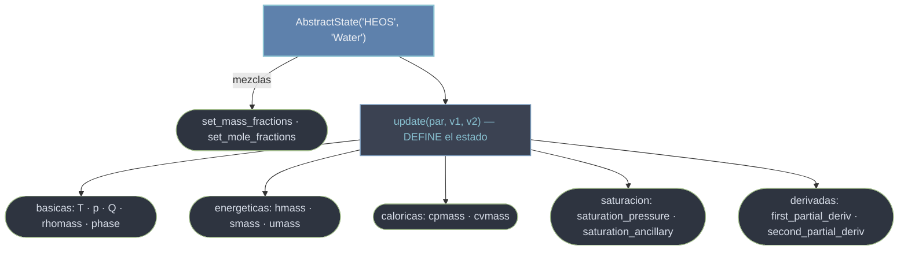

# AbstractState — métodos del objeto de estado

Estos son los métodos del objeto [[AbstractState]], la interfaz de **bajo nivel** de CoolProp. El patrón es siempre el mismo: **creas** el estado para un fluido, lo **fijas** con `update()` dando un par de propiedades, y luego **consultas** todas las demás propiedades —que ya no recalculan el estado, solo lo leen—. Por eso `AbstractState` es mucho más rápido que `PropsSI` cuando necesitas varias propiedades o iteras.

## En acción

```python
from CoolProp.CoolProp import AbstractState
import CoolProp

state = AbstractState("HEOS", "Water")          # 1. crear (backend HEOS, fluido)
state.update(CoolProp.PT_INPUTS, 101325, 300)   # 2. fijar el estado: P=101325 Pa, T=300 K

state.T()        # 3. consultar: 300.0 K
state.p()        #    101325.0 Pa
state.rhomass()  #    densidad masica [kg/m3]
state.hmass()    #    entalpia masica [J/kg]
state.smass()    #    entropia masica [J/kg/K]
state.phase()    #    fase (liquido, gas, supercritico...)
```

## El flujo: crear → fijar → consultar



> [!warning] Siempre `update` antes de consultar
> Consultar una propiedad sin haber fijado el estado con `update()` lanza un error. Y para cambiar de estado, vuelve a llamar `update()` —no creas un objeto nuevo en cada iteración—.

## Los métodos por familia

**Fijar el estado**
- [[AbstractState.update]] — fija el estado con un par de entrada (`PT_INPUTS`, `QT_INPUTS`…). Obligatorio antes de cualquier consulta.
- [[AbstractState.set_mass_fractions]] · [[AbstractState.set_mole_fractions]] — composición de una **mezcla** (fracciones másicas o molares).
- [[AbstractState.get_mass_fractions]] · [[AbstractState.get_mole_fractions]] — leer la composición actual.

**Propiedades básicas**
- [[AbstractState.T]] — temperatura [K] · [[AbstractState.p]] — presión [Pa]
- [[AbstractState.Q]] — calidad de vapor (0 = líquido saturado, 1 = vapor saturado)
- [[AbstractState.rho]] — densidad másica/molar · [[AbstractState.phase]] — fase del fluido

**Propiedades energéticas y calóricas**
- [[AbstractState.hmass]] — entalpía · [[AbstractState.smass]] — entropía · [[AbstractState.umass]] — energía interna (todas másicas)
- [[AbstractState.cpmass]] — calor específico a presión constante · [[AbstractState.cvmass]] — a volumen constante

**Saturación y derivadas**
- [[AbstractState.saturation_pressure]] · [[AbstractState.saturation_ancillary]] — propiedades en la curva de saturación
- [[AbstractState.first_partial_deriv]] · [[AbstractState.second_partial_deriv]] — derivadas parciales termodinámicas
- [[AbstractState.fluid_names]] — nombres de los fluidos del estado

## Tabla de decisión

| Quiero… | Método |
|---------|--------|
| Fijar el estado (P, T, etc.) | [[AbstractState.update]] |
| Temperatura / presión / densidad | [[AbstractState.T]] · [[AbstractState.p]] · [[AbstractState.rho]] |
| Entalpía / entropía / energía interna | [[AbstractState.hmass]] · [[AbstractState.smass]] · [[AbstractState.umass]] |
| Calidad de vapor o fase | [[AbstractState.Q]] · [[AbstractState.phase]] |
| Calores específicos | [[AbstractState.cpmass]] · [[AbstractState.cvmass]] |
| Trabajar con una mezcla | [[AbstractState.set_mole_fractions]] |
| Una derivada termodinámica | [[AbstractState.first_partial_deriv]] |

## Notas relacionadas

- [[AbstractState]] — el objeto al que pertenecen estos métodos
- [[Constants]] — los pares de entrada de `update` y las claves de propiedad
- [[CoolProp.PropsSI]] — la alternativa de alto nivel (una propiedad por llamada)
