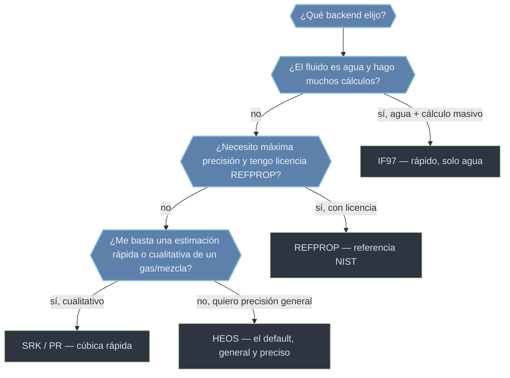

# backends — el motor de cálculo intercambiable

Un **backend** es el modelo matemático con el que CoolProp calcula las propiedades de un fluido. La idea clave es que se **elige sin tocar el resto del código**: cambias el motor y las llamadas a [[CoolProp.PropsSI|PropsSI]] o a [[AbstractState]] siguen siendo las mismas. Por defecto CoolProp usa [[backend.HEOS|HEOS]], el más general y preciso. El concepto de fondo lo desarrolla [[concepto_backend]].

La forma de pedir un backend es el prefijo **`BACKEND::Fluido`** en el nombre del fluido:

```python
from CoolProp.CoolProp import PropsSI

PropsSI('D', 'T', 300, 'P', 1e5, 'Water')         # HEOS implicito (default)
PropsSI('D', 'T', 300, 'P', 1e5, 'HEOS::Water')   # HEOS explicito
PropsSI('D', 'T', 300, 'P', 1e5, 'IF97::Water')   # IF97 (agua, rapido)
```

En [[AbstractState]] el backend no lleva `::`: es directamente el **primer argumento** del constructor, `CP.AbstractState('IF97', 'Water')`.

## En acción

El mismo cálculo (densidad del agua líquida a 300 K y 1 bar) con dos backends distintos, para ver que dan esencialmente lo mismo:

```python
from CoolProp.CoolProp import PropsSI

rho_heos = PropsSI('D', 'T', 300, 'P', 1e5, 'HEOS::Water')   # -> 996.5563403889159
rho_if97 = PropsSI('D', 'T', 300, 'P', 1e5, 'IF97::Water')   # -> 996.5574824996613

print(rho_heos, rho_if97)
print('diferencia relativa:', 100 * abs(rho_heos - rho_if97) / rho_heos, '%')  # -> ~0.0001 %
```

Verificado: HEOS da `996.5563403889159` y IF97 da `996.5574824996613` kg/m³, una diferencia de ~0.0001 %. Misma física, distinto motor; IF97 además es del orden de **14 veces más rápido** para agua (medido en este entorno).

## Los backends disponibles

| Backend | Modelo | Cuándo |
|---------|--------|--------|
| [[backend.HEOS]] | Ecuaciones de Helmholtz multiparamétricas | Por defecto: máxima generalidad y precisión sin licencia, cualquier fluido o mezcla |
| [[backend.IF97]] | Formulación industrial IAPWS-IF97 | Agua/vapor en cálculos masivos (ciclos de vapor, turbinas); muy rápido pero solo agua |
| [[backend.REFPROP]] | NIST REFPROP (externo) | Máxima precisión de referencia; requiere licencia e instalación aparte |
| [[backend.SRK]] | Ecuación cúbica Soave-Redlich-Kwong | Gases y mezclas, estimaciones rápidas/cualitativas; menor precisión (pariente: `PR::`) |

## Cómo elegir



En una frase: **agua pura y rápido → IF97; máxima precisión con licencia → REFPROP; gas/mezcla cualitativo → SRK/PR; todo lo demás → HEOS por defecto.**

## Errores comunes

| Síntoma | Causa | Solución |
|---------|-------|----------|
| `'IF97::R134a'` falla | IF97 solo existe para agua | Usa [[backend.HEOS]] para fluidos distintos del agua |
| `'REFPROP::...'` da error de carga | REFPROP no instalado/licenciado | Comprueba `CP.get_global_param_string('REFPROP_version')`; si es `'n/a'`, cae a HEOS |
| Densidad de líquido imprecisa con `SRK::` | Las cúbicas reproducen mal la fase líquida | Cambia a [[backend.HEOS]] para precisión |

## Notas relacionadas

- [[concepto_backend]] — el concepto: qué es un backend y por qué se puede intercambiar
- [[backend.HEOS]] · [[backend.IF97]] · [[backend.REFPROP]] · [[backend.SRK]]
- [[CoolProp.PropsSI]] — el prefijo `BACKEND::Fluido` va en el argumento del fluido
- [[AbstractState]] — el backend es el primer argumento del constructor
