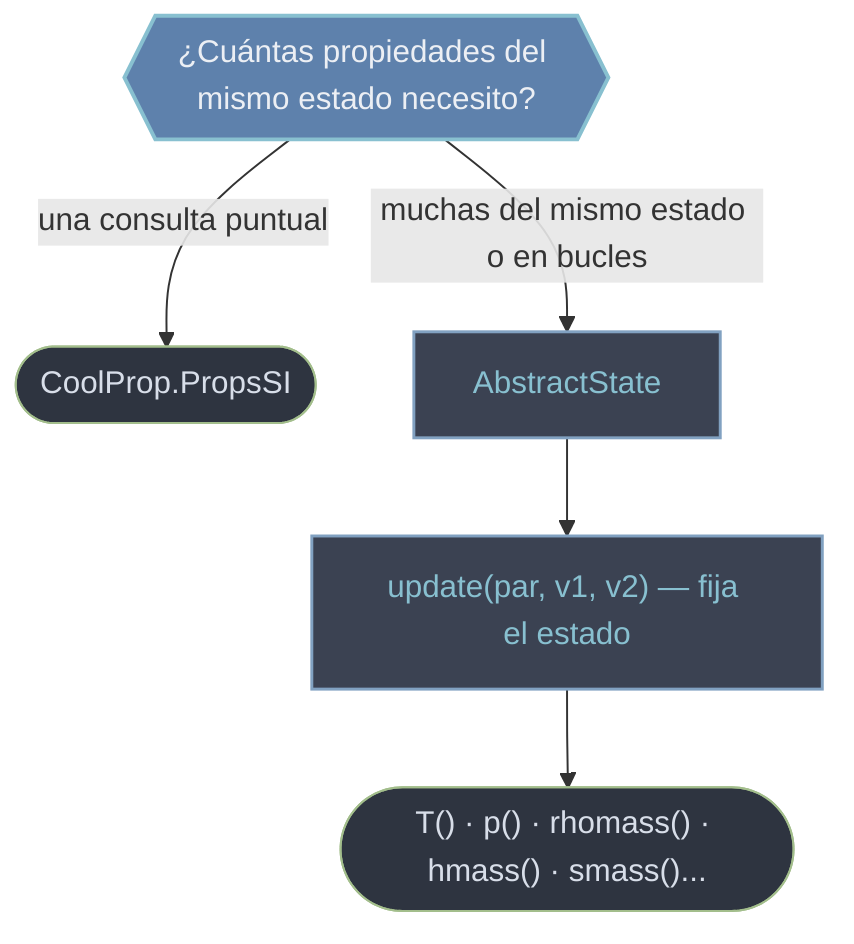

# CoolProp — propiedades termodinámicas de fluidos

CoolProp calcula **propiedades termodinámicas y de transporte** de fluidos puros, pseudopuros y mezclas (agua, aire húmedo, refrigerantes, CO₂…). La idea de fondo es un principio de la termodinámica: el **estado** de un fluido puro queda **definido por dos propiedades independientes** (p. ej. presión y temperatura); fijadas esas dos, CoolProp deriva todas las demás —densidad, entalpía, entropía, calidad de vapor, calores específicos, etc.—.

Ofrece dos interfaces para lo mismo, según cuántas propiedades necesites del mismo estado:

## En acción

```python
from CoolProp.CoolProp import PropsSI, AbstractState
import CoolProp

# Alto nivel: una propiedad por llamada (rapido de escribir)
h = PropsSI("H", "T", 300, "P", 101325, "Water")   # entalpia masica [J/kg]
Tsat = PropsSI("T", "P", 101325, "Q", 0, "Water")  # temperatura de saturacion [K]

# Bajo nivel: un objeto de estado, mucho mas rapido para muchas consultas
state = AbstractState("HEOS", "Water")
state.update(CoolProp.PT_INPUTS, 101325, 300)      # fija el estado (P, T)
state.hmass(), state.rhomass(), state.smass()      # todas las propiedades de ese estado
```

## Las dos interfaces



`PropsSI` recompila el estado en cada llamada; `AbstractState` lo fija una vez y reutiliza, por lo que es mucho más eficiente cuando pides varias propiedades o iteras sobre miles de estados.

## Qué contiene el vault

| Nota / carpeta | Qué aporta |
|----------------|-----------|
| [[CoolProp/conceptos_transversales/index\|conceptos_transversales]] | El **modelo mental**: el estado por 2 propiedades, el backend de cálculo, las unidades SI |
| [[CoolProp.PropsSI]] | La función de **alto nivel**: una propiedad por llamada. El punto de entrada habitual |
| [[CoolProp.HAPropsSI]] | Propiedades del **aire húmedo** (psicrometría): necesita 3 entradas |
| [[CoolProp.PhaseSI]] | La **fase** como texto (`liquid`, `gas`, `supercritical`, `twophase`…) |
| [[AbstractState]] | El objeto de **bajo nivel**: fija un estado y consulta muchas propiedades; soporta mezclas |
| [[CoolProp/AbstractState_metodos/index\|AbstractState_metodos]] | Los métodos del objeto: `update`, propiedades (`T`, `p`, `hmass`…), saturación, derivadas |
| [[CoolProp/backends/index\|backends]] | El **motor de cálculo** intercambiable: `HEOS`, `IF97`, `REFPROP`, `SRK` |
| [[Constants]] | Los pares de entrada (`PT_INPUTS`, `QT_INPUTS`…) y las claves de propiedad |
| [[CoolProp/Plots/index\|Plots]] | Diagramas termodinámicos (P-h, T-s…) con isolíneas vía `PropertyPlot` |
| Metadata | [[CoolProp.get_global_param_string]], [[CoolProp.get_fluid_param_string]], [[CoolProp.set_reference_state]] |

## Notas relacionadas

- [[concepto_estado_termodinamico]] — la regla de las dos propiedades independientes
- [[CoolProp.PropsSI]] — el primer paso para la mayoría de cálculos
- [[AbstractState]] — la vía eficiente y para mezclas
- [[Tree CoolProp]] — mapa completo del vault
