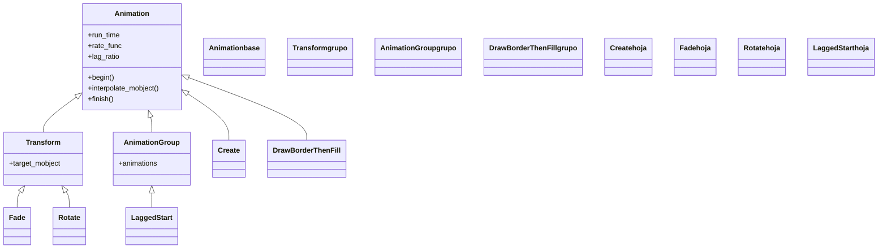

# Animation — la clase base de toda animación

`Animation` es la **clase raíz de todo lo que se reproduce con `self.play`**. No se instancia directamente (es abstracta en la práctica): siempre creas una de sus subclases —`Create`, `Transform`, `FadeOut`, `Rotate`…— pero todas heredan de ella el mismo esqueleto. Por eso esta nota no documenta *una* animación concreta sino el **contrato común**: qué parámetros acepta cualquier animación (`run_time`, `rate_func`, `lag_ratio`), cómo interpola un Mobject del estado inicial al final mediante un `alpha` que va de 0 a 1, y qué método se sobreescribe para crear una animación propia. Si [[concepto_animation]] explica el *modelo mental* (la Animation es una instrucción, no un objeto), esta nota es su **referencia de clase**: el catálogo de familias que cuelgan de ella y la maquinaria que comparten. Conocer `Animation` es saber, de antemano, qué puede hacer cualquier animación sin abrir su documentación.

## Importacion

```python
from manim import Animation
# en la practica nunca importas Animation a secas, sino sus subclases:
from manim import Create, Transform, FadeIn, Rotate
# o, como es habitual:
from manim import *
```

## Herencia

### La jerarquia

`Animation` cuelga directamente de `object`: es ella misma la **raíz** de la rama. Todo lo que se reproduce desciende de aquí. El árbol se ramifica en familias según *qué tipo de cambio* describen; muchas animaciones intermedias (`Transform`, `AnimationGroup`) son a la vez subclases de `Animation` y **padres** de otras.



### Las familias que aporta

Toda animación cae en una de estas familias. Cada una vive en una subcarpeta de `animaciones/`; esta tabla es el mapa para elegir dónde buscar.

| Familia | Carpeta | Describe | Ejemplos |
|---------|---------|----------|----------|
| Creación | [[Manim/animaciones/creacion/index\|creacion]] | un objeto **aparece** dibujándose | [[Create]], [[Write]], [[FadeIn]] |
| Transformación | [[Manim/animaciones/transformacion/index\|transformacion]] | un objeto se **convierte** en otro | [[Transform]], [[ReplacementTransform]] |
| Movimiento | [[Manim/animaciones/movimiento/index\|movimiento]] | un objeto se **desplaza o gira** | [[Rotate]], [[MoveAlongPath]] |
| Indicación | [[Manim/animaciones/indicacion/index\|indicacion]] | **resaltar** algo sin cambiarlo de forma permanente | [[Indicate]], [[Flash]], [[Circumscribe]] |
| Desaparición | [[Manim/animaciones/desaparicion/index\|desaparicion]] | un objeto **se va** de la escena | [[FadeOut]], [[Uncreate]] |
| Composición | [[Manim/animaciones/composicion/index\|composicion]] | **combinar** varias animaciones | [[AnimationGroup]], [[LaggedStart]], [[Succession]] |

## Constructor

Toda subclase de `Animation` recibe primero su(s) **mobject(s) objetivo** y luego los parámetros temporales comunes vía `**kwargs`. La firma de la base es:

```python
Animation(
    mobject,
    *,
    run_time=1.0,
    rate_func=smooth,
    lag_ratio=0.0,
    reverse_rate_function=False,
    name=None,
    remover=False,
    suspend_mobject_updating=True,
)
```

### Parametros comunes a TODA animacion

Estos parámetros los acepta **cualquier** subclase (los hereda de aquí). Son el verdadero motivo de tener una clase base: una vez sabes que algo es una `Animation`, sabes que admite estos sin mirar su firma.

| Parametro | Tipo | Defecto | Controla |
|-----------|------|---------|----------|
| `mobject` | `Mobject` | — | el objeto sobre el que opera la animación |
| `run_time` | `float` (seg) | `1.0` | cuánto **dura** la animación |
| `rate_func` | `Callable` | `smooth` | la **curva de velocidad** (acelera, frena, rebota); ver [[rate_functions]] |
| `lag_ratio` | `float` | `0.0` | el **desfase** entre submobjects: `0` = todos a la vez, `>0` = en cascada |
| `reverse_rate_function` | `bool` | `False` | reproduce la `rate_func` al revés |
| `remover` | `bool` | `False` | si al terminar **quita** el mobject de la escena (lo usan `FadeOut`/`Uncreate`) |

#### run_time — la duración

Es el parámetro que más tocarás. Alarga o acorta la animación sin cambiar nada más.

```python
self.play(Create(c), run_time=3)      # tarda 3 segundos en dibujarse
self.play(FadeOut(c), run_time=0.5)   # se va rapido
```

#### rate_func — la sensación del movimiento

Cambia *cómo* se reparte el tiempo, no cuánto dura. `smooth` (defecto) arranca y frena suave; `linear` va a velocidad constante; `there_and_back` va y vuelve. Se detalla en [[rate_functions]].

```python
from manim import linear, there_and_back
self.play(Rotate(c, PI), rate_func=linear)         # giro mecanico, sin frenado
self.play(c.animate.shift(UP), rate_func=there_and_back)  # sube y baja
```

### Que construye

Devuelve un objeto `Animation` **inerte**: describe un cambio pero no lo ejecuta. Solo cobra vida cuando se pasa a [[Scene.play]] (`self.play(anim)`), que es quien genera los fotogramas intermedios. Crear la animación sin reproducirla no muestra nada en pantalla.

## El ciclo de vida de una animacion

Cuando `self.play` recibe una animación, la recorre internamente en tres fases. No las llamas tú —`play` lo hace—, pero conocerlas explica **qué** se sobreescribe al personalizar.

### begin, interpolate, finish

| Método | Cuándo | Qué hace |
|--------|--------|----------|
| `begin()` | al empezar | guarda el estado inicial del mobject (`starting_mobject`) y prepara la animación |
| `interpolate_mobject(alpha)` | en cada fotograma | mueve el mobject al estado correspondiente a ese `alpha` |
| `finish()` | al terminar | deja el mobject en su estado final exacto |

### El alpha de 0 a 1

El corazón de la interpolación es un número `alpha` que avanza de `0.0` (fotograma inicial) a `1.0` (final). La `rate_func` **remapea** ese avance: con `smooth`, `alpha` no crece lineal sino con arranque y frenado suaves. En cada fotograma, `interpolate_mobject(alpha)` traduce ese número a un estado del mobject. Esta es la pieza que se redefine para crear una animación propia.

## Metodos clave

Casi nunca llamas estos métodos a mano (lo hace `self.play`), pero son los puntos de extensión al subclasear.

| Metodo | Firma | Para que |
|--------|-------|----------|
| `interpolate_mobject` | `interpolate_mobject(alpha)` | **el método a sobreescribir**: define el estado del mobject en cada `alpha` |
| `begin` | `begin()` | preparar la animación (guardar estado inicial) |
| `finish` | `finish()` | dejar el estado final exacto |
| `get_run_time` | `get_run_time()` | devuelve el `run_time` (útil al componer) |

## Ejemplo

### Version minima

La animación más simple no se ve como "una Animation": es cualquier subclase reproducida con `play`. Aquí `Create` —subclase de `Animation`— con un `run_time` heredado de la base.

```python
from manim import *

class AnimacionBase(Scene):
    def construct(self):
        c = Circle(color=BLUE)
        self.play(Create(c), run_time=2)   # run_time viene de Animation
        self.wait()
```

```bash
manim -pql archivo.py AnimacionBase      # -p reproduce, -ql = calidad baja (rapido)
```

### Version completa

Una misma escena que combina varias familias, todas con los parámetros comunes de `Animation` (`run_time`, `rate_func`): aparecer, transformar, mover y desaparecer.

```python
from manim import *

class VariasFamilias(Scene):
    def construct(self):
        c = Circle(color=BLUE, fill_opacity=0.5)
        s = Square(color=GREEN, fill_opacity=0.5)

        self.play(Create(c), run_time=1.5)             # creacion
        self.play(Transform(c, s), rate_func=smooth)   # transformacion
        self.play(c.animate.shift(RIGHT * 2))          # movimiento (.animate)
        self.play(Indicate(c))                         # indicacion
        self.play(FadeOut(c))                          # desaparicion
        self.wait()
```

```bash
manim -pqh archivo.py VariasFamilias     # -qh = calidad alta para el render final
```

## Personalizar (subclasear Animation)

> [!regla] El método a sobreescribir es `interpolate_mobject`
> Una animación propia subclasea `Animation` y redefine `interpolate_mobject(alpha)`: dado un `alpha` de 0 a 1, coloca el mobject en su estado intermedio. Manim llama a este método una vez por fotograma con el `alpha` ya pasado por la `rate_func`.

### Que sobreescribir

| Quiero… | Sobreescribo |
|---------|--------------|
| Un cambio continuo propio (color, posición, escala en función de `alpha`) | `interpolate_mobject(alpha)` |
| Preparar algo antes de empezar (copiar estado, crear objetivos) | `begin()` |
| Fijar el estado final exacto | `finish()` |

### Ejemplo de subclase

Una animación que va girando **y** escalando un mobject a la vez, controlado por un único `alpha`.

```python
from manim import *

class GirarYCrecer(Animation):
    def __init__(self, mobject, vueltas=1, escala_final=2.0, **kwargs):
        self.vueltas = vueltas
        self.escala_final = escala_final
        super().__init__(mobject, **kwargs)

    def interpolate_mobject(self, alpha):
        # alpha va de 0 a 1 (ya pasado por la rate_func)
        self.mobject.become(self.starting_mobject.copy())
        self.mobject.rotate(alpha * self.vueltas * TAU)
        factor = 1 + alpha * (self.escala_final - 1)
        self.mobject.scale(factor)

class UsoCustom(Scene):
    def construct(self):
        s = Square(color=YELLOW)
        self.play(GirarYCrecer(s, vueltas=2, escala_final=2.5), run_time=3)
        self.wait()
```

```bash
manim -pql archivo.py UsoCustom
```

Para casos sencillos suele bastar con subclasear `Transform` (que ya interpola entre dos estados) en vez de `Animation` directamente; ver [[concepto_herencia_mobjects]].

## Errores comunes

| Error | Causa | Solución |
|-------|-------|----------|
| No se ve nada al crear la animación | creaste la `Animation` pero no la reprodujiste | pásala a `self.play(...)` |
| `Animation()` da error o no anima | `Animation` es abstracta, no se instancia sola | usa una subclase (`Create`, `Transform`…) |
| El `run_time` no tiene efecto | lo pasaste al constructor del Mobject, no al de la animación | va en la animación: `Create(c, run_time=2)` o `self.play(..., run_time=2)` |
| El movimiento se ve mecánico | `rate_func=linear` (o lo cambiaste) | usa `smooth` (defecto) para arranque/frenado suaves |
| Al subclasear, el objeto "salta" al final | olvidaste partir de `starting_mobject` en `interpolate_mobject` | reconstruye desde `self.starting_mobject.copy()` cada fotograma |

## Notas relacionadas

- [[concepto_animation]] — el modelo mental: la Animation es una instrucción, no un objeto
- [[Scene.play]] — el método que reproduce una animación y genera los fotogramas
- [[rate_functions]] — las curvas de velocidad (`smooth`, `linear`, `there_and_back`)
- [[concepto_animate_syntax]] — la sintaxis `.animate` como atajo para animar un cambio
- [[Transform]] — la subclase que interpola entre dos estados (base de muchas otras)
- [[AnimationGroup]] — combinar varias animaciones en una
- [[Manim/animaciones/index\|animaciones]] — el índice del pilar con el `classDiagram` completo
