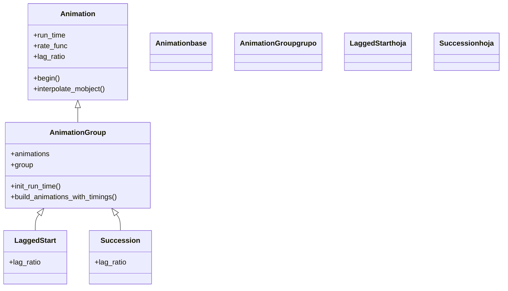

# AnimationGroup — combinar varias animaciones en una sola

`AnimationGroup` es la animación que **agrupa otras animaciones para reproducirlas como una unidad** dentro de un único `self.play`. No describe un cambio nuevo (no dibuja ni mueve nada por sí misma): toma varias [[Animation]] y las coordina en el tiempo según un parámetro clave, `lag_ratio`, que decide si arrancan **todas a la vez**, **escalonadas** o **una tras otra**. Es la **clase madre de toda la familia de composición**: [[LaggedStart]] y [[Succession]] no son más que un `AnimationGroup` con un `lag_ratio` distinto fijado de antemano. Entender `AnimationGroup` y su `lag_ratio` es entender, de golpe, las tres clases de esta carpeta: son la misma maquinaria con distinto desfase. Se usa cuando `self.play(a, b, c)` —que reproduce varias a la vez— se queda corto y necesitas controlar el ritmo, encadenar bloques o anidar grupos dentro de grupos.

## Importacion

```python
from manim import AnimationGroup
# o, como es habitual en Manim:
from manim import *
```

## Herencia

### La jerarquia

`AnimationGroup` cuelga directamente de [[Animation]]: es ella misma una animación (por eso se pasa a `self.play` igual que cualquier otra), pero su trabajo es **orquestar a las demás**. De ella descienden [[LaggedStart]] y [[Succession]], que solo cambian el valor por defecto de `lag_ratio`. La cadena, por tanto, es corta y muy expresiva.



### Que hereda

`AnimationGroup` aporta la lógica de **agrupar y temporizar** las sub-animaciones; todo lo demás (que sea reproducible, que admita `run_time` y `rate_func`) lo hereda de [[Animation]]. Conviene tener claro de dónde sale cada cosa, porque sobre el grupo se aplican los mismos mandos temporales que sobre una animación suelta.

| Capacidad | Parámetro / método | Definido en |
|-----------|--------------------|-------------|
| Ser reproducible con `self.play` | (es una `Animation`) | [[Animation]] |
| Duración total del grupo | `run_time` | [[Animation]] |
| Curva de velocidad global | `rate_func` | [[Animation]] |
| Coordinar varias animaciones | `animations`, `lag_ratio` | `AnimationGroup` |
| Tratar el grupo como un único mobject | `group` | `AnimationGroup` |

El `run_time` y la `rate_func` que se pasan al grupo se reparten entre **todas** las sub-animaciones: cambiar el ritmo del grupo afecta al conjunto, no a una sola pieza.

## Constructor

```python
AnimationGroup(
    *animations,
    group=None,
    run_time=None,
    rate_func=linear,
    lag_ratio=0.0,
    **kwargs,
)
```

### Parametros

| Parametro | Tipo | Defecto | Controla |
|-----------|------|---------|----------|
| `*animations` | `Animation` | — | las animaciones a combinar, pasadas como argumentos sueltos |
| `group` | `Mobject` | `None` | el grupo de mobjects afectados; si es `None`, lo deduce de las animaciones |
| `run_time` | `float` (seg) | `None` | la **duración total** del grupo; si es `None`, la calcula a partir de las sub-animaciones y el `lag_ratio` |
| `rate_func` | `Callable` | `linear` | la curva de velocidad **global** del grupo (ojo: por defecto es `linear`, no `smooth`) |
| `lag_ratio` | `float` | `0.0` | el **desfase** entre los arranques de las sub-animaciones; es el eje que define toda la familia |
| `**kwargs` | — | — | se pasan a [[Animation]] (`reverse_rate_function`, `name`...) |

#### lag_ratio — el corazon de la composicion

`lag_ratio` es el parámetro que **define toda la familia de composición**: fija cuánto espera cada animación respecto a la anterior antes de arrancar, medido como **fracción de la duración de la animación previa**.

| `lag_ratio` | Comportamiento | Equivale a |
|-------------|----------------|------------|
| `0.0` (defecto) | todas arrancan **a la vez** (en paralelo) | `AnimationGroup` puro / `self.play(a, b, c)` |
| entre `0` y `1` | cada una arranca cuando la anterior lleva esa fracción hecha: **cascada** | [[LaggedStart]] (defecto `0.05`) |
| `1.0` | cada una arranca **justo al terminar** la anterior: en secuencia | [[Succession]] |
| `> 1.0` | deja un **hueco** entre el fin de una y el inicio de la siguiente | (pausas entre animaciones) |

```python
# las tres clases de la carpeta son ESTE constructor con distinto lag_ratio:
AnimationGroup(a, b, c, lag_ratio=0.0)   # = a la vez
AnimationGroup(a, b, c, lag_ratio=0.05)  # = LaggedStart (cascada)
AnimationGroup(a, b, c, lag_ratio=1.0)   # = Succession (en secuencia)
```

#### group — tratar el conjunto como un mobject

Cuando las animaciones operan sobre objetos sueltos, Manim deduce el grupo solo. Pasar `group` explícito sirve para casos en que quieres controlar qué mobjects considera afectados el grupo (por ejemplo, para que `rate_func` y los updaters se apliquen sobre el conjunto correcto).

### Que construye / devuelve

Devuelve un objeto `AnimationGroup` **inerte**, como cualquier [[Animation]]: describe la combinación pero no la ejecuta. Solo cobra vida al pasarlo a [[Scene.play]] (`self.play(grupo)`), que es quien reparte el tiempo entre las sub-animaciones según el `lag_ratio` y genera los fotogramas. Crear el grupo sin reproducirlo no muestra nada.

## Ritmo

El grupo expone los mismos mandos temporales que cualquier animación (`run_time`, `rate_func`), más el `lag_ratio` que reparte el tiempo **entre** las piezas. Ajustar estos tres es lo que convierte un montón de animaciones sueltas en una secuencia con ritmo.

### run_time y rate_func del grupo

El `run_time` del grupo es la **duración total** del conjunto, no la de cada pieza: Manim estira o encoge las sub-animaciones para encajarlas en ese tiempo. La `rate_func` del grupo se aplica **por encima** de la de cada animación; por defecto es `linear` (no `smooth`), para que el escalonado del `lag_ratio` se note tal cual.

```python
# todo el grupo dura 4 s en total, repartidos entre las tres:
self.play(AnimationGroup(Create(a), Create(b), Create(c), run_time=4))
```

### lag_ratio: a la vez, en cascada o en secuencia

Es el parámetro distintivo. Con el **mismo** conjunto de animaciones, cambiar solo `lag_ratio` produce los tres comportamientos de la familia sin tocar nada más.

```python
from manim import *

class TresRitmos(Scene):
    def construct(self):
        puntos = VGroup(*[Dot(color=BLUE).shift(RIGHT * i) for i in range(-2, 3)])

        # a la vez:
        self.play(AnimationGroup(*[FadeIn(p) for p in puntos], lag_ratio=0.0))
        self.play(FadeOut(puntos))

        # en cascada (efecto onda):
        puntos2 = puntos.copy().set_color(GREEN)
        self.play(AnimationGroup(*[FadeIn(p) for p in puntos2], lag_ratio=0.2))
        self.wait()
```

```bash
manim -pql archivo.py TresRitmos
```

## Ejemplo

### Version minima

Dos animaciones combinadas en un grupo y reproducidas a la vez (con `lag_ratio=0`, el defecto): equivale a `self.play(a, b)` pero ahora el conjunto es **un solo objeto** que puedes guardar, anidar o reutilizar.

```python
from manim import *

class GrupoMinimo(Scene):
    def construct(self):
        c = Circle(color=BLUE).shift(LEFT * 2)
        s = Square(color=GREEN).shift(RIGHT * 2)
        self.play(AnimationGroup(Create(c), Create(s)))  # ambas a la vez
        self.wait()
```

```bash
manim -pql archivo.py GrupoMinimo      # -p reproduce, -ql = calidad baja (rapido)
```

### Version completa

Un grupo que combina varias familias de animación a la vez sobre objetos distintos, con un `lag_ratio` pequeño para que entren escalonados y un `run_time` que fija la duración total del conjunto.

```python
from manim import *

class GrupoCompleto(Scene):
    def construct(self):
        titulo = Text("Composicion", font_size=40).to_edge(UP)
        c = Circle(color=BLUE, fill_opacity=0.5).shift(LEFT * 3)
        s = Square(color=GREEN, fill_opacity=0.5)
        t = Triangle(color=YELLOW, fill_opacity=0.5).shift(RIGHT * 3)

        # cuatro animaciones distintas, coordinadas como un solo bloque:
        entrada = AnimationGroup(
            Write(titulo),
            Create(c),
            GrowFromCenter(s),
            FadeIn(t),
            lag_ratio=0.15,   # entran con un pequeno desfase
            run_time=3,       # 3 s para todo el bloque
        )
        self.play(entrada)
        self.wait()
```

```bash
manim -pqh archivo.py GrupoCompleto     # -qh = calidad alta para el render final
```

### Variaciones

El mismo grupo con `lag_ratio=1.0` deja de ser un grupo simultáneo y se comporta como una [[Succession]]: una pieza tras otra, dentro de la misma llamada.

```python
from manim import *

class GrupoEnSerie(Scene):
    def construct(self):
        a = Circle(color=BLUE).shift(LEFT * 2)
        b = Square(color=GREEN)
        d = Triangle(color=YELLOW).shift(RIGHT * 2)
        # lag_ratio=1 -> una despues de otra (equivale a Succession):
        self.play(AnimationGroup(Create(a), Create(b), Create(d), lag_ratio=1.0))
        self.wait()
```

```bash
manim -pql archivo.py GrupoEnSerie
```

## Componerla

La gran ventaja de que un `AnimationGroup` sea a su vez una [[Animation]] es que **un grupo puede contener otros grupos**: se anidan para construir coreografías complejas con control fino del ritmo en cada nivel. Un grupo exterior `lag_ratio=1` (en secuencia) puede contener bloques interiores `lag_ratio=0` (cada bloque, a la vez).

```python
from manim import *

class GruposAnidados(Scene):
    def construct(self):
        fila1 = VGroup(*[Dot(color=BLUE).shift(RIGHT * i + UP) for i in range(-2, 3)])
        fila2 = VGroup(*[Dot(color=GREEN).shift(RIGHT * i + DOWN) for i in range(-2, 3)])

        # cada fila entra a la vez (grupo interior), pero una fila despues de otra
        # (grupo exterior en secuencia):
        bloque1 = AnimationGroup(*[FadeIn(p) for p in fila1], lag_ratio=0.0)
        bloque2 = AnimationGroup(*[FadeIn(p) for p in fila2], lag_ratio=0.0)
        self.play(AnimationGroup(bloque1, bloque2, lag_ratio=1.0))
        self.wait()
```

```bash
manim -pql archivo.py GruposAnidados
```

## Errores comunes

| Error | Causa | Solución |
|-------|-------|----------|
| El grupo se ve igual que `self.play(a, b)` | dejaste `lag_ratio=0` (el defecto) | sube `lag_ratio` (cascada) o usa [[LaggedStart]]/[[Succession]] |
| El movimiento del grupo se ve mecánico | el `rate_func` del grupo es `linear` por defecto | pásale `rate_func=smooth` si quieres arranque/frenado del conjunto |
| `run_time` no hace lo que esperas | en un grupo, `run_time` es la duración **total**, no la de cada pieza | calcula: con `lag_ratio>0` el total crece; ajusta el `run_time` del grupo |
| Las animaciones afectan al mismo mobject y se pisan | pasaste dos animaciones que mueven el **mismo** objeto a la vez | usa `.animate` encadenado o sepáralas en [[Succession]] |
| `TypeError: ... got multiple values` | pasaste las animaciones en una lista en vez de sueltas | desempaqueta con `*`: `AnimationGroup(*lista)` |

## Notas relacionadas

- [[LaggedStart]] — el mismo grupo con arranque escalonado (cascada); `lag_ratio` por defecto ~0.05
- [[Succession]] — el mismo grupo en secuencia, una tras otra (`lag_ratio=1`)
- [[Animation]] — la clase base; de ahí vienen `run_time`, `rate_func` y el ser reproducible
- [[Scene.play]] — el método que reproduce el grupo y reparte el tiempo según `lag_ratio`
- [[VGroup]] — agrupar mobjects (no animaciones); a menudo se anima en bloque con un grupo
- [[rate_functions]] — las curvas de velocidad que se aplican al grupo entero
- [[Manim/animaciones/composicion/index|composicion]] — el índice de la familia
