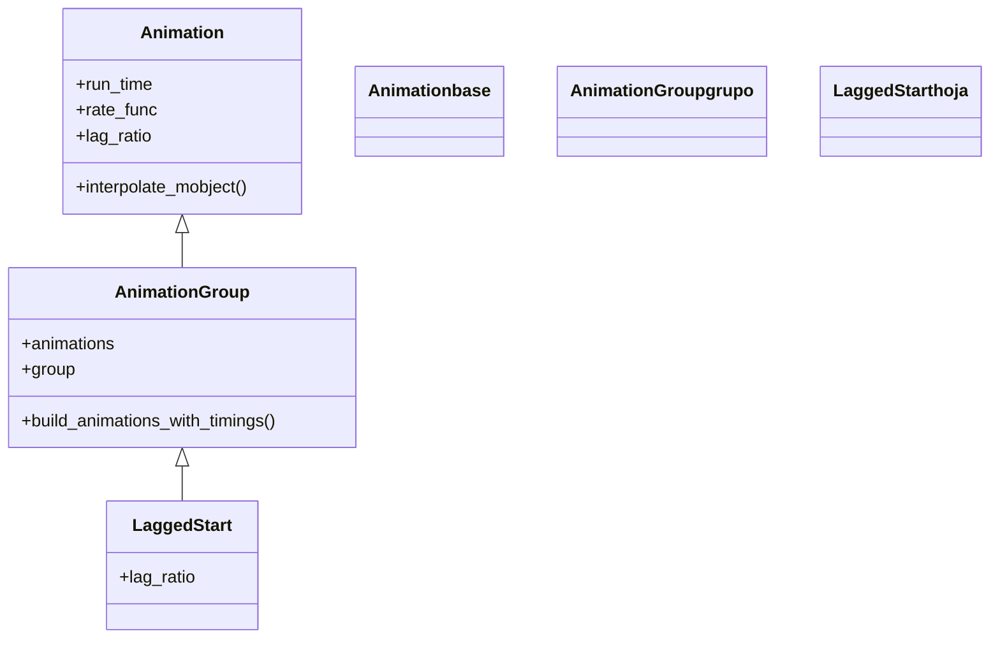

# LaggedStart — animaciones en cascada (arranque escalonado)

`LaggedStart` reproduce varias animaciones con **arranque escalonado**: cada una empieza un poco después de la anterior, antes de que esta termine, produciendo el característico efecto de **cascada u onda**. No es una clase nueva por dentro: es un [[AnimationGroup]] al que solo se le cambia el valor por defecto de `lag_ratio` (de `0.0` a `0.05`), de modo que las piezas se solapan en lugar de arrancar todas juntas. Es la animación con la que entran en pantalla, una tras otra y con gracia, los elementos de una lista, las letras de un título o los puntos de un grupo. Si [[AnimationGroup]] con `lag_ratio=0` es "todas a la vez" y [[Succession]] con `lag_ratio=1` es "una tras otra sin solaparse", `LaggedStart` es el **punto intermedio**: empiezan en orden pero se pisan, que es justo lo que da sensación de fluidez.

## Importacion

```python
from manim import LaggedStart
# y su pariente, para aplicar UNA animacion a cada submobject de un grupo:
from manim import LaggedStartMap
# o, como es habitual:
from manim import *
```

## Herencia

### La jerarquia

`LaggedStart` hereda de [[AnimationGroup]], que a su vez es una [[Animation]]. No añade maquinaria propia: **toda su lógica de temporización es la del grupo**; lo único que cambia es el `lag_ratio` por defecto. La cadena completa hasta `Animation` deja claro que es la misma clase de composición con otro ajuste de fábrica.



### Que hereda

`LaggedStart` lo hereda **prácticamente todo** de [[AnimationGroup]]: la forma de recibir las animaciones, el reparto del tiempo, el `group`, el `run_time` y la `rate_func`. Su única aportación es el `lag_ratio` por defecto distinto.

| Capacidad | Parámetro / método | Definido en |
|-----------|--------------------|-------------|
| Ser reproducible con `self.play` | (es una `Animation`) | [[Animation]] |
| Duración total y curva global | `run_time`, `rate_func` | [[Animation]] |
| Combinar y temporizar varias animaciones | `animations`, `build_animations_with_timings` | [[AnimationGroup]] |
| El desfase, **escalonado por defecto** | `lag_ratio` (defecto `0.05`) | `LaggedStart` |

## Constructor

```python
LaggedStart(
    *animations,
    lag_ratio=0.05,
    group=None,
    run_time=None,
    rate_func=linear,
    **kwargs,
)
```

### Parametros

| Parametro | Tipo | Defecto | Controla |
|-----------|------|---------|----------|
| `*animations` | `Animation` | — | las animaciones a reproducir en cascada, como argumentos sueltos |
| `lag_ratio` | `float` | `0.05` | el **desfase** entre arranques; el único cambio frente a [[AnimationGroup]] |
| `group` | `Mobject` | `None` | el grupo de mobjects afectados (lo deduce si es `None`) |
| `run_time` | `float` (seg) | `None` | la duración **total** de la cascada |
| `rate_func` | `Callable` | `linear` | la curva de velocidad global del conjunto |
| `**kwargs` | — | — | se pasan a [[AnimationGroup]]/[[Animation]] |

#### lag_ratio — cuanto se solapan

En `LaggedStart` el `lag_ratio` mide qué fracción de una animación transcurre antes de que arranque la siguiente. Más bajo, más solape (efecto más continuo); más alto, más separadas (hacia el comportamiento de [[Succession]]).

| `lag_ratio` | Efecto visual |
|-------------|---------------|
| `0.05` (defecto) | cascada muy fluida, las piezas casi se superponen |
| `0.2` – `0.5` | onda clara, se aprecia el orden de entrada |
| `1.0` | ya no se solapan: equivale a una [[Succession]] |

```python
# cuanto mayor el lag_ratio, mas se separan los arranques:
LaggedStart(*animaciones, lag_ratio=0.05)  # cascada apretada (defecto)
LaggedStart(*animaciones, lag_ratio=0.5)   # onda marcada
```

### Que construye / devuelve

Devuelve un `LaggedStart` inerte (un [[AnimationGroup]] con `lag_ratio` escalonado), reproducible solo al pasarlo a [[Scene.play]]. Como cualquier [[Animation]], crearlo no muestra nada hasta que `play` lo ejecuta y genera los fotogramas en cascada.

## Ritmo

El ritmo de `LaggedStart` se gobierna con tres mandos que se combinan: el `lag_ratio` reparte los arranques, el `run_time` fija cuánto dura toda la cascada y la `rate_func` da la sensación a cada pieza.

### run_time y rate_func

El `run_time` es la duración de **toda** la cascada (desde que arranca la primera hasta que termina la última), no la de cada pieza. La `rate_func` por defecto es `linear`, para que el escalonado se note limpio; cada sub-animación conserva además su propia `rate_func`.

```python
# toda la cascada dura 3 s, con un desfase notable entre piezas:
self.play(LaggedStart(*animaciones, lag_ratio=0.3, run_time=3))
```

### lag_ratio: el escalonado en accion

El `lag_ratio` es lo que distingue `LaggedStart` de un grupo simultáneo. Subirlo separa más las entradas; bajarlo las junta.

```python
from manim import *

class CascadaRitmo(Scene):
    def construct(self):
        barras = VGroup(*[
            Rectangle(width=0.4, height=1 + i * 0.3, color=BLUE, fill_opacity=0.6)
            for i in range(6)
        ]).arrange(RIGHT, buff=0.2, aligned_edge=DOWN)

        # las barras crecen una tras otra, en onda:
        self.play(LaggedStart(*[GrowFromEdge(b, DOWN) for b in barras], lag_ratio=0.2))
        self.wait()
```

```bash
manim -pql archivo.py CascadaRitmo
```

## Ejemplo

### Version minima

Tres puntos que aparecen en cascada con el `lag_ratio` por defecto: cada uno arranca cuando el anterior apenas ha empezado.

```python
from manim import *

class CascadaMinima(Scene):
    def construct(self):
        puntos = VGroup(
            Dot(color=BLUE).shift(LEFT),
            Dot(color=GREEN),
            Dot(color=YELLOW).shift(RIGHT),
        )
        self.play(LaggedStart(*[FadeIn(p) for p in puntos]))  # lag_ratio=0.05
        self.wait()
```

```bash
manim -pql archivo.py CascadaMinima      # -p reproduce, -ql = calidad baja (rapido)
```

### Version completa

Una lista de items que entran en cascada deslizándose desde la izquierda: el patrón clásico para revelar una lista con ritmo. Cada línea es un `Text` y todas comparten la misma animación de entrada, escalonada.

```python
from manim import *

class ListaEnCascada(Scene):
    def construct(self):
        items = VGroup(
            Text("1. Definir la escena"),
            Text("2. Crear los mobjects"),
            Text("3. Animar con self.play"),
            Text("4. Renderizar con manim"),
        ).arrange(DOWN, aligned_edge=LEFT, buff=0.4).to_edge(LEFT)

        # cada item entra deslizandose, uno tras otro en onda:
        self.play(
            LaggedStart(
                *[FadeIn(item, shift=RIGHT) for item in items],
                lag_ratio=0.4,
                run_time=3,
            )
        )
        self.wait()
```

```bash
manim -pqh archivo.py ListaEnCascada     # -qh = calidad alta para el render final
```

### Variaciones — LaggedStartMap

Cuando quieres aplicar **la misma** animación a cada submobject de un grupo, escribir la lista a mano es tedioso. `LaggedStartMap` lo hace por ti: recibe una **clase de animación** y un mobject (o grupo), y la aplica a cada submobject en cascada.

```python
from manim import *

class ConLaggedStartMap(Scene):
    def construct(self):
        cuadros = VGroup(*[
            Square(color=BLUE, fill_opacity=0.5).scale(0.5)
            for _ in range(8)
        ]).arrange_in_grid(rows=2, buff=0.3)

        # aplica FadeIn a CADA submobject del grupo, en cascada:
        self.play(LaggedStartMap(FadeIn, cuadros, lag_ratio=0.1))
        self.wait()
```

```bash
manim -pql archivo.py ConLaggedStartMap
```

## Componerla

Como hereda de [[AnimationGroup]], un `LaggedStart` es a su vez una [[Animation]] y **se anida** dentro de otros grupos. Un patrón habitual: aplicar la cascada sobre los **submobjects de un [[VGroup]]**, y meter esa cascada como un bloque dentro de una secuencia mayor.

```python
from manim import *

class CascadaAnidada(Scene):
    def construct(self):
        titulo = Text("Resultados", font_size=44).to_edge(UP)
        grupo = VGroup(*[
            Dot(color=GREEN, radius=0.12).shift(RIGHT * i)
            for i in range(-3, 4)
        ])

        # la cascada sobre los submobjects del VGroup, como un bloque...
        cascada = LaggedStart(*[GrowFromCenter(p) for p in grupo], lag_ratio=0.15)
        # ...metida dentro de una secuencia: primero el titulo, luego la cascada:
        self.play(Succession(Write(titulo), cascada))
        self.wait()
```

```bash
manim -pql archivo.py CascadaAnidada
```

## Errores comunes

| Error | Causa | Solución |
|-------|-------|----------|
| Todas entran a la vez, sin cascada | pusiste `lag_ratio=0` (anulaste el efecto) | deja el defecto `0.05` o sube a `0.2`–`0.4` |
| La cascada va demasiado rápida o lenta | el `run_time` es la duración **total**, repartida entre todas | ajusta `run_time` al número de piezas; más items piden más tiempo |
| Pasaste un grupo y quieres la misma animación en cada parte | escribiste la lista a mano | usa `LaggedStartMap(Animacion, grupo)` |
| `TypeError: ... multiple values` | pasaste las animaciones en una lista | desempaqueta con `*`: `LaggedStart(*lista)` |
| El orden de la cascada no es el esperado | el orden lo fija el de los argumentos (o de los submobjects) | reordena las animaciones o el [[VGroup]] de origen |

## Notas relacionadas

- [[AnimationGroup]] — la clase madre; `LaggedStart` es ella con `lag_ratio=0.05`
- [[Succession]] — el extremo del eje: `lag_ratio=1`, sin solape, una tras otra
- [[Animation]] — la base con `run_time`, `rate_func` y el ser reproducible
- [[VGroup]] — el contenedor cuyos submobjects suelen entrar en cascada
- [[Scene.play]] — el método que reproduce la cascada
- [[Manim/animaciones/composicion/index|composicion]] — el índice de la familia
