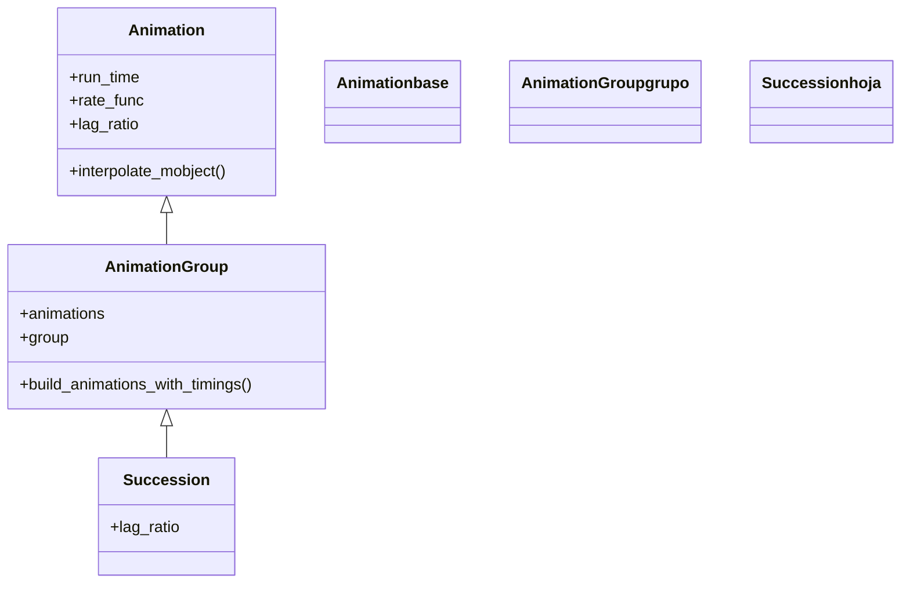

# Succession — animaciones en secuencia (una tras otra)

`Succession` reproduce varias animaciones **en secuencia**: cada una empieza justo cuando la anterior termina, sin solaparse. Por dentro es un [[AnimationGroup]] con `lag_ratio=1.0` fijado de fábrica, así que comparte toda la maquinaria de la familia y solo cambia el extremo del eje: donde [[AnimationGroup]] (`lag_ratio=0`) reproduce todo a la vez y [[LaggedStart]] (`lag_ratio≈0.05`) lo solapa en cascada, `Succession` deja que cada pieza ocurra **completa** antes de la siguiente. Su valor frente a encadenar varios `self.play` es que todo ocurre en **una sola llamada** y, sobre todo, que el resultado es **una única [[Animation]]** que puedes guardar, anidar dentro de otro grupo o combinar con un `lag_ratio` exterior. Se usa para coreografías con pasos ordenados: aparece A, luego se transforma, luego se va, todo como un bloque reutilizable.

## Importacion

```python
from manim import Succession
# o, como es habitual en Manim:
from manim import *
```

## Herencia

### La jerarquia

`Succession` hereda de [[AnimationGroup]], que es una [[Animation]]. No añade lógica propia de temporización: reutiliza la del grupo y solo cambia el `lag_ratio` por defecto a `1.0`. La cadena hasta `Animation` muestra que es la misma clase de composición ajustada al otro extremo del eje frente a [[LaggedStart]].



### Que hereda

`Succession` hereda **toda** la maquinaria de [[AnimationGroup]] (recibir las animaciones, repartir el tiempo, `group`, `run_time`, `rate_func`); su única aportación es el `lag_ratio` por defecto de `1.0`.

| Capacidad | Parámetro / método | Definido en |
|-----------|--------------------|-------------|
| Ser reproducible con `self.play` | (es una `Animation`) | [[Animation]] |
| Duración total y curva global | `run_time`, `rate_func` | [[Animation]] |
| Combinar y temporizar varias animaciones | `animations`, `build_animations_with_timings` | [[AnimationGroup]] |
| El desfase, **secuencial por defecto** | `lag_ratio` (defecto `1.0`) | `Succession` |

## Constructor

```python
Succession(
    *animations,
    lag_ratio=1.0,
    group=None,
    run_time=None,
    rate_func=linear,
    **kwargs,
)
```

### Parametros

| Parametro | Tipo | Defecto | Controla |
|-----------|------|---------|----------|
| `*animations` | `Animation` | — | las animaciones a reproducir en orden, como argumentos sueltos |
| `lag_ratio` | `float` | `1.0` | el **desfase**; en `1.0` cada una arranca al terminar la anterior |
| `group` | `Mobject` | `None` | el grupo de mobjects afectados (lo deduce si es `None`) |
| `run_time` | `float` (seg) | `None` | la duración **total** de toda la secuencia |
| `rate_func` | `Callable` | `linear` | la curva de velocidad global del conjunto |
| `**kwargs` | — | — | se pasan a [[AnimationGroup]]/[[Animation]] |

#### lag_ratio — por que 1.0 es "en secuencia"

Con `lag_ratio=1.0`, la siguiente animación arranca cuando la anterior lleva el **100 %** hecho: es decir, justo al acabar. Bajarlo introduce solape (hacia [[LaggedStart]]); subirlo por encima de `1.0` deja **pausas** entre una y otra.

| `lag_ratio` | Comportamiento |
|-------------|----------------|
| `1.0` (defecto) | cada animación empieza al terminar la anterior: secuencia limpia |
| `< 1.0` | empiezan a solaparse (deja de ser estricta) |
| `> 1.0` | hueco/pausa entre el fin de una y el inicio de la siguiente |

### Que construye / devuelve

Devuelve un `Succession` inerte (un [[AnimationGroup]] con `lag_ratio=1`), reproducible solo al pasarlo a [[Scene.play]]. Lo importante es que es **una sola [[Animation]]**: a diferencia de varios `self.play` seguidos, este objeto se puede guardar en una variable, anidar dentro de otro grupo o reutilizar.

## Ritmo

El ritmo de `Succession` lo fijan el `run_time` (duración total de la secuencia) y la `rate_func` (sensación global). El `lag_ratio` ya está en `1.0`, así que el reparto es secuencial; tocarlo solo tiene sentido para introducir solape o pausas.

### run_time y rate_func

El `run_time` es la duración de **toda** la secuencia, repartida entre las piezas; si no se da, Manim suma las duraciones de las sub-animaciones. La `rate_func` por defecto es `linear`, para que cada paso se reproduzca con su propio ritmo sin que el conjunto lo deforme.

```python
# toda la secuencia (las tres animaciones) dura 6 s en total:
self.play(Succession(Create(a), Transform(a, b), FadeOut(a), run_time=6))
```

### Pausas entre pasos con Wait

Para dejar un respiro **entre** los pasos de una `Succession` se intercala la animación `Wait` (la versión-animación de `self.wait`), que encaja en la secuencia como un paso más.

```python
from manim import *

class SecuenciaConPausa(Scene):
    def construct(self):
        c = Circle(color=BLUE)
        # crear -> esperar 1 s -> desvanecer, todo en una sola Succession:
        self.play(Succession(Create(c), Wait(1), FadeOut(c)))
        self.wait()
```

```bash
manim -pql archivo.py SecuenciaConPausa
```

## Ejemplo

### Version minima

Tres animaciones que ocurren una tras otra dentro de un único `self.play`: el círculo se crea, se mueve y se va, en orden.

```python
from manim import *

class SecuenciaMinima(Scene):
    def construct(self):
        c = Circle(color=BLUE)
        self.play(Succession(
            Create(c),
            c.animate.shift(RIGHT * 2),
            FadeOut(c),
        ))
        self.wait()
```

```bash
manim -pql archivo.py SecuenciaMinima      # -p reproduce, -ql = calidad baja (rapido)
```

### Version completa

Una pequeña coreografía: un título se escribe, una fórmula aparece, se transforma en otra y todo se va, como un bloque secuencial único. Al ser una sola `Succession`, este bloque podría guardarse y reutilizarse o anidarse.

```python
from manim import *

class CoreografiaSecuencial(Scene):
    def construct(self):
        titulo = Text("Teorema", font_size=44).to_edge(UP)
        f1 = MathTex("a^2 + b^2")
        f2 = MathTex("c^2")

        guion = Succession(
            Write(titulo),
            FadeIn(f1, shift=UP),
            ReplacementTransform(f1, f2),
            FadeOut(f2),
            FadeOut(titulo),
            run_time=8,   # los cinco pasos, en 8 s
        )
        self.play(guion)
        self.wait()
```

```bash
manim -pqh archivo.py CoreografiaSecuencial     # -qh = calidad alta para el render final
```

### Variaciones — frente a varios self.play

El mismo resultado visual se logra encadenando `self.play`, pero **no es lo mismo**: con varios `play` tienes varias llamadas sueltas; con `Succession` tienes **un solo objeto** componible.

```python
from manim import *

class PlayVsSuccession(Scene):
    def construct(self):
        c = Circle(color=GREEN)

        # opcion A: tres llamadas separadas (no se pueden anidar ni reutilizar):
        # self.play(Create(c)); self.play(c.animate.shift(UP)); self.play(FadeOut(c))

        # opcion B: una sola Succession -> es UNA Animation, componible:
        secuencia = Succession(Create(c), c.animate.shift(UP), FadeOut(c))
        self.play(secuencia)
        self.wait()
```

```bash
manim -pql archivo.py PlayVsSuccession
```

## Componerla

La ventaja decisiva de `Succession` sobre encadenar `self.play` es que el resultado **es una [[Animation]]** y, por tanto, se anida. Puedes meter una `Succession` (un bloque secuencial) como **una sola pieza** dentro de un [[AnimationGroup]] o un [[LaggedStart]], combinando secuencia interna con simultaneidad o cascada externa.

```python
from manim import *

class SecuenciasEnParalelo(Scene):
    def construct(self):
        c = Circle(color=BLUE).shift(LEFT * 3)
        s = Square(color=GREEN).shift(RIGHT * 3)

        # cada objeto tiene su propia secuencia (crear -> girar)...
        guion_c = Succession(Create(c), Rotate(c, PI))
        guion_s = Succession(Create(s), Rotate(s, PI))

        # ...y las dos secuencias se reproducen EN PARALELO con un grupo exterior:
        self.play(AnimationGroup(guion_c, guion_s, lag_ratio=0.0))
        self.wait()
```

```bash
manim -pql archivo.py SecuenciasEnParalelo
```

## Errores comunes

| Error | Causa | Solución |
|-------|-------|----------|
| Las animaciones se reproducen a la vez, no en orden | usaste [[AnimationGroup]] (defecto `lag_ratio=0`) | usa `Succession` o `lag_ratio=1.0` |
| Quería una pausa entre pasos y no la hay | no intercalaste una espera | añade `Wait(segundos)` como un paso más de la secuencia |
| La secuencia tarda demasiado en total | con `run_time=None` suma todas las duraciones | pásale un `run_time` total para comprimirla |
| No puedo anidar mis `self.play` seguidos | varios `play` son llamadas sueltas, no un objeto | envuélvelos en una `Succession` para tener una sola `Animation` |
| `TypeError: ... multiple values` | pasaste las animaciones en una lista | desempaqueta con `*`: `Succession(*lista)` |

## Notas relacionadas

- [[AnimationGroup]] — la clase madre; `Succession` es ella con `lag_ratio=1.0`
- [[LaggedStart]] — el punto intermedio del eje: cascada con solape (`lag_ratio≈0.05`)
- [[Animation]] — la base con `run_time`, `rate_func` y el ser reproducible
- [[Scene.play]] — el método que reproduce la secuencia; encadenar varios es la alternativa "no componible"
- [[Manim/animaciones/composicion/index|composicion]] — el índice de la familia
