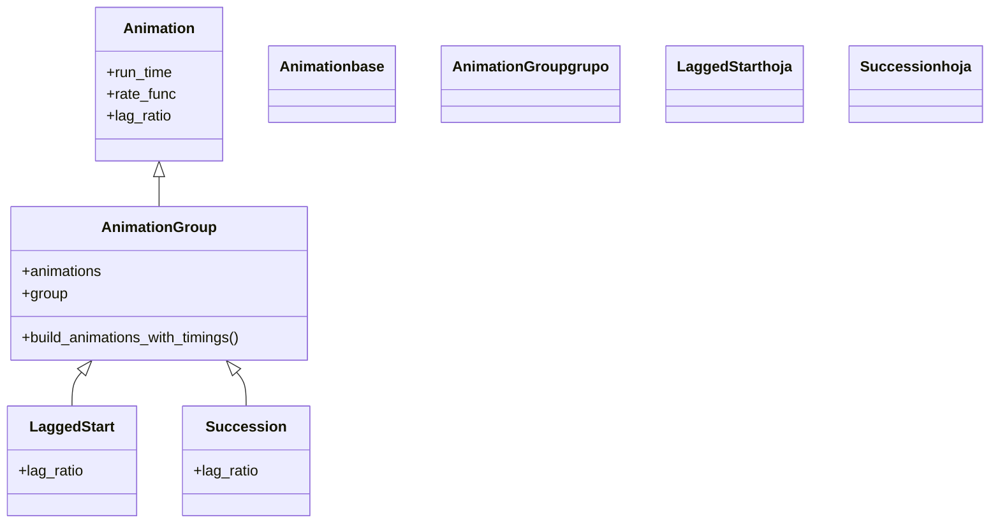

# composicion — combinar animaciones (a la vez, en cascada, en secuencia)

Esta carpeta reúne las animaciones que **no describen un cambio nuevo, sino que combinan otras**: toman varias [[Animation]] sueltas y las reproducen coordinadas dentro de un único `self.play`. La idea que las ordena es que **las tres son la misma maquinaria con distinto `lag_ratio`**, el parámetro que decide el desfase entre los arranques: [[AnimationGroup]] con `lag_ratio=0` las lanza **todas a la vez**; [[LaggedStart]] con `lag_ratio≈0.05` las solapa en **cascada**; [[Succession]] con `lag_ratio=1` las pone **una tras otra**. De hecho `LaggedStart` y `Succession` no son clases independientes: heredan de `AnimationGroup` y solo cambian el valor por defecto de ese parámetro. Frente al atajo `self.play(a, b, c)` —que reproduce varias a la vez—, estas clases dan **control fino** del ritmo y, sobre todo, producen **un objeto componible**: un grupo es a su vez una `Animation`, así que se anida dentro de otro grupo para construir coreografías.

## En accion

Una escena que usa las tres clases sobre los mismos puntos: primero entran **a la vez** con `AnimationGroup`, luego se pintan **en cascada** con `LaggedStart`, y por último se van **en secuencia** con `Succession`. Es el mismo conjunto de animaciones, reordenado en el tiempo por el `lag_ratio`.

```python
from manim import *

class LasTresFormas(Scene):
    def construct(self):
        puntos = VGroup(*[
            Dot(color=BLUE, radius=0.15).shift(RIGHT * i)
            for i in range(-3, 4)
        ])

        # 1. a la vez (lag_ratio=0):
        self.play(AnimationGroup(*[GrowFromCenter(p) for p in puntos]))

        # 2. en cascada (lag_ratio pequeno): se recolorean en onda:
        self.play(LaggedStart(*[p.animate.set_color(YELLOW) for p in puntos], lag_ratio=0.2))

        # 3. en secuencia (lag_ratio=1): se van uno tras otro:
        self.play(Succession(*[FadeOut(p) for p in puntos]))
        self.wait()
```

```bash
manim -pql archivo.py LasTresFormas      # -p reproduce, -ql = calidad baja (rapido)
```

## Herencia

Las tres clases cuelgan de [[Animation]] a través de [[AnimationGroup]]. `AnimationGroup` es subclase directa de `Animation` (por eso se reproduce con `self.play` igual que cualquier animación) y, a la vez, **padre** de las otras dos: [[LaggedStart]] y [[Succession]] solo redefinen el `lag_ratio` por defecto.



## Clases que aporta

Las tres clases de la carpeta, con su padre directo y su uso. Lo que las separa es un único número: el `lag_ratio` por defecto.

| Clase | Hereda de | Para que |
|-------|-----------|----------|
| [[AnimationGroup]] | `Animation` | combinar varias animaciones con control total de `lag_ratio`; la clase madre |
| [[LaggedStart]] | `AnimationGroup` | reproducirlas en **cascada** (arranque escalonado, `lag_ratio≈0.05`) |
| [[Succession]] | `AnimationGroup` | reproducirlas **en secuencia**, una tras otra (`lag_ratio=1`) |

## Como elegir

El eje de decisión es uno solo: **cuánto desfase quieres entre los arranques**. Ese desfase es el `lag_ratio`, y cada valor tiene su clase.

| Quiero que las animaciones… | `lag_ratio` | Clase |
|-----------------------------|-------------|-------|
| Ocurran **todas a la vez** | `0.0` | `AnimationGroup` (o el atajo `self.play(a, b, c)`) |
| Entren **en cascada** (se solapan, efecto onda) | `≈0.05`–`0.5` | `LaggedStart` |
| Vayan **una tras otra** (sin solape) | `1.0` | `Succession` |
| Tengan **pausas** entre ellas | `>1.0` | `AnimationGroup` con `lag_ratio` alto, o `Wait` en `Succession` |

> [!tip] `self.play(a, b)` vs. envolverlas en un grupo
> `self.play(a, b, c)` ya reproduce varias animaciones **a la vez**: es el atajo cómodo para el caso simultáneo. Envolverlas en [[AnimationGroup]]/[[LaggedStart]]/[[Succession]] aporta dos cosas que el atajo no tiene: **control del `lag_ratio`** (cascada, secuencia, pausas) y un **objeto componible** —el grupo es una `Animation` que puedes guardar, reutilizar y **anidar** dentro de otro grupo—.

## Patrones y recetas del grupo

Tres recetas que se repiten al componer animaciones: la cascada sobre un grupo, la secuencia con pausas y el anidamiento de grupos.

### LaggedStart sobre los submobjects de un VGroup

El patrón estrella: tienes un [[VGroup]] y quieres que sus partes entren en cascada. Se genera una animación por submobject y se pasan todas a `LaggedStart`.

```python
from manim import *

class CascadaSobreVGroup(Scene):
    def construct(self):
        grupo = VGroup(*[
            Square(color=BLUE, fill_opacity=0.5).scale(0.4)
            for _ in range(10)
        ]).arrange_in_grid(rows=2, buff=0.25)

        # una animacion por submobject del VGroup, en cascada:
        self.play(LaggedStart(*[FadeIn(m) for m in grupo], lag_ratio=0.1))
        self.wait()
```

```bash
manim -pql archivo.py CascadaSobreVGroup
```

### Una secuencia con pausa intercalada

Para un guion de pasos ordenados con un respiro entre ellos, se usa `Succession` con un `Wait` como paso intermedio: todo en una sola llamada.

```python
from manim import *

class GuionConPausa(Scene):
    def construct(self):
        c = Circle(color=YELLOW)
        s = Square(color=GREEN)
        self.play(Succession(
            Create(c),
            Wait(0.5),                       # respiro
            ReplacementTransform(c, s),
            Wait(0.5),
            FadeOut(s),
        ))
        self.wait()
```

```bash
manim -pql archivo.py GuionConPausa
```

### Anidar grupos: secuencia de bloques simultaneos

Como cada grupo es una `Animation`, se anidan: un `Succession` exterior reproduce **bloques** uno tras otro, y cada bloque es un `AnimationGroup` que ocurre **a la vez**. Así se construyen coreografías con ritmo a varios niveles.

```python
from manim import *

class GruposAnidados(Scene):
    def construct(self):
        izq = VGroup(*[Dot(color=BLUE).shift(LEFT * 2 + UP * i) for i in (-1, 0, 1)])
        der = VGroup(*[Dot(color=GREEN).shift(RIGHT * 2 + UP * i) for i in (-1, 0, 1)])

        bloque_izq = AnimationGroup(*[GrowFromCenter(p) for p in izq])   # a la vez
        bloque_der = AnimationGroup(*[GrowFromCenter(p) for p in der])   # a la vez
        # primero el bloque izquierdo entero, luego el derecho entero:
        self.play(Succession(bloque_izq, bloque_der))
        self.wait()
```

```bash
manim -pql archivo.py GruposAnidados
```

## Notas relacionadas

- [[AnimationGroup]] — la clase madre; combina animaciones con cualquier `lag_ratio`
- [[LaggedStart]] — la cascada (arranque escalonado); incluye su pariente `LaggedStartMap`
- [[Succession]] — la secuencia, una tras otra; alternativa componible a encadenar `self.play`
- [[Animation]] — la clase base de la que todas heredan `run_time`, `rate_func` y `lag_ratio`
- [[Scene.play]] — el método que reproduce el grupo y reparte el tiempo según `lag_ratio`
- [[VGroup]] — agrupar mobjects (no animaciones); su contenido suele entrar en cascada
- [[Manim/animaciones/index|animaciones]] — el índice del pilar con el `classDiagram` completo
