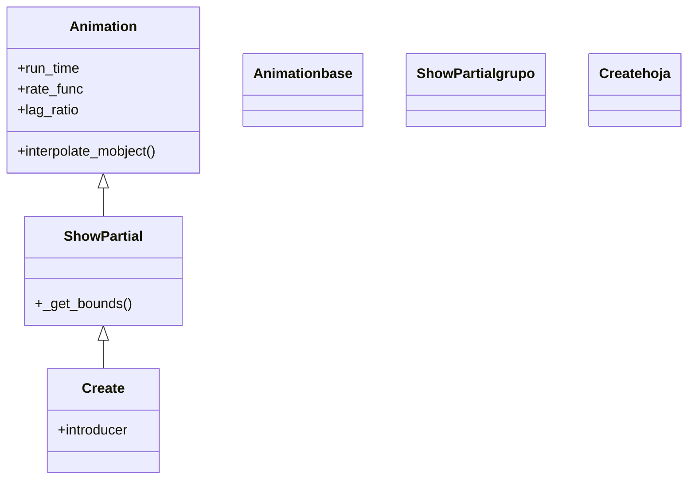

# Create — dibujar un VMobject siguiendo su trazo

`Create` es la **animación de creación por defecto**: dibuja un VMobject de principio a fin recorriendo su propio trazo, como si una pluma invisible siguiera el contorno y lo fuera revelando. Es la primera animación que se aprende y la que casi siempre quieres cuando una figura geométrica —un [[Circle]], un `Square`, una `Line`— debe **aparecer dibujándose** en pantalla. Por dentro es una [[Animation]] que en cada fotograma muestra solo una fracción del trazo del mobject, controlada por el `alpha` que va de 0 a 1; ese reparto progresivo del recorrido es lo que hereda de su padre directo `ShowPartial`. A diferencia de [[FadeIn]] o [[GrowFromCenter]], que hacen aparecer el objeto ya formado, `Create` **traza la geometría**: se ve la línea avanzar. Su pareja para deshacer el trazo es [[Uncreate]] (carpeta desaparición). Para texto y fórmulas suele preferirse [[Write]], que dibuja el borde y luego rellena.

## Importacion

```python
from manim import Create
# o, como es habitual en Manim:
from manim import *
```

## Herencia

### La jerarquia

`Create` cuelga de `ShowPartial`, una [[Animation]] abstracta cuya única misión es mostrar **una porción** del trazo de un VMobject en cada fotograma. `ShowPartial` define el esqueleto (`_get_bounds`) y `Create` lo concreta diciendo "muestra desde el inicio (0) hasta `alpha`": por eso el trazo crece de forma continua. La cadena completa hasta `Animation` deja claro de dónde sale cada cosa.



### Que hereda

`Create` apenas añade lógica propia: hereda casi todo de [[Animation]] y la idea de "mostrar un trozo" de `ShowPartial`. Conviene recordar de dónde sale cada parámetro, porque controlar la duración o la curva de un `Create` es idéntico a controlarlas en cualquier otra animación.

| Capacidad | Cómo se usa | Definido en |
|-----------|-------------|-------------|
| Duración de la animación | `run_time` | [[Animation]] |
| Curva de velocidad | `rate_func` (ver [[rate_functions]]) | [[Animation]] |
| Desfase entre submobjects | `lag_ratio` | [[Animation]] |
| Mostrar solo una porción del trazo | `_get_bounds(alpha)` devuelve `(0, alpha)` | `ShowPartial` |
| Interpolar fotograma a fotograma | `interpolate_mobject(alpha)` | [[Animation]] |

El motor de interpolación (`alpha` de 0 a 1, `begin`/`finish`) es el mismo de [[Animation]]; lo único que `Create` aporta es decidir **qué fracción** del trazo se ve en cada instante.

## Constructor

```python
Create(
    mobject,
    lag_ratio=1.0,
    introducer=True,
    **kwargs,
)
```

### Parametros

| Parametro | Tipo | Defecto | Controla |
|-----------|------|---------|----------|
| `mobject` | `VMobject` | — | el objeto a dibujar; debe tener trazo (ser un VMobject) |
| `lag_ratio` | `float` | `1.0` | el **desfase** entre submobjects: con `1.0` se dibujan uno tras otro (en cascada); con `0` todos a la vez |
| `introducer` | `bool` | `True` | marca la animación como "introductora": añade el mobject a la escena al empezar |
| `**kwargs` | — | — | se pasan a [[Animation]]: `run_time`, `rate_func`, `reverse_rate_function`... |

#### lag_ratio — por qué un VGroup se dibuja en cascada

A diferencia de la base [[Animation]] (donde `lag_ratio` vale `0.0`), `Create` lo pone en `1.0`. Si el mobject es un grupo (un `VGroup`, un `Square` que son cuatro lados), sus partes se dibujan **una tras otra**, no a la vez. Para que todo se trace simultáneamente, baja el valor.

```python
self.play(Create(grupo, lag_ratio=0))    # todas las partes a la vez
self.play(Create(grupo))                  # en cascada (defecto 1.0)
```

### Que construye

Devuelve un objeto `Create` **inerte**: describe el trazado pero no dibuja nada hasta que se pasa a [[Scene.play]]. Solo funciona con **VMobjects** (objetos con trazo vectorial); pasarle un objeto sin trazo no produce el efecto de dibujo.

## Ritmo (run_time y rate_func)

`Create` no añade parámetros temporales propios: usa los que hereda de [[Animation]]. Los dos que más tocarás:

| Parametro | Defecto | Efecto en `Create` |
|-----------|---------|--------------------|
| `run_time` | `1.0` | cuánto tarda en dibujarse el trazo; súbelo para un trazado lento y vistoso |
| `rate_func` | `smooth` | la curva del trazado; `linear` da una pluma a velocidad constante |
| `lag_ratio` | `1.0` | el desfase entre partes (propio: `Create` lo sube a `1.0`) |

```python
self.play(Create(c), run_time=3)               # se dibuja despacio
self.play(Create(c), rate_func=linear)         # pluma a ritmo constante
```

## Ejemplo

### Version minima

Un círculo azul que se dibuja siguiendo su contorno.

```python
from manim import *

class CrearMinimo(Scene):
    def construct(self):
        c = Circle(radius=1.5, color=BLUE)
        self.play(Create(c))
        self.wait()
```

```bash
manim -pql archivo.py CrearMinimo      # -p reproduce, -ql = calidad baja (rapido)
```

### Version completa

Varias figuras que se dibujan: primero un cuadrado a velocidad constante, luego un grupo de líneas que, gracias al `lag_ratio` por defecto, se trazan en cascada una tras otra.

```python
from manim import *

class CrearCompleto(Scene):
    def construct(self):
        # 1. un cuadrado dibujado con pluma de ritmo constante
        s = Square(color=GREEN, fill_opacity=0.3)
        self.play(Create(s), run_time=2, rate_func=linear)

        # 2. un grupo de lineas: se dibujan en cascada (lag_ratio=1.0 por defecto)
        rejilla = VGroup(*[
            Line(LEFT * 3, RIGHT * 3).shift(UP * y)
            for y in (-1, 0, 1)
        ]).set_color(YELLOW)
        self.play(Create(rejilla), run_time=2)
        self.wait()
```

```bash
manim -pqh archivo.py CrearCompleto     # -qh = calidad alta para el render final
```

### Variaciones

Tres usos frecuentes, cada uno con su matiz.

```python
# Dibujar todo de golpe (sin cascada) un grupo:
self.play(Create(grupo, lag_ratio=0))

# Deshacer el trazo (la pareja de Create):
self.play(Uncreate(c))

# Crear y, a la vez, mover otra cosa:
self.play(Create(c), d.animate.shift(UP))
```

## Componerla

Como toda [[Animation]], un `Create` se combina con otras en un solo `self.play` o con las clases de [[Manim/animaciones/composicion/index|composicion]]. Para dibujar varias figuras **escalonadas** en el tiempo, [[LaggedStart]] reparte el arranque de cada una; para hacerlo **a la vez**, basta pasarlas juntas a `play`.

```python
from manim import *

class ComponerCreate(Scene):
    def construct(self):
        figs = VGroup(
            Circle(color=BLUE),
            Square(color=GREEN),
            Triangle(color=YELLOW),
        ).arrange(RIGHT, buff=0.8)

        # cada figura empieza a dibujarse un poco despues que la anterior
        self.play(LaggedStart(
            *[Create(f) for f in figs],
            lag_ratio=0.4,
        ))
        self.wait()
```

```bash
manim -pql archivo.py ComponerCreate
```

## Errores comunes

| Error | Causa | Solución |
|-------|-------|----------|
| No se ve el trazo, el objeto aparece de golpe | el mobject no es un VMobject (no tiene trazo vectorial) | usa `Create` solo con VMobjects; para imágenes/grupos sin trazo usa [[FadeIn]] |
| Un texto se dibuja a trompicones y feo | `Create` traza el contorno crudo del texto | para texto/fórmulas usa [[Write]], pensado para ellos |
| Las partes de un grupo salen una a una y querías todas juntas | `lag_ratio` vale `1.0` por defecto en `Create` | pásalo a `0`: `Create(grupo, lag_ratio=0)` |
| `run_time` no cambia nada | lo pusiste en el constructor del Mobject | va en la animación: `Create(c, run_time=2)` |
| El objeto desaparece al terminar | confundiste `Create` con su reverso | `Create` deja el objeto; para quitarlo usa [[Uncreate]] o [[FadeOut]] |

## Notas relacionadas

- [[Animation]] — la clase base; de aquí salen `run_time`, `rate_func` y el ciclo de interpolación
- [[Write]] — la creación pensada para texto y fórmulas (borde y luego relleno)
- [[DrawBorderThenFill]] — dibuja el contorno y después rellena; padre de `Write`
- [[FadeIn]] — hacer aparecer un objeto por fundido, sin dibujar el trazo
- [[Uncreate]] — el reverso: deshace el trazo de un objeto creado
- [[LaggedStart]] — escalonar el arranque de varias creaciones
- [[Manim/animaciones/creacion/index|creacion]] — la familia completa de animaciones de aparición
