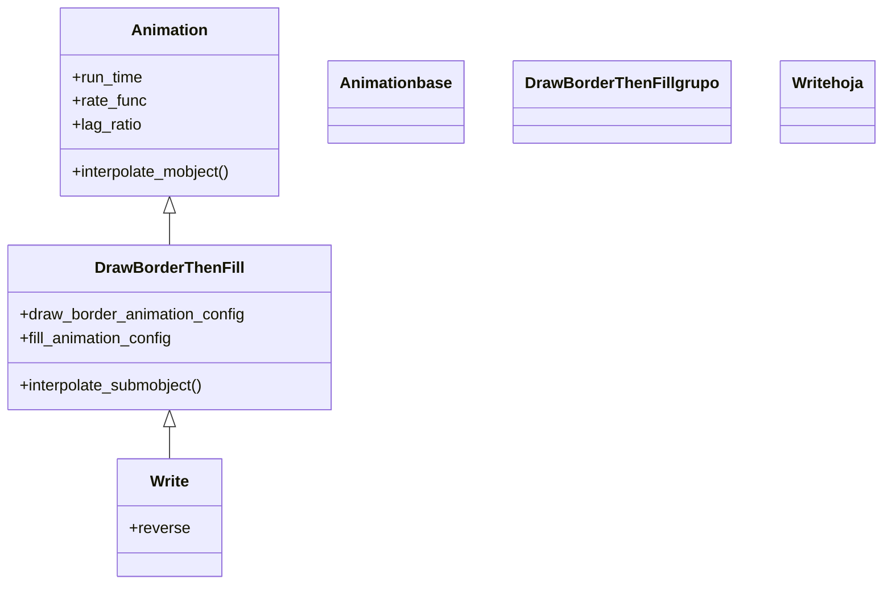

# DrawBorderThenFill — dibujar el contorno y luego rellenar

`DrawBorderThenFill` hace aparecer un VMobject en **dos fases**: primero traza su contorno (como un boceto a lápiz) y, una vez cerrado el borde, lo **rellena** activando su color y su opacidad. El resultado es la sensación de "primero lo dibujo, después lo pinto", muy natural para figuras con relleno y para texto grueso. Es importante por una segunda razón: es el **padre directo de [[Write]]**, que no es más que un `DrawBorderThenFill` afinado para escribir glifos en cascada. Como toda [[Animation]], reparte el avance con un `alpha` de 0 a 1; lo propio de esta clase es **dividir ese avance en dos tramos** —borde en la primera mitad, relleno en la segunda—. Frente a [[Create]], que solo recorre el trazo sin rellenar, aquí el objeto termina **macizo** aunque su trazo no tuviera relleno marcado al inicio.

## Importacion

```python
from manim import DrawBorderThenFill
# o, como es habitual en Manim:
from manim import *
```

## Herencia

### La jerarquia

`DrawBorderThenFill` cuelga **directamente** de [[Animation]]: no pasa por `ShowPartial` como [[Create]], sino que implementa su propio `interpolate_submobject` para repartir el tiempo entre las dos fases. A su vez es el tronco del que baja [[Write]].



### Que hereda

Esta clase aporta la lógica de las dos fases; el ritmo y el ciclo de vida los hereda de [[Animation]].

| Capacidad | Cómo se usa | Definido en |
|-----------|-------------|-------------|
| Duración y curva | `run_time`, `rate_func` | [[Animation]] |
| Desfase entre submobjects | `lag_ratio` | [[Animation]] |
| Ciclo `begin`/`interpolate`/`finish` | el motor de fotogramas | [[Animation]] |
| Dibujar el borde y después rellenar | `interpolate_submobject` en dos tramos | `DrawBorderThenFill` |
| Estilo temporal del borde de boceto | `stroke_width` / color de trazo inicial | `DrawBorderThenFill` |

## Constructor

```python
DrawBorderThenFill(
    vmobject,
    run_time=2,
    rate_func=double_smooth,
    stroke_width=2,
    stroke_color=None,
    draw_border_animation_config={},
    fill_animation_config={},
    **kwargs,
)
```

### Parametros

| Parametro | Tipo | Defecto | Controla |
|-----------|------|---------|----------|
| `vmobject` | `VMobject` | — | el objeto a dibujar y rellenar; debe ser vectorial |
| `run_time` | `float` | `2` | dura más que la media (las dos fases necesitan tiempo) |
| `rate_func` | `Callable` | `double_smooth` | curva con dos suavizados, uno por fase |
| `stroke_width` | `float` | `2` | grosor del borde de boceto mientras se dibuja |
| `stroke_color` | `ManimColor` | `None` | color del contorno temporal; si `None`, usa el del objeto |
| `draw_border_animation_config` | `dict` | `{}` | ajustes finos de la fase de trazado |
| `fill_animation_config` | `dict` | `{}` | ajustes finos de la fase de relleno |
| `**kwargs` | — | — | se pasan a [[Animation]] |

#### Por qué `run_time=2` y no 1

Al partir el avance en dos fases, un `run_time` de 1 segundo deja cada fase en medio segundo y se ve atropellado. Por eso el defecto sube a `2`. Si quieres que sea más rápido, bájalo conscientemente.

```python
self.play(DrawBorderThenFill(s))               # 2 s: medio borde, medio relleno
self.play(DrawBorderThenFill(s, run_time=4))   # mas pausado, se aprecian las fases
```

### Que construye

Devuelve un objeto `DrawBorderThenFill` inerte hasta que [[Scene.play]] lo reproduce. Pensado para VMobjects **con relleno** (un `Square(fill_opacity=...)`, un `Text`): en un objeto sin relleno la segunda fase apenas se nota y conviene usar [[Create]].

## Ritmo (run_time y rate_func)

Hereda `run_time`/`rate_func` de [[Animation]], pero con defectos propios pensados para las dos fases.

| Parametro | Defecto en esta clase | Nota |
|-----------|------------------------|------|
| `run_time` | `2` | el doble de lo habitual, para que las dos fases respiren |
| `rate_func` | `double_smooth` | suaviza por separado el trazado y el relleno |
| `stroke_width` | `2` | grosor del contorno temporal de boceto |

```python
self.play(DrawBorderThenFill(s, rate_func=linear))   # fases a ritmo constante
self.play(DrawBorderThenFill(s, stroke_width=6))     # boceto de borde mas grueso
```

## Ejemplo

### Version minima

Un cuadrado relleno que primero se contornea y luego se pinta.

```python
from manim import *

class BordeRellenoMinimo(Scene):
    def construct(self):
        s = Square(color=BLUE, fill_opacity=0.8)
        self.play(DrawBorderThenFill(s))
        self.wait()
```

```bash
manim -pql archivo.py BordeRellenoMinimo      # -p reproduce, -ql = calidad baja (rapido)
```

### Version completa

Un triángulo y un texto grueso aparecen con las dos fases bien marcadas: el borde se traza en un color y el relleno entra después. Se alarga el `run_time` para que se aprecie la separación.

```python
from manim import *

class BordeRellenoCompleto(Scene):
    def construct(self):
        tri = Triangle(color=GREEN, fill_opacity=0.7).scale(1.5)
        self.play(
            DrawBorderThenFill(tri, run_time=3, stroke_color=YELLOW, stroke_width=5)
        )

        etiqueta = Text("AREA", weight=BOLD, font_size=48).next_to(tri, DOWN)
        self.play(DrawBorderThenFill(etiqueta, run_time=2))
        self.wait()
```

```bash
manim -pqh archivo.py BordeRellenoCompleto     # -qh = calidad alta para el render final
```

## Componerla

Se compone como cualquier [[Animation]]. Para varios objetos en cascada va bien [[LaggedStart]]; para combinarla con otra animación, se pasan juntas a `self.play`. Recuerda que [[Write]] ya es esta animación afinada para texto, así que para fórmulas suele convenir más `Write`.

```python
from manim import *

class ComponerDBTF(Scene):
    def construct(self):
        formas = VGroup(
            Square(color=BLUE, fill_opacity=0.7),
            Circle(color=RED, fill_opacity=0.7),
            Triangle(color=GREEN, fill_opacity=0.7),
        ).arrange(RIGHT, buff=0.8)

        self.play(LaggedStart(
            *[DrawBorderThenFill(f) for f in formas],
            lag_ratio=0.5,
        ))
        self.wait()
```

```bash
manim -pql archivo.py ComponerDBTF
```

## Errores comunes

| Error | Causa | Solución |
|-------|-------|----------|
| El relleno no se nota, parece solo un trazo | el objeto no tiene `fill_opacity` | dale relleno: `Square(fill_opacity=0.8)` |
| La animación se ve atropellada | dejaste un `run_time` bajo para dos fases | súbelo (defecto ya es `2`): `run_time=3` |
| Para texto se ve peor que con `Write` | `Write` añade la cascada por glifos | usa [[Write]] para texto y fórmulas |
| El borde temporal no se ve | `stroke_width`/`stroke_color` apagados | súbelos: `stroke_width=5`, `stroke_color=YELLOW` |
| Confundes el efecto con `Create` | `Create` no rellena, solo traza | si quieres relleno, usa esta clase; si solo trazo, [[Create]] |

## Notas relacionadas

- [[Animation]] — la clase base; de aquí salen `run_time`, `rate_func` y el ciclo de vida
- [[Write]] — la subclase para texto: añade la escritura en cascada por glifos
- [[Create]] — la creación por trazo, sin fase de relleno
- [[FadeIn]] — hacer aparecer el objeto ya formado, sin dibujarlo
- [[Manim/animaciones/creacion/index|creacion]] — la familia completa de animaciones de aparición
