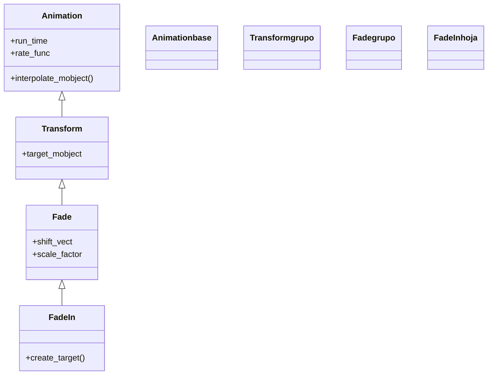

# FadeIn — aparecer por fundido (sin dibujar el trazo)

`FadeIn` hace que un objeto **aparezca subiendo su opacidad** de transparente a opaco, sin trazar su contorno: surge ya formado, como si se materializara. Es la creación más versátil y la única que funciona con **cualquier** Mobject —no solo VMobjects—, así que es la opción por defecto para imágenes, grupos heterogéneos o cuando no quieres el efecto de dibujo de [[Create]]. Acepta además modificadores muy usados: `shift` para que entre desplazándose desde una dirección, `scale` para que entre creciendo o encogiendo, y `target_position` para que aparezca llegando a un punto. Por dentro es un `Fade` (su padre directo) que a su vez es un [[Transform]]: interpola la opacidad del estado invisible al visible. Su pareja exacta es [[FadeOut]] (carpeta desaparición), que hace lo contrario. La diferencia clave con [[Create]]/[[Write]]: estas **dibujan el trazo**; `FadeIn` no, el objeto aparece entero.

## Importacion

```python
from manim import FadeIn
# o, como es habitual en Manim:
from manim import *
```

## Herencia

### La jerarquia

`FadeIn` cuelga de `Fade`, una clase intermedia que recoge lo común a aparecer y desaparecer por opacidad; `Fade` a su vez baja de [[Transform]], el motor que interpola entre dos estados de un mobject (aquí, invisible → visible). La cadena completa hasta [[Animation]]:



### Que hereda

`FadeIn` define cómo es el estado de partida (transparente, quizá desplazado o escalado); la maquinaria de interpolar entre dos estados viene de [[Transform]], y el ritmo de [[Animation]].

| Capacidad | Cómo se usa | Definido en |
|-----------|-------------|-------------|
| Duración y curva | `run_time`, `rate_func` | [[Animation]] |
| Interpolar entre dos estados | el motor de `Transform` | [[Transform]] |
| Desplazamiento y escala de entrada | `shift`, `scale` | `Fade` |
| Construir el estado inicial invisible | `create_target` / `create_starting_mobject` | `FadeIn` |

## Constructor

```python
FadeIn(
    *mobjects,
    shift=ORIGIN,
    target_position=None,
    scale=1,
    **kwargs,
)
```

### Parametros

| Parametro | Tipo | Defecto | Controla |
|-----------|------|---------|----------|
| `*mobjects` | `Mobject` | — | uno o varios objetos a hacer aparecer (cualquier tipo, no solo VMobject) |
| `shift` | `np.ndarray` | `ORIGIN` | dirección/vector desde el que **entra** desplazándose (`UP`, `LEFT*2`...) |
| `target_position` | `Mobject \| point` | `None` | punto/objeto **hacia** el que aparece (alternativa a `shift`) |
| `scale` | `float` | `1` | factor de escala inicial: `<1` entra creciendo, `>1` entra encogiendo |
| `**kwargs` | — | — | se pasan a [[Animation]]: `run_time`, `rate_func`... |

#### shift — entrar desde una dirección

Es el modificador más usado. El objeto empieza desplazado en `-shift` y, mientras se vuelve opaco, se desliza a su sitio. Pasar varios mobjects los hace aparecer a todos igual.

```python
self.play(FadeIn(t, shift=UP))          # entra subiendo
self.play(FadeIn(t, shift=LEFT * 2))    # entra deslizandose desde la derecha
```

#### scale — entrar creciendo o encogiendo

```python
self.play(FadeIn(logo, scale=0.5))   # arranca a la mitad y crece hasta su tamaño
self.play(FadeIn(logo, scale=1.5))   # arranca grande y se asienta
```

### Que construye

Devuelve un objeto `FadeIn` inerte hasta que [[Scene.play]] lo reproduce. Como **añade** el mobject a la escena al terminar, no hace falta un `self.add` previo. Acepta cualquier Mobject, lo que lo hace la creación más general.

## Ritmo (run_time y rate_func)

Hereda `run_time`/`rate_func` de [[Animation]]; sus parámetros **propios** son los de entrada (`shift`, `scale`, `target_position`).

| Parametro | Defecto | Efecto |
|-----------|---------|--------|
| `run_time` | `1.0` | cuánto dura el fundido |
| `rate_func` | `smooth` | curva del fundido; `linear` da una aparición uniforme |
| `shift` | `ORIGIN` | de dónde entra (propio) |
| `scale` | `1` | escala de entrada (propio) |

```python
self.play(FadeIn(t, shift=UP, run_time=2))           # entrada lenta desde abajo
self.play(FadeIn(t), rate_func=rush_from)            # aparece de golpe y frena
```

## Ejemplo

### Version minima

Un texto que aparece por fundido, sin dibujarse.

```python
from manim import *

class FundidoMinimo(Scene):
    def construct(self):
        t = Text("Aparezco suave")
        self.play(FadeIn(t))
        self.wait()
```

```bash
manim -pql archivo.py FundidoMinimo      # -p reproduce, -ql = calidad baja (rapido)
```

### Version completa

Tres tarjetas que entran desde direcciones distintas con `shift`, y un título que aparece creciendo con `scale`. Muestra los modificadores propios de `FadeIn` y que funciona con grupos.

```python
from manim import *

class FundidoCompleto(Scene):
    def construct(self):
        titulo = Text("Menu", font_size=48).to_edge(UP)
        self.play(FadeIn(titulo, scale=0.6))      # entra creciendo

        tarjetas = VGroup(*[
            Square(side_length=1.2, color=c, fill_opacity=0.6)
            for c in (BLUE, GREEN, RED)
        ]).arrange(RIGHT, buff=0.6)

        # cada tarjeta entra desde una direccion distinta
        self.play(
            FadeIn(tarjetas[0], shift=LEFT),
            FadeIn(tarjetas[1], shift=DOWN),
            FadeIn(tarjetas[2], shift=RIGHT),
        )
        self.wait()
```

```bash
manim -pqh archivo.py FundidoCompleto     # -qh = calidad alta para el render final
```

### Variaciones

```python
# Entrar deslizando hacia un punto concreto:
self.play(FadeIn(obj, target_position=ORIGIN))

# Hacer aparecer varios objetos a la vez con el mismo efecto:
self.play(FadeIn(a, b, c, shift=UP))

# La pareja: desaparecer por fundido
self.play(FadeOut(obj, shift=UP))
```

## Componerla

Se compone como cualquier [[Animation]]. Para que varios objetos aparezcan **escalonados** va perfecto [[LaggedStart]] (un menú que se monta de arriba abajo); para combinar la aparición con otra animación, se pasan juntas a `self.play`.

```python
from manim import *

class ComponerFadeIn(Scene):
    def construct(self):
        items = VGroup(*[
            Text(f"Item {i}") for i in range(1, 5)
        ]).arrange(DOWN, aligned_edge=LEFT, buff=0.4)

        # aparecen uno tras otro, cada uno entrando desde la izquierda
        self.play(LaggedStart(
            *[FadeIn(it, shift=RIGHT * 0.5) for it in items],
            lag_ratio=0.3,
        ))
        self.wait()
```

```bash
manim -pql archivo.py ComponerFadeIn
```

## Errores comunes

| Error | Causa | Solución |
|-------|-------|----------|
| Querías ver el trazo dibujarse | `FadeIn` no dibuja, solo funde | usa [[Create]] (figuras) o [[Write]] (texto) |
| El objeto aparece duplicado | hiciste `self.add` y además `FadeIn` | `FadeIn` ya añade el objeto; quita el `add` |
| `shift` no surte efecto visible | el vector es muy pequeño | usa una dirección clara: `shift=UP` o `LEFT*2` |
| El objeto entra encogiéndose y no querías | dejaste un `scale` distinto de 1 | quítalo o pon `scale=1` |
| Esperabas que se quedara y desapareció | confundiste `FadeIn` con [[FadeOut]] | `FadeIn` deja el objeto; `FadeOut` lo quita |

## Notas relacionadas

- [[Fade]] — la clase padre; lo común a aparecer y desaparecer por opacidad
- [[Transform]] — el motor que interpola entre dos estados (abuelo de `FadeIn`)
- [[Animation]] — la base con `run_time` y `rate_func`
- [[FadeOut]] — la pareja exacta: desaparecer por fundido (carpeta desaparición)
- [[Create]] — la creación que sí dibuja el trazo
- [[GrowFromCenter]] — aparecer creciendo desde el centro (otra creación sin trazo)
- [[Manim/animaciones/creacion/index|creacion]] — la familia completa de animaciones de aparición
