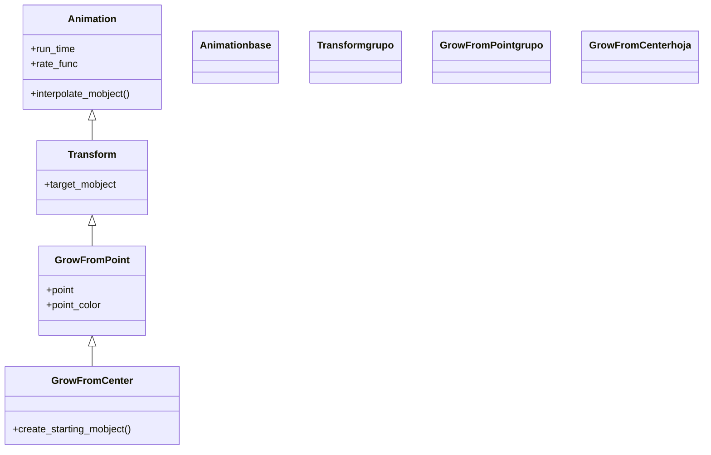

# GrowFromCenter — crecer desde el centro escalando desde cero

`GrowFromCenter` hace que un objeto **aparezca creciendo desde su propio centro**: arranca con tamaño cero (un punto) y se escala hasta su tamaño final, como si brotara. No dibuja el trazo ni funde la opacidad: el objeto está completo desde el primer fotograma, solo cambia de escala. Es ideal para que una figura "salte" a escena con energía —un botón que aparece, una pieza que brota— y para enfatizar un punto de origen. Por dentro es un `GrowFromPoint` (su padre directo) cuyo punto de origen es, justamente, el **centro** del mobject; `GrowFromPoint` a su vez es un [[Transform]] que interpola del estado encogido al final. Pertenece a una pequeña familia de "crecer": `GrowFromEdge` (desde un borde), `GrowFromPoint` (desde un punto cualquiera) y `SpinInFromNothing` (crece girando). Frente a [[FadeIn]], que también aparece sin trazo, aquí el efecto es de **escala** (brota), no de opacidad.

## Importacion

```python
from manim import GrowFromCenter
# o, como es habitual en Manim:
from manim import *
```

## Herencia

### La jerarquia

`GrowFromCenter` cuelga de `GrowFromPoint`, que hace crecer un mobject desde un punto arbitrario; `GrowFromCenter` solo fija ese punto en el centro del objeto. `GrowFromPoint` baja de [[Transform]] (interpola entre dos estados) y este de [[Animation]]. La cadena completa:



### Que hereda

`GrowFromCenter` solo decide el punto de origen (el centro); el "crecer desde un punto" lo aporta `GrowFromPoint`, la interpolación [[Transform]] y el ritmo [[Animation]].

| Capacidad | Cómo se usa | Definido en |
|-----------|-------------|-------------|
| Duración y curva | `run_time`, `rate_func` | [[Animation]] |
| Interpolar entre dos estados | el motor de `Transform` | [[Transform]] |
| Crecer desde un punto dado | `point`, `point_color` | `GrowFromPoint` |
| Fijar el origen en el centro | `point = mobject.get_center()` | `GrowFromCenter` |

### Los parientes de la familia "crecer"

| Clase | Crece desde | Cuándo usarla |
|-------|-------------|---------------|
| `GrowFromCenter` | el centro del objeto | brote simétrico, el caso por defecto |
| `GrowFromEdge` | un borde (`UP`, `LEFT`...) | que salga "desde" un lado |
| `GrowFromPoint` | un punto arbitrario `point` | brotar desde una posición concreta de la escena |
| `SpinInFromNothing` | el centro, girando | aparición con un giro extra |

## Constructor

```python
GrowFromCenter(
    mobject,
    point_color=None,
    **kwargs,
)
```

### Parametros

| Parametro | Tipo | Defecto | Controla |
|-----------|------|---------|----------|
| `mobject` | `Mobject` | — | el objeto que brota desde su centro |
| `point_color` | `ManimColor` | `None` | color del punto de origen al arrancar; si `None`, parte del color del objeto |
| `**kwargs` | — | — | se pasan a [[Animation]]: `run_time`, `rate_func`... |

#### point_color — el tinte del arranque

Si lo fijas, el objeto empieza con ese color en el punto-semilla y va virando al suyo a medida que crece; un detalle para enfatizar el origen.

```python
self.play(GrowFromCenter(s))                    # brota con su propio color
self.play(GrowFromCenter(s, point_color=WHITE)) # arranca blanco y vira al suyo
```

### Que construye

Devuelve un objeto `GrowFromCenter` inerte hasta que [[Scene.play]] lo reproduce. **Añade** el mobject a la escena al terminar, así que no necesita un `self.add` previo. Funciona con cualquier Mobject (el efecto es de escala, no de trazo).

## Ritmo (run_time y rate_func)

Hereda todo el ritmo de [[Animation]]; el único parámetro propio relevante es `point_color`.

| Parametro | Defecto | Efecto |
|-----------|---------|--------|
| `run_time` | `1.0` | cuánto tarda en crecer |
| `rate_func` | `smooth` | curva del crecimiento; `there_and_back` lo hace brotar y encoger |
| `point_color` | `None` | color del punto-semilla (propio) |

```python
self.play(GrowFromCenter(s), run_time=1.5)            # brote pausado
self.play(GrowFromCenter(s), rate_func=rush_into)     # crece acelerando
```

## Ejemplo

### Version minima

Un cuadrado que brota desde su centro.

```python
from manim import *

class CrecerMinimo(Scene):
    def construct(self):
        s = Square(color=GREEN, fill_opacity=0.6)
        self.play(GrowFromCenter(s))
        self.wait()
```

```bash
manim -pql archivo.py CrecerMinimo      # -p reproduce, -ql = calidad baja (rapido)
```

### Version completa

Una fila de círculos que brotan en cascada desde su centro y, para contrastar, un parejo que crece desde un borde con `GrowFromEdge`. Muestra el efecto de escala y un pariente de la familia.

```python
from manim import *

class CrecerCompleto(Scene):
    def construct(self):
        puntos = VGroup(*[
            Circle(radius=0.4, color=BLUE, fill_opacity=0.7)
            for _ in range(4)
        ]).arrange(RIGHT, buff=0.5)

        # cada circulo brota desde su centro, en cascada
        self.play(LaggedStart(
            *[GrowFromCenter(p) for p in puntos],
            lag_ratio=0.3,
        ))

        # un cuadrado que crece desde su borde superior (pariente)
        s = Square(color=YELLOW, fill_opacity=0.5).next_to(puntos, DOWN, buff=1)
        self.play(GrowFromEdge(s, UP))
        self.wait()
```

```bash
manim -pqh archivo.py CrecerCompleto     # -qh = calidad alta para el render final
```

## Componerla

Se compone como cualquier [[Animation]]. El patrón estrella es combinarla con [[LaggedStart]] para que varios objetos broten **escalonados** (como en el ejemplo); para que broten a la vez, se pasan juntos a `self.play`.

```python
from manim import *

class ComponerGrow(Scene):
    def construct(self):
        estrellas = VGroup(*[
            Star(color=YELLOW, fill_opacity=0.8).scale(0.4).shift(RIGHT * x)
            for x in (-2, 0, 2)
        ])
        # brotan todas a la vez
        self.play(*[GrowFromCenter(e) for e in estrellas])
        self.wait()
```

```bash
manim -pql archivo.py ComponerGrow
```

## Errores comunes

| Error | Causa | Solución |
|-------|-------|----------|
| El objeto no parece "brotar", solo aparece | `run_time` muy corto | súbelo: `GrowFromCenter(s, run_time=1.5)` |
| Querías que saliera desde un lado | `GrowFromCenter` usa el centro | usa `GrowFromEdge(s, UP)` o `GrowFromPoint(s, punto)` |
| El objeto aparece duplicado | hiciste `self.add` y además la animación | la animación ya lo añade; quita el `add` |
| Esperabas que se dibujara el trazo | esta animación escala, no traza | usa [[Create]] (figuras) o [[Write]] (texto) |
| El crecimiento se ve mecánico | cambiaste `rate_func` a `linear` | usa `smooth` (defecto) para un brote natural |

## Notas relacionadas

- [[GrowFromPoint]] — el padre: crecer desde un punto cualquiera de la escena
- [[Transform]] — el motor que interpola entre dos estados (abuelo de la clase)
- [[Animation]] — la base con `run_time` y `rate_func`
- [[FadeIn]] — aparecer por fundido en vez de por escala
- [[Create]] — la creación que sí dibuja el trazo
- [[LaggedStart]] — escalonar el brote de varios objetos
- [[Manim/animaciones/creacion/index|creacion]] — la familia completa de animaciones de aparición
