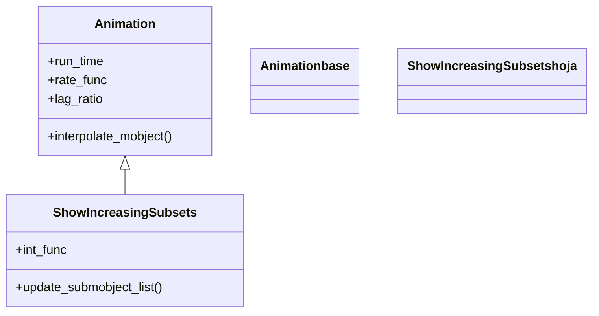

# ShowIncreasingSubsets — mostrar los submobjects de un grupo uno a uno

`ShowIncreasingSubsets` revela los **submobjects de un grupo de forma acumulativa**: primero se ve uno, luego dos, luego tres... hasta mostrarlos todos. No dibuja trazos ni funde opacidades; simplemente va **añadiendo elementos enteros** a la escena conforme avanza el `alpha`. Es la animación ideal para listas, conjuntos de puntos de un `VGroup`, los términos de una sucesión o el rellenado progresivo de una tabla: cualquier cosa que sea "una colección que aparece pieza a pieza". Por dentro es una [[Animation]] directa (no pasa por `Transform` ni `ShowPartial`) que en cada fotograma calcula **cuántos** submobjects deben verse y muestra ese prefijo del grupo. Tiene un pariente cercano para texto, `AddTextLetterByLetter`, que aplica la misma idea letra a letra. A diferencia de [[Create]] con `lag_ratio`, aquí cada elemento aparece **completo de golpe** (no se traza), lo que da un efecto más "discreto", de conteo.

## Importacion

```python
from manim import ShowIncreasingSubsets
# o, como es habitual en Manim:
from manim import *
```

## Herencia

### La jerarquia

`ShowIncreasingSubsets` cuelga **directamente** de [[Animation]]: implementa su propio `interpolate_mobject(alpha)` que traduce el `alpha` a un número entero de submobjects visibles. No hereda de `Transform` porque no interpola formas, solo decide cuántas piezas mostrar.



### Que hereda

Lo único propio es "cuántos submobjects mostrar en cada `alpha`"; el ciclo de vida y el ritmo bajan de [[Animation]].

| Capacidad | Cómo se usa | Definido en |
|-----------|-------------|-------------|
| Duración y curva | `run_time`, `rate_func` | [[Animation]] |
| Ciclo `begin`/`interpolate`/`finish` | el motor de fotogramas | [[Animation]] |
| Cuántas piezas visibles en cada `alpha` | `int_func` aplicada a `alpha * n` | `ShowIncreasingSubsets` |

### El pariente para texto

| Clase | Revela | Cuándo usarla |
|-------|--------|---------------|
| `ShowIncreasingSubsets` | los submobjects de un grupo, uno a uno | listas, puntos, términos de un `VGroup` |
| `AddTextLetterByLetter` | un texto, letra a letra | máquina de escribir; texto que aparece carácter a carácter |

## Constructor

```python
ShowIncreasingSubsets(
    group,
    suspend_mobject_updating=False,
    int_func=np.round,
    **kwargs,
)
```

### Parametros

| Parametro | Tipo | Defecto | Controla |
|-----------|------|---------|----------|
| `group` | `Mobject` | — | el grupo (un `VGroup`/`Group`) cuyos submobjects se revelan |
| `suspend_mobject_updating` | `bool` | `False` | si pausa los updaters del grupo durante la animación |
| `int_func` | `Callable` | `np.round` | cómo se redondea `alpha * n` a un entero de piezas (`np.round`, `np.floor`, `np.ceil`) |
| `**kwargs` | — | — | se pasan a [[Animation]]: `run_time`, `rate_func`... |

#### int_func — cómo cuenta las piezas

Controla el redondeo del número de submobjects visibles. Con `np.ceil` el último elemento aparece antes; con `np.floor`, más tarde. Es un ajuste fino del ritmo del conteo.

```python
import numpy as np
self.play(ShowIncreasingSubsets(grupo, int_func=np.ceil))   # revela "adelantado"
self.play(ShowIncreasingSubsets(grupo, int_func=np.floor))  # revela "retrasado"
```

### Que construye

Devuelve un objeto `ShowIncreasingSubsets` inerte hasta que [[Scene.play]] lo reproduce. El objeto que recibe debe ser un **grupo con submobjects** (un `VGroup`, un `Group`): lo que aparece pieza a pieza son sus hijos directos.

## Ritmo (run_time y rate_func)

Hereda el ritmo de [[Animation]]; el reparto del tiempo entre piezas se controla con `rate_func` e `int_func`.

| Parametro | Defecto | Efecto |
|-----------|---------|--------|
| `run_time` | `1.0` | el tiempo total para revelar todo el grupo |
| `rate_func` | `smooth` | curva del conteo; `linear` revela las piezas a ritmo constante |
| `int_func` | `np.round` | el redondeo de cuántas piezas se ven (propio) |

```python
self.play(ShowIncreasingSubsets(grupo, run_time=3))                 # conteo lento
self.play(ShowIncreasingSubsets(grupo, rate_func=linear))           # ritmo uniforme
```

## Ejemplo

### Version minima

Una fila de puntos que aparecen uno a uno.

```python
from manim import *

class SubsetsMinimo(Scene):
    def construct(self):
        puntos = VGroup(*[
            Dot(color=BLUE).shift(RIGHT * x)
            for x in range(-3, 4)
        ])
        self.play(ShowIncreasingSubsets(puntos))
        self.wait()
```

```bash
manim -pql archivo.py SubsetsMinimo      # -p reproduce, -ql = calidad baja (rapido)
```

### Version completa

Una lista de viñetas que aparece línea a línea (como construyendo una diapositiva) y, a la vez, una nube de puntos que se va poblando. A ritmo constante (`linear`) para que el conteo sea uniforme.

```python
from manim import *
import numpy as np

class SubsetsCompleto(Scene):
    def construct(self):
        # una lista que se construye linea a linea
        items = VGroup(*[
            Text(f"- Paso {i}", font_size=32) for i in range(1, 5)
        ]).arrange(DOWN, aligned_edge=LEFT, buff=0.4).to_edge(LEFT)
        self.play(ShowIncreasingSubsets(items, run_time=2, rate_func=linear))

        # una nube de puntos que se va poblando
        nube = VGroup(*[
            Dot(np.array([np.random.uniform(0, 4), np.random.uniform(-2, 2), 0]),
                color=YELLOW, radius=0.06)
            for _ in range(40)
        ])
        self.play(ShowIncreasingSubsets(nube, run_time=2))
        self.wait()
```

```bash
manim -pqh archivo.py SubsetsCompleto     # -qh = calidad alta para el render final
```

## Componerla

Se compone como cualquier [[Animation]]. Suele ir sola (ya es de por sí un "reparto en el tiempo"), pero se combina bien con otra animación en el mismo `self.play`. Para revelar varios grupos en serie, encadénalos con [[Succession]] de [[Manim/animaciones/composicion/index|composicion]].

```python
from manim import *

class ComponerSubsets(Scene):
    def construct(self):
        fila_a = VGroup(*[Square(side_length=0.5, color=BLUE).shift(RIGHT*x) for x in range(5)])
        fila_b = VGroup(*[Square(side_length=0.5, color=GREEN).shift(RIGHT*x + DOWN) for x in range(5)])

        # primero se puebla una fila, luego la otra (en serie)
        self.play(Succession(
            ShowIncreasingSubsets(fila_a),
            ShowIncreasingSubsets(fila_b),
        ))
        self.wait()
```

```bash
manim -pql archivo.py ComponerSubsets
```

## Errores comunes

| Error | Causa | Solución |
|-------|-------|----------|
| No aparece nada o aparece todo de golpe | pasaste un Mobject simple, sin submobjects | dale un `VGroup`/`Group` con varios hijos |
| Esperabas ver dibujarse cada pieza | esta animación muestra piezas enteras, no traza | usa [[Create]] con `lag_ratio` si quieres trazo en cascada |
| Querías escribir un texto letra a letra | `ShowIncreasingSubsets` revela submobjects, no glifos finos | usa el pariente `AddTextLetterByLetter` |
| El último elemento aparece tarde/temprano | el redondeo de `int_func` | ajusta `int_func=np.ceil` o `np.floor` |
| El ritmo se ve irregular | `rate_func=smooth` acelera y frena | usa `rate_func=linear` para un conteo uniforme |

## Notas relacionadas

- [[Animation]] — la clase base; de aquí salen `run_time`, `rate_func` y el ciclo de vida
- [[Create]] — revelar una figura trazando su contorno (no por piezas enteras)
- [[FadeIn]] — hacer aparecer todo el grupo a la vez por fundido
- [[Succession]] — encadenar varios reveals en serie
- [[VGroup]] — el contenedor cuyos submobjects revela esta animación
- [[Manim/animaciones/creacion/index|creacion]] — la familia completa de animaciones de aparición
