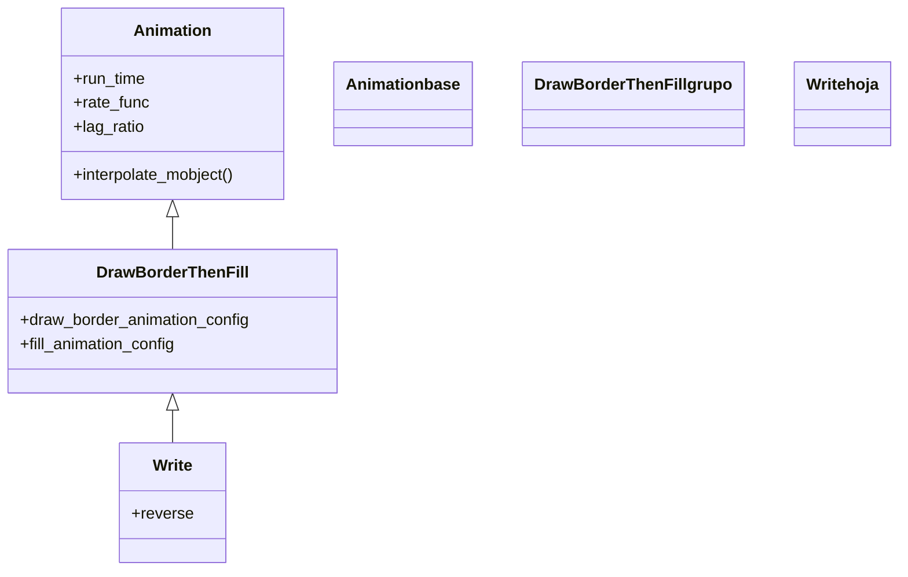

# Write — escribir texto y fórmulas (borde y relleno en cascada)

`Write` es la animación de creación **pensada para texto y fórmulas**: simula la escritura a mano dibujando primero el contorno de cada glifo y rellenándolo después, todo **en cascada** trozo por trozo, de modo que las letras van apareciendo de izquierda a derecha como si una pluma las escribiera. Es lo que quieres siempre que un [[Text]], un `Tex` o un `MathTex` deba **aparecer escribiéndose**; sobre figuras geométricas funciona también, pero ahí suele bastar [[Create]]. Por dentro es un [[DrawBorderThenFill]] (su padre directo) al que añade un `lag_ratio` automático calculado según el número de trozos: cuanto más largo el texto, más escalonada la escritura. A diferencia de [[FadeIn]], que hace aparecer el texto ya formado por opacidad, `Write` **dibuja el trazo y luego lo macizа**. Su pareja para borrar lo escrito es [[Unwrite]] (carpeta desaparición).

## Importacion

```python
from manim import Write
# o, como es habitual en Manim:
from manim import *
```

## Herencia

### La jerarquia

`Write` cuelga de [[DrawBorderThenFill]], que es una [[Animation]] que ejecuta dos fases sobre un VMobject: primero traza el **borde** y luego activa el **relleno**. `Write` reutiliza ese mecanismo y le añade el reparto en cascada (un `lag_ratio` y un `run_time` que escala con el número de submobjects). La cadena hasta `Animation` muestra de dónde sale cada pieza.



### Que hereda

`Write` aporta la cascada y la inversión (`Unwrite`); todo lo demás baja de sus ancestros. La doble fase borde→relleno es de [[DrawBorderThenFill]]; el ritmo y la interpolación, de [[Animation]].

| Capacidad | Cómo se usa | Definido en |
|-----------|-------------|-------------|
| Duración y curva | `run_time`, `rate_func` | [[Animation]] |
| Desfase entre trozos | `lag_ratio` (Write lo calcula solo) | [[Animation]] |
| Dibujar el borde y luego rellenar | las dos fases internas | [[DrawBorderThenFill]] |
| Escritura en cascada por glifos | `run_time`/`lag_ratio` según nº de partes | `Write` |
| Reproducir al revés (borrar) | `reverse=True` (base de [[Unwrite]]) | `Write` |

## Constructor

```python
Write(
    vmobject,
    rate_func=linear,
    reverse=False,
    **kwargs,
)
```

### Parametros

| Parametro | Tipo | Defecto | Controla |
|-----------|------|---------|----------|
| `vmobject` | `VMobject` | — | el objeto a escribir; típicamente [[Text]], `Tex` o `MathTex` |
| `rate_func` | `Callable` | `linear` | la curva de la escritura; `Write` usa `linear` por defecto (no `smooth`) para un trazo uniforme |
| `reverse` | `bool` | `False` | si `True`, reproduce la escritura al revés (es lo que hace [[Unwrite]]) |
| `**kwargs` | — | — | se pasan a [[DrawBorderThenFill]]/[[Animation]]: `run_time`, `lag_ratio`... |

#### run_time y lag_ratio automáticos

Si no los fijas, `Write` **calcula** un `run_time` y un `lag_ratio` en función de cuántos submobjects (glifos) tenga el texto: un texto corto se escribe casi a la vez; uno largo, más escalonado y durante más tiempo. Puedes forzar ambos pasándolos explícitamente.

```python
self.play(Write(formula))                 # ritmo automatico segun longitud
self.play(Write(formula, run_time=4))     # fuerzas una escritura lenta
```

### Que construye

Devuelve un objeto `Write` inerte hasta que [[Scene.play]] lo reproduce. Funciona con cualquier VMobject, pero está afinado para **texto/fórmulas** (objetos con muchos submobjects-glifo). Recuerda que `Tex`/`MathTex` requieren una instalación de LaTeX.

## Ritmo (run_time y rate_func)

`Write` hereda el ritmo de [[Animation]], pero con dos particularidades propias frente a otras creaciones.

| Parametro | Defecto en `Write` | Nota |
|-----------|--------------------|------|
| `rate_func` | `linear` | distinto de la base (`smooth`); da un trazo uniforme, más natural al escribir |
| `run_time` | automático | escala con el número de glifos si no lo fijas |
| `lag_ratio` | automático | el desfase entre letras se calcula solo |

```python
self.play(Write(texto, run_time=2))                # control manual del tiempo
self.play(Write(texto, rate_func=smooth))          # arranque/frenado suaves
```

## Ejemplo

### Version minima

Una línea de texto que se escribe sola.

```python
from manim import *

class EscribirMinimo(Scene):
    def construct(self):
        t = Text("Hola, Manim")
        self.play(Write(t))
        self.wait()
```

```bash
manim -pql archivo.py EscribirMinimo      # -p reproduce, -ql = calidad baja (rapido)
```

### Version completa

Un título que se escribe y, debajo, una fórmula matemática que se escribe más despacio; al final se subraya con una línea creada con [[Create]]. Combina escritura de texto y de LaTeX.

```python
from manim import *

class EscribirCompleto(Scene):
    def construct(self):
        titulo = Text("Teorema de Pitagoras", font_size=40)
        formula = MathTex("a^2 + b^2 = c^2").next_to(titulo, DOWN, buff=0.8)

        self.play(Write(titulo))
        self.play(Write(formula), run_time=3)        # mas lento, se aprecia el trazo

        subrayado = Line(formula.get_left(), formula.get_right(), color=YELLOW)
        subrayado.next_to(formula, DOWN, buff=0.2)
        self.play(Create(subrayado))
        self.wait()
```

```bash
manim -pqh archivo.py EscribirCompleto     # -qh = calidad alta para el render final
```

### Variaciones

```python
# Borrar lo escrito (reverso de Write):
self.play(Unwrite(texto))
# equivalente explicito:
self.play(Write(texto, reverse=True), remover=True)

# Escribir una figura geometrica (funciona, aunque Create suele bastar):
self.play(Write(Square(color=BLUE)))
```

## Componerla

`Write` se combina como cualquier [[Animation]]. Para escribir varias líneas **en secuencia** suave conviene [[LaggedStart]]; para escribir y, a la vez, hacer otra cosa, se pasan juntas a `self.play`.

```python
from manim import *

class ComponerWrite(Scene):
    def construct(self):
        lineas = VGroup(
            Text("Primera linea"),
            Text("Segunda linea"),
            Text("Tercera linea"),
        ).arrange(DOWN, aligned_edge=LEFT, buff=0.4)

        # cada linea empieza a escribirse despues de la anterior
        self.play(LaggedStart(
            *[Write(l) for l in lineas],
            lag_ratio=0.6,
        ))
        self.wait()
```

```bash
manim -pql archivo.py ComponerWrite
```

## Errores comunes

| Error | Causa | Solución |
|-------|-------|----------|
| `Tex`/`MathTex` lanza un error de compilación | falta una instalación de LaTeX | instala LaTeX (TeX Live/MiKTeX) o usa [[Text]] para texto plano |
| El texto se escribe demasiado rápido o lento | dejaste el `run_time` automático | fíjalo: `Write(t, run_time=3)` |
| Querías que el texto apareciera entero, sin trazo | `Write` siempre dibuja | usa [[FadeIn]] para que aparezca ya formado |
| `Unwrite` deja el texto en pantalla | faltó el `remover` o usaste mal el reverso | usa directamente [[Unwrite]], que ya lo quita |
| Una figura geométrica se escribe rara | `Write` está afinado para glifos | para figuras usa [[Create]] |

## Notas relacionadas

- [[DrawBorderThenFill]] — la clase padre; dibuja el borde y luego rellena
- [[Animation]] — la base con `run_time`, `rate_func` y el ciclo de interpolación
- [[Create]] — la creación por trazo, mejor para figuras geométricas
- [[FadeIn]] — hacer aparecer el texto ya formado, sin escribirlo
- [[Unwrite]] — el reverso: borra lo escrito
- [[Text]] — el Mobject de texto plano que se suele escribir con `Write`
- [[Manim/animaciones/creacion/index|creacion]] — la familia completa de animaciones de aparición
