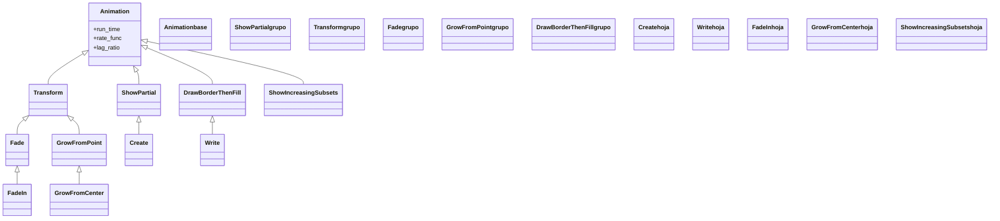

# creación — cómo un objeto aparece en escena

Esta es la **primera familia de animaciones**: las que hacen que un Mobject **aparezca** en la escena. Todas responden a la misma intención —"que esto entre"— pero se diferencian en *cómo* entra, y esa elección cambia por completo la sensación: un objeto puede **dibujarse** siguiendo su trazo ([[Create]]), **escribirse** trazando el borde y rellenando ([[Write]], [[DrawBorderThenFill]]), **fundirse** subiendo su opacidad ([[FadeIn]]), **brotar** creciendo desde su centro ([[GrowFromCenter]]) o **poblarse** pieza a pieza ([[ShowIncreasingSubsets]]). La gran línea divisoria es si la animación **dibuja el trazo** (Create/Write/DrawBorderThenFill: se ve la línea avanzar) o hace aparecer el objeto **ya formado** (FadeIn/GrowFromCenter: surge entero). Como todas heredan de [[Animation]], comparten `run_time`, `rate_func` y `lag_ratio`: eliges la creación por el efecto y la controlas siempre igual. Cada una tiene su pareja en la familia de [[Manim/animaciones/desaparicion/index|desaparición]] (`Uncreate`, `Unwrite`, `FadeOut`).

## En accion

Una escena que combina **cuatro** formas de aparecer sobre los mismos elementos: un título se escribe ([[Write]]), una figura se dibuja ([[Create]]), una tarjeta se funde entrando desde abajo ([[FadeIn]]) y una fila de puntos se puebla uno a uno ([[ShowIncreasingSubsets]]). Todas con el mismo `self.play`.

```python
from manim import *

class GaleriaDeCreacion(Scene):
    def construct(self):
        titulo = Text("Formas de aparecer", font_size=40).to_edge(UP)
        self.play(Write(titulo))                      # escribir

        figura = Circle(color=BLUE, fill_opacity=0.4).shift(LEFT * 3)
        self.play(Create(figura))                     # dibujar el trazo

        tarjeta = Square(color=GREEN, fill_opacity=0.5)
        self.play(FadeIn(tarjeta, shift=UP))          # fundir entrando

        puntos = VGroup(*[
            Dot(color=YELLOW).shift(RIGHT * 3 + UP * y)
            for y in (-1, 0, 1)
        ])
        self.play(ShowIncreasingSubsets(puntos))      # poblar pieza a pieza
        self.wait()
```

```bash
manim -pql archivo.py GaleriaDeCreacion      # -p reproduce, -ql = calidad baja (rapido)
```

## Herencia

Todas cuelgan de [[Animation]], pero por caminos distintos: [[Create]] pasa por `ShowPartial` (muestra una porción del trazo); [[Write]] por [[DrawBorderThenFill]] (dos fases borde→relleno); [[FadeIn]] y [[GrowFromCenter]] por [[Transform]] (interpolan entre dos estados, opacidad o escala); y [[ShowIncreasingSubsets]] baja directa de `Animation`. Esa ramificación explica por qué unas dibujan el trazo y otras no.



## Clases que aporta

Las seis animaciones de la carpeta, con su padre directo y su uso.

| Clase | Hereda de | Para que |
|-------|-----------|----------|
| [[Create]] | `ShowPartial` | dibujar un VMobject siguiendo su trazo; la creación por defecto |
| [[Write]] | `DrawBorderThenFill` | escribir texto/fórmulas: borde y relleno en cascada |
| [[DrawBorderThenFill]] | `Animation` | dibujar el contorno y luego rellenar; padre de `Write` |
| [[FadeIn]] | `Fade` | aparecer por fundido de opacidad; admite `shift`, `scale` |
| [[GrowFromCenter]] | `GrowFromPoint` | brotar creciendo desde el centro (de tamaño 0 al final) |
| [[ShowIncreasingSubsets]] | `Animation` | revelar los submobjects de un grupo uno a uno |

## Como elegir

Primero decide si quieres **ver el trazo dibujarse** o que el objeto aparezca **ya formado**; dentro de cada rama, la clase concreta.

| Quiero que… | ¿Dibuja el trazo? | Clase |
|-------------|-------------------|-------|
| Una figura se dibuje siguiendo su contorno | sí | `Create` |
| Un texto o fórmula se escriba | sí | `Write` |
| Una figura rellena se contornee y luego se pinte | sí | `DrawBorderThenFill` |
| Algo aparezca suave, ya formado | no (opacidad) | `FadeIn` |
| Algo entre desplazándose o creciendo desde fuera | no (opacidad + `shift`/`scale`) | `FadeIn` |
| Algo brote creciendo desde su centro | no (escala) | `GrowFromCenter` |
| Una lista/nube aparezca pieza a pieza | no (por piezas) | `ShowIncreasingSubsets` |

## Patrones y recetas del grupo

Tres patrones que se repiten al crear objetos: el contraste trazo-vs-fundido, escalonar varias creaciones y deshacer lo creado.

### Trazo vs fundido: el mismo objeto, dos sensaciones

La decisión más importante de esta familia. Un [[Create]] **muestra la geometría avanzando**; un [[FadeIn]] hace aparecer el objeto **entero**. Verlos seguidos deja clara la diferencia.

```python
from manim import *

class TrazoVsFundido(Scene):
    def construct(self):
        a = Square(color=BLUE).shift(LEFT * 2)
        b = Square(color=GREEN).shift(RIGHT * 2)

        self.play(Create(a))      # se ve el trazo dibujarse
        self.play(FadeIn(b))      # aparece ya formado
        self.wait()
```

```bash
manim -pql archivo.py TrazoVsFundido
```

### Escalonar varias creaciones con LaggedStart

Cuando varios objetos deben aparecer **uno tras otro** (un menú, una rejilla, una lista), [[LaggedStart]] reparte el arranque de cada animación de creación. Sirve con cualquiera de esta familia.

```python
from manim import *

class CreacionEscalonada(Scene):
    def construct(self):
        formas = VGroup(*[
            Circle(radius=0.5, color=c, fill_opacity=0.6).shift(RIGHT * x)
            for c, x in zip([BLUE, GREEN, YELLOW, RED], [-3, -1, 1, 3])
        ])
        # cada figura brota un poco despues que la anterior
        self.play(LaggedStart(
            *[GrowFromCenter(f) for f in formas],
            lag_ratio=0.4,
        ))
        self.wait()
```

```bash
manim -pql archivo.py CreacionEscalonada
```

### Crear y deshacer: cada creación tiene su reverso

Toda creación tiene una pareja en [[Manim/animaciones/desaparicion/index|desaparición]]: [[Create]] ↔ `Uncreate`, [[Write]] ↔ `Unwrite`, [[FadeIn]] ↔ `FadeOut`. Útil para que algo entre y salga con el mismo lenguaje visual.

```python
from manim import *

class CrearYDeshacer(Scene):
    def construct(self):
        t = Text("Aparezco y me voy")
        self.play(Write(t))       # se escribe
        self.wait()
        self.play(Unwrite(t))     # se borra (reverso)
        self.wait()
```

```bash
manim -pql archivo.py CrearYDeshacer
```

## Notas relacionadas

- [[Animation]] — la clase base con `run_time`, `rate_func` y `lag_ratio` que todas comparten
- [[concepto_animation]] — el modelo mental: la Animation es una instrucción, no un objeto
- [[LaggedStart]] — escalonar el arranque de varias creaciones
- [[Manim/animaciones/desaparicion/index|desaparicion]] — la familia inversa: `Uncreate`, `Unwrite`, `FadeOut`
- [[Manim/animaciones/index|animaciones]] — el índice del pilar con el `classDiagram` completo
- [[Manim/mobjects/index|mobjects]] — los objetos que estas animaciones hacen aparecer
