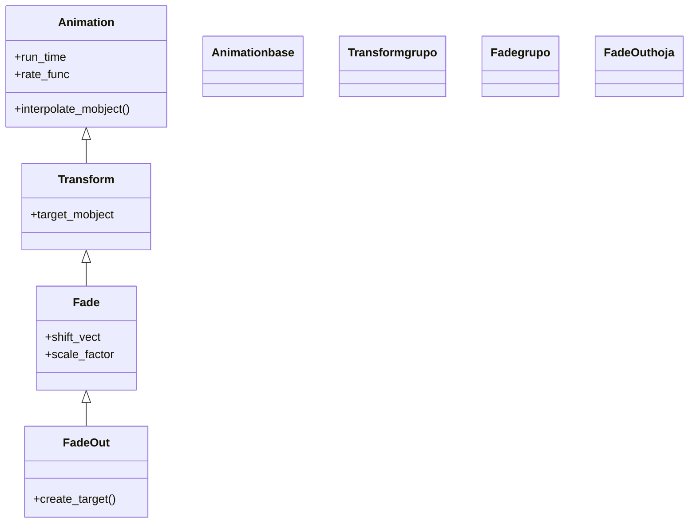

# FadeOut — desaparecer por fundido (y quitar el objeto)

`FadeOut` hace que un objeto **desaparezca bajando su opacidad** de opaco a transparente y, al terminar, lo **quita de la escena**. Es la desaparición más usada y la más versátil: funciona con **cualquier** Mobject —no solo VMobjects—, así que es la opción por defecto para imágenes, grupos heterogéneos o simplemente cuando quieres que algo se esfume sin des-dibujar su trazo. Acepta los mismos modificadores que su pareja [[FadeIn]] pero en sentido de salida: `shift` para que se vaya desplazándose hacia una dirección, `scale` para que mengüe o crezca al irse, y `target_position` para que salga hacia un punto. Por dentro es un `Fade` (su padre directo) que a su vez es un [[Transform]]: interpola la opacidad del estado visible al invisible. La diferencia clave con todas las demás familias es que **lleva `remover=True` por dentro**: cuando la animación acaba, el mobject ya **no está en `self.mobjects`**; si lo quieres de vuelta hay que volver a añadirlo o recrearlo. Su pareja exacta es [[FadeIn]], que hace lo contrario. Además, `FadeOut(*self.mobjects)` es el truco clásico para **limpiar la escena entera** de una sola animación.

## Importacion

```python
from manim import FadeOut
# o, como es habitual en Manim:
from manim import *
```

## Herencia

### La jerarquia

`FadeOut` cuelga de `Fade`, la clase intermedia que recoge lo común a aparecer y desaparecer por opacidad (la comparte con [[FadeIn]]); `Fade` a su vez baja de [[Transform]], el motor que interpola entre dos estados de un mobject (aquí, visible → invisible). La cadena completa hasta [[Animation]]:



### Que hereda

`FadeOut` define cuál es el estado de llegada (transparente, quizá desplazado o escalado) y activa el `remover`; la maquinaria de interpolar entre dos estados viene de [[Transform]], y el ritmo de [[Animation]].

| Capacidad | Cómo se usa | Definido en |
|-----------|-------------|-------------|
| Duración y curva | `run_time`, `rate_func` | [[Animation]] |
| Quitar el mobject al terminar | `remover=True` (lo activa `FadeOut`) | [[Animation]] |
| Interpolar entre dos estados | el motor de `Transform` | [[Transform]] |
| Desplazamiento y escala de salida | `shift`, `scale` | `Fade` |
| Construir el estado final invisible | `create_target` | `FadeOut` |

## Constructor

```python
FadeOut(
    *mobjects,
    shift=ORIGIN,
    target_position=None,
    scale=1,
    **kwargs,
)
```

### Parametros

| Parametro | Tipo | Defecto | Controla |
|-----------|------|---------|----------|
| `*mobjects` | `Mobject` | — | uno o varios objetos a hacer desaparecer (cualquier tipo, no solo VMobject) |
| `shift` | `np.ndarray` | `ORIGIN` | dirección/vector hacia el que **sale** desplazándose (`UP`, `LEFT*2`...) |
| `target_position` | `Mobject \| point` | `None` | punto/objeto **hacia** el que se va (alternativa a `shift`) |
| `scale` | `float` | `1` | factor de escala final: `<1` se va encogiendo, `>1` se va creciendo |
| `**kwargs` | — | — | se pasan a [[Animation]]: `run_time`, `rate_func`... |

#### shift — salir hacia una dirección

Es el modificador más usado. Mientras el objeto se vuelve transparente, se desliza en la dirección de `shift`. Pasar varios mobjects los hace desaparecer a todos igual.

```python
self.play(FadeOut(t, shift=UP))          # se va subiendo
self.play(FadeOut(t, shift=LEFT * 2))    # se desliza hacia la izquierda al irse
```

#### *self.mobjects — limpiar toda la escena

Como `FadeOut` acepta varios mobjects de golpe, pasarle `*self.mobjects` desvanece **todo lo que haya en pantalla** en una sola animación: el patrón habitual para cerrar una sección.

```python
self.play(FadeOut(*self.mobjects))   # vacia el lienzo, sea lo que sea
```

### Que construye

Devuelve un objeto `FadeOut` inerte hasta que [[Scene.play]] lo reproduce. Como lleva `remover=True`, al terminar **saca el mobject de la escena**: a partir de ese momento no está en `self.mobjects` y no se dibuja. Para traerlo de vuelta hay que volver a añadirlo (`self.add(m)`) o recrearlo (`self.play(FadeIn(m))`).

## Ritmo

Hereda `run_time`/`rate_func` de [[Animation]]; sus parámetros **propios** son los de salida (`shift`, `scale`, `target_position`).

| Parametro | Defecto | Efecto |
|-----------|---------|--------|
| `run_time` | `1.0` | cuánto dura el fundido de salida; bájalo (`0.5`) para que se vaya rápido |
| `rate_func` | `smooth` | curva del fundido; `linear` da una salida uniforme |
| `shift` | `ORIGIN` | hacia dónde sale (propio) |
| `scale` | `1` | escala de salida (propio) |

```python
self.play(FadeOut(t, shift=DOWN, run_time=2))   # salida lenta hacia abajo
self.play(FadeOut(t), run_time=0.5)             # se esfuma deprisa
```

## Ejemplo

### Version minima

Un texto que primero está en pantalla y se desvanece. Nótese que el objeto debe existir antes (aquí entra con [[FadeIn]]) para poder hacerlo desaparecer.

```python
from manim import *

class FundidoSalidaMinimo(Scene):
    def construct(self):
        t = Text("Me voy")
        self.play(FadeIn(t))     # primero existe en la escena
        self.wait()
        self.play(FadeOut(t))    # y se desvanece (sale de self.mobjects)
        self.wait()
```

```bash
manim -pql archivo.py FundidoSalidaMinimo      # -p reproduce, -ql = calidad baja (rapido)
```

### Version completa

Tres tarjetas que ya están en escena (añadidas con `self.add`) salen cada una hacia una dirección con `shift`, y un título se va encogiendo con `scale`. Al final se limpia cualquier resto con `FadeOut(*self.mobjects)`.

```python
from manim import *

class FundidoSalidaCompleto(Scene):
    def construct(self):
        titulo = Text("Menu", font_size=48).to_edge(UP)
        tarjetas = VGroup(*[
            Square(side_length=1.2, color=c, fill_opacity=0.6)
            for c in (BLUE, GREEN, RED)
        ]).arrange(RIGHT, buff=0.6)
        self.add(titulo, tarjetas)   # ya estan en escena, sin animacion
        self.wait()

        # cada tarjeta sale hacia una direccion distinta
        self.play(
            FadeOut(tarjetas[0], shift=LEFT),
            FadeOut(tarjetas[1], shift=DOWN),
            FadeOut(tarjetas[2], shift=RIGHT),
        )
        self.play(FadeOut(titulo, scale=0.3))   # se va encogiendo
        self.wait()
```

```bash
manim -pqh archivo.py FundidoSalidaCompleto     # -qh = calidad alta para el render final
```

### Variaciones

```python
# Limpiar TODA la escena de una sola animacion:
self.play(FadeOut(*self.mobjects))

# Salir deslizando hacia un punto/objeto concreto:
self.play(FadeOut(obj, target_position=ORIGIN))

# Hacer desaparecer varios objetos a la vez con el mismo efecto:
self.play(FadeOut(a, b, c, shift=DOWN))

# La pareja: aparecer por fundido
self.play(FadeIn(obj, shift=UP))
```

## Componerla

Se compone como cualquier [[Animation]]. Para que varios objetos desaparezcan **escalonados** va perfecto [[LaggedStart]] (una lista que se vacía de abajo arriba); para combinar la salida con otra animación, se pasan juntas a `self.play`.

```python
from manim import *

class ComponerFadeOut(Scene):
    def construct(self):
        items = VGroup(*[
            Text(f"Item {i}") for i in range(1, 5)
        ]).arrange(DOWN, aligned_edge=LEFT, buff=0.4)
        self.add(items)
        self.wait()

        # se van uno tras otro, cada uno deslizandose a la derecha
        self.play(LaggedStart(
            *[FadeOut(it, shift=RIGHT * 0.5) for it in items],
            lag_ratio=0.3,
        ))
        self.wait()
```

```bash
manim -pql archivo.py ComponerFadeOut
```

## Errores comunes

| Error | Causa | Solución |
|-------|-------|----------|
| `FadeOut` no hace nada / da error | el objeto no estaba en la escena | añádelo antes (`self.add` o anímalo a entrar) y luego hazlo desaparecer |
| El objeto reaparece más tarde y no querías | tras `FadeOut` volviste a añadirlo o a animarlo | tras `FadeOut` el mobject sale de `self.mobjects`; no lo vuelvas a añadir |
| Quieres recuperarlo y no aparece | crees que basta con tener la variable | `FadeOut` lo quitó; recupéralo con `self.add(m)` o `FadeIn(m)` |
| Querías ver el trazo des-dibujarse | `FadeOut` solo funde la opacidad | usa [[Uncreate]] (figuras) o [[Unwrite]] (texto) |
| `shift` no surte efecto visible | el vector es muy pequeño | usa una dirección clara: `shift=UP` o `DOWN*2` |

## Notas relacionadas

- [[FadeIn]] — la pareja exacta: aparecer por fundido (carpeta creación)
- [[Fade]] — la clase padre; lo común a aparecer y desaparecer por opacidad
- [[Transform]] — el motor que interpola entre dos estados (abuelo de `FadeOut`)
- [[Animation]] — la base con `run_time`, `rate_func` y el flag `remover`
- [[Uncreate]] — la desaparición que sí des-dibuja el trazo
- [[Unwrite]] — la desaparición pensada para borrar texto
- [[Manim/animaciones/desaparicion/index|desaparicion]] — la familia completa de animaciones de salida
