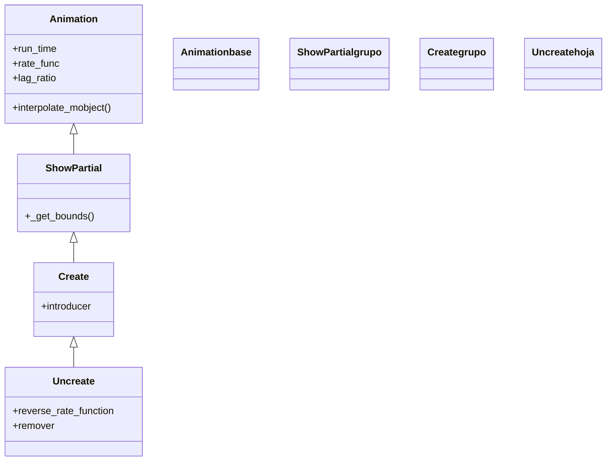

# Uncreate — deshacer el trazo de un VMobject (Create al revés)

`Uncreate` hace que un VMobject **se des-dibuje**: recorre su propio trazo en sentido inverso, borrándolo de forma progresiva hasta que no queda nada, y luego quita el objeto de la escena. Es, literalmente, [[Create]] **reproducido al revés**: hereda de él toda la maquinaria de "mostrar una porción del trazo" y se limita a invertir la curva de avance (`reverse_rate_function=True`) y a activar el `remover`. Por eso es la pareja inversa de [[Create]] y la desaparición que quieres cuando una figura geométrica —un [[Circle]], un `Square`, una `Line`— debe **deshacerse trazo a trazo**, como si la pluma que la dibujó volviera sobre sus pasos. A diferencia de [[FadeOut]], que solo baja la opacidad sin tocar el trazo, `Uncreate` **se ve recorrer la geometría hacia atrás**. Solo funciona con **VMobjects** (objetos con trazo vectorial); para imágenes, grupos sin trazo o cuando no quieres el efecto de des-dibujo, usa [[FadeOut]]. Para borrar texto/fórmulas suele preferirse [[Unwrite]], afinado para glifos. Como toda desaparición, al terminar el mobject **ya no está en `self.mobjects`**.

## Importacion

```python
from manim import Uncreate
# o, como es habitual en Manim:
from manim import *
```

## Herencia

### La jerarquia

`Uncreate` cuelga directamente de [[Create]], que a su vez baja de `ShowPartial` (la [[Animation]] abstracta que muestra solo una porción del trazo en cada fotograma). `Uncreate` no añade geometría nueva: reutiliza el `_get_bounds` de `Create`/`ShowPartial` pero recorre el `alpha` al revés, de modo que la porción visible **decrece** en vez de crecer. La cadena completa hasta `Animation`:



### Que hereda

`Uncreate` apenas aporta lógica propia: solo fija dos valores por defecto (`reverse_rate_function=True` y `remover=True`). Todo lo demás —mostrar una fracción del trazo, el ritmo, la interpolación— baja de sus ancestros.

| Capacidad | Cómo se usa | Definido en |
|-----------|-------------|-------------|
| Duración y curva | `run_time`, `rate_func` | [[Animation]] |
| Quitar el mobject al terminar | `remover=True` (lo activa `Uncreate`) | [[Animation]] |
| Reproducir la curva al revés | `reverse_rate_function=True` (lo activa `Uncreate`) | [[Animation]] |
| Mostrar solo una porción del trazo | `_get_bounds(alpha)` | `ShowPartial` |
| Lógica de trazado (heredada de Create) | el `lag_ratio` y la cascada de partes | [[Create]] |

## Constructor

```python
Uncreate(
    mobject,
    reverse_rate_function=True,
    remover=True,
    **kwargs,
)
```

### Parametros

| Parametro | Tipo | Defecto | Controla |
|-----------|------|---------|----------|
| `mobject` | `VMobject` | — | el objeto a des-dibujar; debe tener trazo (ser un VMobject) |
| `reverse_rate_function` | `bool` | `True` | invierte la curva de avance: el trazo se recorre **hacia atrás** (es lo que lo hace "Create al revés") |
| `remover` | `bool` | `True` | al terminar **quita** el mobject de la escena |
| `**kwargs` | — | — | se pasan a [[Create]]/[[Animation]]: `run_time`, `rate_func`, `lag_ratio`... |

#### reverse_rate_function — por qué es un Create invertido

Es el parámetro que define la clase: con `reverse_rate_function=True`, la animación toma exactamente el `Create` del objeto y recorre su `alpha` de 1 a 0, así que el trazo que se dibujaba ahora se **borra** en el mismo orden inverso. Dejarlo en `False` reproduciría un `Create` normal (no tendría sentido en una desaparición).

```python
self.play(Uncreate(c))                  # se des-dibuja (defecto)
self.play(Create(c, reverse_rate_function=True))  # equivalente conceptual
```

### Que construye

Devuelve un objeto `Uncreate` inerte hasta que [[Scene.play]] lo reproduce. Solo surte el efecto de des-dibujo con **VMobjects**; al terminar saca el mobject de `self.mobjects`. Para recuperarlo más tarde hay que volver a crearlo (`self.play(Create(m))`) o añadirlo (`self.add(m)`).

## Ritmo

`Uncreate` no añade parámetros temporales propios más allá de invertir la curva: usa los que hereda de [[Animation]] vía [[Create]].

| Parametro | Defecto | Efecto en `Uncreate` |
|-----------|---------|----------------------|
| `run_time` | `1.0` | cuánto tarda en des-dibujarse; súbelo para un borrado lento y vistoso |
| `rate_func` | `smooth` | la curva del borrado (ya invertida por `reverse_rate_function`) |
| `lag_ratio` | `1.0` | el desfase entre partes (heredado de `Create`: las partes se borran en cascada) |

```python
self.play(Uncreate(c), run_time=3)          # se borra despacio
self.play(Uncreate(grupo, lag_ratio=0))     # todas las partes a la vez
```

## Ejemplo

### Version minima

Una figura que primero se dibuja con [[Create]] y luego se des-dibuja. El objeto debe existir antes para poder deshacerlo.

```python
from manim import *

class DescrearMinimo(Scene):
    def construct(self):
        c = Circle(radius=1.5, color=BLUE)
        self.play(Create(c))      # primero se dibuja (existe en la escena)
        self.wait()
        self.play(Uncreate(c))    # y se des-dibuja (sale de self.mobjects)
        self.wait()
```

```bash
manim -pql archivo.py DescrearMinimo      # -p reproduce, -ql = calidad baja (rapido)
```

### Version completa

Un cuadrado y una rejilla de líneas ya en escena se des-dibujan: el cuadrado a ritmo constante, y la rejilla en cascada (gracias al `lag_ratio` heredado de `Create`), una línea tras otra.

```python
from manim import *

class DescrearCompleto(Scene):
    def construct(self):
        s = Square(color=GREEN, fill_opacity=0.3)
        rejilla = VGroup(*[
            Line(LEFT * 3, RIGHT * 3).shift(UP * y)
            for y in (-1, 0, 1)
        ]).set_color(YELLOW).shift(DOWN * 0.2)
        self.add(s, rejilla)   # ya estan dibujadas
        self.wait()

        self.play(Uncreate(s), run_time=2, rate_func=linear)   # borrado uniforme
        self.play(Uncreate(rejilla), run_time=2)               # en cascada
        self.wait()
```

```bash
manim -pqh archivo.py DescrearCompleto     # -qh = calidad alta para el render final
```

### Variaciones

```python
# Des-dibujar todo de golpe (sin cascada) un grupo:
self.play(Uncreate(grupo, lag_ratio=0))

# La pareja: dibujar el trazo
self.play(Create(c))

# Para texto, mejor su reverso especifico:
self.play(Unwrite(texto))
```

## Componerla

Como toda [[Animation]], un `Uncreate` se combina en un solo `self.play` o con las clases de [[Manim/animaciones/composicion/index|composicion]]. Para des-dibujar varias figuras **escalonadas** en el tiempo, [[LaggedStart]] reparte el arranque de cada una.

```python
from manim import *

class ComponerUncreate(Scene):
    def construct(self):
        figs = VGroup(
            Circle(color=BLUE),
            Square(color=GREEN),
            Triangle(color=YELLOW),
        ).arrange(RIGHT, buff=0.8)
        self.add(figs)
        self.wait()

        # cada figura empieza a borrarse un poco despues que la anterior
        self.play(LaggedStart(
            *[Uncreate(f) for f in figs],
            lag_ratio=0.4,
        ))
        self.wait()
```

```bash
manim -pql archivo.py ComponerUncreate
```

## Errores comunes

| Error | Causa | Solución |
|-------|-------|----------|
| No se ve el des-dibujo, el objeto desaparece de golpe | el mobject no es un VMobject (no tiene trazo) | usa `Uncreate` solo con VMobjects; para lo demás usa [[FadeOut]] |
| Un texto se borra a trompicones y feo | `Uncreate` recorre el contorno crudo del texto | para texto/fórmulas usa [[Unwrite]], afinado para glifos |
| Las partes de un grupo se borran una a una y querías todas juntas | `lag_ratio` vale `1.0` (heredado de `Create`) | pásalo a `0`: `Uncreate(grupo, lag_ratio=0)` |
| `Uncreate` da error / no hace nada | el objeto no estaba en la escena | dibújalo antes (`Create` o `self.add`) y luego deshazlo |
| Quieres el objeto de vuelta y no aparece | tras `Uncreate` salió de `self.mobjects` | recréalo con `self.play(Create(m))` o añádelo con `self.add(m)` |

## Notas relacionadas

- [[Create]] — la pareja exacta: dibujar el trazo (carpeta creación); `Uncreate` es su reverso
- [[Animation]] — la base con `run_time`, `rate_func`, `reverse_rate_function` y `remover`
- [[FadeOut]] — la desaparición que solo funde la opacidad, sin des-dibujar
- [[Unwrite]] — la desaparición pensada para borrar texto y fórmulas
- [[Manim/animaciones/desaparicion/index|desaparicion]] — la familia completa de animaciones de salida
