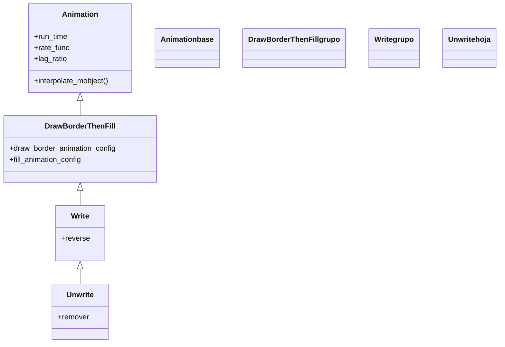

# Unwrite — des-escribir texto y fórmulas (Write al revés)

`Unwrite` hace que un texto o una fórmula **se des-escriba**: borra cada glifo en cascada, de modo que las letras van desapareciendo como si una pluma deshiciera lo escrito, y al terminar quita el objeto de la escena. Es [[Write]] **reproducido al revés**: hereda de él toda la maquinaria de escritura por glifos (la doble fase borde-relleno de [[DrawBorderThenFill]] y el `lag_ratio` automático según la longitud) y se limita a invertir el sentido con `reverse=True`. Por eso es la pareja inversa de [[Write]] y la desaparición que quieres siempre que un [[Text]], un `Tex` o un `MathTex` deba **borrarse escribiéndose al revés**. A diferencia de [[FadeOut]], que solo baja la opacidad del texto entero, `Unwrite` **se ve recorrer los glifos hacia atrás**. Sobre figuras geométricas funciona también, pero ahí suele bastar [[Uncreate]]. Tiene un parámetro propio, `reverse`, que decide **el sentido del borrado** (de derecha a izquierda o de izquierda a derecha). Como toda desaparición, al terminar el mobject **ya no está en `self.mobjects`**.

## Importacion

```python
from manim import Unwrite
# o, como es habitual en Manim:
from manim import *
```

## Herencia

### La jerarquia

`Unwrite` cuelga directamente de [[Write]], que a su vez baja de [[DrawBorderThenFill]] (la [[Animation]] que ejecuta las dos fases borde→relleno sobre un VMobject). `Unwrite` no inventa nada nuevo: reutiliza el mecanismo de escritura por glifos de `Write` pero lo reproduce en sentido inverso, así que el texto que se escribía ahora se **borra**. La cadena completa hasta `Animation`:



### Que hereda

`Unwrite` solo aporta el sentido inverso y el `remover`; todo lo demás baja de sus ancestros. La escritura por glifos y el `reverse` son de [[Write]]; la doble fase borde→relleno, de [[DrawBorderThenFill]]; el ritmo y la interpolación, de [[Animation]].

| Capacidad | Cómo se usa | Definido en |
|-----------|-------------|-------------|
| Duración y curva | `run_time`, `rate_func` | [[Animation]] |
| Quitar el mobject al terminar | `remover=True` (lo activa `Unwrite`) | [[Animation]] |
| Desfase entre glifos (cascada) | `lag_ratio` automático según longitud | [[Write]] |
| Reproducir la escritura al revés | `reverse=True` | [[Write]] |
| Dibujar/borrar borde y relleno | las dos fases internas | [[DrawBorderThenFill]] |

## Constructor

```python
Unwrite(
    vmobject,
    reverse=True,
    **kwargs,
)
```

### Parametros

| Parametro | Tipo | Defecto | Controla |
|-----------|------|---------|----------|
| `vmobject` | `VMobject` | — | el objeto a des-escribir; típicamente [[Text]], `Tex` o `MathTex` |
| `reverse` | `bool` | `True` | el **sentido del borrado**: `True` borra de derecha a izquierda (deshace el orden de escritura); `False` lo borra de izquierda a derecha |
| `**kwargs` | — | — | se pasan a [[Write]]/[[Animation]]: `run_time`, `rate_func`, `lag_ratio`... |

#### reverse — el sentido en que se borra

Es el parámetro propio de `Unwrite`. Con `reverse=True` (defecto) el texto se borra **desde el final hacia el principio**, deshaciendo el orden en que se escribió; con `reverse=False` se borra desde el principio. Cambia la sensación del borrado pero no su duración.

```python
self.play(Unwrite(t))                 # borra de derecha a izquierda (defecto)
self.play(Unwrite(t, reverse=False))  # borra de izquierda a derecha
```

### Que construye

Devuelve un objeto `Unwrite` inerte hasta que [[Scene.play]] lo reproduce. Está afinado para **texto/fórmulas** (objetos con muchos submobjects-glifo); recuerda que `Tex`/`MathTex` requieren una instalación de LaTeX. Al terminar saca el mobject de `self.mobjects`: para recuperarlo hay que volver a escribirlo (`self.play(Write(m))`) o añadirlo (`self.add(m)`).

## Ritmo

`Unwrite` hereda el ritmo de [[Write]], que a su vez lo calcula según el número de glifos si no lo fijas.

| Parametro | Defecto en `Unwrite` | Nota |
|-----------|----------------------|------|
| `run_time` | automático | escala con el número de glifos; fíjalo para controlar la velocidad |
| `rate_func` | `linear` | heredado de `Write`; da un borrado uniforme |
| `lag_ratio` | automático | el desfase entre letras se calcula solo |

```python
self.play(Unwrite(texto, run_time=2))           # control manual del tiempo
self.play(Unwrite(texto, rate_func=smooth))     # arranque/frenado suaves
```

## Ejemplo

### Version minima

Una línea de texto que primero se escribe con [[Write]] y luego se des-escribe. El objeto debe existir antes para poder borrarlo.

```python
from manim import *

class DesescribirMinimo(Scene):
    def construct(self):
        t = Text("Hola y adios")
        self.play(Write(t))       # primero se escribe (existe en la escena)
        self.wait()
        self.play(Unwrite(t))     # y se des-escribe (sale de self.mobjects)
        self.wait()
```

```bash
manim -pql archivo.py DesescribirMinimo      # -p reproduce, -ql = calidad baja (rapido)
```

### Version completa

Un título y una fórmula ya en escena se borran con sentidos distintos: el título de derecha a izquierda (defecto) y la fórmula de izquierda a derecha con `reverse=False`, más despacio para apreciar el trazo.

```python
from manim import *

class DesescribirCompleto(Scene):
    def construct(self):
        titulo = Text("Teorema de Pitagoras", font_size=40)
        formula = MathTex("a^2 + b^2 = c^2").next_to(titulo, DOWN, buff=0.8)
        self.add(titulo, formula)   # ya escritos en pantalla
        self.wait()

        self.play(Unwrite(titulo))                      # borra de derecha a izquierda
        self.play(Unwrite(formula, reverse=False), run_time=3)  # de izquierda a derecha, lento
        self.wait()
```

```bash
manim -pqh archivo.py DesescribirCompleto     # -qh = calidad alta para el render final
```

### Variaciones

```python
# Borrar de izquierda a derecha en vez del defecto:
self.play(Unwrite(texto, reverse=False))

# La pareja: escribir
self.play(Write(texto))

# Equivalente explicito con Write invertido:
self.play(Write(texto, reverse=True), remover=True)
```

## Componerla

`Unwrite` se combina como cualquier [[Animation]]. Para borrar varias líneas **en secuencia** suave conviene [[LaggedStart]]; para des-escribir y, a la vez, hacer otra cosa, se pasan juntas a `self.play`.

```python
from manim import *

class ComponerUnwrite(Scene):
    def construct(self):
        lineas = VGroup(
            Text("Primera linea"),
            Text("Segunda linea"),
            Text("Tercera linea"),
        ).arrange(DOWN, aligned_edge=LEFT, buff=0.4)
        self.add(lineas)
        self.wait()

        # cada linea empieza a borrarse despues de la anterior
        self.play(LaggedStart(
            *[Unwrite(l) for l in lineas],
            lag_ratio=0.6,
        ))
        self.wait()
```

```bash
manim -pql archivo.py ComponerUnwrite
```

## Errores comunes

| Error | Causa | Solución |
|-------|-------|----------|
| `Tex`/`MathTex` lanza un error de compilación | falta una instalación de LaTeX | instala LaTeX (TeX Live/MiKTeX) o usa [[Text]] para texto plano |
| El texto se borra demasiado rápido o lento | dejaste el `run_time` automático | fíjalo: `Unwrite(t, run_time=3)` |
| Querías que el texto se esfumara sin recorrer los glifos | `Unwrite` siempre des-escribe trazo a trazo | usa [[FadeOut]] para que desaparezca por opacidad |
| `Unwrite` da error / no hace nada | el texto no estaba en la escena | escríbelo antes (`Write` o `self.add`) y luego bórralo |
| Una figura geométrica se borra rara | `Unwrite` está afinado para glifos | para figuras usa [[Uncreate]] |

## Notas relacionadas

- [[Write]] — la pareja exacta: escribir texto y fórmulas (carpeta creación); `Unwrite` es su reverso
- [[DrawBorderThenFill]] — el abuelo; dibuja el borde y luego rellena (aquí, al revés)
- [[Animation]] — la base con `run_time`, `rate_func` y el flag `remover`
- [[FadeOut]] — la desaparición que solo funde la opacidad, sin des-escribir
- [[Uncreate]] — la desaparición pensada para des-dibujar figuras geométricas
- [[Text]] — el Mobject de texto plano que se suele des-escribir con `Unwrite`
- [[Manim/animaciones/desaparicion/index|desaparicion]] — la familia completa de animaciones de salida
