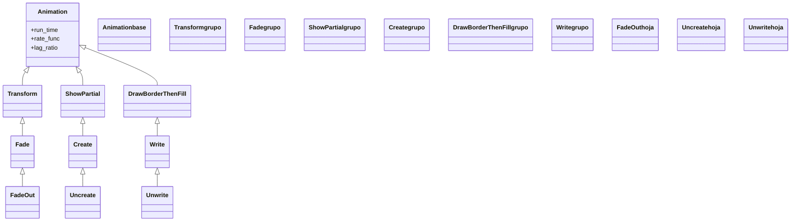

# desaparición — cómo un objeto se va de la escena

Esta es la familia **espejo** de [[Manim/animaciones/creacion/index|creación]]: las animaciones que hacen que un Mobject **se vaya** de la escena. Todas responden a la misma intención —"que esto salga"— pero se diferencian en *cómo* sale, y casi siempre la elección es la **pareja inversa** de cómo entró: un objeto puede **fundirse** bajando su opacidad ([[FadeOut]], reverso de [[FadeIn]]), **des-dibujarse** deshaciendo su trazo ([[Uncreate]], reverso de [[Create]]) o **des-escribirse** borrando el texto letra a letra ([[Unwrite]], reverso de [[Write]]). El rasgo que las une, y lo que las separa de todas las demás familias, es que **quitan el objeto de la escena**: por dentro llevan `remover=True`, así que cuando la animación termina el mobject **ya no está en `self.mobjects`**. Eso tiene una consecuencia práctica que conviene tener siempre presente: tras `FadeOut(m)`, si más adelante quieres `m` de vuelta, tienes que **volver a añadirlo** (`self.add(m)`) o recrearlo (`self.play(FadeIn(m))`); no basta con referenciar la variable, porque la escena ya no lo dibuja.

## En accion

Una escena que primero **crea** tres elementos con la familia de creación y luego los hace **desaparecer** de las tres formas, cada una emparejada con cómo entró: el texto que se escribió se des-escribe, la figura que se dibujó se des-dibuja, y la tarjeta que se fundió se funde de salida.

```python
from manim import *

class GaleriaDeDesaparicion(Scene):
    def construct(self):
        titulo = Text("Adios, Manim", font_size=40).to_edge(UP)
        figura = Circle(color=BLUE, fill_opacity=0.4).shift(LEFT * 3)
        tarjeta = Square(color=GREEN, fill_opacity=0.5).shift(RIGHT * 3)

        self.play(Write(titulo), Create(figura), FadeIn(tarjeta))   # entran
        self.wait()

        self.play(Unwrite(titulo))     # se des-escribe (reverso de Write)
        self.play(Uncreate(figura))    # se des-dibuja (reverso de Create)
        self.play(FadeOut(tarjeta))    # se funde (reverso de FadeIn)
        self.wait()
```

```bash
manim -pql archivo.py GaleriaDeDesaparicion      # -p reproduce, -ql = calidad baja (rapido)
```

## Herencia

Cada desaparición hereda por el mismo camino que su pareja de creación, lo que explica por qué se ve "igual pero al revés": [[FadeOut]] cuelga de `Fade` (que baja de [[Transform]]), igual que [[FadeIn]]; [[Uncreate]] cuelga de [[Create]] (vía `ShowPartial`), es literalmente un `Create` con la curva invertida; y [[Unwrite]] cuelga de [[Write]] (vía [[DrawBorderThenFill]]), un `Write` reproducido al revés.



## Clases que aporta

Las tres animaciones de la carpeta, con su padre directo y su pareja inversa en creación.

| Clase | Hereda de | Para que |
|-------|-----------|----------|
| [[FadeOut]] | `Fade` | desvanecer un objeto bajando su opacidad y quitarlo; la desaparición por defecto, vale para cualquier Mobject |
| [[Uncreate]] | `Create` | deshacer el trazo de un VMobject hasta borrarlo (un `Create` al revés) |
| [[Unwrite]] | `Write` | des-escribir texto o fórmulas letra a letra (un `Write` al revés) |

## Como elegir

La regla práctica es elegir la desaparición **espejo** de cómo apareció el objeto, para que entre y salga con el mismo lenguaje visual. Si no entró con animación (lo añadiste con `self.add`), `FadeOut` es la opción universal.

| Quiero que… | ¿Dibuja el trazo? | Clase | Pareja inversa |
|-------------|-------------------|-------|----------------|
| Algo se desvanezca suave, sin des-dibujarse | no (opacidad) | `FadeOut` | [[FadeIn]] |
| Una figura se des-dibuje siguiendo su contorno al revés | sí | `Uncreate` | [[Create]] |
| Un texto o fórmula se borre letra a letra | sí | `Unwrite` | [[Write]] |
| Quitar cualquier cosa (imagen, grupo, lo que sea) | no | `FadeOut` | [[FadeIn]] |
| Limpiar TODA la escena de golpe | no | `FadeOut(*self.mobjects)` | — |

## Patrones y recetas del grupo

Tres patrones que se repiten al hacer desaparecer objetos: entrar y salir con la pareja, limpiar la escena entera, y recordar que el objeto deja de existir en la escena.

### Entrar y salir con la pareja inversa

El patrón más común: animar la entrada con una creación y la salida con su reverso exacto, para que el objeto tenga un ciclo de vida coherente.

```python
from manim import *

class EntrarYSalir(Scene):
    def construct(self):
        t = Text("Mensaje temporal")
        self.play(Write(t))       # entra escribiendose
        self.wait()
        self.play(Unwrite(t))     # sale des-escribiendose (reverso)
        self.wait()
```

```bash
manim -pql archivo.py EntrarYSalir
```

### Limpiar toda la escena con FadeOut(*self.mobjects)

`FadeOut` acepta varios mobjects a la vez. Pasándole **todos** los objetos actuales de la escena (`*self.mobjects`) se vacía el lienzo de una sola animación: el truco clásico para cerrar una sección antes de empezar la siguiente.

```python
from manim import *

class LimpiarEscena(Scene):
    def construct(self):
        a = Circle(color=BLUE).shift(LEFT * 2)
        b = Square(color=GREEN).shift(RIGHT * 2)
        c = Text("Seccion 1").to_edge(UP)
        self.play(Create(a), Create(b), Write(c))
        self.wait()

        # vacia el lienzo de golpe, sea lo que sea que haya
        self.play(FadeOut(*self.mobjects))
        self.wait()
```

```bash
manim -pql archivo.py LimpiarEscena
```

### Después de desaparecer, el objeto ya no está en la escena

Tras una desaparición el mobject sale de `self.mobjects`. Si quieres traerlo de vuelta, no basta con tener la variable: hay que **volver a añadirlo o recrearlo**. Olvidarlo es la causa número uno de "mi objeto no reaparece".

```python
from manim import *

class TraerDeVuelta(Scene):
    def construct(self):
        d = Dot(color=YELLOW)
        self.play(FadeIn(d))
        self.play(FadeOut(d))       # d ya NO esta en self.mobjects
        self.wait()

        # para recuperarlo hay que volver a meterlo en la escena:
        self.play(FadeIn(d))        # (o self.add(d) sin animacion)
        self.wait()
```

```bash
manim -pql archivo.py TraerDeVuelta
```

## Notas relacionadas

- [[Animation]] — la clase base con `run_time`, `rate_func` y `lag_ratio` que todas comparten
- [[concepto_animation]] — el modelo mental: la Animation es una instrucción, no un objeto
- [[Manim/animaciones/creacion/index|creacion]] — la familia espejo: `FadeIn`, `Create`, `Write`
- [[FadeOut]] — la desaparición por defecto y el truco `FadeOut(*self.mobjects)`
- [[Manim/animaciones/index|animaciones]] — el índice del pilar con el `classDiagram` completo
- [[Manim/mobjects/index|mobjects]] — los objetos que estas animaciones hacen desaparecer
