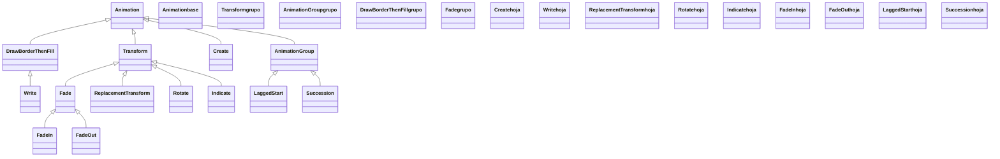

# animaciones — cómo cambian los mobjects en el tiempo

Este es el **segundo gran pilar** de Manim, el complemento de [[Manim/mobjects/index|mobjects]]: si un Mobject es *qué se ve*, una [[concepto_animation|Animation]] es *cómo cambia en el tiempo*. Aquí vive todo lo que se reproduce con `self.play`: lo que hace que un círculo se dibuje, una fórmula se transforme en otra, un objeto gire, parpadee o se desvanezca. La idea que ordena la carpeta es que **toda animación hereda de [[Animation]]**, así que todas comparten los mismos parámetros temporales (`run_time`, `rate_func`, `lag_ratio`) sin importar a qué familia pertenezcan. Lo único que cambia de una a otra es *qué tipo de cambio* describen, y por eso la carpeta se divide en seis familias: **crear**, **transformar**, **mover**, **indicar**, **desaparecer** y **componer**. Eliges la animación por el cambio que quieres y la controlas siempre igual.

## En accion

Una escena que recorre las seis familias sobre los mismos objetos: una fórmula aparece (creación), se transforma en otra (transformación), gira (movimiento), se resalta (indicación), se agrupan animaciones (composición) y todo se va (desaparición). Todas se reproducen con el mismo `self.play`.

```python
from manim import *

class ElPilarEntero(Scene):
    def construct(self):
        a = MathTex("a^2 + b^2")
        b = MathTex("c^2")

        self.play(Write(a))                          # creacion
        self.play(TransformMatchingShapes(a, b))     # transformacion
        self.play(Rotate(b, PI / 4))                 # movimiento
        self.play(Indicate(b))                       # indicacion
        self.play(LaggedStart(                       # composicion (en cascada)
            b.animate.shift(UP),
            b.animate.set_color(YELLOW),
            lag_ratio=0.5,
        ))
        self.play(FadeOut(b))                        # desaparicion
        self.wait()
```

```bash
manim -pql archivo.py ElPilarEntero      # -p reproduce, -ql = calidad baja (rapido)
```

## Herencia

Todo cuelga de [[Animation]]. Dos clases intermedias son a la vez subclases y **padres** de muchas otras: `Transform` (interpola entre dos estados; de él bajan `ReplacementTransform`, `Rotate`, `Indicate`, `Fade`) y `AnimationGroup` (combina varias; de él bajan `LaggedStart`, `Succession`, `Flash`).



## Las seis familias

Cada familia es una subcarpeta con su propio `index`. Eliges la familia por el **tipo de cambio** que buscas.

| Familia | Carpeta | El cambio que describe | Animaciones clave |
|---------|---------|------------------------|-------------------|
| Creación | [[Manim/animaciones/creacion/index\|creacion]] | un objeto **aparece** | [[Create]], [[Write]], [[FadeIn]], [[GrowFromCenter]] |
| Transformación | [[Manim/animaciones/transformacion/index\|transformacion]] | un objeto se **convierte** en otro | [[Transform]], [[ReplacementTransform]], [[TransformMatchingTex]] |
| Movimiento | [[Manim/animaciones/movimiento/index\|movimiento]] | un objeto **se mueve o gira** | [[Rotate]], [[MoveAlongPath]] |
| Indicación | [[Manim/animaciones/indicacion/index\|indicacion]] | **resaltar** algo de forma efímera | [[Indicate]], [[Flash]], [[Circumscribe]] |
| Desaparición | [[Manim/animaciones/desaparicion/index\|desaparicion]] | un objeto **se va** | [[FadeOut]], [[Uncreate]], [[Unwrite]] |
| Composición | [[Manim/animaciones/composicion/index\|composicion]] | **combinar** varias animaciones | [[AnimationGroup]], [[LaggedStart]], [[Succession]] |

## Como elegir

Primero decides la familia por la intención; dentro de ella, la animación concreta.

| Quiero que… | Familia | Animación |
|-------------|---------|-----------|
| Una figura se dibuje sola | creación | `Create` (trazo) · `DrawBorderThenFill` (borde y relleno) |
| Un texto o fórmula aparezca escribiéndose | creación | `Write` |
| Algo aparezca suave (sin dibujarse) | creación | `FadeIn` · `GrowFromCenter` |
| Una fórmula se convierta en otra | transformación | `ReplacementTransform` (la habitual) · `TransformMatchingTex` (por partes) |
| Un objeto rote o siga un camino | movimiento | `Rotate` · `MoveAlongPath` |
| Llamar la atención sobre algo sin cambiarlo | indicación | `Indicate` · `Flash` · `Circumscribe` |
| Quitar algo de la escena | desaparición | `FadeOut` (suave) · `Uncreate` (deshace el trazo) |
| Reproducir varias animaciones a la vez / en cascada / en serie | composición | `AnimationGroup` · `LaggedStart` · `Succession` |

## Patrones y recetas del grupo

Tres patrones que atraviesan todas las familias: el `.animate`, reproducir varias a la vez, y el ritmo con `run_time`/`rate_func`.

### `.animate`: animar un cambio sin una clase de animación

Para muchos cambios (mover, escalar, recolorear) no hace falta una clase: el prefijo `.animate` convierte cualquier método del Mobject en una animación. `self.play(c.animate.shift(UP))` anima el desplazamiento; `c.shift(UP)` lo aplica al instante. Se detalla en [[concepto_animate_syntax]].

```python
from manim import *

class ConAnimate(Scene):
    def construct(self):
        c = Circle(color=BLUE)
        self.add(c)
        self.play(c.animate.shift(RIGHT * 2).set_color(RED))  # mueve y recolorea, animado
        self.wait()
```

```bash
manim -pql archivo.py ConAnimate
```

### Varias animaciones en un solo play

Pasar varias animaciones a `self.play` las reproduce **a la vez**. Para más control (cascada, secuencia) están las clases de [[Manim/animaciones/composicion/index|composicion]].

```python
from manim import *

class VariasALaVez(Scene):
    def construct(self):
        a = Circle(color=BLUE).shift(LEFT * 2)
        b = Square(color=GREEN).shift(RIGHT * 2)
        self.play(Create(a), Create(b))      # ambas simultaneas
        self.play(a.animate.shift(UP), b.animate.shift(DOWN))
        self.wait()
```

```bash
manim -pql archivo.py VariasALaVez
```

### Controlar el ritmo: run_time y rate_func

Como **todo** hereda de [[Animation]], cualquiera de estas animaciones acepta `run_time` (duración) y `rate_func` (curva de velocidad). Cambiar el ritmo es lo que separa una animación tosca de una pulida.

```python
from manim import *

class Ritmo(Scene):
    def construct(self):
        c = Circle(color=YELLOW)
        self.play(Create(c), run_time=2)                  # lenta
        self.play(c.animate.shift(UP), rate_func=there_and_back)  # sube y vuelve
        self.wait()
```

```bash
manim -pql archivo.py Ritmo
```

## Notas relacionadas

- [[Animation]] — la clase base con los parámetros comunes y cómo subclasear
- [[concepto_animation]] — el modelo mental: la Animation es una instrucción, no un objeto
- [[concepto_animate_syntax]] — la sintaxis `.animate` para animar un cambio sin una clase
- [[Scene.play]] — el método que reproduce las animaciones
- [[rate_functions]] — las curvas de velocidad que controlan la sensación del movimiento
- [[Manim/mobjects/index\|mobjects]] — el otro pilar: los objetos que estas animaciones cambian
- [[Manim/index\|Manim]] — el índice raíz con el `classDiagram` global
