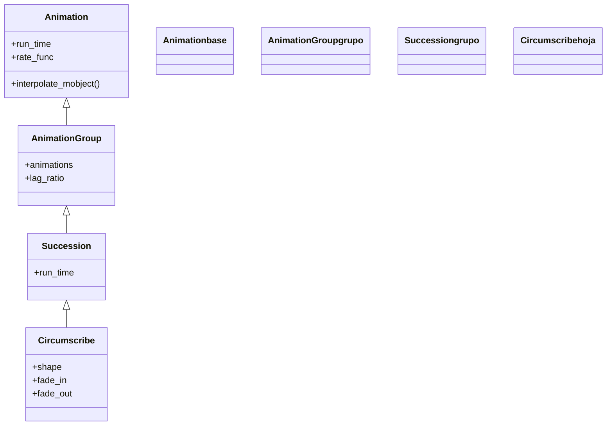

# Circumscribe — dibuja un recuadro alrededor del objeto y lo borra

`Circumscribe` **circunscribe** un objeto: dibuja un rectángulo (o un círculo) que lo envuelve, lo mantiene un instante y lo borra, dejando la escena intacta. Es el gesto de "encierra esto en un recuadro" que se hace al subrayar el dato clave de una transparencia. A diferencia de [[Indicate]], que actúa sobre el propio objeto agrandándolo, `Circumscribe` **añade una forma temporal a su alrededor** y la retira: el objeto resaltado no cambia ni de tamaño ni de color. Por dentro es una [[Succession]] —una secuencia de animaciones encadenadas—: primero crea la forma envolvente (o la funde), luego la deshace (o la funde a la inversa), todo de corrido. El resultado es un recuadro que aparece, recorre el contorno y desaparece. Acepta la `shape` de la envolvente ([[Rectangle]] o [[Circle]]) y si la forma debe aparecer/desaparecer dibujándose o por fundido.

## Importacion

```python
from manim import Circumscribe
# o, como es habitual en Manim:
from manim import *
```

## Herencia

### La jerarquia

`Circumscribe` cuelga de [[Succession]], que a su vez es un [[AnimationGroup]] que reproduce sus sub-animaciones **una tras otra** (en serie, no a la vez). La cadena completa hasta [[Animation]] explica el efecto: la forma envolvente se crea y luego se borra, dos animaciones que `Succession` ordena en el tiempo.



### Que hereda

`Circumscribe` decide **qué forma** envuelve el objeto y **cómo** aparece y se va; la maquinaria de encadenar esas dos fases en serie la pone [[Succession]]. La forma se ajusta al tamaño del mobject con un pequeño margen (`buff`).

| Capacidad | De dónde viene | Definido en |
|-----------|----------------|-------------|
| Encadenar animaciones en serie | reproducción secuencial | [[Succession]] |
| Agrupar sub-animaciones | `animations` | [[AnimationGroup]] |
| Duración y curva | `run_time`, `rate_func` | [[Animation]] |
| Forma envolvente y aparición | `shape`, `fade_in`, `fade_out`, `buff` | `Circumscribe` |

## Constructor

```python
Circumscribe(
    mobject,
    shape=Rectangle,
    fade_in=False,
    fade_out=True,
    color=YELLOW,
    run_time=1,
    stroke_width=DEFAULT_STROKE_WIDTH,
    buff=SMALL_BUFF,
    time_width=0.3,
    **kwargs,
)
```

### Parametros

| Parametro | Tipo | Defecto | Controla |
|-----------|------|---------|----------|
| `mobject` | `Mobject` | — | el objeto que se circunscribe |
| `shape` | `type` | `Rectangle` | la **clase** de la forma envolvente: [[Rectangle]] o [[Circle]] |
| `fade_in` | `bool` | `False` | si la forma **aparece** por fundido (`True`) o dibujándose (`False`) |
| `fade_out` | `bool` | `True` | si la forma **se va** por fundido (`True`) o deshaciéndose (`False`) |
| `color` | `ManimColor` | `YELLOW` | el color de la forma envolvente |
| `run_time` | `float` | `1` | la duración total (dibujar + borrar) |
| `stroke_width` | `float` | `DEFAULT_STROKE_WIDTH` | el grosor del trazo de la envolvente |
| `buff` | `float` | `SMALL_BUFF` | el **margen** entre el objeto y la forma que lo rodea |
| `time_width` | `float` | `0.3` | el ancho del trazo que recorre el contorno al dibujarse |
| `**kwargs` | — | — | se pasan a [[Succession]]/[[Animation]] |

#### shape — rectángulo o círculo

El parámetro recibe la **clase**, no una instancia: `shape=Rectangle` (el defecto) o `shape=Circle`. `Circumscribe` la instancia internamente ajustada al objeto.

```python
self.play(Circumscribe(formula))                 # recuadro rectangular (defecto)
self.play(Circumscribe(formula, shape=Circle))   # lo rodea con un circulo
```

#### fade_in / fade_out — cómo entra y sale el recuadro

Combinando los dos booleanos eliges el estilo: el defecto (`fade_in=False`, `fade_out=True`) dibuja el recuadro de un trazo y luego lo funde; poner ambos a `True` lo hace aparecer y desaparecer suave, como un parpadeo.

```python
self.play(Circumscribe(formula, fade_in=True, fade_out=True))   # aparece y se va por fundido
```

### Que construye / devuelve

Devuelve un objeto `Circumscribe` (una `Succession` inerte) que, al reproducirse con [[Scene.play]], dibuja la forma envolvente, la retira y **no deja nada en la escena**. El objeto circunscrito no se modifica.

## Ritmo

`Circumscribe` reparte su `run_time` entre las dos fases (aparecer y desaparecer), así que un `run_time` corto da un recuadro fugaz y uno largo deja el contorno más tiempo a la vista. El `time_width` controla lo "lento" que recorre el trazo el contorno al dibujarse.

```python
self.play(Circumscribe(formula), run_time=0.6)   # recuadro fugaz
self.play(Circumscribe(formula, run_time=2))     # se queda mas tiempo
```

## Ejemplo

### Version minima

Un recuadro amarillo que rodea un texto y se borra.

```python
from manim import *

class CircunscribirMinimo(Scene):
    def construct(self):
        t = Text("resultado").scale(1.5)
        self.add(t)
        self.play(Circumscribe(t))
        self.wait()
```

```bash
manim -pql archivo.py CircunscribirMinimo      # -p reproduce, -ql = calidad baja (rapido)
```

### Version completa

Subrayar el **paso clave** de una deducción: dos líneas de fórmula y un recuadro que encierra primero un término con un círculo y luego la conclusión con un rectángulo de otro color.

```python
from manim import *

class CircunscribirDeduccion(Scene):
    def construct(self):
        paso = MathTex("x", "+", "3", "=", "7").scale(2).to_edge(UP)
        sol = MathTex("x", "=", "4").scale(2)
        self.play(Write(paso))
        self.play(Write(sol))

        # rodear el termino que se despeja con un circulo
        self.play(Circumscribe(paso[2], shape=Circle, color=RED))

        # encerrar la solucion en un recuadro que se queda un instante mas
        self.play(Circumscribe(sol, color=GREEN, buff=0.3, run_time=1.5))
        self.wait()
```

```bash
manim -pqh archivo.py CircunscribirDeduccion     # -qh = calidad alta para el render final
```

### Variaciones

El estilo "dibujado" (defecto) frente al estilo "parpadeo" (`fade_in` y `fade_out` a `True`).

```python
from manim import *

class CircunscribirEstilos(Scene):
    def construct(self):
        a = Text("dibujado").shift(UP)
        b = Text("parpadeo").shift(DOWN)
        self.add(a, b)
        self.play(Circumscribe(a))                              # se dibuja y se funde
        self.play(Circumscribe(b, fade_in=True, fade_out=True)) # aparece/desaparece suave
        self.wait()
```

```bash
manim -pql archivo.py CircunscribirEstilos
```

## Componerla

`Circumscribe` encaja en las clases de [[Manim/animaciones/composicion/index|composicion]]. Encadenarla con un [[Indicate]] en una [[Succession]] combina dos formas de resaltar (recuadro + pulso); reproducirla a la vez que un movimiento subraya algo mientras se desplaza.

```python
from manim import *

class CircunscribirYPulsar(Scene):
    def construct(self):
        dato = Text("42").scale(2)
        self.add(dato)
        # primero lo encierra, luego lo hace pulsar
        self.play(Succession(Circumscribe(dato), Indicate(dato)))
        self.wait()
```

```bash
manim -pql archivo.py CircunscribirYPulsar
```

## Errores comunes

| Error | Causa | Solución |
|-------|-------|----------|
| `Circumscribe(mob, shape=Circle())` da error | pasaste una **instancia**, no la clase | pasa la clase: `shape=Circle` (sin paréntesis) |
| El recuadro queda pegado al objeto | `buff` por defecto es pequeño | súbelo: `buff=0.3` |
| Esperabas que el objeto creciera o cambiara | `Circumscribe` solo añade la envolvente | usa [[Indicate]] si quieres tocar el objeto |
| El recuadro desaparece demasiado rápido | `run_time` corto reparte poco a cada fase | sube `run_time` (1.5–2) |
| `NameError: name 'Circumscribe' is not defined` | faltó el import | `from manim import *` al inicio |

## Notas relacionadas

- [[Succession]] — la clase padre; `Circumscribe` encadena dibujar y borrar en serie
- [[Indicate]] — pulso de escala y color sobre el propio objeto
- [[Flash]] — un destello radial desde un punto
- [[Rectangle]] — la forma envolvente por defecto
- [[Circle]] — la forma envolvente alternativa (`shape=Circle`)
- [[Manim/animaciones/indicacion/index|indicacion]] — la familia de animaciones de resaltado
- [[Animation]] — la clase base con `run_time` y `rate_func`
