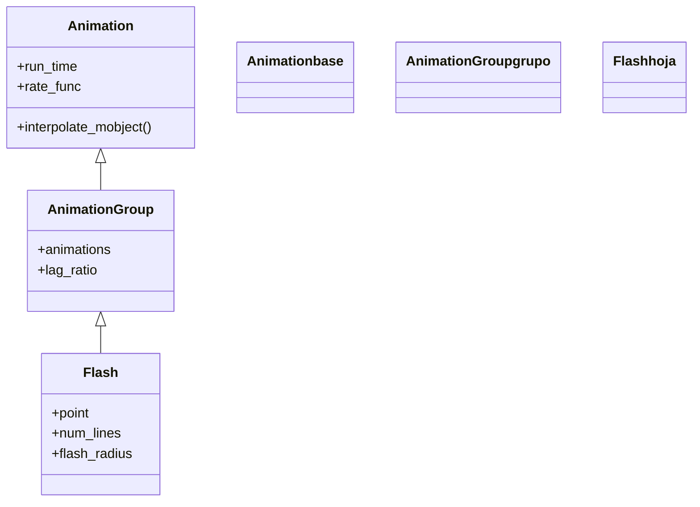

# Flash — un destello de líneas radiales desde un punto

`Flash` lanza un **destello** desde un punto: un haz de líneas cortas que salen disparadas hacia afuera en todas direcciones, brillan un instante y desaparecen. Es el efecto de "chispazo" o "¡tachán!" que marca un punto exacto de la escena —el lugar donde aparece un resultado, el vértice de una figura, la posición de un clic—. A diferencia de [[Indicate]], que actúa sobre un mobject y lo agranda, `Flash` **no toca ningún objeto**: dibuja sus propias líneas radiales alrededor de un `point`, las anima y las retira, dejando la escena exactamente como estaba. Por dentro es un [[AnimationGroup]]: construye `num_lines` segmentos en corona y los anima todos a la vez con un efecto de trazo que pasa. Por eso acepta un punto (o un mobject, del que toma su centro) y un puñado de parámetros geométricos para ajustar el tamaño y la densidad del destello.

## Importacion

```python
from manim import Flash
# o, como es habitual en Manim:
from manim import *
```

## Herencia

### La jerarquia

`Flash` cuelga de [[AnimationGroup]], la clase que reproduce **varias animaciones como una sola**. Tiene sentido: un destello no es un único trazo sino un manojo de líneas animadas en paralelo. La cadena hasta [[Animation]] pasa por `AnimationGroup`, de quien hereda la capacidad de agrupar y sincronizar sus sub-animaciones.



### Que hereda

`Flash` define la **geometría del destello** (cuántas líneas, qué largas, a qué radio) y delega en [[AnimationGroup]] la reproducción simultánea de todas ellas. Las líneas se animan internamente con `ShowPassingFlash`, un trazo que recorre la línea y se apaga.

| Capacidad | De dónde viene | Definido en |
|-----------|----------------|-------------|
| Animar muchas líneas a la vez | `animations`, sincronización | [[AnimationGroup]] |
| Desfasar las sub-animaciones | `lag_ratio` | [[AnimationGroup]] |
| Duración y curva del destello | `run_time`, `rate_func` | [[Animation]] |
| Forma del destello (líneas, radio) | `num_lines`, `line_length`, `flash_radius` | `Flash` |

## Constructor

```python
Flash(
    point,
    line_length=0.2,
    num_lines=12,
    flash_radius=0.1,
    line_stroke_width=3,
    color=YELLOW,
    time_width=1,
    run_time=1.0,
    **kwargs,
)
```

### Parametros

| Parametro | Tipo | Defecto | Controla |
|-----------|------|---------|----------|
| `point` | `np.ndarray` \| `Mobject` | — | el centro del destello; si es un mobject, usa su `get_center()` |
| `line_length` | `float` | `0.2` | el **largo** de cada línea radial |
| `num_lines` | `int` | `12` | cuántas líneas forman la corona (la densidad del destello) |
| `flash_radius` | `float` | `0.1` | el radio interior donde **arrancan** las líneas (separación del centro) |
| `line_stroke_width` | `float` | `3` | el grosor de cada línea |
| `color` | `ManimColor` | `YELLOW` | el color del destello |
| `time_width` | `float` | `1` | qué porción de la línea está encendida a la vez (el "ancho" del trazo que pasa) |
| `**kwargs` | — | — | se pasan a [[AnimationGroup]]/[[Animation]]: `run_time`, `rate_func`... |

#### point — un punto o un mobject

El primer argumento puede ser un vector de posición o directamente un mobject; en el segundo caso `Flash` destella sobre su centro, lo que evita calcular coordenadas a mano.

```python
self.play(Flash(ORIGIN))          # destello en el centro de la escena
self.play(Flash(dot))             # destello sobre el centro de 'dot'
self.play(Flash(LEFT * 2 + UP))   # destello en una posicion concreta
```

### Que construye / devuelve

Devuelve un objeto `Flash` (un `AnimationGroup` inerte) que, al reproducirse con [[Scene.play]], crea temporalmente las líneas radiales, las anima y las **elimina al terminar**. No queda ningún mobject en la escena ni se altera el objeto sobre el que destellaste.

## Ritmo

`Flash` acepta `run_time` (lo rápido que aparece y se apaga el destello) y `rate_func`. Combinado con `time_width`, controla la sensación: un `run_time` corto da un chispazo seco; uno largo, un brillo que se demora.

```python
self.play(Flash(dot), run_time=0.5)              # chispazo rapido
self.play(Flash(dot, run_time=1.5, time_width=0.5))  # brillo mas lento y fino
```

## Ejemplo

### Version minima

Un destello amarillo en el centro de la escena.

```python
from manim import *

class DestelloMinimo(Scene):
    def construct(self):
        self.play(Flash(ORIGIN))
        self.wait()
```

```bash
manim -pql archivo.py DestelloMinimo      # -p reproduce, -ql = calidad baja (rapido)
```

### Version completa

Marcar la **aparición de un resultado**: una fórmula se escribe y, justo donde queda el resultado, estalla un destello más grande y denso para subrayar el momento.

```python
from manim import *

class DestelloResultado(Scene):
    def construct(self):
        formula = MathTex("E = mc^2").scale(2)
        self.play(Write(formula))

        # destello potente justo sobre la formula
        self.play(Flash(
            formula,
            color=GOLD,
            line_length=0.6,
            num_lines=20,
            flash_radius=0.8,
            run_time=1,
        ))
        self.wait()
```

```bash
manim -pqh archivo.py DestelloResultado     # -qh = calidad alta para el render final
```

### Variaciones

Un destello discreto (pocas líneas, cortas) frente a uno espectacular (muchas y largas).

```python
from manim import *

class DestelloVariantes(Scene):
    def construct(self):
        izq = Dot(LEFT * 3, color=BLUE)
        der = Dot(RIGHT * 3, color=RED)
        self.add(izq, der)

        self.play(Flash(izq, num_lines=8, line_length=0.15))    # discreto
        self.play(Flash(der, num_lines=30, line_length=0.7,
                        color=RED, flash_radius=0.5))           # espectacular
        self.wait()
```

```bash
manim -pql archivo.py DestelloVariantes
```

## Componerla

Como cualquier animación, `Flash` se reproduce **junto a otras** en el mismo `self.play`, lo que permite destellar a la vez que aparece el objeto. Combinarlo con [[FadeIn]] o [[Create]] hace que el objeto "nazca con chispazo".

```python
from manim import *

class NacerConDestello(Scene):
    def construct(self):
        estrella = Star(color=YELLOW, fill_opacity=1).scale(0.8)
        # aparece y destella simultaneamente
        self.play(FadeIn(estrella), Flash(estrella, num_lines=16, flash_radius=0.9))
        self.wait()
```

```bash
manim -pql archivo.py NacerConDestello
```

## Errores comunes

| Error | Causa | Solución |
|-------|-------|----------|
| No se ve el destello | el `point` cae fuera de cuadro o `line_length` es minúsculo | comprueba la posición y sube `line_length`/`flash_radius` |
| El destello tapa la fórmula | `flash_radius` muy pequeño y las líneas nacen encima | sube `flash_radius` para que arranquen más afuera |
| Esperabas que el objeto creciera | confundiste `Flash` con [[Indicate]] | `Flash` no toca el objeto; usa [[Indicate]] para agrandarlo |
| Las líneas se ven muy densas o ralas | `num_lines` no encaja con el tamaño | ajusta `num_lines` (8 ralo … 30 denso) |
| `NameError: name 'Flash' is not defined` | faltó el import | `from manim import *` al inicio |

## Notas relacionadas

- [[AnimationGroup]] — la clase padre; `Flash` agrupa muchas líneas radiales
- [[Indicate]] — pulso de escala y color sobre un mobject (la indicación más usada)
- [[Circumscribe]] — rodea el objeto con un recuadro en vez de destellar un punto
- [[FocusOn]] — un círculo que se contrae enfocando un punto
- [[Manim/animaciones/indicacion/index|indicacion]] — la familia de animaciones de resaltado
- [[Animation]] — la clase base con `run_time` y `rate_func`
