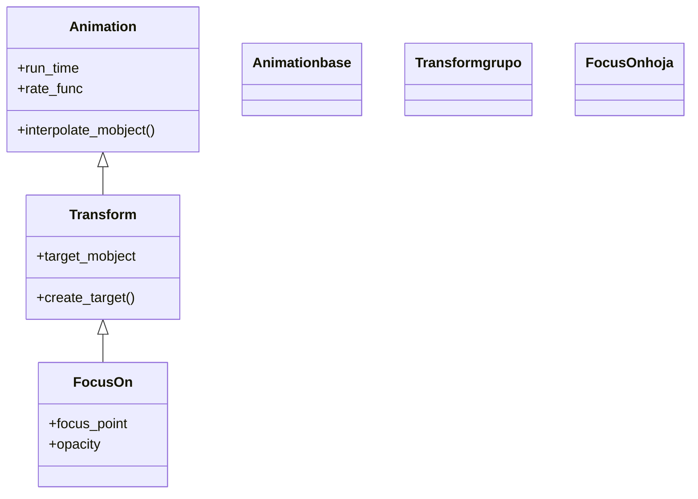

# FocusOn — un círculo grande se contrae enfocando un punto

`FocusOn` **enfoca** un punto: un círculo translúcido y enorme aparece cubriendo la escena y se **contrae** rápidamente hasta colapsar sobre el punto o el objeto indicado, como un objetivo de cámara que cierra el diafragma. Es el efecto de "concentra la mirada aquí": en lugar de marcar el objeto, guía el ojo del espectador hacia él reduciendo el campo de atención. Como toda animación de indicación, **no deja nada en la escena ni cambia el objeto enfocado**: el círculo es un mobject temporal que desaparece al colapsar. Por dentro es una [[Transform]]: interpola desde un círculo grande (de baja opacidad) hasta un círculo diminuto en el punto destino, de modo que el "encogimiento" es la transformación. Acepta el punto a enfocar (o un mobject, del que toma el centro), la opacidad del círculo y su color.

## Importacion

```python
from manim import FocusOn
# o, como es habitual en Manim:
from manim import *
```

## Herencia

### La jerarquia

`FocusOn` cuelga de [[Transform]], la animación que interpola entre dos estados. Aquí los dos estados son dos círculos: uno grande y semitransparente al principio, uno minúsculo en el punto destino al final. La cadena hasta [[Animation]] es la misma que la de [[Indicate]]; cambia solo qué se interpola.



### Que hereda

`FocusOn` define los **dos círculos** (el grande de partida y el diminuto de llegada) y delega en [[Transform]] la interpolación entre ellos. El círculo de partida es un mobject que `FocusOn` crea y, como el de llegada es prácticamente un punto, el efecto neto es un colapso que termina invisible.

| Capacidad | De dónde viene | Definido en |
|-----------|----------------|-------------|
| Interpolar entre dos estados (círculo grande → diminuto) | `create_target`, `interpolate_mobject` | [[Transform]] |
| Duración y curva del enfoque | `run_time` (defecto `2`), `rate_func` | [[Animation]] |
| Círculo de partida y destino | `focus_point`, `opacity`, `color` | `FocusOn` |

## Constructor

```python
FocusOn(
    focus_point,
    opacity=0.2,
    color=GREY,
    run_time=2,
    **kwargs,
)
```

### Parametros

| Parametro | Tipo | Defecto | Controla |
|-----------|------|---------|----------|
| `focus_point` | `np.ndarray` \| `Mobject` | — | el punto donde colapsa el enfoque; si es un mobject, usa su centro |
| `opacity` | `float` | `0.2` | la **opacidad** del círculo grande de partida (su densidad de "velo") |
| `color` | `ManimColor` | `GREY` | el color del círculo de enfoque |
| `run_time` | `float` | `2` | la duración del encogimiento (más largo que el `1` habitual) |
| `**kwargs` | — | — | se pasan a [[Transform]]/[[Animation]]: `rate_func`, `lag_ratio`... |

#### focus_point — un punto o un mobject

Como en [[Flash]], el destino puede ser un vector de posición o directamente un mobject (se enfoca su centro), lo que evita calcular coordenadas.

```python
self.play(FocusOn(ORIGIN))      # enfoca el centro de la escena
self.play(FocusOn(dot))         # enfoca el centro de 'dot'
self.play(FocusOn(RIGHT * 2))   # enfoca una posicion concreta
```

#### opacity — lo notorio del velo

Controla cuánto "oscurece" el círculo grande la escena antes de contraerse. Subirla hace el efecto más dramático (un velo más denso que se cierra); bajarla, casi imperceptible.

```python
self.play(FocusOn(dot, opacity=0.5))   # velo mas denso, mas dramatico
```

### Que construye / devuelve

Devuelve un objeto `FocusOn` (una `Transform` inerte) que, al reproducirse con [[Scene.play]], crea el círculo de enfoque, lo contrae hasta el punto y lo **retira al terminar**. La escena queda igual y el objeto enfocado no se modifica.

## Ritmo

`FocusOn` usa un `run_time` por defecto de `2` segundos: el enfoque es un gesto deliberado, no un parpadeo. Acortarlo lo vuelve un cierre brusco; alargarlo, un acercamiento más cinematográfico.

```python
self.play(FocusOn(dot), run_time=1)     # enfoque rapido
self.play(FocusOn(dot, run_time=3))     # acercamiento lento
```

## Ejemplo

### Version minima

Un enfoque que se cierra sobre el centro de la escena.

```python
from manim import *

class EnfocarMinimo(Scene):
    def construct(self):
        punto = Dot(color=RED).scale(2)
        self.add(punto)
        self.play(FocusOn(punto))
        self.wait()
```

```bash
manim -pql archivo.py EnfocarMinimo      # -p reproduce, -ql = calidad baja (rapido)
```

### Version completa

Dirigir la atención a **un elemento entre varios**: una rejilla de puntos y un enfoque que se cierra sobre uno concreto con un velo más denso para aislarlo visualmente.

```python
from manim import *

class EnfocarUno(Scene):
    def construct(self):
        rejilla = VGroup(*[Dot() for _ in range(9)]).arrange_in_grid(3, 3, buff=1)
        self.play(FadeIn(rejilla))

        # cerrar el foco sobre el punto central con un velo notorio
        objetivo = rejilla[4]
        self.play(FocusOn(objetivo, opacity=0.4, color=BLUE, run_time=2))
        self.play(Indicate(objetivo, color=YELLOW))   # rematar con un pulso
        self.wait()
```

```bash
manim -pqh archivo.py EnfocarUno     # -qh = calidad alta para el render final
```

### Variaciones

Un enfoque sutil (poca opacidad) frente a uno dramático (velo denso y oscuro).

```python
from manim import *

class EnfocarVariantes(Scene):
    def construct(self):
        a = Dot(LEFT * 3, color=GREEN)
        b = Dot(RIGHT * 3, color=ORANGE)
        self.add(a, b)
        self.play(FocusOn(a, opacity=0.15))                    # sutil
        self.play(FocusOn(b, opacity=0.6, color=DARK_GREY))    # dramatico
        self.wait()
```

```bash
manim -pql archivo.py EnfocarVariantes
```

## Componerla

`FocusOn` se combina con las clases de [[Manim/animaciones/composicion/index|composicion]]. El patrón más natural es encadenarlo con otra indicación en una [[Succession]]: primero el foco lleva el ojo al objeto y luego un [[Indicate]] o un [[Circumscribe]] lo remata.

```python
from manim import *

class EnfocarYResaltar(Scene):
    def construct(self):
        clave = Text("clave").scale(2)
        self.add(clave)
        # el foco guia la mirada y el recuadro la fija
        self.play(Succession(FocusOn(clave), Circumscribe(clave)))
        self.wait()
```

```bash
manim -pql archivo.py EnfocarYResaltar
```

## Errores comunes

| Error | Causa | Solución |
|-------|-------|----------|
| El velo tapa demasiado la escena | `opacity` alta deja el círculo muy denso al inicio | bájala: `opacity=0.15`–`0.2` |
| No se aprecia el enfoque | `opacity` muy baja, casi transparente | súbela un poco (`0.3`–`0.5`) |
| Esperabas que el objeto cambiara | `FocusOn` solo dirige la mirada, no toca el objeto | combínalo con [[Indicate]]/[[Circumscribe]] |
| El enfoque va muy lento | `run_time` por defecto es `2` | bájalo: `run_time=1` |
| `NameError: name 'FocusOn' is not defined` | faltó el import | `from manim import *` al inicio |

## Notas relacionadas

- [[Transform]] — la clase padre; `FocusOn` interpola de un círculo grande a uno diminuto
- [[Flash]] — un destello radial desde un punto (también acepta un mobject)
- [[Indicate]] — pulso de escala y color, ideal para rematar el enfoque
- [[Circumscribe]] — rodea el objeto con un recuadro
- [[Manim/animaciones/indicacion/index|indicacion]] — la familia de animaciones de resaltado
- [[Animation]] — la clase base con `run_time` y `rate_func`
