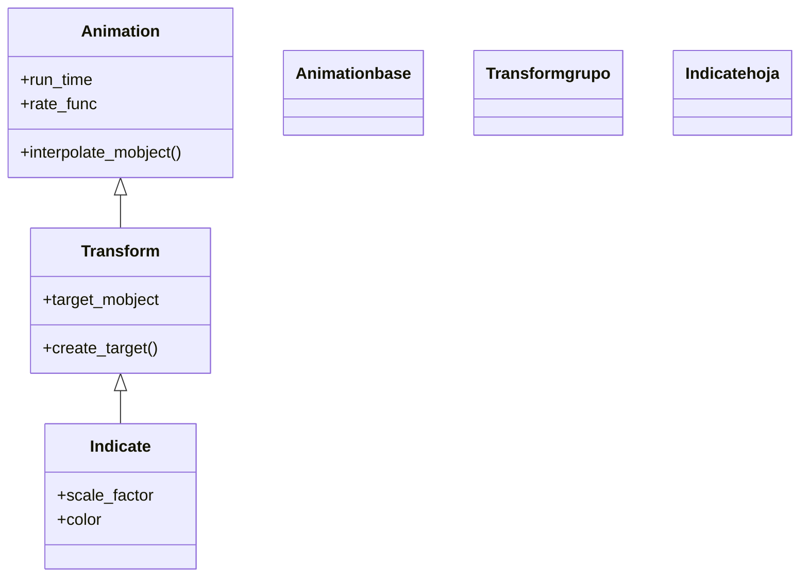

# Indicate — pulso de escala y color para llamar la atención

`Indicate` es la indicación **más usada** de Manim: da un breve **pulso** a un mobject —lo agranda un poco y le cambia el color— y lo devuelve exactamente a su estado original. Es el gesto de "mira aquí" por excelencia: durante un segundo el objeto crece y se tiñe de amarillo, y al terminar vuelve a su tamaño y su color de siempre, como si nada hubiera pasado. Por dentro es una [[Transform]]: interpola del estado inicial a un estado "resaltado" (escalado y recoloreado) y, gracias a una `rate_func` de ida y vuelta (`there_and_back`), regresa al punto de partida sin dejar el objeto modificado. Como toda animación de indicación, **no cambia el objeto de forma permanente**: úsala para enfatizar un término de una fórmula, un nodo de un diagrama o una pieza de una figura justo cuando hablas de él.

## Importacion

```python
from manim import Indicate
# o, como es habitual en Manim:
from manim import *
```

## Herencia

### La jerarquia

`Indicate` cuelga de [[Transform]], la animación que interpola entre dos estados de un mismo mobject. La cadena hasta [[Animation]] es corta: `Indicate` no inventa maquinaria nueva, solo fija cuál es el "estado resaltado" (escala y color) y deja que `Transform` haga la interpolación de ida y vuelta.



### Que hereda

`Indicate` solo define **a qué estado** se resalta el mobject (cuánto crece y de qué color se tiñe); todo el motor de animación lo hereda. La pieza clave que aprovecha es la `rate_func`: por defecto usa `there_and_back`, que lleva el `alpha` de 0 a 1 y de vuelta a 0, de ahí que el objeto pulse y regrese.

| Capacidad | De dónde viene | Definido en |
|-----------|----------------|-------------|
| Interpolar entre dos estados del mobject | `create_target`, `interpolate_mobject` | [[Transform]] |
| Duración y curva del pulso | `run_time`, `rate_func` (`there_and_back`) | [[Animation]] |
| Volver al estado original | `rate_func` de ida y vuelta | [[Animation]] |
| Estado resaltado (escala + color) | `scale_factor`, `color` | `Indicate` |

## Constructor

```python
Indicate(
    mobject,
    scale_factor=1.2,
    color=YELLOW,
    rate_func=there_and_back,
    **kwargs,
)
```

### Parametros

| Parametro | Tipo | Defecto | Controla |
|-----------|------|---------|----------|
| `mobject` | `Mobject` | — | el objeto que recibe el pulso |
| `scale_factor` | `float` | `1.2` | cuánto **crece** el objeto en el punto álgido del pulso (`1.2` = un 20% más grande) |
| `color` | `ManimColor` | `YELLOW` | el color al que se **tiñe** durante el pulso |
| `rate_func` | `Callable` | `there_and_back` | la curva del pulso; por defecto va y vuelve, dejando el objeto como estaba |
| `**kwargs` | — | — | se pasan a [[Transform]]/[[Animation]]: `run_time`, `lag_ratio`... |

#### scale_factor — la intensidad del pulso

Es lo que más tocarás. Un valor cercano a `1` es un guiño sutil; uno mayor, un golpe de atención.

```python
self.play(Indicate(formula, scale_factor=1.1))   # sutil
self.play(Indicate(formula, scale_factor=1.6))   # enfatico
```

### Que construye / devuelve

Devuelve un objeto `Indicate` (una `Animation` inerte). No hace nada hasta que se pasa a [[Scene.play]]. Al reproducirse, el mobject crece y se recolorea hasta la mitad de la animación y luego deshace el cambio; **al terminar, el objeto queda idéntico a como estaba antes**.

## Ritmo

Como toda animación, `Indicate` acepta `run_time` (duración del pulso completo, ida y vuelta) y `rate_func`. La `rate_func` por defecto (`there_and_back`) es la que hace que sea una indicación efímera; cambiarla rompe el "vuelve a su estado".

```python
self.play(Indicate(formula), run_time=0.5)   # un pulso rapido
self.play(Indicate(formula, run_time=2))     # un pulso lento y marcado
```

> [!warning] No cambies la `rate_func` a una que no vuelva
> Si pasas `rate_func=smooth` (que va de 0 a 1 sin volver), el objeto se quedará **agrandado y amarillo** al final, dejando de ser una indicación efímera. Mantén `there_and_back` (el defecto) salvo que sepas lo que haces.

## Ejemplo

### Version minima

Un texto que pulsa una vez para llamar la atención y vuelve a su estado.

```python
from manim import *

class IndicarMinimo(Scene):
    def construct(self):
        t = Text("importante")
        self.add(t)
        self.play(Indicate(t))
        self.wait()
```

```bash
manim -pql archivo.py IndicarMinimo      # -p reproduce, -ql = calidad baja (rapido)
```

### Version completa

Resaltar **un término concreto** de una fórmula sin tocar el resto. Se usa `MathTex` con partes separadas y se indica solo el sumando que interesa, con un color y una escala a medida.

```python
from manim import *

class IndicarTermino(Scene):
    def construct(self):
        formula = MathTex("a^2", "+", "b^2", "=", "c^2").scale(2)
        self.play(Write(formula))

        # resaltar solo "b^2" (indice 2) en rojo y mas grande
        self.play(Indicate(formula[2], scale_factor=1.5, color=RED))

        # y luego el resultado "c^2" (indice 4) en verde
        self.play(Indicate(formula[4], scale_factor=1.4, color=GREEN))
        self.wait()
```

```bash
manim -pqh archivo.py IndicarTermino     # -qh = calidad alta para el render final
```

### Variaciones

Indicar **varios objetos a la vez** pasando varias animaciones al mismo `self.play`.

```python
from manim import *

class IndicarVarios(Scene):
    def construct(self):
        puntos = VGroup(*[Dot() for _ in range(3)]).arrange(RIGHT, buff=1.5)
        self.add(puntos)
        self.play(*[Indicate(d, color=TEAL) for d in puntos])   # los tres pulsan juntos
        self.wait()
```

```bash
manim -pql archivo.py IndicarVarios
```

## Componerla

`Indicate` es una `Animation` normal, así que se combina con las clases de [[Manim/animaciones/composicion/index|composicion]]. Encadenarla en una [[Succession]] o escalonarla con [[LaggedStart]] da el efecto de "ir señalando" elementos uno tras otro, muy útil para recorrer los términos de una expresión.

```python
from manim import *

class IndicarEnCascada(Scene):
    def construct(self):
        items = VGroup(*[Text(p) for p in ("uno", "dos", "tres")]).arrange(DOWN)
        self.add(items)
        # cada elemento pulsa un poco despues que el anterior
        self.play(LaggedStart(*[Indicate(it) for it in items], lag_ratio=0.6))
        self.wait()
```

```bash
manim -pql archivo.py IndicarEnCascada
```

## Errores comunes

| Error | Causa | Solución |
|-------|-------|----------|
| El objeto se queda grande/amarillo al terminar | cambiaste la `rate_func` por una que no vuelve | deja `there_and_back` (el defecto) |
| Indica toda la fórmula, no el término | pasaste el `MathTex` entero en vez de un índice | usa `formula[i]` para una parte concreta |
| `formula[2]` da `IndexError` | el `MathTex` no se partió en tantos trozos | separa los argumentos: `MathTex("a^2", "+", "b^2")` |
| El pulso es demasiado tímido o brusco | `scale_factor` por defecto no encaja | ajústalo: `1.1` (sutil) … `1.6` (fuerte) |
| `NameError: name 'Indicate' is not defined` | faltó el import | `from manim import *` al inicio |

## Notas relacionadas

- [[Transform]] — la clase padre; `Indicate` es una transformación de ida y vuelta
- [[Flash]] — destello radial desde un punto, otra forma de decir "mira aquí"
- [[Circumscribe]] — dibuja un recuadro alrededor del objeto en vez de pulsarlo
- [[Wiggle]] — hace temblar el objeto en lugar de agrandarlo
- [[rate_functions]] — `there_and_back` y las demás curvas de velocidad
- [[Manim/animaciones/indicacion/index|indicacion]] — la familia de animaciones de resaltado
- [[Animation]] — la clase base con `run_time` y `rate_func`
