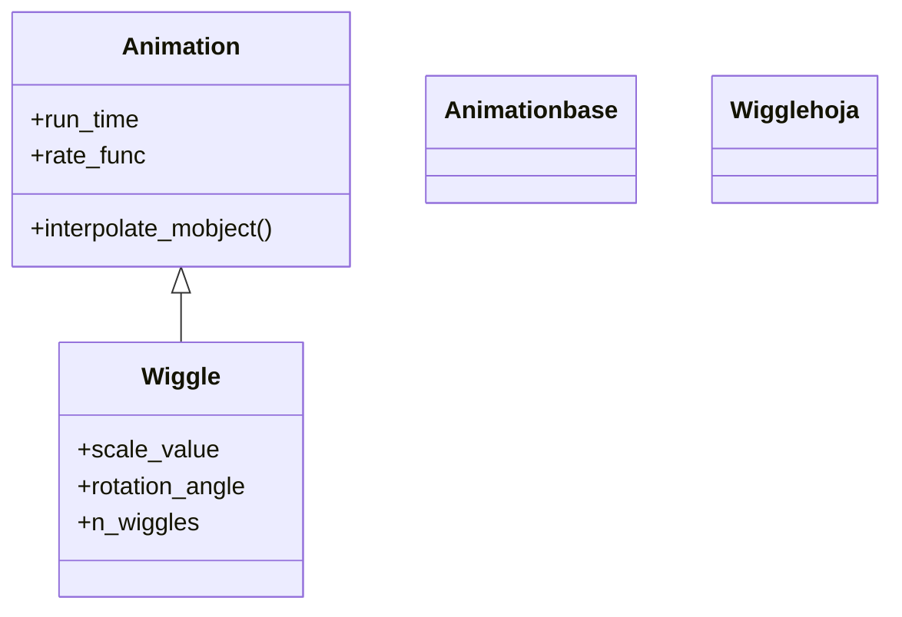

# Wiggle — hace temblar o menear el objeto de ida y vuelta

`Wiggle` hace **temblar** un objeto: lo agranda un poco y lo rota de un lado a otro varias veces, como una sacudida nerviosa, y lo devuelve a su estado exacto. Es la indicación más "viva" del grupo —en lugar de un pulso limpio ([[Indicate]]) o un recuadro ([[Circumscribe]]), transmite vibración o énfasis cinético—, ideal para decir "¡eh, esto!" con un meneo. Como toda animación de indicación, **no deja el objeto cambiado**: al terminar vuelve a su tamaño, su giro y su posición originales. A diferencia de sus hermanas, `Wiggle` hereda **directamente de [[Animation]]**: no es una `Transform` ni un `AnimationGroup`, sino una animación que sobreescribe `interpolate_mobject` para combinar una oscilación de escala y una de rotación en función del `alpha`. Por eso sus parámetros son geométricos: cuánto crece, cuánto rota y cuántas sacudidas da.

## Importacion

```python
from manim import Wiggle
# o, como es habitual en Manim:
from manim import *
```

## Herencia

### La jerarquia

`Wiggle` cuelga **directamente** de [[Animation]], la raíz de todo lo que se reproduce. No pasa por `Transform` ni por `AnimationGroup`: implementa su propio `interpolate_mobject` para mezclar las dos oscilaciones (escala y rotación) que producen el temblor.



### Que hereda

Al heredar directo de [[Animation]], `Wiggle` aprovecha el esqueleto común (`run_time`, `rate_func`, el ciclo `begin`/`interpolate_mobject`/`finish`) y aporta toda la lógica del temblor en su propio `interpolate_mobject`: para cada `alpha`, calcula una escala y un ángulo oscilantes y los aplica partiendo del estado inicial guardado.

| Capacidad | De dónde viene | Definido en |
|-----------|----------------|-------------|
| Esqueleto de animación (`alpha`, ciclo de vida) | `begin`, `interpolate_mobject`, `finish` | [[Animation]] |
| Duración y curva | `run_time` (defecto `2`), `rate_func` | [[Animation]] |
| Volver al estado inicial | parte de `starting_mobject` cada fotograma | [[Animation]] |
| La oscilación de escala y rotación | `scale_value`, `rotation_angle`, `n_wiggles` | `Wiggle` |

## Constructor

```python
Wiggle(
    mobject,
    scale_value=1.1,
    rotation_angle=0.01 * TAU,
    n_wiggles=6,
    scale_about_point=None,
    rotate_about_point=None,
    run_time=2,
    **kwargs,
)
```

### Parametros

| Parametro | Tipo | Defecto | Controla |
|-----------|------|---------|----------|
| `mobject` | `Mobject` | — | el objeto que tiembla |
| `scale_value` | `float` | `1.1` | cuánto **crece** en el punto álgido de cada sacudida |
| `rotation_angle` | `float` (rad) | `0.01 * TAU` (≈ 0.063) | el **ángulo** máximo del meneo a cada lado |
| `n_wiggles` | `int` | `6` | cuántas **sacudidas** (oscilaciones) da en total |
| `scale_about_point` | `np.ndarray` \| `None` | `None` | punto fijo de la escala; por defecto, el centro del objeto |
| `rotate_about_point` | `np.ndarray` \| `None` | `None` | punto fijo de la rotación; por defecto, el centro del objeto |
| `run_time` | `float` | `2` | la duración total del temblor (más largo que el defecto general) |
| `**kwargs` | — | — | se pasan a [[Animation]]: `rate_func`, `lag_ratio`... |

#### rotation_angle — la amplitud del meneo

Está en **radianes** y es pequeño por defecto (un meneo discreto). Súbelo para un temblor más exagerado; usa `DEGREES` si prefieres pensar en grados.

```python
self.play(Wiggle(obj, rotation_angle=0.05))        # meneo discreto
self.play(Wiggle(obj, rotation_angle=15 * DEGREES))  # meneo amplio
```

#### n_wiggles — cuántas sacudidas

Controla la frecuencia del temblor dentro del mismo `run_time`: más `n_wiggles` = vibración más rápida y nerviosa; menos = un balanceo lento.

```python
self.play(Wiggle(obj, n_wiggles=3))    # balanceo lento
self.play(Wiggle(obj, n_wiggles=12))   # vibracion nerviosa
```

### Que construye / devuelve

Devuelve un objeto `Wiggle` (una `Animation` inerte) que, al reproducirse con [[Scene.play]], sacude el mobject y lo **deja exactamente como estaba**: misma escala, mismo ángulo, misma posición.

## Ritmo

`Wiggle` trae un `run_time` por defecto de `2` segundos (más largo que el `1` habitual) para que las `n_wiggles` sacudidas se aprecien. Bajar el `run_time` acelera todo el temblor; la `rate_func` afecta a cómo se reparte, pero la oscilación interna ya garantiza que vuelve al inicio.

```python
self.play(Wiggle(obj), run_time=1)     # temblor mas rapido
self.play(Wiggle(obj, run_time=3))     # temblor prolongado
```

## Ejemplo

### Version minima

Un texto que tiembla una vez para llamar la atención y vuelve a su sitio.

```python
from manim import *

class TemblarMinimo(Scene):
    def construct(self):
        t = Text("ojo").scale(2)
        self.add(t)
        self.play(Wiggle(t))
        self.wait()
```

```bash
manim -pql archivo.py TemblarMinimo      # -p reproduce, -ql = calidad baja (rapido)
```

### Version completa

Resaltar el **dato erróneo** de una lista haciéndolo temblar con énfasis (más amplitud y más sacudidas) mientras los demás permanecen quietos.

```python
from manim import *

class TemblarError(Scene):
    def construct(self):
        items = VGroup(
            Text("2 + 2 = 4", color=GREEN),
            Text("3 + 3 = 7", color=RED),
            Text("5 + 1 = 6", color=GREEN),
        ).arrange(DOWN, buff=0.5)
        self.play(Write(items))

        # el dato erroneo tiembla con fuerza
        self.play(Wiggle(
            items[1],
            scale_value=1.2,
            rotation_angle=12 * DEGREES,
            n_wiggles=8,
        ))
        self.wait()
```

```bash
manim -pqh archivo.py TemblarError     # -qh = calidad alta para el render final
```

### Variaciones

Un meneo casi imperceptible frente a una sacudida exagerada.

```python
from manim import *

class TemblarVariantes(Scene):
    def construct(self):
        a = Square(color=BLUE, fill_opacity=0.5).shift(LEFT * 2.5)
        b = Square(color=RED, fill_opacity=0.5).shift(RIGHT * 2.5)
        self.add(a, b)
        self.play(Wiggle(a, scale_value=1.05, rotation_angle=0.03))     # sutil
        self.play(Wiggle(b, scale_value=1.4, rotation_angle=25 * DEGREES,
                         n_wiggles=10))                                 # exagerado
        self.wait()
```

```bash
manim -pql archivo.py TemblarVariantes
```

## Componerla

`Wiggle` es una `Animation` corriente y se combina con las clases de [[Manim/animaciones/composicion/index|composicion]]. Escalonar varios `Wiggle` con [[LaggedStart]] hace que una fila de objetos tiemble en ola; reproducir un `Wiggle` junto a un [[Indicate]] suma meneo y color.

```python
from manim import *

class TemblarEnOla(Scene):
    def construct(self):
        fila = VGroup(*[Dot(color=YELLOW) for _ in range(5)]).arrange(RIGHT, buff=0.8)
        self.add(fila)
        # cada punto tiembla un poco despues que el anterior: efecto de ola
        self.play(LaggedStart(*[Wiggle(d) for d in fila], lag_ratio=0.3))
        self.wait()
```

```bash
manim -pql archivo.py TemblarEnOla
```

## Errores comunes

| Error | Causa | Solución |
|-------|-------|----------|
| Apenas se nota el temblor | `rotation_angle` por defecto es pequeño | súbelo: `rotation_angle=15 * DEGREES` |
| El meneo va demasiado lento | `run_time` por defecto es `2` | bájalo: `run_time=1` |
| Esperabas que rotara mucho y solo vibra | `rotation_angle` está en **radianes** | usa `* DEGREES` para pensar en grados |
| El objeto parece quedar girado | en realidad vuelve al inicio; era un fotograma intermedio | añade `self.wait()` para verlo asentado |
| `NameError: name 'Wiggle' is not defined` | faltó el import | `from manim import *` al inicio |

## Notas relacionadas

- [[Animation]] — la clase padre directa; `Wiggle` sobreescribe `interpolate_mobject`
- [[Indicate]] — pulso limpio de escala y color (sin temblor)
- [[Circumscribe]] — rodea el objeto con un recuadro
- [[Flash]] — un destello radial desde un punto
- [[rate_functions]] — las curvas de velocidad de la animación
- [[Manim/animaciones/indicacion/index|indicacion]] — la familia de animaciones de resaltado
