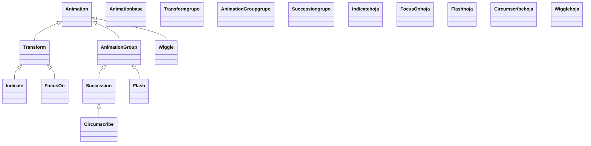

# indicación — resaltar algo de forma efímera

Esta carpeta reúne las animaciones de **indicación**: las que sirven para decir "mira aquí" en mitad de una explicación. Su rasgo común y definitorio es que **resaltan algo de forma efímera**: el objeto pulsa, tiembla, se rodea de un recuadro o recibe un destello, y al terminar **vuelve a su estado exacto**, sin quedar modificado. Son lo contrario de una [[Transform]] o un [[FadeOut]], que dejan la escena cambiada para siempre; una indicación es un gesto que va y vuelve. Esto las hace el recurso natural para guiar la atención del espectador mientras hablas: enfatizar un término de una fórmula justo cuando lo nombras, marcar el dato clave de una tabla, señalar el vértice de una figura. Lo curioso de esta familia es que sus clases **no comparten un padre común propio**: unas son [[Transform]] (interpolan ida y vuelta), otras son [[AnimationGroup]]/[[Succession]] (orquestan varias sub-animaciones) y otra hereda directo de [[Animation]]. Lo que las agrupa no es la herencia sino la **intención**: resaltar sin dejar huella.

## En accion

Una escena que toma una fórmula y la recorre con varias indicaciones, una por término, sin alterar la fórmula: un pulso, un recuadro, un destello y un meneo, encadenados. Al final la fórmula sigue intacta, porque ninguna indicación la cambia de forma permanente.

```python
from manim import *

class RecorrerFormula(Scene):
    def construct(self):
        f = MathTex("a^2", "+", "b^2", "=", "c^2").scale(2)
        self.play(Write(f))

        self.play(Indicate(f[0], color=YELLOW))           # pulso de escala y color
        self.play(Circumscribe(f[2], shape=Circle))       # recuadro (circulo) alrededor
        self.play(Flash(f[4], num_lines=16, flash_radius=0.6))  # destello sobre el resultado
        self.play(Wiggle(f[3]))                           # menea el signo igual

        self.wait()   # la formula quedo idéntica a como se escribio
```

```bash
manim -pql archivo.py RecorrerFormula      # -p reproduce, -ql = calidad baja (rapido)
```

## Herencia

Esta subfamilia es **heterogénea**: sus clases cuelgan de ramas distintas del árbol de [[Animation]]. `Indicate` y `FocusOn` son [[Transform]] (interpolan de un estado a otro y vuelven); `Flash` es un [[AnimationGroup]] (anima muchas líneas a la vez); `Circumscribe` es una [[Succession]] (encadena dibujar y borrar en serie); y `Wiggle` hereda **directamente** de `Animation`. El diagrama muestra de qué rama baja cada una.



## Clases que aporta

Las cinco indicaciones de la carpeta, con su padre directo y para qué sirve cada una.

| Clase | Hereda de | Para que |
|-------|-----------|----------|
| [[Indicate]] | `Transform` | un pulso de escala y color sobre el objeto; la indicación más usada |
| [[Flash]] | `AnimationGroup` | un destello de líneas radiales desde un punto; marca un sitio exacto |
| [[Circumscribe]] | `Succession` | dibuja un rectángulo o círculo alrededor del objeto y lo borra |
| [[Wiggle]] | `Animation` | hace temblar/menear el objeto de ida y vuelta |
| [[FocusOn]] | `Transform` | un círculo grande se contrae enfocando un punto; guía la mirada |

## Como elegir

Todas resaltan, pero el **gesto** es distinto. Eliges por la sensación que quieres transmitir.

| Quiero… | Indicación | Cómo se ve |
|---------|-----------|------------|
| Enfatizar un término al nombrarlo | `Indicate` | el objeto crece un poco y se tiñe, luego vuelve |
| Marcar un punto exacto (un resultado, un clic) | `Flash` | chispazo de líneas radiales desde el punto |
| Encerrar algo en un recuadro | `Circumscribe` | un rectángulo o círculo se dibuja alrededor y se borra |
| Transmitir vibración, error o nerviosismo | `Wiggle` | el objeto tiembla (escala + rotación) y se asienta |
| Guiar el ojo hacia algo sin tocarlo | `FocusOn` | un velo circular se cierra sobre el punto |

> [!tip] La regla de oro de la familia
> Si la animación deja el objeto **cambiado** al terminar, no es una indicación: es una transformación o un movimiento. Toda indicación devuelve la escena a su estado previo; por eso se pueden encadenar sin "ensuciar" el lienzo.

## Patrones y recetas del grupo

Tres patrones que se repiten al usar indicaciones: combinarlas sobre el mismo objeto, escalonarlas en cascada y guiar-y-rematar.

### Combinar dos indicaciones sobre el mismo objeto

Encadenar un enfoque que lleva la mirada y un pulso que la fija es el "uno-dos" más común. Se hace con una [[Succession]] (en serie) o pasándolas a `self.play` seguidas.

```python
from manim import *

class GuiarYFijar(Scene):
    def construct(self):
        dato = Text("x = 42").scale(2)
        self.add(dato)
        self.play(FocusOn(dato))      # el foco lleva el ojo
        self.play(Indicate(dato))     # el pulso lo fija
        self.wait()
```

```bash
manim -pql archivo.py GuiarYFijar
```

### Resaltar en cascada con LaggedStart

Para señalar una lista o una fila de elementos uno tras otro, se escalonan las indicaciones con [[LaggedStart]]: cada una arranca un poco después que la anterior, creando una ola.

```python
from manim import *

class ResaltarEnCascada(Scene):
    def construct(self):
        items = VGroup(*[Text(p) for p in ("uno", "dos", "tres")]).arrange(DOWN, buff=0.5)
        self.add(items)
        self.play(LaggedStart(*[Indicate(it) for it in items], lag_ratio=0.6))
        self.wait()
```

```bash
manim -pql archivo.py ResaltarEnCascada
```

### Destello al aparecer un objeto

Reproducir un [[Flash]] a la vez que el objeto se crea hace que "nazca con chispazo": se pasan ambas animaciones al mismo `self.play`.

```python
from manim import *

class NacerConChispazo(Scene):
    def construct(self):
        estrella = Star(color=YELLOW, fill_opacity=1)
        self.play(FadeIn(estrella), Flash(estrella, num_lines=18, flash_radius=0.9))
        self.wait()
```

```bash
manim -pql archivo.py NacerConChispazo
```

## Notas relacionadas

- [[Animation]] — la clase base de la que, por ramas distintas, cuelgan todas estas
- [[Transform]] — el padre de `Indicate` y `FocusOn` (interpolan ida y vuelta)
- [[AnimationGroup]] — el padre de `Flash` (y abuelo de `Circumscribe`)
- [[Succession]] — el padre de `Circumscribe` (encadena en serie)
- [[LaggedStart]] — para escalonar varias indicaciones en cascada
- [[concepto_animation]] — el modelo mental: la Animation es una instrucción, no un objeto
- [[Manim/animaciones/index|animaciones]] — el índice del pilar con el `classDiagram` completo
