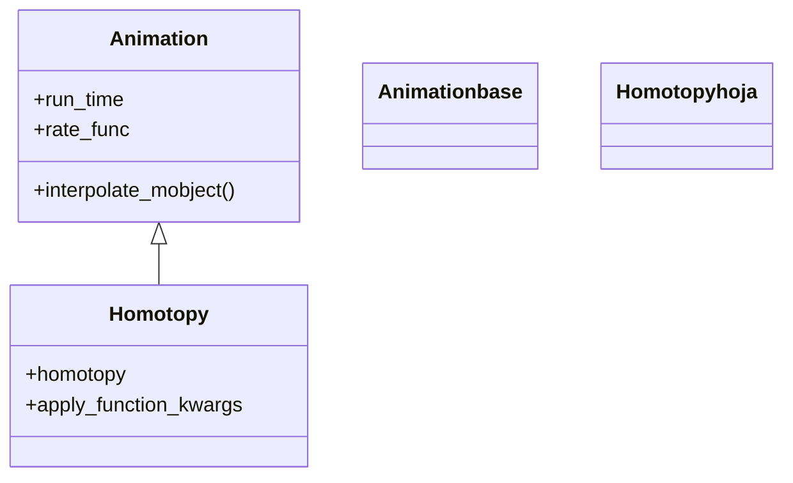

# Homotopy — deformar un mobject con una función del plano

`Homotopy` es la animación más **matemática** de la familia de movimiento: en lugar de mover el objeto entero, deforma continuamente su geometría aplicando una **función del espacio y el tiempo** a cada uno de sus puntos. Le das una función `homotopy(x, y, z, t)` que, para cada punto `(x, y, z)` del mobject y cada instante `t` entre 0 y 1, devuelve dónde debe estar ese punto en ese momento; Manim la evalúa fotograma a fotograma y va llevando cada punto de su posición inicial (`t=0`) a la final (`t=1`). En la práctica es una **homotopía** en el sentido topológico: una deformación continua del plano (o del espacio) que arrastra al objeto consigo. Es la herramienta para ondular, retorcer, plegar o transportar una figura siguiendo una ley arbitraria, no para un simple desplazamiento o giro. Hereda directamente de [[Animation]] y se crea y reproduce con `self.play` como cualquier otra.

> [!warning] Nivel avanzado
> `Homotopy` no es una animación de uso diario: requiere pensar el movimiento como una **función matemática de los puntos**, no como un gesto. Para girar usa [[Rotate]], para seguir un camino [[MoveAlongPath]]; recurre a `Homotopy` solo cuando necesites una deformación punto a punto que esas no pueden expresar.

## Importacion

```python
from manim import Homotopy
# o, como es habitual en Manim:
from manim import *
```

## Herencia

### La jerarquia

`Homotopy` cuelga **directamente** de [[Animation]]: como [[MoveAlongPath]], es una animación de movimiento sin pasar por [[Transform]]. La cadena es mínima —`Animation` ← `Homotopy`— porque no interpola entre dos formas, sino que aplica su propia función a los puntos en cada `alpha`.



### Que hereda

`Homotopy` solo define **cómo** se deforma el objeto (aplicar la función `homotopy` a cada punto en cada fotograma); el control temporal lo hereda de [[Animation]]. La `t` de la homotopía está ligada al `alpha` de la base: en cada fotograma, Manim pasa el `alpha` (ya remapeado por la `rate_func`) como `t` de la función.

| Capacidad | Parámetro/método | Definido en |
|-----------|------------------|-------------|
| Duración de la deformación | `run_time` | [[Animation]] |
| Curva de velocidad (controla `t`) | `rate_func` | [[Animation]] |
| Quitar el mobject al terminar | `remover` | [[Animation]] |
| Aplicar la función a los puntos | `interpolate_mobject(alpha)` | `Homotopy` |

## Constructor

```python
Homotopy(
    homotopy,                    # funcion (x, y, z, t) -> (x', y', z'), con t de 0 a 1
    mobject,                     # el objeto que se deforma
    aligned_edge=ORIGIN,         # borde de referencia al recolocar (poco usado)
    apply_function_kwargs=None,  # kwargs extra para apply_function
    **kwargs,                    # run_time, rate_func, lag_ratio... -> Animation
)
```

### Parametros

| Parametro | Tipo | Defecto | Controla |
|-----------|------|---------|----------|
| `homotopy` | `Callable` | — | la función `(x, y, z, t)` que devuelve la nueva posición `(x', y', z')` de cada punto en el instante `t` |
| `mobject` | `Mobject` | — | el objeto cuyos puntos se deforman |
| `aligned_edge` | `np.ndarray` | `ORIGIN` | borde de referencia al recolocar el resultado; rara vez se toca |
| `apply_function_kwargs` | `dict \| None` | `None` | argumentos extra que se pasan a `apply_function` internamente |
| `**kwargs` | — | — | se pasan a [[Animation]]: `run_time`, `rate_func`, `lag_ratio`... |

#### homotopy — la función que lo gobierna todo

Es el corazón de la animación: una función Python que recibe **cuatro** argumentos `(x, y, z, t)` (las tres coordenadas de un punto y el tiempo normalizado) y devuelve una tupla `(x', y', z')` con la nueva posición de ese punto. Con `t=0` debería devolver el punto sin cambios (la posición inicial) y con `t=1`, la deformación completa. El argumento `t` es lo que distingue una homotopía de un simple `apply_function`: el movimiento depende del tiempo.

```python
# ondular en vertical: cada punto sube segun una onda que crece con t
def onda(x, y, z, t):
    return (x, y + 0.5 * t * np.sin(2 * x), z)

self.play(Homotopy(onda, mi_objeto), run_time=2)
```

> [!important] El orden de los argumentos: la función va PRIMERO
> Cuidado: en `Homotopy` el orden es `Homotopy(homotopy, mobject, ...)` —la función antes que el mobject—, al revés que en casi todas las demás animaciones, que reciben el mobject primero. Pasarlos en orden inverso es un error típico.

### Que construye / devuelve

Devuelve un objeto `Homotopy` (una `Animation` inerte). En cada fotograma toma el `alpha` actual (de 0 a 1, ya pasado por la `rate_func`), lo usa como `t` y reconstruye el mobject aplicando `homotopy(x, y, z, t)` a cada uno de sus puntos desde su estado inicial. Al terminar, el objeto queda con la deformación correspondiente a `t=1`. Crear la animación sin pasarla a `self.play` no muestra nada.

## Ritmo

Como desciende de [[Animation]], se controla en el tiempo igual que cualquier animación; el matiz es que aquí el tiempo **entra dentro de la función**.

### run_time y rate_func (heredados de Animation)

`run_time` fija cuánto dura la deformación; `rate_func` remapea el avance del `t` que recibe la función. Con `linear`, `t` crece de forma uniforme; con `smooth` (defecto), arranca y frena suave; con `there_and_back`, la deformación va y se deshace (el objeto vuelve a su forma inicial), lo que es muy útil para un efecto de "respiración".

```python
self.play(Homotopy(onda, obj), run_time=3, rate_func=linear)         # deformacion uniforme
self.play(Homotopy(onda, obj), rate_func=there_and_back)             # se deforma y vuelve
```

### t y alpha son lo mismo

La `t` de tu función **es** el `alpha` de la animación: no la controlas directamente, la mueve Manim de 0 a 1 a lo largo del `run_time`. Por eso conviene escribir la función de modo que en `t=0` devuelva el punto sin cambios; si no, el objeto "saltará" en el primer fotograma.

## Ejemplo

### Version minima

Una línea recta que se ondula: cada punto sube según una onda senoidal cuya amplitud crece con el tiempo.

```python
from manim import *

class OndaMinima(Scene):
    def construct(self):
        linea = Line(LEFT * 4, RIGHT * 4, color=BLUE)

        def ondular(x, y, z, t):
            return (x, y + 0.6 * t * np.sin(2 * x), z)

        self.add(linea)
        self.play(Homotopy(ondular, linea), run_time=2)   # la funcion va PRIMERO
        self.wait()
```

```bash
manim -pql archivo.py OndaMinima      # -p reproduce, -ql = calidad baja (rapido)
```

### Version completa

Una cuadrícula que se retuerce en un remolino: cada punto gira un ángulo que depende de su distancia al origen y del tiempo, creando un efecto de vórtice que se forma de a poco.

```python
from manim import *

class Remolino(Scene):
    def construct(self):
        grid = NumberPlane(x_range=[-4, 4], y_range=[-3, 3])

        def vortice(x, y, z, t):
            r = np.sqrt(x**2 + y**2)
            ang = t * 1.5 / (1 + r)          # gira mas cerca del centro y crece con t
            cos_a, sin_a = np.cos(ang), np.sin(ang)
            return (x * cos_a - y * sin_a, x * sin_a + y * cos_a, z)

        self.add(grid)
        self.play(Homotopy(vortice, grid), run_time=3, rate_func=linear)
        self.wait()
```

```bash
manim -pqh archivo.py Remolino      # -qh = calidad alta para el render final
```

### Parientes y variaciones

Hay variantes de `Homotopy` para casos concretos; conviene saber que existen.

| Clase | Para qué |
|-------|----------|
| `SmoothedVectorizedHomotopy` | aplica la homotopía suavizando las curvas Bézier del VMobject; deformaciones más limpias en objetos vectorizados |
| `ComplexHomotopy` | la función es del plano **complejo**: `homotopy(z, t) -> z'` con `z` complejo, en lugar de coordenadas `(x, y, z)`; cómoda para transformaciones del análisis complejo |

```python
from manim import *

class HomotopiaCompleja(Scene):
    def construct(self):
        cuadro = Square(color=YELLOW).scale(2)

        # eleva al cuadrado en el plano complejo, de a poco
        def f(z, t):
            return z ** (1 + t)              # de z (t=0) a z^2 (t=1)

        self.add(cuadro)
        self.play(ComplexHomotopy(f, cuadro), run_time=3)
        self.wait()
```

```bash
manim -pql archivo.py HomotopiaCompleja
```

## Componerla

`Homotopy` se combina como cualquier `Animation`: deformar varios objetos a la vez en un mismo `self.play` o dentro de un [[AnimationGroup]], o mezclar la deformación con un cambio de color o posición vía `.animate`.

```python
from manim import *

class ComponerHomotopia(Scene):
    def construct(self):
        linea = Line(LEFT * 4, RIGHT * 4, color=BLUE)

        def ondular(x, y, z, t):
            return (x, y + 0.6 * t * np.sin(3 * x), z)

        self.add(linea)
        # ondular Y recolorear a la vez
        self.play(AnimationGroup(
            Homotopy(ondular, linea),
            linea.animate.set_color(RED),
        ), run_time=2)
        self.wait()
```

```bash
manim -pql archivo.py ComponerHomotopia
```

## Errores comunes

| Error | Causa | Solución |
|-------|-------|----------|
| `TypeError` sobre los argumentos | pasaste el mobject antes que la función | el orden es `Homotopy(funcion, mobject)`: la función va primero |
| El objeto "salta" en el primer fotograma | en `t=0` la función no devuelve el punto sin cambios | escribe la función para que en `t=0` sea la identidad |
| La función falla con arrays | usaste `math.sin` en vez de `np.sin` | usa NumPy (`np.sin`, `np.sqrt`); los puntos llegan como floats pero conviene NumPy |
| La deformación se ve a tirones en curvas | el VMobject tiene pocos puntos de control | usa `SmoothedVectorizedHomotopy` o añade más resolución a la curva |
| Querías solo mover o girar el objeto | `Homotopy` deforma punto a punto, es excesiva | usa [[MoveAlongPath]] (recorrer) o [[Rotate]] (girar) |

## Notas relacionadas

- [[Animation]] — la clase base con `run_time`/`rate_func` que `Homotopy` hereda
- [[MoveAlongPath]] — mover el objeto entero por un camino, sin deformarlo
- [[Rotate]] — girar el objeto, el movimiento rígido más común
- [[concepto_animation]] — el modelo mental de animación que `Homotopy` lleva al extremo
- [[AnimationGroup]] — combinar la deformación con otras animaciones a la vez
- [[Manim/animaciones/movimiento/index | movimiento]] — el índice de la familia de movimiento
