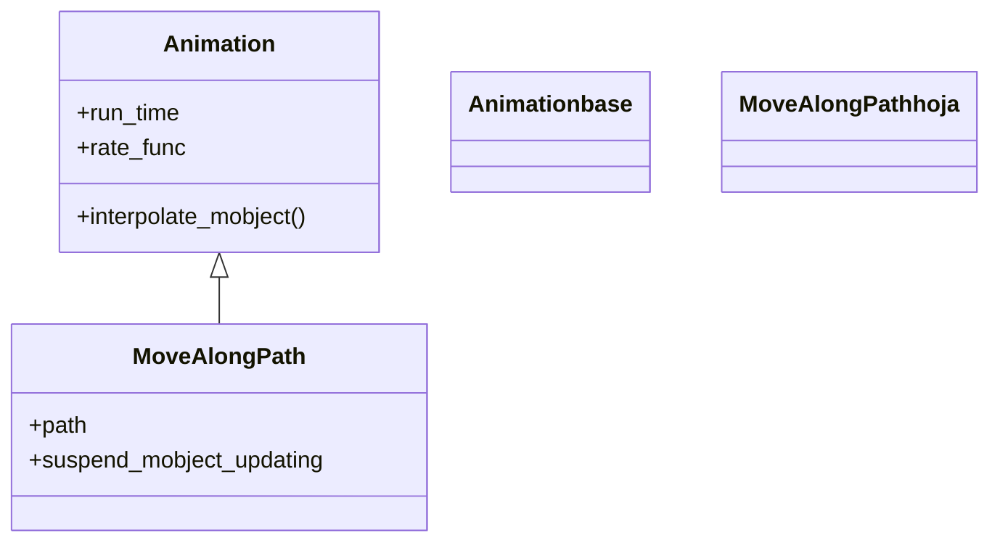

# MoveAlongPath — recorrer un camino con un mobject

`MoveAlongPath` es la animación que **mueve un mobject a lo largo de un camino**: toma un objeto y lo hace viajar siguiendo la traza de otro VMobject —una [[Line]], un [[Arc]], un círculo, una curva paramétrica del [[ParametricFunction]] o la gráfica de una función—, recolocándolo en cada fotograma sobre el punto correspondiente de esa curva. Es la herramienta para "un punto que recorre la circunferencia", "una nave que sigue una trayectoria" o "un marcador que avanza por la gráfica de una función". A diferencia de [[Rotate]], no hereda de [[Transform]] sino **directamente de [[Animation]]**: no interpola entre dos formas, sino que en cada `alpha` consulta el punto del camino a esa fracción del recorrido (`path.point_from_proportion(alpha)`) y mueve allí el mobject. El camino es un mobject de pleno derecho: puede dibujarse o quedar invisible (no se añade a la escena salvo que tú lo hagas). Como toda animación, se crea y se pasa a `self.play`.

## Importacion

```python
from manim import MoveAlongPath
# o, como es habitual en Manim:
from manim import *
```

## Herencia

### La jerarquia

`MoveAlongPath` cuelga **directamente** de [[Animation]]: es una animación de movimiento "pura", sin pasar por [[Transform]]. La cadena es la más corta posible —`Animation` ← `MoveAlongPath`— porque no necesita la maquinaria de morphing; solo el esqueleto temporal de la base.



### Que hereda

`MoveAlongPath` solo define **cómo** se calcula la posición en cada fotograma (consultar el punto del camino a la proporción `alpha`); todo el control temporal lo hereda de [[Animation]]. Por eso acepta `run_time`, `rate_func` y `lag_ratio` sin definir nada de eso.

| Capacidad | Parámetro/método | Definido en |
|-----------|------------------|-------------|
| Duración del recorrido | `run_time` | [[Animation]] |
| Curva de velocidad sobre el camino | `rate_func` | [[Animation]] |
| Quitar el mobject al terminar | `remover` | [[Animation]] |
| Calcular la posición en cada `alpha` | `interpolate_mobject(alpha)` | `MoveAlongPath` |

## Constructor

```python
MoveAlongPath(
    mobject,                          # el objeto que viaja
    path,                             # el VMobject cuya traza se sigue (Line, Arc, circulo, curva...)
    suspend_mobject_updating=False,   # si congela los updaters del mobject durante el recorrido
    **kwargs,                         # run_time, rate_func, lag_ratio... -> Animation
)
```

### Parametros

| Parametro | Tipo | Defecto | Controla |
|-----------|------|---------|----------|
| `mobject` | `Mobject` | — | el objeto que se desplaza a lo largo del camino |
| `path` | `VMobject` | — | la curva que se recorre; cualquier VMobject sirve como traza |
| `suspend_mobject_updating` | `bool` | `False` | si `True`, pausa los `updaters` del mobject mientras viaja |
| `**kwargs` | — | — | se pasan a [[Animation]]: `run_time`, `rate_func`, `lag_ratio`... |

#### path — el camino es otro mobject

El segundo argumento es un VMobject cualquiera: el objeto que se mueve aterriza sobre su contorno. Una [[Line]] da un recorrido recto; un [[Arc]] o un [[Circle]], uno curvo; una `ParametricFunction` o `axes.plot(...)`, una trayectoria arbitraria. El camino **no aparece** en escena a menos que lo añadas tú con `self.add(path)` o lo animes; suele dibujarse para que se vea la trayectoria.

```python
camino = Circle(radius=2)            # la traza: un circulo
self.add(camino)                     # opcional: para que se vea
punto = Dot(color=YELLOW)
self.play(MoveAlongPath(punto, camino))   # el punto recorre el circulo
```

#### suspend_mobject_updating — congelar updaters

Si el mobject que viaja tiene `updaters` (por ejemplo, una etiqueta que lo sigue), `True` los pausa durante el recorrido para que no interfieran. En la mayoría de los casos se deja en `False`.

### Que construye / devuelve

Devuelve un objeto `MoveAlongPath` (una `Animation` inerte). En cada fotograma llama a `path.point_from_proportion(alpha)` para obtener el punto a esa fracción del camino y centra allí el mobject. El recorrido va del inicio del `path` (`alpha=0`) a su final (`alpha=1`); si el camino es cerrado (un círculo), termina donde empezó. Crear la animación sin pasarla a `self.play` no muestra nada.

## Ritmo

Como desciende de [[Animation]], el ritmo del recorrido se controla con los parámetros heredados, más el matiz de que aquí "el cuánto" lo define el propio camino.

### run_time y rate_func (heredados de Animation)

`run_time` fija cuánto tarda en recorrer **todo** el camino; `rate_func` decide la velocidad a lo largo del trayecto. Con `linear` el objeto avanza a ritmo constante; con `smooth` (defecto) arranca y frena suave, lo que en un círculo cerrado puede notarse como un titubeo al cerrar la vuelta.

```python
self.play(MoveAlongPath(p, camino), run_time=3, rate_func=linear)  # recorrido uniforme en 3 s
self.play(MoveAlongPath(p, camino), rate_func=there_and_back)       # va hasta el final y vuelve
```

### La longitud del camino no cambia el run_time

`run_time` reparte el tiempo sobre la **proporción** del camino (de 0 a 1), no sobre su longitud real: un camino largo y uno corto con el mismo `run_time` tardan lo mismo, así que el largo se recorre a más velocidad. Para mantener una velocidad constante entre caminos distintos, ajusta el `run_time` proporcionalmente a su longitud.

## Ejemplo

### Version minima

Un punto que recorre una vuelta completa a un círculo.

```python
from manim import *

class RecorridoMinimo(Scene):
    def construct(self):
        camino = Circle(radius=2, color=GREY)
        punto = Dot(color=YELLOW)
        punto.move_to(camino.point_from_proportion(0))   # empieza sobre el camino

        self.add(camino, punto)
        self.play(MoveAlongPath(punto, camino), run_time=3, rate_func=linear)
        self.wait()
```

```bash
manim -pql archivo.py RecorridoMinimo      # -p reproduce, -ql = calidad baja (rapido)
```

### Version completa

Un marcador que recorre la gráfica de una función sobre unos ejes, dejando ver la trayectoria: el camino es la curva que devuelve `axes.plot`, y el punto la sigue mientras la curva ya está dibujada.

```python
from manim import *

class SeguirFuncion(Scene):
    def construct(self):
        ejes = Axes(x_range=[-3, 3], y_range=[-1, 5], x_length=7, y_length=4)
        curva = ejes.plot(lambda x: x**2, color=BLUE)        # la grafica = el camino
        marcador = Dot(color=YELLOW)
        marcador.move_to(curva.point_from_proportion(0))

        self.play(Create(ejes), Create(curva))
        self.add(marcador)
        # el marcador recorre la parabola de un extremo al otro
        self.play(MoveAlongPath(marcador, curva), run_time=4, rate_func=linear)
        self.wait()
```

```bash
manim -pqh archivo.py SeguirFuncion      # -qh = calidad alta para el render final
```

### Variaciones

Distintos caminos para el mismo patrón: una recta, un arco y una curva paramétrica (una espiral).

```python
from manim import *

class VariosCaminos(Scene):
    def construct(self):
        recta = Line(LEFT * 5, LEFT * 1, color=GREY)
        arco = Arc(radius=1.5, start_angle=0, angle=PI, color=GREY).shift(UP)
        espiral = ParametricFunction(
            lambda t: np.array([0.3 * t * np.cos(t), 0.3 * t * np.sin(t), 0]),
            t_range=[0, 4 * PI],
            color=GREY,
        ).shift(RIGHT * 3)

        a, b, c = Dot(color=RED), Dot(color=GREEN), Dot(color=BLUE)
        self.add(recta, arco, espiral)
        self.play(
            MoveAlongPath(a, recta),
            MoveAlongPath(b, arco),
            MoveAlongPath(c, espiral),
            run_time=4,
            rate_func=linear,
        )
        self.wait()
```

```bash
manim -pql archivo.py VariosCaminos
```

## Componerla

`MoveAlongPath` se combina como cualquier `Animation`: varios recorridos simultáneos en un mismo `self.play` o dentro de un [[AnimationGroup]], y se puede mezclar con el `.animate` del mobject para que cambie de color o tamaño mientras viaja.

```python
from manim import *

class ComponerRecorrido(Scene):
    def construct(self):
        camino = Circle(radius=2, color=GREY)
        punto = Dot(color=YELLOW)
        punto.move_to(camino.point_from_proportion(0))

        self.add(camino, punto)
        # recorrer el circulo Y cambiar de color a la vez
        self.play(AnimationGroup(
            MoveAlongPath(punto, camino),
            punto.animate.set_color(RED),
        ), run_time=3, rate_func=linear)
        self.wait()
```

```bash
manim -pql archivo.py ComponerRecorrido
```

> [!tip] El punto de partida importa
> `MoveAlongPath` mueve el mobject al inicio del camino al empezar la animación, así que conviene colocarlo allí desde el principio con `move_to(path.point_from_proportion(0))` para evitar un salto brusco en el primer fotograma.

## Errores comunes

| Error | Causa | Solución |
|-------|-------|----------|
| El objeto "salta" al empezar | estaba lejos del inicio del camino | colócalo antes con `move_to(path.point_from_proportion(0))` |
| El camino no se ve | un `path` no se añade a la escena solo | `self.add(camino)` o anímalo con `Create` antes |
| El recorrido se ve con frenón | `rate_func=smooth` por defecto | usa `rate_func=linear` para velocidad constante |
| Esperabas que girara, no que se trasladara | confundiste mover con rotar | para giro usa [[Rotate]]; `MoveAlongPath` solo traslada |
| Dos caminos de distinta longitud tardan igual | `run_time` reparte sobre la proporción, no la longitud | ajusta `run_time` a la longitud de cada camino |

## Notas relacionadas

- [[Animation]] — la clase base con `run_time`/`rate_func` que `MoveAlongPath` hereda
- [[Rotate]] — la otra animación de movimiento: girar en vez de recorrer
- [[Homotopy]] — deformar el objeto con una función, no moverlo entero por un camino
- [[Line]] — un camino recto entre dos puntos
- [[Arc]] — un camino curvo (un trozo de circunferencia)
- [[Circle]] — un camino cerrado para órbitas y bucles
- [[AnimationGroup]] — combinar el recorrido con otras animaciones a la vez
- [[Manim/animaciones/movimiento/index | movimiento]] — el índice de la familia de movimiento
