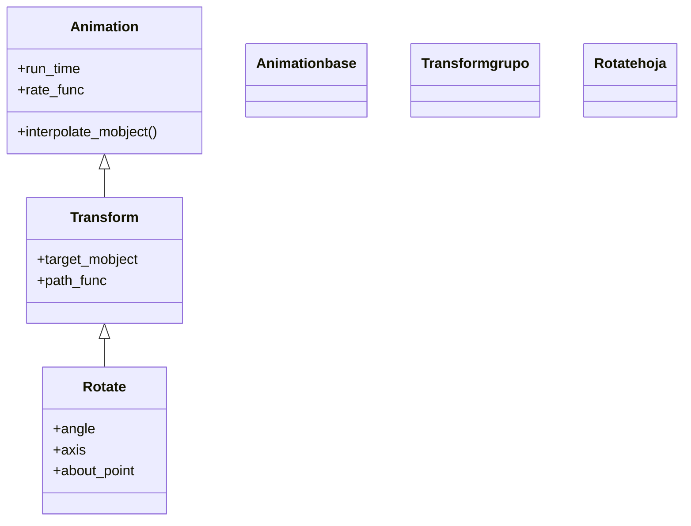

# Rotate — girar un mobject un ángulo dado

`Rotate` es la animación que **gira** un mobject un ángulo concreto alrededor de un punto y un eje. Es la forma controlada de rotar: a diferencia del atajo `mobject.animate.rotate(...)`, su constructor expone directamente `about_point`, `about_edge` y `axis`, así que es la que usas cuando el giro tiene que ocurrir alrededor de un punto que no es el centro del objeto (una esquina, el origen, otro mobject) o sobre un eje distinto del que sale de la pantalla. Hereda de [[Transform]] porque girar es, en el fondo, interpolar entre el estado inicial y una copia ya rotada del objeto: por eso comparte con él toda la maquinaria de morphing y, por encima, los parámetros temporales de [[Animation]]. El ángulo va siempre en **radianes** (`PI`, `TAU/4`) o en grados convertidos con la constante `DEGREES` (`90 * DEGREES`). Como toda animación, no se reproduce sola: se crea y se pasa a `self.play`.

## Importacion

```python
from manim import Rotate
# o, como es habitual en Manim:
from manim import *
```

## Herencia

### La jerarquia

`Rotate` cuelga de [[Transform]], que a su vez es una subclase directa de [[Animation]]. La cadena es corta —`Animation` ← `Transform` ← `Rotate`— pero importa: de `Transform` saca la interpolación entre dos estados, y de `Animation` los parámetros temporales que comparte con cualquier otra animación.



### Que hereda

`Rotate` solo define **qué** transformación se aplica (rotar un ángulo alrededor de un punto/eje); construye internamente una copia rotada del mobject como objetivo y deja que [[Transform]] interpole hacia ella. Todo lo temporal lo hereda de [[Animation]], así que un `Rotate` acepta `run_time`, `rate_func` y `lag_ratio` exactamente igual que cualquier otra animación.

| Capacidad | Parámetro/método | Definido en |
|-----------|------------------|-------------|
| Duración de la animación | `run_time` | [[Animation]] |
| Curva de velocidad | `rate_func` | [[Animation]] |
| Desfase entre submobjects | `lag_ratio` | [[Animation]] |
| Interpolación hacia el objetivo | `interpolate_mobject(alpha)` | [[Transform]] |
| Construir el objetivo rotado | el `angle`/`axis`/`about_point` | `Rotate` |

## Constructor

```python
Rotate(
    mobject,                 # el objeto que gira
    angle=PI,                # cuanto gira, en RADIANES (PI = media vuelta)
    axis=OUT,                # eje de giro; OUT = perpendicular a la pantalla (giro 2D normal)
    about_point=None,        # punto fijo del giro; None = el centro del mobject
    about_edge=None,         # alternativa: un borde como pivote (UL, DOWN, ...)
    **kwargs,                # run_time, rate_func, lag_ratio... -> Animation
)
```

### Parametros

| Parametro | Tipo | Defecto | Controla |
|-----------|------|---------|----------|
| `mobject` | `Mobject` | — | el objeto que se hace girar |
| `angle` | `float` (rad) | `PI` | el ángulo de giro; positivo = antihorario; en radianes o `grados * DEGREES` |
| `axis` | `np.ndarray` | `OUT` | el eje alrededor del que gira; `OUT` (hacia el espectador) da el giro plano habitual |
| `about_point` | `np.ndarray \| None` | `None` | el punto que queda fijo; `None` usa el centro del mobject |
| `about_edge` | `np.ndarray \| None` | `None` | usar un borde como pivote (`UL`, `DOWN`...) en lugar de un punto exacto |
| `**kwargs` | — | — | se pasan a [[Animation]]: `run_time`, `rate_func`, `lag_ratio`... |

#### angle — radianes, no grados

El error número uno: pasar `90` esperando 90 grados. `Rotate(m, 90)` gira **90 radianes** (más de 14 vueltas). Para grados, multiplica por `DEGREES` (que vale `PI/180`).

```python
self.play(Rotate(cuadro, PI / 2))        # un cuarto de vuelta (90 grados)
self.play(Rotate(cuadro, 90 * DEGREES))  # lo mismo, escrito en grados
self.play(Rotate(cuadro, -TAU))          # una vuelta entera en sentido horario
```

#### about_point — el pivote del giro

Por defecto el objeto gira sobre su propio centro. Con `about_point` el giro ocurre alrededor de cualquier punto: el `ORIGIN`, una esquina o la posición de otro mobject. Es justo lo que el atajo `.animate.rotate()` no deja controlar con la misma comodidad.

```python
# gira el cuadro alrededor del origen, no de su centro (lo hace orbitar)
self.play(Rotate(cuadro, PI, about_point=ORIGIN))
# pivota sobre su esquina superior izquierda
self.play(Rotate(cuadro, PI / 4, about_edge=UL))
```

### Que construye / devuelve

Devuelve un objeto `Rotate` (una `Animation` inerte): describe el giro pero no lo ejecuta. Internamente, al empezar genera una **copia del mobject ya rotada** y la usa como `target_mobject` de [[Transform]]; cada fotograma interpola la rotación parcial. Tras la animación, en escena queda **el mobject original** ya girado (no una copia nueva). Crear el `Rotate` sin pasarlo a `self.play` no muestra nada.

## Ritmo

Como desciende de [[Animation]], `Rotate` se controla en el tiempo igual que cualquier animación, más lo propio del giro.

### run_time y rate_func (heredados de Animation)

`run_time` alarga o acorta el giro; `rate_func` decide cómo se reparte la velocidad. Para un giro continuo y mecánico conviene `linear` (sin arranque ni frenado), que es lo contrario del `smooth` por defecto.

```python
self.play(Rotate(rueda, TAU), run_time=2, rate_func=linear)   # una vuelta uniforme en 2 s
self.play(Rotate(flecha, PI / 2))                             # cuarto de vuelta, con frenado suave
```

### El angulo total define el recorrido

A diferencia de un desplazamiento, en `Rotate` el "cuánto" es el `angle`: combinándolo con `run_time` controlas la **velocidad angular**. Un `TAU` en 1 s gira el doble de rápido que un `TAU` en 2 s. Para un giro que **no para** (sin un ángulo final fijo) usa el pariente [[Rotating]], pensado para `run_time` largos.

## Ejemplo

### Version minima

Un cuadrado que da un cuarto de vuelta sobre su centro.

```python
from manim import *

class GiroMinimo(Scene):
    def construct(self):
        s = Square(color=BLUE, fill_opacity=0.5)
        self.add(s)
        self.play(Rotate(s, PI / 2))   # 90 grados, alrededor de su centro
        self.wait()
```

```bash
manim -pql archivo.py GiroMinimo      # -p reproduce, -ql = calidad baja (rapido)
```

### Version completa

Una "luna" que orbita alrededor de un planeta: el truco es girar la luna usando `about_point` en el centro del planeta, de modo que el giro la hace trasladarse en círculo en vez de rotar sobre sí misma.

```python
from manim import *

class Orbita(Scene):
    def construct(self):
        planeta = Dot(ORIGIN, color=YELLOW).scale(3)
        luna = Dot(color=BLUE).scale(1.5).shift(RIGHT * 3)

        self.add(planeta, luna)
        # la luna gira TAU alrededor del planeta: orbita una vuelta entera
        self.play(
            Rotate(luna, TAU, about_point=planeta.get_center()),
            run_time=4,
            rate_func=linear,
        )
        self.wait()
```

```bash
manim -pqh archivo.py Orbita      # -qh = calidad alta para el render final
```

### Variaciones

Tres maneras frecuentes de tocar el giro: el pivote en una esquina, el sentido horario y el giro sobre un eje 3D.

```python
from manim import *

class VariacionesGiro(Scene):
    def construct(self):
        a = Square(color=GREEN, fill_opacity=0.4).shift(LEFT * 4)
        b = Square(color=RED, fill_opacity=0.4)
        c = Square(color=BLUE, fill_opacity=0.4).shift(RIGHT * 4)

        self.add(a, b, c)
        self.play(
            Rotate(a, PI, about_edge=DL),     # pivota sobre su esquina inferior izquierda
            Rotate(b, -PI, run_time=2),       # media vuelta en sentido horario, mas lenta
            Rotate(c, PI, axis=UP),           # gira sobre el eje vertical (efecto 3D, se "voltea")
        )
        self.wait()
```

```bash
manim -pql archivo.py VariacionesGiro
```

## Componerla

`Rotate` se combina con otras animaciones como cualquier `Animation`. Lo más útil: lanzar varios giros a la vez con [[AnimationGroup]] (o varios argumentos en un mismo `self.play`), o componer el giro con otro cambio del mismo objeto.

```python
from manim import *

class ComponerGiro(Scene):
    def construct(self):
        s = Square(color=YELLOW, fill_opacity=0.5)
        self.add(s)
        # girar Y escalar a la vez: dos animaciones simultaneas
        self.play(AnimationGroup(
            Rotate(s, PI),
            s.animate.scale(1.5),
        ))
        self.wait()
```

```bash
manim -pql archivo.py ComponerGiro
```

> [!tip] `Rotate` clase vs `.animate.rotate` vs `Rotating`
> `Rotate(m, PI)` es la animación con **control total** del pivote y el eje. `m.animate.rotate(PI)` es el atajo cómodo (gira sobre el centro por defecto; admite `about_point` como argumento, pero la clase es más explícita). [[Rotating]] es el pariente para giro **continuo** sin un ángulo final fijo, pensado para `run_time` largos.

## Errores comunes

| Error | Causa | Solución |
|-------|-------|----------|
| El objeto da decenas de vueltas | pasaste grados como si fueran radianes (`Rotate(m, 90)`) | usa radianes (`PI/2`) o multiplica: `90 * DEGREES` |
| Gira sobre su centro y querías que orbitara | no fijaste el pivote | pasa `about_point=ORIGIN` o `about_point=otro.get_center()` |
| El giro se ve con frenón al final | `rate_func=smooth` por defecto | usa `rate_func=linear` para un giro uniforme |
| Querías un giro que no parara | `Rotate` necesita un ángulo final | usa [[Rotating]], pensado para giro continuo |
| `Rotate(m, axis=...)` no hace nada raro en 2D | `OUT` es el eje normal; otros ejes "voltean" el objeto | usa `axis=UP`/`RIGHT` solo si buscas el efecto de volteo 3D |

## Notas relacionadas

- [[Transform]] — la clase padre; `Rotate` interpola hacia una copia ya rotada
- [[Rotating]] — el pariente para giro continuo sin ángulo final (run_time largo)
- [[MoveAlongPath]] — la otra forma de mover: seguir un camino en vez de girar
- [[Animation]] — la base con `run_time`/`rate_func` que `Rotate` hereda
- [[concepto_animate_syntax]] — el atajo `.animate.rotate()` frente a la clase `Rotate`
- [[AnimationGroup]] — combinar el giro con otras animaciones a la vez
- [[Manim/animaciones/movimiento/index | movimiento]] — el índice de la familia de movimiento
