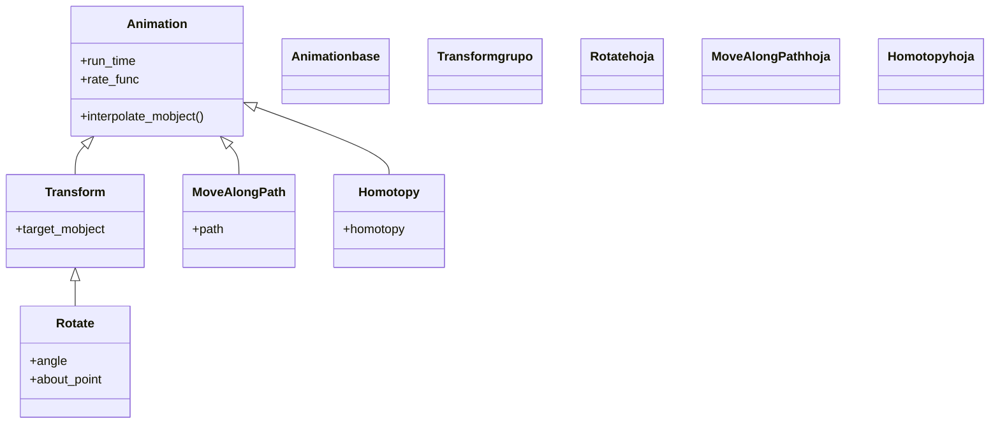

# movimiento — girar, recorrer y deformar mobjects

Esta carpeta reúne las animaciones que **mueven** un mobject en el tiempo sin convertirlo en otro objeto: lo hacen **girar** alrededor de un punto ([[Rotate]]), **recorrer** la traza de un camino ([[MoveAlongPath]]) o **deformar** punto a punto siguiendo una función ([[Homotopy]]). Es la familia del *desplazamiento* dentro del pilar de [[Manim/animaciones/index|animaciones]]: a diferencia de la transformación —donde una figura se *convierte* en otra—, aquí el objeto sigue siendo el mismo, solo cambia de orientación, posición o forma. Lo que las une es lo de siempre: todas heredan de [[Animation]], así que comparten `run_time`, `rate_func` y `lag_ratio`, y todas se reproducen con `self.play`. Una nota aparte: muchos movimientos sencillos (un `shift`, un `scale`, un `rotate` sobre el centro) ni siquiera necesitan una clase de estas, basta el atajo `.animate`; estas clases existen para cuando el movimiento necesita **control fino** —un pivote concreto, un camino arbitrario, una deformación matemática— que el atajo no da con comodidad.

## En accion

Una escena que combina las tres ideas de la carpeta: un cuadrado **gira** alrededor de su centro mientras un punto **recorre** un círculo y una línea se **deforma** en una onda. Las tres animaciones corren a la vez, todas con el mismo `self.play`.

```python
from manim import *

class MovimientoEnAccion(Scene):
    def construct(self):
        cuadro = Square(color=GREEN, fill_opacity=0.5).shift(LEFT * 4)

        camino = Circle(radius=1.2, color=GREY)
        punto = Dot(color=YELLOW)
        punto.move_to(camino.point_from_proportion(0))

        linea = Line(RIGHT * 2, RIGHT * 6, color=BLUE)
        def ondular(x, y, z, t):
            return (x, y + 0.5 * t * np.sin(3 * x), z)

        self.add(cuadro, camino, punto, linea)
        self.play(
            Rotate(cuadro, TAU),                                  # gira sobre su centro
            MoveAlongPath(punto, camino),                         # recorre el circulo
            Homotopy(ondular, linea),                             # se deforma en onda
            run_time=4,
            rate_func=linear,
        )
        self.wait()
```

```bash
manim -pql archivo.py MovimientoEnAccion      # -p reproduce, -ql = calidad baja (rapido)
```

## Herencia

Las tres clases descienden de [[Animation]], pero por dos caminos distintos: [[Rotate]] pasa por [[Transform]] (porque girar es interpolar hacia una copia ya rotada), mientras que [[MoveAlongPath]] y [[Homotopy]] cuelgan **directamente** de la base, sin morphing: recalculan la posición o la forma en cada fotograma.



## Clases que aporta

Las tres animaciones de la carpeta, con su padre directo y su uso.

| Clase | Hereda de | Para que |
|-------|-----------|----------|
| [[Rotate]] | `Transform` | girar un mobject un ángulo dado alrededor de un punto o eje |
| [[MoveAlongPath]] | `Animation` | mover un mobject siguiendo la traza de otro VMobject (una línea, un arco, una curva) |
| [[Homotopy]] | `Animation` | deformar un mobject punto a punto con una función `(x, y, z, t)` |

## Como elegir

Primero decides el **tipo de movimiento**; dentro del giro, además, eliges entre la clase y el atajo.

| Quiero… | Animación |
|---------|-----------|
| Girar un objeto un ángulo concreto | [[Rotate]] |
| Que un objeto orbite o pivote sobre un punto que no es su centro | [[Rotate]] con `about_point` |
| Que un objeto recorra una trayectoria (recta, curva, gráfica) | [[MoveAlongPath]] |
| Que un objeto siga moviéndose sin un ángulo final | [[Rotating]] (giro continuo) |
| Ondular, retorcer o deformar la forma con una ley matemática | [[Homotopy]] |
| Un simple desplazamiento o un giro sobre el centro | el atajo `.animate` (ver abajo) |

### Rotate clase vs `.animate.rotate` vs Rotating

Las tres giran, pero no son intercambiables:

| Forma | Cuándo usarla |
|-------|---------------|
| `Rotate(m, PI, about_point=...)` | giro de un **ángulo concreto** con control del pivote y el eje; la opción explícita y completa |
| `m.animate.rotate(PI)` | el **atajo** cómodo para un giro rápido; gira sobre el centro por defecto |
| [[Rotating]] | giro **continuo** sin un ángulo final fijo, pensado para `run_time` largos (una rueda que no para) |

## Patrones y recetas del grupo

Tres recetas habituales al mover objetos: orbitar, recorrer una función y un objeto que mira hacia donde avanza.

### Hacer orbitar un objeto con Rotate

El truco de la órbita: `Rotate` con `about_point` en el centro del objeto central convierte el giro en una traslación circular. La "luna" gira alrededor del "planeta", no sobre sí misma.

```python
from manim import *

class Orbitar(Scene):
    def construct(self):
        sol = Dot(ORIGIN, color=YELLOW).scale(3)
        planeta = Dot(color=BLUE).scale(1.5).shift(RIGHT * 2.5)

        self.add(sol, planeta)
        self.play(
            Rotate(planeta, TAU, about_point=ORIGIN),   # orbita una vuelta
            run_time=4,
            rate_func=linear,
        )
        self.wait()
```

```bash
manim -pql archivo.py Orbitar
```

### Recorrer la gráfica de una función

Un marcador que avanza por una curva: el camino es la gráfica que devuelve `axes.plot`, y `MoveAlongPath` lo lleva de un extremo al otro.

```python
from manim import *

class RecorrerGrafica(Scene):
    def construct(self):
        ejes = Axes(x_range=[-3, 3], y_range=[-1, 4], x_length=7, y_length=4)
        curva = ejes.plot(lambda x: 0.5 * x**2, color=BLUE)
        marcador = Dot(color=YELLOW).move_to(curva.point_from_proportion(0))

        self.play(Create(ejes), Create(curva))
        self.add(marcador)
        self.play(MoveAlongPath(marcador, curva), run_time=4, rate_func=linear)
        self.wait()
```

```bash
manim -pql archivo.py RecorrerGrafica
```

### Una flecha que sigue a un punto en movimiento

Combinando un `updater` con `MoveAlongPath`: un punto recorre un círculo y una flecha, en cada fotograma, se redibuja desde el centro hasta él (una aguja de radar). El `updater` reacciona al recorrido sin que tengamos que animar la flecha por separado.

```python
from manim import *

class AgujaDeRadar(Scene):
    def construct(self):
        camino = Circle(radius=2, color=GREY)
        punto = Dot(color=YELLOW).move_to(camino.point_from_proportion(0))

        # la flecha se redibuja del centro al punto en cada fotograma
        aguja = always_redraw(lambda: Arrow(ORIGIN, punto.get_center(), color=RED, buff=0))

        self.add(camino, punto, aguja)
        self.play(MoveAlongPath(punto, camino), run_time=4, rate_func=linear)
        self.wait()
```

```bash
manim -pql archivo.py AgujaDeRadar
```

## Notas relacionadas

- [[Animation]] — la clase base con `run_time`/`rate_func` que todas estas comparten
- [[Rotate]] — girar un mobject un ángulo dado
- [[MoveAlongPath]] — recorrer la traza de un camino
- [[Homotopy]] — deformar el mobject punto a punto con una función
- [[concepto_animate_syntax]] — el atajo `.animate` para los movimientos sencillos
- [[Manim/animaciones/transformacion/index|transformacion]] — la familia vecina: convertir una figura en otra
- [[Manim/animaciones/index|animaciones]] — el índice del pilar con el `classDiagram` completo
