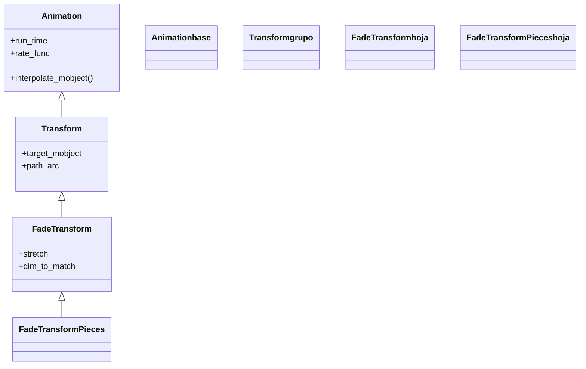

# FadeTransform — fundir un mobject en otro

`FadeTransform` **funde** un mobject en otro: mientras `mobject` se desvanece, `target_mobject` aparece, y a la vez se interpola su **posición y su escala** para que el cambio no sea un simple corte sino una transición fluida de uno a otro. Es la alternativa **suave** a [[Transform]] para cuando no quieres un *morphing* literal punto a punto (que puede verse forzado si las dos figuras son muy distintas), sino algo más parecido a un fundido encadenado con desplazamiento. Visualmente: A se atenúa y se encoge/mueve hacia donde está B, mientras B surge desde la posición de A; el ojo percibe que "uno se convierte en otro" sin la deformación geométrica del `Transform`. Existe también su variante por piezas, `FadeTransformPieces`, que aplica el fundido a cada submobject por separado. Como toda transformación, se crea y se pasa a `self.play`.

## Importacion

```python
from manim import FadeTransform
# o, como es habitual en Manim:
from manim import *
```

## Herencia

### La jerarquia

`FadeTransform` es una subclase de [[Transform]]: reutiliza su maquinaria de "ir de un estado a otro", pero en vez de interpolar los puntos uno a uno juega con la **opacidad** además de la posición y la escala. La cadena completa sube hasta [[Animation]].



### Que hereda

De [[Transform]] hereda el esqueleto de transformación entre dos objetos y el reemplazo en escena; de [[Animation]], los parámetros temporales. Lo propio de `FadeTransform` es **mezclar opacidad** en la transición (el fundido) en lugar de deformar la geometría.

| Capacidad | Origen |
|-----------|--------|
| Estructura "de A a B" y manejo del objetivo | [[Transform]] |
| `run_time`, `rate_func`, `lag_ratio` | [[Animation]] |
| Fundido (opacidad) + interpolación de posición/escala | `FadeTransform` |

## Constructor

```python
FadeTransform(
    mobject,             # A: el objeto que se desvanece
    target_mobject,      # B: el objeto que aparece
    stretch=True,        # estirar A para encajar el tamano de B (si False, mantiene proporcion)
    dim_to_match=1,      # dimension (0=ancho, 1=alto) que se usa para casar tamanos
    **kwargs,            # run_time, rate_func... (van a Transform / Animation)
) -> FadeTransform
```

### Parametros

| Parametro | Tipo | Defecto | Controla |
|-----------|------|---------|----------|
| `mobject` | `Mobject` | — | el objeto A que se **desvanece** durante la transición |
| `target_mobject` | `Mobject` | — | el objeto B que **aparece**; es el que queda en escena al terminar |
| `stretch` | `bool` | `True` | si `True`, estira A para que su tamaño encaje con el de B durante el fundido; si `False`, conserva la proporción |
| `dim_to_match` | `int` | `1` | qué dimensión se usa para casar tamaños cuando `stretch=False` (`0` = ancho, `1` = alto) |

#### stretch — encajar tamaños o conservar proporción

Con `stretch=True` (defecto), durante la transición A se deforma para ocupar el rectángulo de B, lo que da un fundido más "lleno". Con `stretch=False`, A se escala manteniendo su proporción y solo se casa la dimensión indicada por `dim_to_match`; útil cuando deformar A se vería raro (por ejemplo, un icono que no quieres achatar).

```python
self.play(FadeTransform(a, b, stretch=False, dim_to_match=0))  # casa por ancho, sin deformar
```

### Que construye

Devuelve una `Animation` inerte que, al reproducirse con [[Scene.play]], funde A en B (opacidad + posición + escala). Al terminar, **`target_mobject` (B) es el que queda en escena**, igual que en un [[ReplacementTransform]]: A ya se desvaneció.

## Ritmo y parametros comunes

Hereda `run_time` y `rate_func` de [[Animation]]. Un `run_time` ligeramente mayor realza el efecto de fundido.

```python
self.play(FadeTransform(a, b), run_time=1.5, rate_func=smooth)
```

## Ejemplo

### Version minima

Un cuadrado se funde en un círculo. A diferencia de [[Transform]], no hay deformación punto a punto: el cuadrado se atenúa mientras el círculo surge en su lugar.

```python
from manim import *

class FundidoMinimo(Scene):
    def construct(self):
        a = Square(color=BLUE, fill_opacity=0.6)
        b = Circle(color=GREEN, fill_opacity=0.6)
        self.play(Create(a))
        self.play(FadeTransform(a, b))   # a se desvanece, b aparece (queda b)
        self.wait()
```

```bash
manim -pql archivo.py FundidoMinimo      # -p reproduce, -ql = calidad baja (rapido)
```

### Version completa

Una transición entre dos imágenes conceptuales muy distintas (un texto y una figura), donde el morphing de [[Transform]] se vería forzado y el fundido queda limpio. Se compara además `stretch=True` y `stretch=False`.

```python
from manim import *

class FundidoCompleto(Scene):
    def construct(self):
        titulo = Text("Idea", color=YELLOW).scale(1.5)
        figura = Star(color=BLUE, fill_opacity=0.7).scale(1.5)

        self.play(Write(titulo))
        self.wait(0.5)
        # el texto se funde en la estrella sin deformarse de forma extrana
        self.play(FadeTransform(titulo, figura, stretch=False), run_time=2)
        self.wait(0.5)
        # y de vuelta a otro texto
        cierre = Text("Fin", color=GREEN).scale(1.5)
        self.play(FadeTransform(figura, cierre), run_time=1.5)
        self.wait()
```

```bash
manim -pqh archivo.py FundidoCompleto     # -qh = calidad alta para el render final
```

## Componerla

Como toda [[Animation]], encaja en un `self.play` con otras o dentro de [[AnimationGroup]]/[[LaggedStart]]. Es habitual fundir varios objetos a la vez.

```python
from manim import *

class FundidosSimultaneos(Scene):
    def construct(self):
        a1 = Text("A", color=BLUE).shift(LEFT * 2)
        a2 = Text("B", color=RED).shift(RIGHT * 2)
        self.add(a1, a2)
        self.play(
            FadeTransform(a1, Circle(color=BLUE).shift(LEFT * 2)),
            FadeTransform(a2, Square(color=RED).shift(RIGHT * 2)),
        )
        self.wait()
```

```bash
manim -pql archivo.py FundidosSimultaneos
```

## Errores comunes

| Error | Causa | Solución |
|-------|-------|----------|
| Animar `a` después no hace nada | `FadeTransform` deja `b` en escena, no `a` (como [[ReplacementTransform]]) | sigue con `b`; `a` ya se desvaneció |
| Esperabas un morphing geométrico de A a B | `FadeTransform` funde, no deforma punto a punto | si quieres el morphing, usa [[Transform]] |
| El objeto se achata de forma rara durante el fundido | `stretch=True` deformó A para encajar B | usa `stretch=False` (y ajusta `dim_to_match`) |
| Quieres el fundido pieza a pieza, no del bloque entero | `FadeTransform` funde el objeto como un todo | usa `FadeTransformPieces` |
| Aparece un duplicado | añadiste `b` con `self.add(b)` antes | no añadas el objetivo a mano |

## Notas relacionadas

- [[Transform]] — la clase padre; morphing punto a punto en vez de fundido
- [[ReplacementTransform]] — morfar dejando el objetivo en escena (igual que `FadeTransform` en cuanto a qué queda)
- [[TransformMatchingTex]] — para fórmulas: empareja sub-partes por su LaTeX
- [[TransformMatchingShapes]] — empareja sub-partes por su forma
- [[FadeIn]] — solo aparecer (sin objeto de partida que se funda)
- [[Manim/animaciones/transformacion/index | transformacion]] — el índice de la familia
- [[Scene.play]] — el método que la reproduce
