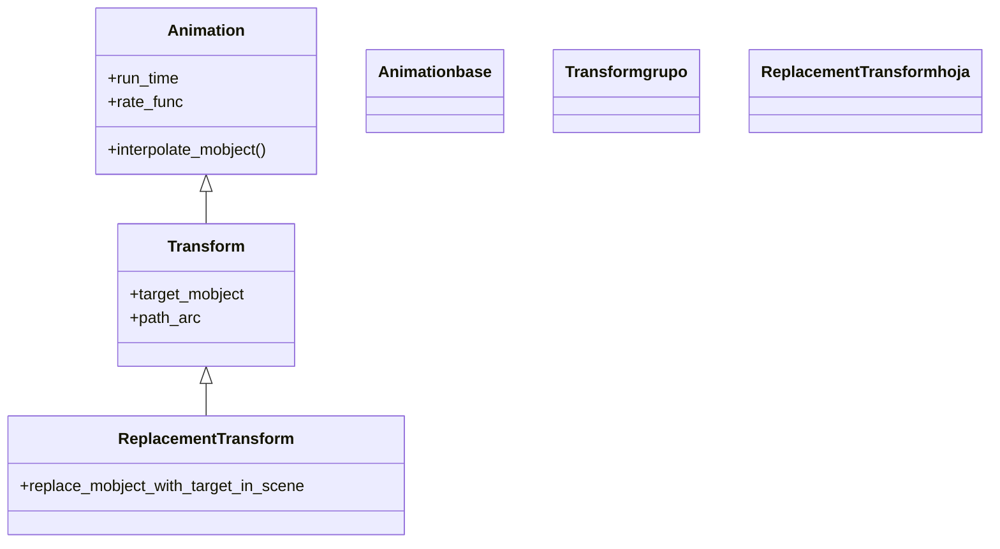

# ReplacementTransform — A pasa a SER B (B queda en escena)

`ReplacementTransform` morfa `mobject` en `target_mobject` igual que [[Transform]], pero con una diferencia decisiva en **qué objeto queda al final**: tras `ReplacementTransform(a, b)`, en escena queda **`b`** (la variable objetivo), no `a`. Es decir, A literalmente **pasa a ser** B: el morphing es idéntico al de `Transform`, pero el objeto que sigue vivo en la escena —el que podrás mover, colorear o transformar después— es `b`. Internamente no es más que `Transform(..., replace_mobject_with_target_in_scene=True)`. Es la transformación **habitual cuando luego vas a seguir manipulando el resultado**, precisamente porque te deja trabajando con la variable nueva (`b`) y no con la vieja disfrazada. Si esta distinción aún no te queda clara, su sección [[#Transform vs ReplacementTransform (la diferencia clave)]] la explica con detalle: es la causa número uno del error "el objeto que animo después no se mueve".

## Importacion

```python
from manim import ReplacementTransform
# o, como es habitual en Manim:
from manim import *
```

## Herencia

### La jerarquia

`ReplacementTransform` es una subclase directa de [[Transform]]; no añade lógica de interpolación nueva, solo **fija un parámetro** del padre (`replace_mobject_with_target_in_scene=True`). La cadena completa sube hasta [[Animation]].



### Que hereda

`ReplacementTransform` hereda **toda** la maquinaria de [[Transform]] (la interpolación, `path_arc`, `path_func`) y, de más arriba, los parámetros temporales de [[Animation]]. Lo único que cambia es el destino del objeto al terminar.

| Capacidad | Parámetro/método | Definido en |
|-----------|------------------|-------------|
| Interpolación entre dos estados | `interpolate_mobject(alpha)` | [[Transform]] |
| Camino curvo del morphing | `path_arc`, `path_func` | [[Transform]] |
| Duración y curva de velocidad | `run_time`, `rate_func` | [[Animation]] |
| Dejar el objetivo en escena | (fijado a `True`) | `ReplacementTransform` |

## Constructor

```python
ReplacementTransform(
    mobject,           # A: el objeto de partida (DESAPARECE de la escena al terminar)
    target_mobject,    # B: el objeto destino (es el que QUEDA en escena)
    **kwargs,          # path_arc, run_time, rate_func... (van a Transform / Animation)
) -> ReplacementTransform
```

### Parametros

| Parametro | Tipo | Defecto | Controla |
|-----------|------|---------|----------|
| `mobject` | `Mobject` | — | el objeto A de partida; al terminar **se retira** de la escena |
| `target_mobject` | `Mobject` | — | el objeto B destino; al terminar **es el que permanece** en escena |
| `**kwargs` | — | — | se reenvían a [[Transform]]/[[Animation]]: `path_arc`, `run_time`, `rate_func`... |

Fíjate en que aquí `target_mobject` **no** lleva defecto `None`: en `ReplacementTransform` siempre pasas los dos objetos, porque la gracia es sustituir uno por el otro.

### Que construye

Devuelve una `Animation` inerte que, al reproducirse con [[Scene.play]], morfa `mobject` en `target_mobject` y, al terminar, **quita `mobject` y deja `target_mobject`** en la escena. A partir de ese momento la variable viva es `target_mobject` (`b`): es la que está en escena y la que debes seguir animando.

## Transform vs ReplacementTransform (la diferencia clave)

Las dos producen **exactamente el mismo morphing** en pantalla; difieren solo en **qué objeto queda en escena** al terminar, y eso decide a cuál de las dos variables le seguirás hablando.

| | `Transform(a, b)` | `ReplacementTransform(a, b)` |
|--|-------------------|------------------------------|
| Lo que se ve durante la animación | A morfa hacia la forma de B | A morfa hacia la forma de B (idéntico) |
| Objeto que queda en escena | **`a`** (con apariencia de B) | **`b`** |
| Objeto que debes animar después | `a` | `b` |
| `b` se añade a la escena | nunca | sí, sustituye a `a` |
| Cuándo elegirla | morphings sueltos, encadenar sobre la misma variable | cuando luego manipularás el resultado como `b` |

> [!regla] La regla de oro: ¿con qué variable seguirás trabajando?
> Si después de transformar vas a **seguir manipulando el resultado con el nombre nuevo (`b`)**, usa `ReplacementTransform`: te deja `b` en escena. Si vas a seguir con el nombre viejo (`a`) o es un morphing de una sola vez, `Transform` vale. El error clásico —"transformo `a` en `b`, luego hago `self.play(b.animate.shift(UP))` y no se mueve nada"— pasa por usar `Transform` (que dejó `a` en escena, no `b`) cuando querías `ReplacementTransform`.

### El error "el objeto que animo despues no se mueve"

```python
from manim import *

class ErrorClasico(Scene):
    def construct(self):
        a = Square(color=BLUE)
        b = Circle(color=GREEN).shift(RIGHT * 2)
        self.add(a)

        # MAL: Transform deja 'a' en escena; 'b' nunca se anadio
        self.play(Transform(a, b))
        self.play(b.animate.shift(UP))     # no se ve nada: 'b' no esta en escena

        # BIEN: ReplacementTransform deja 'b' en escena
        # self.play(ReplacementTransform(a, b))
        # self.play(b.animate.shift(UP))   # ahora si: 'b' es el objeto vivo
        self.wait()
```

```bash
manim -pql archivo.py ErrorClasico
```

## Ritmo y parametros comunes

Idénticos a los de [[Transform]] (y, por encima, a los de [[Animation]]): `run_time`, `rate_func`, y el `path_arc`/`path_func` para curvar el recorrido.

```python
self.play(ReplacementTransform(a, b, path_arc=PI / 2), run_time=2)
```

## Ejemplo

### Version minima

A pasa a ser B; después seguimos animando **`b`** (que es lo que ahora está en escena).

```python
from manim import *

class ReemplazoMinimo(Scene):
    def construct(self):
        a = Square(color=BLUE)
        b = Circle(color=GREEN)
        self.play(Create(a))
        self.play(ReplacementTransform(a, b))   # a pasa a SER b
        self.play(b.animate.set_color(YELLOW))  # seguimos con b, que esta en escena
        self.wait()
```

```bash
manim -pql archivo.py ReemplazoMinimo      # -p reproduce, -ql = calidad baja (rapido)
```

### Version completa

Una secuencia de pasos donde cada resultado es la entrada del siguiente. Usar `ReplacementTransform` mantiene el código legible: en cada paso trabajamos con la variable que de verdad está en escena, sin disfraces.

```python
from manim import *

class SecuenciaDePasos(Scene):
    def construct(self):
        paso1 = MathTex("2x", "+", "4", "=", "10")
        paso2 = MathTex("2x", "=", "6")
        paso3 = MathTex("x", "=", "3")

        self.play(Write(paso1))
        self.wait(0.5)
        # cada paso pasa a SER el siguiente; la variable viva avanza
        self.play(ReplacementTransform(paso1, paso2))
        self.wait(0.5)
        self.play(ReplacementTransform(paso2, paso3))
        # paso3 es lo que esta en escena: podemos enmarcarlo
        self.play(Circumscribe(paso3, color=YELLOW))
        self.wait()
```

```bash
manim -pqh archivo.py SecuenciaDePasos     # -qh = calidad alta para el render final
```

## Componerla

Como toda [[Animation]], encaja en un `self.play` con otras o dentro de [[AnimationGroup]]/[[LaggedStart]]. Es muy común reemplazar varios objetos a la vez:

```python
from manim import *

class ReemplazosSimultaneos(Scene):
    def construct(self):
        a1 = Square(color=BLUE).shift(LEFT * 2)
        a2 = Square(color=RED).shift(RIGHT * 2)
        self.add(a1, a2)
        self.play(
            ReplacementTransform(a1, Circle(color=BLUE).shift(LEFT * 2)),
            ReplacementTransform(a2, Triangle(color=RED).shift(RIGHT * 2)),
        )
        self.wait()
```

```bash
manim -pql archivo.py ReemplazosSimultaneos
```

## Errores comunes

| Error | Causa | Solución |
|-------|-------|----------|
| Animar `b` después no mueve nada (usaste `Transform`) | `Transform` dejó `a` en escena, no `b` | usa `ReplacementTransform(a, b)` para que el objeto vivo sea `b` |
| Animar `a` después no mueve nada (usaste `ReplacementTransform`) | `ReplacementTransform` retiró `a`; el vivo es `b` | sigue con `b`; `a` ya no está en escena |
| Aparece un duplicado | añadiste `b` con `self.add(b)` antes de la transformación | no añadas el objetivo a mano; la animación lo coloca |
| `TypeError: missing argument target_mobject` | `ReplacementTransform` exige los **dos** objetos | pásalos ambos: `ReplacementTransform(a, b)` |
| Las partes no encajan y el morphing se ve raro | A y B tienen distinto número de submobjects | usa [[TransformMatchingTex]]/[[TransformMatchingShapes]] según el caso |

## Notas relacionadas

- [[Transform]] — la clase padre; igual morphing, pero deja `a` (no `b`) en escena
- [[FadeTransform]] — funde A en B en vez de morfar punto a punto
- [[TransformMatchingTex]] — para fórmulas troceadas: empareja sub-partes por su LaTeX
- [[TransformMatchingShapes]] — empareja sub-partes por su forma
- [[Manim/animaciones/transformacion/index | transformacion]] — el índice de la familia, con la tabla Transform vs ReplacementTransform
- [[Scene.play]] — el método que reproduce la transformación
