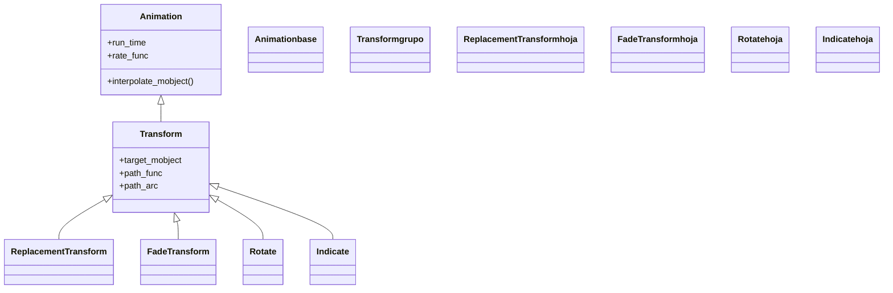

# Transform — morfar un mobject en la forma de otro

`Transform` es la animación que **morfa** un mobject para que adopte la forma de otro: interpola punto a punto entre la geometría, el color y la posición de `mobject` y las de `target_mobject`, de modo que el primero parece *convertirse* en el segundo. Es una de las animaciones más importantes de Manim, y también el **padre de toda una familia**: de ella heredan [[ReplacementTransform]], [[FadeTransform]], `Rotate`, `Indicate` y muchas más, porque "ir suavemente de un estado a otro" es el patrón que comparten. Hay una sutileza que define su comportamiento y que es la fuente número uno de confusión: tras `Transform(a, b)`, **lo que queda en escena es `a`** (con la apariencia de `b`); el objeto `b` nunca se añade a la escena. Si lo que quieres es que el resultado *sea* `b` para seguir manipulándolo, mira [[ReplacementTransform]]. Como toda animación, no se "reproduce" sola: se crea y se pasa a `self.play`.

## Importacion

```python
from manim import Transform
# o, como es habitual en Manim:
from manim import *
```

## Herencia

### La jerarquia

`Transform` cuelga directamente de [[Animation]]: es una de las ramas principales del árbol de animaciones y, a su vez, la raíz de una sub-familia muy poblada. La cadena completa hasta `Animation` es corta, pero hacia abajo se ramifica mucho.



### Que hereda

`Transform` define la lógica de interpolar entre dos estados (cómo se construye el mobject intermedio en cada `alpha`); **todo lo temporal lo hereda** de [[Animation]]. Por eso un `Transform` acepta `run_time`, `rate_func` y `lag_ratio` igual que cualquier otra animación.

| Capacidad | Parámetro/método | Definido en |
|-----------|------------------|-------------|
| Duración de la animación | `run_time` | [[Animation]] |
| Curva de velocidad | `rate_func` | [[Animation]] |
| Desfase entre submobjects | `lag_ratio` | [[Animation]] |
| Quitar el mobject al terminar | `remover` | [[Animation]] |
| Interpolación entre dos estados | `interpolate_mobject(alpha)` | `Transform` |

## Constructor

```python
Transform(
    mobject,                                       # el objeto que se morfa (y el que QUEDA en escena)
    target_mobject=None,                           # el objeto cuya forma se adopta
    path_func=None,                                # como viajan los puntos (recto por defecto)
    path_arc=0,                                    # angulo del arco si el camino es curvo
    path_arc_axis=OUT,                             # eje del arco (para 3D)
    replace_mobject_with_target_in_scene=False,    # si True, deja target en escena (-> ReplacementTransform)
    **kwargs,                                       # run_time, rate_func... (van a Animation)
) -> Transform
```

### Parametros

| Parametro | Tipo | Defecto | Controla |
|-----------|------|---------|----------|
| `mobject` | `Mobject` | — | el objeto que se anima; **es el que permanece en escena** con la apariencia final |
| `target_mobject` | `Mobject \| None` | `None` | el objeto cuya forma, color y posición adopta `mobject` |
| `path_func` | `Callable \| None` | `None` | la función que decide **cómo** viajan los puntos de un estado a otro (recto si es `None`) |
| `path_arc` | `float` | `0` | si es distinto de `0`, los puntos viajan por un **arco** de ese ángulo (en radianes) en vez de en línea recta |
| `replace_mobject_with_target_in_scene` | `bool` | `False` | si `True`, al terminar quita `mobject` y deja `target_mobject`; es justo lo que hace [[ReplacementTransform]] |

#### path_arc — morfar en arco en vez de en recta

Por defecto cada punto del mobject viaja en **línea recta** hasta su destino. `path_arc` curva ese recorrido: los puntos giran describiendo un arco del ángulo dado, lo que da una sensación de rotación durante el morphing (muy útil cuando A y B están en lados opuestos y no quieres que se "atraviesen").

```python
self.play(Transform(a, b, path_arc=PI / 2))   # los puntos viajan curvando 90 grados
```

#### path_func — el control fino del recorrido

`path_func` es la versión general de `path_arc`: una función que recibe los puntos de inicio y fin y devuelve cómo interpolarlos. Manim trae varias (`clockwise_path()`, `counterclockwise_path()`, `straight_path()`). Para la mayoría de los casos basta con `path_arc`; `path_func` es para recorridos a medida.

```python
from manim import clockwise_path
self.play(Transform(a, b, path_func=clockwise_path()))
```

### Que construye

Devuelve un objeto `Transform` **inerte** (una instrucción), como toda [[Animation]]: no morfa nada hasta que se pasa a [[Scene.play]]. Internamente, al empezar guarda una copia del estado de `mobject` y, en cada fotograma, reconstruye `mobject` interpolando entre ese estado inicial y el de `target_mobject` según el `alpha`. Al terminar, `mobject` tiene exactamente la forma de `target_mobject`, pero **sigue siendo el objeto `mobject`** (la variable original).

## Ritmo y parametros comunes

Como subclase de [[Animation]], `Transform` acepta los parámetros temporales comunes. Los dos que más se tocan al morfar:

| Parametro | Defecto | Efecto en un Transform |
|-----------|---------|------------------------|
| `run_time` | `1.0` | cuánto dura el morphing; súbelo (`run_time=3`) para un cambio lento y legible |
| `rate_func` | `smooth` | la curva de velocidad; `smooth` arranca y frena suave, ideal para que el ojo siga el cambio |

```python
self.play(Transform(a, b), run_time=2, rate_func=smooth)   # morphing lento y suave
```

## Ejemplo

### Version minima

Un cuadrado que se morfa en un círculo. Tras la animación, la variable `cuadro` sigue existiendo (ahora con forma de círculo); el `circulo` que pasamos como objetivo nunca se añade.

```python
from manim import *

class MorfarMinimo(Scene):
    def construct(self):
        cuadro = Square(color=BLUE)
        circulo = Circle(color=GREEN)
        self.play(Create(cuadro))
        self.play(Transform(cuadro, circulo))   # cuadro adopta la forma de circulo
        self.wait()
```

```bash
manim -pql archivo.py MorfarMinimo      # -p reproduce, -ql = calidad baja (rapido)
```

### Version completa

Una cadena de transformaciones sobre el **mismo** objeto: un cuadrado se vuelve círculo, luego triángulo, luego una estrella, cada paso con su ritmo. Como siempre animamos `forma` (la variable original), la cadena funciona sin sobresaltos: el objeto que queda en escena tras cada paso es siempre `forma`.

```python
from manim import *

class CadenaDeFormas(Scene):
    def construct(self):
        forma = Square(color=BLUE, fill_opacity=0.5)
        self.play(Create(forma))

        # cada Transform reescribe la forma de la MISMA variable
        self.play(Transform(forma, Circle(color=GREEN, fill_opacity=0.5)))
        self.play(Transform(forma, Triangle(color=YELLOW, fill_opacity=0.5)))
        self.play(
            Transform(forma, Star(color=RED, fill_opacity=0.5)),
            path_arc=PI,            # el ultimo morphing viaja en arco
            run_time=2,
        )
        self.wait()
```

```bash
manim -pqh archivo.py CadenaDeFormas     # -qh = calidad alta para el render final
```

### Variaciones

`Transform` también acepta el **objetivo en su sitio**: si mueves o escalas una copia, el morphing incluye ese desplazamiento.

```python
from manim import *

class MorfarYMover(Scene):
    def construct(self):
        a = Square(color=BLUE)
        # el objetivo es un circulo desplazado y agrandado: el morphing hace las tres cosas
        objetivo = Circle(color=GREEN).scale(1.5).shift(RIGHT * 3)
        self.add(a)
        self.play(Transform(a, objetivo), run_time=2)   # morfa, mueve y agranda a la vez
        self.wait()
```

```bash
manim -pql archivo.py MorfarYMover
```

## Componerla

Un `Transform` es una [[Animation]] normal: puede ir junto a otras en un mismo `self.play` (se reproducen a la vez) o dentro de un [[AnimationGroup]]/[[LaggedStart]] para encadenarlas o escalonarlas.

```python
from manim import *

class TransformEnGrupo(Scene):
    def construct(self):
        a = Square(color=BLUE).shift(LEFT * 2)
        b = Triangle(color=GREEN).shift(RIGHT * 2)
        self.add(a, b)
        # dos morphings simultaneos en el mismo play
        self.play(
            Transform(a, Circle(color=BLUE).shift(LEFT * 2)),
            Transform(b, Star(color=GREEN).shift(RIGHT * 2)),
        )
        self.wait()
```

```bash
manim -pql archivo.py TransformEnGrupo
```

## Errores comunes

| Error | Causa | Solución |
|-------|-------|----------|
| Tras `Transform(a, b)`, animar `b` después no hace nada visible | `b` nunca se añadió a la escena; el que está en escena es `a` (con forma de `b`) | sigue manipulando `a`, o usa [[ReplacementTransform]] para que el que quede sea `b` |
| Aparece un duplicado del objeto | añadiste `b` con `self.add(b)` además de transformar | no añadas el objetivo; `Transform` ya gestiona qué se ve |
| El morphing "se atraviesa" de forma fea | el camino recto pasa por encima de otros objetos | usa `path_arc=PI/2` (o `path_func`) para curvar el recorrido |
| El número de partes no coincide y el morphing se ve raro | A y B tienen distinto número de submobjects | empareja las partes a mano, o usa [[TransformMatchingShapes]]/[[TransformMatchingTex]] |
| El objeto "salta" al inicio de la animación | esperabas que `b` se moviera, pero `b` no es lo que se anima | recuerda: se anima `a`; coloca el objetivo donde quieras el resultado |

## Notas relacionadas

- [[Animation]] — la clase base; de aquí salen `run_time`, `rate_func` y el ciclo de vida
- [[ReplacementTransform]] — la variante que deja el objetivo en escena (A pasa a SER B)
- [[FadeTransform]] — funde A en B en vez de morfar punto a punto
- [[TransformMatchingTex]] — para fórmulas: empareja sub-partes por su LaTeX
- [[TransformMatchingShapes]] — empareja sub-partes por su forma (texto, figuras)
- [[Manim/animaciones/transformacion/index | transformacion]] — el índice de la familia
- [[Scene.play]] — el método que reproduce la transformación
