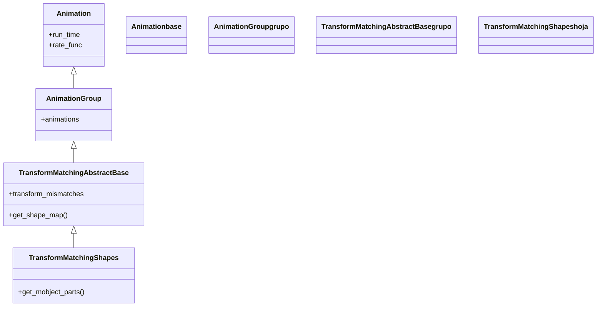

# TransformMatchingShapes — emparejar sub-partes por su forma

`TransformMatchingShapes` transforma un mobject en otro **emparejando sus sub-partes por la forma de los submobjects**, no por ningún texto o LaTeX: compara la geometría de cada pieza y mueve las que se parecen de un objeto al otro, hace aparecer las nuevas y desaparecer las que sobran. Es la hermana de [[TransformMatchingTex]] para todo lo que **no** es una fórmula LaTeX troceada: un [[Text]] (que no tiene troceo semántico por argumentos), dos figuras, un logo que se reorganiza. Donde `TransformMatchingTex` pregunta "¿qué partes tienen el mismo LaTeX?", esta pregunta "¿qué submobjects tienen la misma forma?", y empareja los glifos o piezas que geométricamente coinciden. Es más general (funciona con cualquier Mobject) pero menos preciso: el emparejamiento por forma puede confundir letras parecidas. Para fórmulas con control fino del despeje, prefiere [[TransformMatchingTex]].

## Importacion

```python
from manim import TransformMatchingShapes
# o, como es habitual en Manim:
from manim import *
```

## Herencia

### La jerarquia

Comparte base con [[TransformMatchingTex]]: ambas cuelgan de `TransformMatchingAbstractBase`, que es un `AnimationGroup` (el resultado es un conjunto coordinado de transformaciones, apariciones y desapariciones). La cadena completa sube hasta [[Animation]]. Lo único que distingue a esta clase de su hermana es **el criterio de emparejamiento**: por forma en lugar de por LaTeX.



### Que hereda

De `TransformMatchingAbstractBase` hereda el algoritmo de emparejar-mover-aparecer-desaparecer; de [[AnimationGroup]], la coordinación de varias animaciones; de [[Animation]], los parámetros temporales. Define **cómo agrupa** las piezas a emparejar (por forma geométrica) y cómo decide que dos formas "son la misma".

| Capacidad | Origen |
|-----------|--------|
| Algoritmo emparejar / aparecer / desaparecer | `TransformMatchingAbstractBase` |
| Coordinar varias animaciones a la vez | [[AnimationGroup]] |
| `run_time`, `rate_func`, `lag_ratio` | [[Animation]] |
| Identificar partes por su **forma** | `TransformMatchingShapes` |

## Constructor

```python
TransformMatchingShapes(
    mobject,                          # el objeto de partida
    target_mobject,                   # el objeto destino
    transform_mismatches=False,       # morfar las partes sin pareja en vez de fundirlas
    fade_transform_mismatches=False,  # fundir-transformando las partes sin pareja
    **kwargs,                         # run_time, rate_func... (van a Animation)
) -> TransformMatchingShapes
```

### Parametros

| Parametro | Tipo | Defecto | Controla |
|-----------|------|---------|----------|
| `mobject` | `Mobject` | — | el objeto de partida; sus submobjects son lo que se empareja por forma |
| `target_mobject` | `Mobject` | — | el objeto destino |
| `transform_mismatches` | `bool` | `False` | si `True`, las partes **sin** pareja se **morfan** entre sí en vez de aparecer/desaparecer |
| `fade_transform_mismatches` | `bool` | `False` | si `True`, las partes sin pareja se funden transformándose (mezcla de fundido y morphing) |

#### fade_transform_mismatches — suavizar lo que no empareja

Por defecto, las piezas sin pareja entran con un `FadeIn` y salen con un `FadeOut` (aparecen/desaparecen en su sitio). Con `fade_transform_mismatches=True`, en cambio, se funden **transformándose** unas en otras (las sobrantes hacia las nuevas), lo que evita el efecto de "parpadeo" cuando hay muchas piezas que no casan.

```python
self.play(TransformMatchingShapes(a, b, fade_transform_mismatches=True))
```

### Que construye

Devuelve un [[AnimationGroup]] inerte que, al reproducirse, mueve las piezas emparejadas por forma, hace aparecer las nuevas y desaparecer las sobrantes, todo coordinado. No necesita que los objetos estén troceados en argumentos: trabaja directamente sobre el árbol de submobjects de cada Mobject.

## Ritmo y parametros comunes

Hereda `run_time` y `rate_func` de [[Animation]]; con muchas piezas, un `run_time` mayor ayuda a leer el cambio.

```python
self.play(TransformMatchingShapes(a, b), run_time=2)
```

## Ejemplo

### Version minima

Un [[Text]] se reorganiza en otro: las letras comunes ("a", "t"...) viajan de una palabra a la otra, el resto aparece o desaparece. Con `Text` no hay troceo por argumentos, así que `TransformMatchingShapes` es la opción natural.

```python
from manim import *

class AnagramaMinimo(Scene):
    def construct(self):
        a = Text("manim")
        b = Text("animar")
        self.play(Write(a))
        self.wait(0.5)
        # empareja por forma: las letras comunes se mueven, el resto aparece/desaparece
        self.play(TransformMatchingShapes(a, b))
        self.wait()
```

```bash
manim -pql archivo.py AnagramaMinimo      # -p reproduce, -ql = calidad baja (rapido)
```

### Version completa

Una figura compuesta se reorganiza en otra: un grupo de puntos se transforma en una palabra. Las formas que casan viajan; con `transform_mismatches=True` las que no casan se morfan en vez de parpadear.

```python
from manim import *

class FormasCompleto(Scene):
    def construct(self):
        # un grupo de circulos dispuestos en fila
        puntos = VGroup(*[Dot(color=BLUE) for _ in range(5)]).arrange(RIGHT, buff=0.5)
        palabra = Text("hola", color=GREEN).scale(2)

        self.play(Create(puntos))
        self.wait(0.5)
        self.play(
            TransformMatchingShapes(puntos, palabra, transform_mismatches=True),
            run_time=2,
        )
        self.wait()
```

```bash
manim -pqh archivo.py FormasCompleto     # -qh = calidad alta para el render final
```

## Componerla

El resultado es un [[AnimationGroup]], que normalmente se reproduce solo, pero puede ir junto a otras animaciones en el mismo `self.play`.

```python
from manim import *

class ConFondo(Scene):
    def construct(self):
        a = Text("antes")
        b = Text("despues")
        fondo = Rectangle(width=6, height=2, color=GREY, fill_opacity=0.2)
        self.add(fondo)
        self.play(Write(a))
        self.play(
            TransformMatchingShapes(a, b),
            fondo.animate.set_color(BLUE),   # el fondo cambia a la vez
        )
        self.wait()
```

```bash
manim -pql archivo.py ConFondo
```

## Errores comunes

| Error | Causa | Solución |
|-------|-------|----------|
| Letras parecidas se emparejan mal (una "o" salta donde no toca) | el criterio de forma confunde glifos similares | si es LaTeX, usa [[TransformMatchingTex]] (empareja por contenido, no por forma) |
| Querías control de despeje pieza a pieza | `TransformMatchingShapes` no entiende de LaTeX | usa [[TransformMatchingTex]] con `key_map` |
| Las partes sin pareja "parpadean" feo | aparecen/desaparecen en su sitio por defecto | usa `fade_transform_mismatches=True` o `transform_mismatches=True` |
| No empareja nada y todo se funde | los objetos no comparten ninguna forma reconocible | revisa que de verdad haya piezas similares; quizá un [[Transform]] simple basta |
| Va muy rápido con muchas piezas | `run_time` por defecto | súbelo (`run_time=2`) |

## Notas relacionadas

- [[TransformMatchingTex]] — la hermana que empareja por **LaTeX**; mejor para fórmulas troceadas
- [[Text]] — el texto sin LaTeX que esta animación reorganiza por forma
- [[Transform]] — la transformación punto a punto, sin emparejar partes
- [[ReplacementTransform]] — morfar dejando el objetivo en escena
- [[AnimationGroup]] — el contenedor que esta animación produce por dentro
- [[Manim/animaciones/transformacion/index | transformacion]] — el índice de la familia
- [[Scene.play]] — el método que la reproduce
