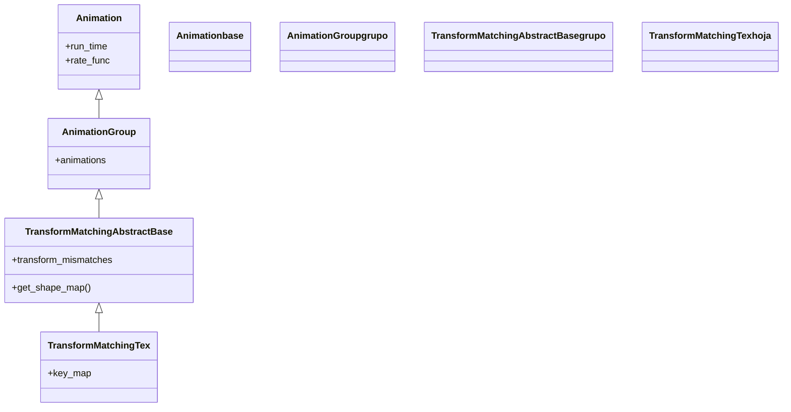

# TransformMatchingTex — emparejar sub-partes de dos formulas por su LaTeX

`TransformMatchingTex` transforma una fórmula en otra **emparejando sus sub-partes por su cadena LaTeX**: las partes cuyo LaTeX coincide en ambas fórmulas se **mueven** suavemente de una posición a la otra, las que solo están en la nueva **aparecen**, y las que sobran de la vieja **desaparecen**. Es la animación del "paso de despeje" por excelencia: cuando `a + b = c` se convierte en `a = c - b`, las `a`, `b`, `c` y el `=` no se redibujan desde cero, sino que **viajan** a su nuevo sitio, dejando clarísimo qué término se movió. Para que funcione necesita que las dos fórmulas estén **troceadas** (`MathTex("a", "+", "b")`, no `MathTex("a+b")`), porque el emparejamiento opera sobre las sub-partes de cada [[MathTex]] (la división en `formula[0]`, `formula[1]`... que documenta esa nota). Si tus objetos no son fórmulas LaTeX (texto plano, figuras), su hermana [[TransformMatchingShapes]] hace lo mismo emparejando por forma.

## Importacion

```python
from manim import TransformMatchingTex
# o, como es habitual en Manim:
from manim import *
```

## Herencia

### La jerarquia

`TransformMatchingTex` cuelga de `TransformMatchingAbstractBase`, la base abstracta que define el algoritmo de emparejar-mover-aparecer-desaparecer; esa base es a su vez un `AnimationGroup` (porque el resultado es **un conjunto** de animaciones coordinadas: varios `ReplacementTransform`, `FadeIn` y `FadeOut` a la vez). La cadena completa sube hasta [[Animation]].



### Que hereda

De `TransformMatchingAbstractBase` hereda el **algoritmo** de emparejamiento (qué hacer con las partes que coinciden y con las que no); de [[AnimationGroup]], la capacidad de reproducir varias animaciones coordinadas; de [[Animation]], los parámetros temporales. Lo único que `TransformMatchingTex` define es **cómo identifica** cada sub-parte: por su cadena LaTeX.

| Capacidad | Origen |
|-----------|--------|
| Algoritmo emparejar / aparecer / desaparecer | `TransformMatchingAbstractBase` |
| Coordinar varias animaciones a la vez | [[AnimationGroup]] |
| `run_time`, `rate_func`, `lag_ratio` | [[Animation]] |
| Identificar partes por su **LaTeX** | `TransformMatchingTex` |

## Constructor

```python
TransformMatchingTex(
    mobject,                          # la formula de partida (un MathTex troceado)
    target_mobject,                   # la formula destino (otro MathTex troceado)
    transform_mismatches=False,       # morfar las partes sin pareja en vez de fundirlas
    fade_transform_mismatches=False,  # fundir-transformando las partes sin pareja
    key_map=None,                     # emparejar a mano partes con LaTeX distinto
    **kwargs,                         # run_time, rate_func... (van a Animation)
) -> TransformMatchingTex
```

### Parametros

| Parametro | Tipo | Defecto | Controla |
|-----------|------|---------|----------|
| `mobject` | `MathTex` (troceado) | — | la fórmula de partida; sus sub-partes son lo que se empareja |
| `target_mobject` | `MathTex` (troceado) | — | la fórmula destino |
| `transform_mismatches` | `bool` | `False` | si `True`, las partes **sin** pareja se **morfan** entre sí (en vez de aparecer/desaparecer) |
| `fade_transform_mismatches` | `bool` | `False` | si `True`, las partes sin pareja se funden transformándose (mezcla de fundido y morphing) |
| `key_map` | `dict \| None` | `None` | un mapa `{tex_viejo: tex_nuevo}` para **emparejar a mano** partes cuyo LaTeX difiere pero quieres que se muevan una a la otra |

#### key_map — emparejar partes con distinto LaTeX

Por defecto solo se emparejan partes con el **mismo** LaTeX. Si quieres que, por ejemplo, una `x` se transforme en una `y` (LaTeX distinto), díselo con `key_map`:

```python
# que la parte "x" de la formula vieja viaje hacia la parte "y" de la nueva
self.play(TransformMatchingTex(antes, despues, key_map={"x": "y"}))
```

### Que construye

Devuelve un [[AnimationGroup]] (inerte hasta `self.play`) compuesto, por dentro, de un `ReplacementTransform` por cada par de partes que coinciden, un `FadeIn` por cada parte nueva y un `FadeOut` por cada parte que sobra. Al reproducirse, todo ocurre a la vez y de forma coordinada, dando la sensación de que la fórmula "se reorganiza".

## Ritmo y parametros comunes

Hereda `run_time` y `rate_func` de [[Animation]]. Como suele haber varias partes moviéndose, un `run_time` algo mayor (`1.5`–`2`) ayuda a seguir el cambio.

```python
self.play(TransformMatchingTex(antes, despues), run_time=2)
```

## Ejemplo

### Version minima

Un despeje: `a + b = c` se convierte en `a = c - b`. La `a`, la `b`, la `c` y el `=` coinciden en ambas y se **mueven**; el `+` desaparece y el `-` aparece. Ambas fórmulas van **troceadas** en argumentos.

```python
from manim import *

class DespejeMinimo(Scene):
    def construct(self):
        antes = MathTex("a", "+", "b", "=", "c")
        despues = MathTex("a", "=", "c", "-", "b")
        self.play(Write(antes))
        self.wait(0.5)
        # empareja a, b, c, = por su LaTeX y solo mueve lo que cambia de sitio
        self.play(TransformMatchingTex(antes, despues))
        self.wait()
```

```bash
manim -pql archivo.py DespejeMinimo      # -p reproduce, -ql = calidad baja (rapido)
```

### Version completa

Una factorización donde varias partes se reordenan, alguna desaparece y otra nueva entra; con `transform_mismatches=True` para que las partes sin pareja se morfen en vez de aparecer/desaparecer de golpe, y un `key_map` para forzar un emparejamiento concreto.

```python
from manim import *

class FactorizarCompleto(Scene):
    def construct(self):
        antes = MathTex("x^2", "+", "2", "x", "+", "1")
        despues = MathTex("(", "x", "+", "1", ")^2")

        self.play(Write(antes))
        self.wait(0.5)
        self.play(
            TransformMatchingTex(
                antes,
                despues,
                transform_mismatches=True,     # las partes sin pareja se morfan
                key_map={"x^2": "x"},          # x^2 viaja hacia la x del cuadrado
            ),
            run_time=2,
        )
        self.wait()
```

```bash
manim -pqh archivo.py FactorizarCompleto     # -qh = calidad alta para el render final
```

## Componerla

El resultado **ya es** un [[AnimationGroup]], así que normalmente se reproduce solo. Puede combinarse con otras animaciones en el mismo `self.play` (por ejemplo, mover un rótulo a la vez que la fórmula se reorganiza).

```python
from manim import *

class ConRotulo(Scene):
    def construct(self):
        antes = MathTex("a", "+", "b")
        despues = MathTex("b", "+", "a")
        rotulo = Text("conmutativa", font_size=24).to_edge(DOWN)
        self.play(Write(antes))
        self.play(
            TransformMatchingTex(antes, despues),
            FadeIn(rotulo, shift=UP),    # el rotulo entra a la vez
        )
        self.wait()
```

```bash
manim -pql archivo.py ConRotulo
```

## Errores comunes

| Error | Causa | Solución |
|-------|-------|----------|
| Toda la fórmula se funde y reaparece en vez de mover partes | las fórmulas no están troceadas (`MathTex("a+b")` es una sola parte) | trocéalas: `MathTex("a", "+", "b")`, o usa `substrings_to_isolate` |
| Partes que deberían moverse aparecen/desaparecen | su LaTeX no es idéntico en ambas fórmulas | usa `key_map={viejo: nuevo}` para emparejarlas a mano |
| No sabes por qué se emparejó mal | no ves los índices/LaTeX de cada parte | usa `index_labels(formula)` de [[MathTex]] para inspeccionar el troceo |
| Esperabas emparejar por forma, no por texto | tus objetos son [[Text]] o figuras, no LaTeX | usa [[TransformMatchingShapes]] |
| El cambio es tan rápido que no se sigue | `run_time` por defecto (`1`) con muchas partes | súbelo a `run_time=2` o más |

## Notas relacionadas

- [[MathTex]] — la fórmula troceada en sub-partes que esta animación empareja (`formula[0]`...)
- [[TransformMatchingShapes]] — la hermana que empareja por **forma** (texto, figuras sin LaTeX)
- [[Transform]] — la transformación punto a punto, sin emparejar partes
- [[ReplacementTransform]] — morfar dejando el objetivo en escena
- [[AnimationGroup]] — el contenedor que esta animación produce por dentro
- [[Manim/animaciones/transformacion/index | transformacion]] — el índice de la familia
- [[Scene.play]] — el método que la reproduce
