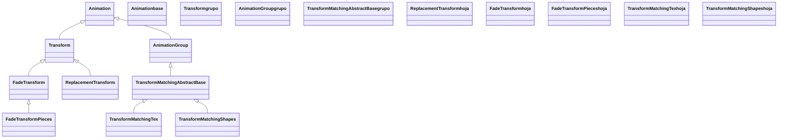

# transformacion — convertir un mobject en otro

Esta carpeta reúne las animaciones que hacen que un Mobject **se convierta en otro**: el cuadrado que se vuelve círculo, la fórmula que se despeja paso a paso, el texto que se reorganiza en una figura. Es una de las seis familias de [[Manim/animaciones/index|animaciones]] y se organiza alrededor de una clase central, [[Transform]], que define el "ir suavemente de un estado a otro" y de la que **heredan casi todas las demás** ([[ReplacementTransform]], [[FadeTransform]] y, por otra rama, las dos `TransformMatching`). Lo que de verdad hay que dominar de este grupo no es tanto cada clase como **dos decisiones**: (1) tras la animación, *¿qué objeto queda en escena, el viejo o el nuevo?* —ahí se separan `Transform` y `ReplacementTransform`—, y (2) *¿transformo el objeto como un bloque o emparejando sus partes?* —ahí entran los `TransformMatching`—. Acierta esas dos y el resto es ritmo (`run_time`, `rate_func`, `path_arc`).

## En accion

Una fórmula que **evoluciona** en tres pasos combinando varias clases del grupo: primero se reorganiza emparejando sus partes ([[TransformMatchingTex]]), luego pasa a ser otra dejando el resultado en escena ([[ReplacementTransform]]), y por último se funde en una conclusión ([[FadeTransform]]). Tres maneras distintas de "convertir A en B" en la misma escena.

```python
from manim import *

class FormulaQueEvoluciona(Scene):
    def construct(self):
        paso1 = MathTex("a", "+", "b", "=", "c")
        paso2 = MathTex("a", "=", "c", "-", "b")
        paso3 = MathTex("x", "=", "3")
        cierre = Text("listo", color=GREEN).scale(1.5)

        self.play(Write(paso1))
        self.wait(0.5)
        # 1. emparejar partes por su LaTeX: lo comun se mueve
        self.play(TransformMatchingTex(paso1, paso2))
        self.wait(0.5)
        # 2. A pasa a SER B: queda paso3 en escena
        self.play(ReplacementTransform(paso2, paso3))
        self.wait(0.5)
        # 3. fundir el resultado en una conclusion
        self.play(FadeTransform(paso3, cierre))
        self.wait()
```

```bash
manim -pql archivo.py FormulaQueEvoluciona      # -p reproduce, -ql = calidad baja (rapido)
```

## Herencia

Toda la familia desciende de [[Animation]]. Hay **dos ramas**: la de [[Transform]] (morphing entre dos estados; de él bajan `ReplacementTransform` y `FadeTransform`) y la de `TransformMatchingAbstractBase` —que es un `AnimationGroup`— de la que bajan las dos `TransformMatching` (emparejan sub-partes y producen un grupo coordinado de animaciones).



## Clases que aporta

Las cinco transformaciones documentadas, con su padre directo y su uso.

| Clase | Hereda de | Para que |
|-------|-----------|----------|
| [[Transform]] | `Animation` | morfar A en la forma de B; **queda A** en escena. El padre de la familia |
| [[ReplacementTransform]] | `Transform` | A pasa a SER B; **queda B** en escena. La habitual si seguirás manipulando el resultado |
| [[FadeTransform]] | `Transform` | fundir A en B (uno se desvanece, el otro aparece); alternativa suave al morphing |
| [[TransformMatchingTex]] | `TransformMatchingAbstractBase` | despejar fórmulas: empareja sub-partes de dos [[MathTex]] por su LaTeX |
| [[TransformMatchingShapes]] | `TransformMatchingAbstractBase` | emparejar por **forma** (texto, figuras sin troceo LaTeX) |

## Como elegir

Dos preguntas resuelven casi todo. Primero, **¿qué objeto quieres que quede en escena?** Segundo, **¿transformas el bloque entero o emparejas sus partes?**

### Transform vs ReplacementTransform: quién queda en escena

Las dos pintan el **mismo** morphing; difieren en qué variable sigue viva al terminar. Es la decisión más importante del grupo y la causa número uno de bugs.

| | `Transform(a, b)` | `ReplacementTransform(a, b)` |
|--|-------------------|------------------------------|
| Lo que se ve | A morfa hacia B | A morfa hacia B (idéntico) |
| Queda en escena | **`a`** (con forma de B) | **`b`** |
| A quién animas después | `a` | `b` |
| Cuándo | morphing suelto, encadenar sobre la misma variable | cuando seguirás manipulando el resultado como `b` |

> [!regla] Si después usarás el nombre nuevo, `ReplacementTransform`
> El bug clásico es "transformo `a` en `b`, luego `self.play(b.animate.shift(UP))` y no se mueve nada": pasó porque usaste `Transform` (deja `a` en escena), cuando para seguir con `b` necesitabas `ReplacementTransform`. [[FadeTransform]] también deja `b`.

### Bloque entero vs por partes: cuándo los TransformMatching

| Quiero… | Uso |
|---------|-----|
| Morfar una figura entera en otra | `Transform` / `ReplacementTransform` |
| Un fundido suave en vez de deformar | `FadeTransform` |
| Despejar una **fórmula** moviendo sus términos | `TransformMatchingTex` (empareja por LaTeX; exige [[MathTex]] troceado) |
| Reorganizar un **texto** o figuras sin LaTeX | `TransformMatchingShapes` (empareja por forma) |

## Patrones y recetas del grupo

Tres recetas que se repiten al transformar objetos: la cadena sobre una misma variable, el despeje de fórmulas y el fundido entre cosas dispares.

### Encadenar morphings sobre la misma variable

Con [[Transform]], como el objeto que queda es siempre el original, puedes encadenar cambios sobre la **misma** variable sin preocuparte de cuál está en escena.

```python
from manim import *

class Encadenar(Scene):
    def construct(self):
        forma = Square(color=BLUE, fill_opacity=0.5)
        self.play(Create(forma))
        self.play(Transform(forma, Circle(color=GREEN, fill_opacity=0.5)))
        self.play(Transform(forma, Triangle(color=YELLOW, fill_opacity=0.5)))
        self.wait()
```

```bash
manim -pql archivo.py Encadenar
```

### Despejar una fórmula paso a paso

Para que los términos **viajen** a su nuevo sitio en vez de redibujarse, trocea las fórmulas y usa [[TransformMatchingTex]]: empareja las partes con el mismo LaTeX.

```python
from manim import *

class Despejar(Scene):
    def construct(self):
        antes = MathTex("2", "x", "=", "6")
        despues = MathTex("x", "=", "3")
        self.play(Write(antes))
        self.wait(0.5)
        self.play(TransformMatchingTex(antes, despues))   # x y = se mueven
        self.wait()
```

```bash
manim -pql archivo.py Despejar
```

### Fundir entre dos cosas muy distintas

Cuando A y B no se parecen en nada (un texto y una figura), el morphing de `Transform` se ve forzado; [[FadeTransform]] da una transición limpia.

```python
from manim import *

class Fundir(Scene):
    def construct(self):
        idea = Text("idea", color=YELLOW).scale(1.5)
        figura = Star(color=BLUE, fill_opacity=0.7).scale(1.5)
        self.play(Write(idea))
        self.play(FadeTransform(idea, figura), run_time=2)   # queda la figura
        self.wait()
```

```bash
manim -pql archivo.py Fundir
```

## Notas relacionadas

- [[Animation]] — la clase base de la que cuelga toda la familia; aporta `run_time` y `rate_func`
- [[Transform]] — el padre del grupo y la transformación punto a punto
- [[ReplacementTransform]] — la variante que deja el objetivo en escena
- [[FadeTransform]] — fundir A en B en vez de morfar
- [[TransformMatchingTex]] — emparejar fórmulas por su LaTeX
- [[TransformMatchingShapes]] — emparejar por forma
- [[MathTex]] — la fórmula troceada que habilita los `TransformMatching`
- [[Manim/animaciones/index | animaciones]] — el pilar con las seis familias
- [[Manim/index | Manim]] — el índice raíz con el `classDiagram` global
