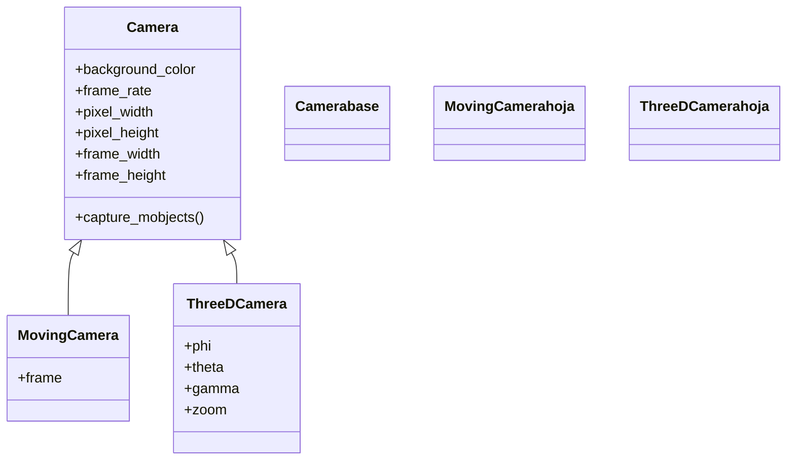

# Camera — el motor de render que convierte mobjects en píxeles

`Camera` es la clase base de la cámara de Manim: el **motor que, en cada frame, toma los mobjects de la escena y los "fotografía"** sobre un lienzo de píxeles. Es quien sabe el color de fondo, la resolución de la imagen, los fotogramas por segundo y qué rectángulo del plano entra en cuadro. En una [[concepto_scene_construct|Scene]] normal esta cámara está **fija**: siempre encuadra el mismo trozo del plano XY centrado en el `ORIGIN`, y por eso para "moverte" por la escena desplazas o animas los objetos, no la cámara. Rara vez se instancia o se toca a mano: la Scene la crea por ti y la deja en `self.camera`, y sus ajustes (fondo, tamaño, frame rate) se fijan de forma global a través de [[config]]. Las cámaras que **sí** se mueven son sus subclases: [[MovingCamera]] (paneo y zoom en 2D) y [[ThreeDCamera]] (orientación en 3D).

## Importacion

```python
from manim import Camera
# casi nunca hace falta importarla: la usa la Scene por dentro
from manim import *
```

## Herencia

### La jerarquia

`Camera` es la **raíz** de la familia de cámaras: no hereda de `Mobject` (no es un objeto dibujable) sino directamente de `object`. De ella cuelgan las dos cámaras especializadas que añaden movimiento.



### Que hereda y que aporta

`Camera` no hereda capacidades de Manim (su padre es `object`): es ella la que **aporta** la maquinaria de render que las demás cámaras reutilizan. [[MovingCamera]] y [[ThreeDCamera]] heredan todo este motor (fondo, resolución, captura de frame) y solo añaden su forma de moverse: un `frame` animable la primera, los ángulos esféricos la segunda.

| Capacidad | De dónde sale | Notas |
|-----------|---------------|-------|
| Color de fondo | `Camera` (`background_color`) | se fija global con [[config]] |
| Resolución en píxeles | `Camera` (`pixel_width`, `pixel_height`) | la marca el flag de calidad (`-ql`, `-qh`) |
| Fotogramas por segundo | `Camera` (`frame_rate`) | por defecto 60 fps en alta calidad |
| Tamaño del encuadre en unidades del plano | `Camera` (`frame_width`, `frame_height`) | el "campo de visión" 2D |
| Mover el encuadre (2D) | [[MovingCamera]] | añade `frame` como Mobject animable |
| Orientar en el espacio (3D) | [[ThreeDCamera]] | añade `phi`/`theta`/`gamma` |

## Como se accede

No creas un `Camera()` a mano. La [[concepto_scene_construct|Scene]] lo instancia al arrancar y lo guarda en **`self.camera`**; dentro de `construct` puedes leerlo, pero en una `Scene` normal no expone nada para moverlo (no hay `frame` ni ángulos: por eso queda fija).

```python
from manim import *

class QuienEsLaCamara(Scene):
    def construct(self):
        print(type(self.camera))            # <class 'manim.camera.camera.Camera'>
        print(self.camera.frame_width)      # ancho del encuadre en unidades del plano
        self.add(Dot())
        self.wait()
```

Para **cambiar sus ajustes** no se tocan estos atributos en caliente, sino que se fijan de forma global antes de renderizar con [[config]] (color de fondo, dimensiones, frame rate). Y para **mover** la cámara hace falta cambiar de clase de escena: [[MovingCameraScene]] para 2D o [[ThreeDScene]] para 3D.

## Atributos clave

Son atributos de configuración del render. Lo habitual no es asignarlos a mano sobre `self.camera`, sino fijarlos vía [[config]] (que los propaga a la cámara al construir la escena).

| Atributo | Qué controla | Cómo se fija normalmente |
|----------|--------------|--------------------------|
| `background_color` | color de fondo del lienzo | `config.background_color = BLACK` (o `self.camera.background_color`) |
| `frame_rate` | fotogramas por segundo del vídeo | flag de calidad / `config.frame_rate` |
| `pixel_width` | ancho de la imagen en píxeles | `config.pixel_width` (lo marca `-ql`/`-qh`) |
| `pixel_height` | alto de la imagen en píxeles | `config.pixel_height` |
| `frame_width` | ancho del encuadre en unidades del plano (campo de visión) | `config.frame_width` |
| `frame_height` | alto del encuadre en unidades del plano | `config.frame_height` |

> [!tip] Píxeles vs unidades del plano
> `pixel_width`/`pixel_height` son la **resolución** del vídeo (p. ej. 1920x1080). `frame_width`/`frame_height` son cuántas **unidades del plano** entran en cuadro (por defecto 14.22 x 8 unidades). Lo primero define la nitidez; lo segundo, cuánto plano se ve.

## Ejemplo

### Version minima

Una `Scene` normal: la cámara está fija. El cuadrado se mueve por el plano, pero el encuadre no le sigue (sale de cuadro). Ese "no seguir" es justamente la cámara base en acción.

```python
from manim import *

class CamaraFija(Scene):
    def construct(self):
        cuadro = Square(color=BLUE)
        self.add(cuadro)
        # la camara NO le sigue: el cuadrado se va hacia el borde
        self.play(cuadro.animate.shift(RIGHT * 5), run_time=2)
        self.wait()
```

```bash
manim -pql archivo.py CamaraFija      # -p reproduce, -ql = calidad baja (rapido)
```

### Version completa

Leer y cambiar ajustes de la cámara fija: se pinta el fondo con `background_color` y se inspecciona el tamaño del encuadre. Para **mover** la cámara haría falta [[MovingCameraScene]]; aquí solo se demuestra que la base es configuración, no movimiento.

```python
from manim import *

class AjustesDeCamara(Scene):
    def construct(self):
        # cambiar el color de fondo de la camara fija
        self.camera.background_color = "#1e2030"

        # el encuadre por defecto: cuanto plano se ve
        ancho = self.camera.frame_width
        info = Text(f"frame_width = {ancho:.2f} unidades", font_size=28)

        # un marco del tamano exacto del encuadre visible
        borde = Rectangle(
            width=self.camera.frame_width,
            height=self.camera.frame_height,
            color=YELLOW,
        ).scale(0.98)

        self.add(borde, info)
        self.wait()
```

```bash
manim -pqh archivo.py AjustesDeCamara      # -qh = alta calidad para el render final
```

## Errores comunes

| Error / síntoma | Causa | Solución |
|-----------------|-------|----------|
| `AttributeError: 'Camera' object has no attribute 'frame'` | intentaste `self.camera.frame` en una `Scene` normal | la cámara fija no tiene `frame`; usa [[MovingCameraScene]] |
| Esperabas que la cámara siguiera a un objeto | la `Camera` base es fija; no hay seguimiento | usa [[MovingCameraScene]] y anima `self.camera.frame` |
| El color de fondo no cambia | lo fijaste tarde o sobre el objeto equivocado | usa `config.background_color` antes del render o `self.camera.background_color` en `construct` |
| El vídeo sale con baja resolución | la calidad la marca el flag, no la creas a mano | renderiza con `-qh`/`-qk` o ajusta `config.pixel_width` |
| Intentaste `camara = Camera()` y nada aparece | la cámara la crea la Scene, no tú | accede a la ya creada con `self.camera` |

## Notas relacionadas

- [[MovingCamera]] — la subclase con `frame` para paneo y zoom en 2D.
- [[ThreeDCamera]] — la subclase 3D orientada por ángulos esféricos.
- [[MovingCameraScene]] — la Scene que instala una `MovingCamera` movible.
- [[ThreeDScene]] — la Scene 3D que orienta su `ThreeDCamera`.
- [[config]] — dónde se fijan de verdad los ajustes de la cámara (fondo, resolución, frame rate).
- [[concepto_scene_construct]] — la Scene que crea la cámara y la deja en `self.camera`.
- [[Manim/camara/index | camara]] — el índice del grupo de cámaras.
