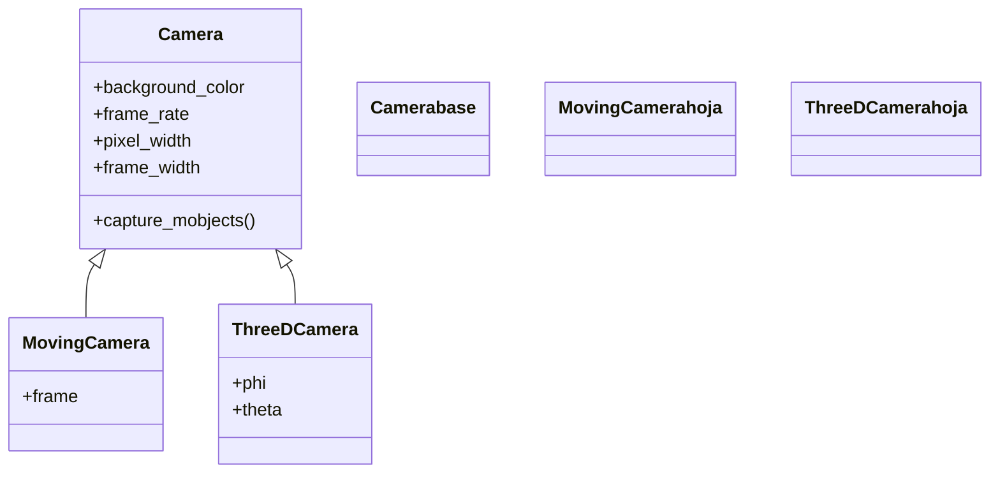

# MovingCamera — la cámara con frame movible (paneo y zoom 2D)

`MovingCamera` es la cámara que **se puede mover y hacer zoom en el plano**. Su novedad respecto a la [[Camera]] base es un único atributo decisivo: el **`frame`**, un mobject rectangular que representa el encuadre. Como es un mobject, responde a `move_to`, `scale`, `rotate` y a la sintaxis `.animate`, así que desplazarlo es hacer un **paneo** (travelling) y encogerlo o agrandarlo es hacer **zoom**, todo animable con `self.play(...)`. La idea de fondo es la misma que en toda la carpeta: no acercas los objetos a la cámara, mueves la ventana de la cámara sobre los objetos. Nunca la instancias tú: la monta la [[MovingCameraScene]] y la deja en `self.camera`, de modo que en la práctica "usar `MovingCamera`" significa heredar de esa Scene y animar `self.camera.frame`.

## Importacion

```python
from manim import MovingCamera
# en la practica no la importas: heredas de MovingCameraScene
from manim import *
```

## Herencia

### La jerarquia

`MovingCamera` hereda directamente de [[Camera]]: reutiliza todo el motor de render (fondo, resolución, frame rate) y añade el `frame` animable. Es hermana de [[ThreeDCamera]], que resuelve el movimiento de otra forma (ángulos en vez de un frame 2D).



### Que hereda

Todo el render viene de [[Camera]]; lo único **propio** de `MovingCamera` es el `frame` y el hecho de que el encuadre se calcula a partir de él en cada momento.

| Capacidad | De dónde sale | Notas |
|-----------|---------------|-------|
| Fondo, resolución, frame rate | [[Camera]] | se fijan global vía [[config]] |
| Captura del frame en cada paso | [[Camera]] | el motor de render heredado |
| El encuadre como mobject animable | `MovingCamera` (`frame`) | lo nuevo: `move_to`, `scale`, `.animate` |

## Como se accede

La cámara la crea [[MovingCameraScene]]; tú accedes a su encuadre con **`self.camera.frame`**. Como se usa mucho, es habitual guardarlo en una variable corta al inicio del `construct`.

```python
class Demo(MovingCameraScene):
    def construct(self):
        frame = self.camera.frame          # atajo: el encuadre animable
        frame.save_state()                 # guarda la vista inicial para volver luego
        ...
```

Si tu escena hereda de `Scene` (no de `MovingCameraScene`), `self.camera` es una [[Camera]] fija y **no tiene `frame`**: ese es el error nº 1 de esta cámara.

## El frame

Todo el control de `MovingCamera` pasa por su `frame`. Estos son los tres gestos: mover, zoom y guardar/restaurar.

### Mover (paneo)

`move_to` lleva el encuadre hasta un punto o un objeto, sin cambiar el zoom: es un travelling. Dentro de `self.play(...)` con `.animate` se ve el desplazamiento; fuera, salta de golpe.

```python
self.play(self.camera.frame.animate.move_to(objetivo))   # travelling hasta el objeto
```

### Zoom

`scale` cambia el tamaño del encuadre. **Escala menor que 1 acerca** (zoom-in: la ventana se encoge y su contenido se ve más grande); **mayor que 1 aleja** (zoom-out). También puedes fijar el ancho absoluto con `.set(width=...)`.

```python
self.play(self.camera.frame.animate.scale(0.5))   # zoom-IN (acerca)
self.play(self.camera.frame.animate.scale(2))     # zoom-OUT (aleja)
```

> [!tip] Zoom-in = frame más pequeño
> Es contraintuitivo: para **acercarte** encoges el frame (`scale(0.5)`). El frame es la ventana sobre el plano; cuanto más pequeña, más ampliado se ve lo que cae dentro.

### save_state / restore

Guarda la vista general con `save_state()` antes de moverte; tras enseñar un detalle, vuelves con una sola animación. Es el mismo par `save_state`/`restore` de cualquier mobject; `Restore(frame)` es su versión como `Animation`.

```python
self.camera.frame.save_state()                               # guarda la vista general
self.play(self.camera.frame.animate.scale(0.4).move_to(detalle))   # zoom al detalle
self.play(Restore(self.camera.frame))                        # vuelve a la vista general
```

## Ejemplo

### Version minima

Acercarse a un objeto y volver: el gesto más básico de `MovingCamera`.

```python
from manim import *

class ZoomMinimo(MovingCameraScene):
    def construct(self):
        objetivo = Triangle(color=BLUE, fill_opacity=0.6)
        self.add(objetivo)

        self.camera.frame.save_state()                          # vista inicial
        self.play(self.camera.frame.animate.scale(0.5).move_to(objetivo))   # zoom-in
        self.wait()
        self.play(Restore(self.camera.frame))                   # zoom-out de vuelta
        self.wait()
```

```bash
manim -pql archivo.py ZoomMinimo      # -p reproduce, -ql = calidad baja (rapido)
```

### Version completa

Tres usos encadenados: paneo de un objeto a otro, zoom a un detalle y seguimiento de un objeto en movimiento con un `add_updater` sobre el `frame`.

```python
from manim import *

class CamaraMovil(MovingCameraScene):
    def construct(self):
        izquierda = Square(color=GREEN, fill_opacity=0.5).shift(LEFT * 5)
        derecha = Circle(color=RED, fill_opacity=0.5).shift(RIGHT * 5)
        movil = Dot(color=YELLOW).shift(LEFT * 5 + DOWN * 2)
        self.add(izquierda, derecha, movil)

        frame = self.camera.frame
        frame.save_state()                                      # guarda la vista general

        # 1. paneo: de la figura izquierda a la derecha
        self.play(frame.animate.move_to(izquierda), run_time=1.5)
        self.play(frame.animate.move_to(derecha), run_time=2)

        # 2. zoom a un detalle de la figura derecha
        self.play(frame.animate.scale(0.4).move_to(derecha), run_time=1.5)
        self.wait(0.5)
        self.play(Restore(frame), run_time=1.5)                 # vuelve a la vista general

        # 3. seguir un objeto en movimiento: el frame se "pega" al punto
        frame.add_updater(lambda m: m.move_to(movil))
        self.play(movil.animate.shift(RIGHT * 10 + UP * 4), run_time=3)
        frame.remove_updater(frame.get_updaters()[-1])          # soltar el seguimiento
        self.wait()
```

```bash
manim -pqh archivo.py CamaraMovil      # -qh = alta calidad para el render final
```

## Errores comunes

| Error / síntoma | Causa | Solución |
|-----------------|-------|----------|
| `AttributeError: 'Camera' object has no attribute 'frame'` | la escena hereda de `Scene`, no de [[MovingCameraScene]] | cambia la base: `class X(MovingCameraScene)` |
| El zoom-in aleja en vez de acercar | usaste `scale(2)` esperando acercarte | para acercarte **encoge** el frame: `scale(0.5)` (escala <1 acerca, >1 aleja) |
| La cámara salta sin animarse | hiciste `self.camera.frame.scale(0.5)` fuera de `play` | mételo en `self.play(self.camera.frame.animate.scale(0.5))` |
| `Restore` no vuelve a ningún sitio | olvidaste `save_state()` antes de mover | guarda el estado al inicio del `construct` |
| El seguimiento con updater "tiembla" o no suelta | dejaste el `add_updater` activo | quita el updater (`remove_updater`) cuando termine el seguimiento |

## Notas relacionadas

- [[MovingCameraScene]] — la Scene que instala esta cámara; aquí es donde de verdad se usa.
- [[Camera]] — la clase base de la que hereda el motor de render.
- [[ThreeDCamera]] — la otra subclase: en vez de un `frame`, se orienta por ángulos en 3D.
- [[concepto_animate_syntax]] — la sintaxis `.animate` con la que se anima el encuadre.
- [[ZoomedScene]] — variante que añade un recuadro-lupa sobre la cámara móvil.
- [[Manim/camara/index | camara]] — el índice del grupo de cámaras.
