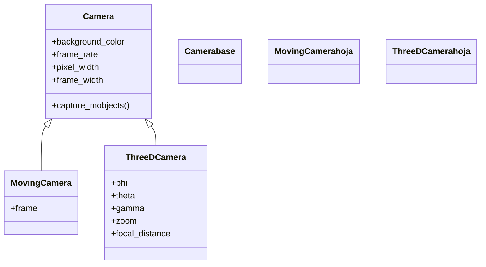

# ThreeDCamera — la cámara 3D orientada por ángulos esféricos

`ThreeDCamera` es la cámara que mira la escena **desde cualquier punto del espacio**. A diferencia de la [[Camera]] base (que encuadra el plano XY de frente) y de la [[MovingCamera]] (que se mueve con un `frame` plano), esta cámara se orienta con **ángulos esféricos**: `phi` es la inclinación respecto al eje vertical Z, `theta` el giro alrededor de ese eje (acimut), y completan el cuadro `gamma` (giro sobre el propio eje de visión), `zoom` y `focal_distance`. Con esos ángulos defines "desde dónde se observa" un sólido, una superficie o unos ejes 3D. Igual que el resto de la carpeta, no la instancias a mano: la crea la [[ThreeDScene]] y la deja en `self.camera`, y **no tocas sus atributos directamente**, sino que la controlas con los métodos de la Scene (`set_camera_orientation`, `move_camera`, la rotación ambiental).

## Importacion

```python
from manim import ThreeDCamera
# en la practica no la importas: heredas de ThreeDScene
from manim import *
```

## Herencia

### La jerarquia

`ThreeDCamera` hereda de [[Camera]]: reutiliza el motor de render y añade la proyección 3D y los ángulos esféricos. Es hermana de [[MovingCamera]], que resuelve el movimiento con un `frame` plano en lugar de ángulos.



### Que hereda

El render heredado de [[Camera]] es el mismo; lo **propio** de `ThreeDCamera` es la proyección en perspectiva y los ángulos que la orientan.

| Capacidad | De dónde sale | Notas |
|-----------|---------------|-------|
| Fondo, resolución, frame rate | [[Camera]] | se fijan global vía [[config]] |
| Captura del frame | [[Camera]] | el motor de render heredado |
| Orientación esférica (`phi`, `theta`, `gamma`) | `ThreeDCamera` | lo nuevo: el punto de vista 3D |
| Zoom y distancia focal de la perspectiva | `ThreeDCamera` (`zoom`, `focal_distance`) | controlan acercamiento y deformación en perspectiva |

## Como se accede / controla

La cámara la crea [[ThreeDScene]] y vive en `self.camera`, pero **no se manipulan sus atributos a mano** (`self.camera.phi = ...` no es la vía). En su lugar usas los métodos que la `ThreeDScene` expone para pilotarla:

| Método de la Scene | Qué hace |
|--------------------|----------|
| `self.set_camera_orientation(phi=..., theta=...)` | coloca la cámara en un ángulo de golpe (sin animar); al inicio del `construct` |
| `self.move_camera(phi=..., theta=..., run_time=...)` | **anima** el viaje de la cámara a un nuevo ángulo |
| `self.begin_ambient_camera_rotation(rate=...)` | hace orbitar la cámara sola (hay que dejar pasar tiempo con `self.wait`) |
| `self.stop_ambient_camera_rotation()` | detiene la órbita |

```python
self.set_camera_orientation(phi=75 * DEGREES, theta=-45 * DEGREES)   # punto de vista inicial
```

El detalle clave: si tu escena hereda de `Scene` en vez de [[ThreeDScene]], estos métodos no existen y la cámara no se orienta; todo se ve plano.

## Los angulos

Los tres ángulos esféricos y los dos ajustes de perspectiva. **Van en radianes**: por eso se multiplican grados por `DEGREES` (`75 * DEGREES`).

| Parámetro | Qué controla | Valor típico |
|-----------|--------------|--------------|
| `phi` | inclinación desde el eje Z vertical: `0` = mirando en picado desde arriba; `90°` = a la altura del plano XY | `70 * DEGREES` |
| `theta` | giro alrededor del eje Z (acimut): rota el punto de vista en horizontal | `-45 * DEGREES` |
| `gamma` | giro sobre el propio eje de visión (inclina el "horizonte") | `0` |
| `zoom` | acercamiento: `>1` acerca, `<1` aleja | `1` |
| `focal_distance` | distancia focal de la perspectiva (cuánto se exagera la profundidad) | por defecto |

> [!tip] Siempre en radianes
> `phi=70` no son 70 grados: son 70 radianes (más de 11 vueltas). Multiplica siempre por `DEGREES`: `phi=70 * DEGREES`.

## Ejemplo

### Version minima

Unos ejes 3D y un cubo vistos en perspectiva. Lo mínimo para ver `set_camera_orientation` orientando la `ThreeDCamera`.

```python
from manim import *

class Camara3DMinima(ThreeDScene):
    def construct(self):
        self.set_camera_orientation(phi=70 * DEGREES, theta=-45 * DEGREES)
        ejes = ThreeDAxes()
        cubo = Cube(side_length=2, fill_opacity=0.7, fill_color=BLUE)
        self.add(ejes, cubo)
        self.wait()
```

```bash
manim -pql archivo.py Camara3DMinima      # -p reproduce, -ql = calidad baja (rapido)
```

### Version completa

Punto de vista inicial en perspectiva, un vuelo de cámara a otro ángulo y una órbita automática al final. Toda la cámara se pilota desde la `ThreeDScene`, nunca tocando los atributos de la `ThreeDCamera`.

```python
from manim import *

class VueloDeCamara(ThreeDScene):
    def construct(self):
        # 1. orientar la camara de golpe (sin animar)
        self.set_camera_orientation(phi=75 * DEGREES, theta=-45 * DEGREES, zoom=0.9)

        ejes = ThreeDAxes()
        cubo = Cube(side_length=2, fill_opacity=0.6, fill_color=TEAL).shift(LEFT * 2)
        esfera = Sphere(radius=1, fill_opacity=0.6).shift(RIGHT * 2)
        self.add(ejes, cubo, esfera)
        self.wait()

        # 2. volar a otro angulo (animado)
        self.move_camera(phi=45 * DEGREES, theta=30 * DEGREES, run_time=3)
        self.wait()

        # 3. dejar la camara orbitando sola unos segundos
        self.begin_ambient_camera_rotation(rate=0.3, about="theta")
        self.wait(6)                       # debe pasar tiempo para verla girar
        self.stop_ambient_camera_rotation()
        self.wait()
```

```bash
manim -pqh archivo.py VueloDeCamara      # -qh = alta calidad para el render final
```

## Errores comunes

| Error / síntoma | Causa | Solución |
|-----------------|-------|----------|
| Todo se ve plano, sin profundidad | usaste una `Scene` normal, o no llamaste a `set_camera_orientation` (la cámara mira de frente, `phi=0`) | hereda de [[ThreeDScene]] e inclina: `set_camera_orientation(phi=70*DEGREES, theta=-45*DEGREES)` |
| La cámara gira demasiado o casi nada | pasaste grados como si fueran radianes (`phi=70`) | multiplica por `DEGREES`: `phi=70 * DEGREES` |
| `AttributeError: set_camera_orientation` | la escena hereda de `Scene`, no de `ThreeDScene` | cambia la base a `class X(ThreeDScene)` |
| La cámara no orbita aunque llamaste `begin_ambient_camera_rotation` | no dejaste pasar tiempo entre el `begin` y el `stop` | mete un `self.wait(...)` en medio |
| Intentaste `self.camera.phi = ...` y no pasa nada esperado | no se tocan sus atributos a mano | usa `set_camera_orientation` / `move_camera` desde la Scene |

## Notas relacionadas

- [[ThreeDScene]] — la Scene 3D que crea esta cámara y la pilota con `set_camera_orientation`.
- [[Camera]] — la clase base de la que hereda el motor de render.
- [[MovingCamera]] — la otra subclase: movimiento 2D con un `frame` en vez de ángulos.
- [[ThreeDAxes]] — los ejes tridimensionales que se ven con esta cámara.
- [[concepto_sistema_coordenadas]] — el eje Z y las direcciones (`OUT`, `IN`) del espacio 3D.
- [[Manim/camara/index | camara]] — el índice del grupo de cámaras.
