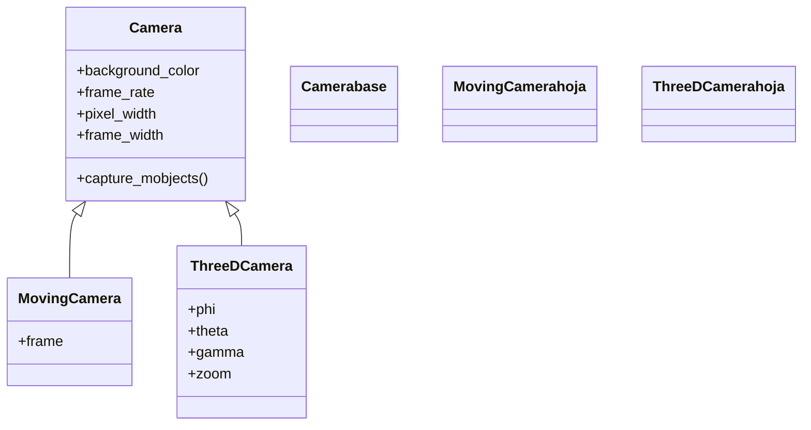

# camara — el punto de vista que se renderiza

La **cámara** es el punto de vista desde el que Manim "fotografía" la escena en cada frame: define qué trozo del plano (o del espacio) acaba convertido en píxeles. En la inmensa mayoría de escenas la cámara está **fija** —siempre muestra el mismo rectángulo centrado en el `ORIGIN`— y ni siquiera reparas en ella. Pero cuando quieres movimiento de cámara hay dos caminos: en 2D **mueves y haces zoom** desplazando un encuadre rectangular (`self.camera.frame`), y en 3D **orientas** la cámara en el espacio con ángulos esféricos (`phi`, `theta`). El detalle que gobierna toda esta carpeta es que **casi nunca instancias una cámara a mano**: la crea la [[concepto_scene_construct|Scene]] y la guarda en `self.camera`; lo que tú eliges es la Scene adecuada ([[MovingCameraScene]] para 2D, [[ThreeDScene]] para 3D) y la controlas a través de ella. La clase base [[Camera]] es, sobre todo, el motor de render; sus subclases [[MovingCamera]] y [[ThreeDCamera]] son las que añaden el movimiento.

## En accion

Una `MovingCameraScene` que parte de una vista general y hace **zoom** sobre un objeto concreto encogiendo el encuadre y centrándolo en él. Fíjate en que no se toca el objeto: se mueve la cámara.

```python
from manim import *

class ZoomAlPunto(MovingCameraScene):
    def construct(self):
        fondo = VGroup(*[Dot(np.array([x, y, 0]), color=GREY)
                         for x in range(-5, 6) for y in range(-3, 4)])
        objetivo = Star(color=YELLOW, fill_opacity=1).scale(0.4).shift(RIGHT * 3 + UP * 1)
        self.add(fondo, objetivo)

        self.camera.frame.save_state()                                  # guarda la vista general
        self.play(self.camera.frame.animate.scale(0.5).move_to(objetivo))   # zoom-in al objetivo
        self.wait()
        self.play(Restore(self.camera.frame))                           # vuelve a la vista general
        self.wait()
```

```bash
manim -pql archivo.py ZoomAlPunto      # -p reproduce, -ql = calidad baja (rapido)
```

## Herencia

Las tres cámaras forman una jerarquía corta: [[Camera]] es la base (el motor de render 2D) y de ella cuelgan las dos especializadas. [[MovingCamera]] añade un `frame` animable para moverse y hacer zoom en el plano; [[ThreeDCamera]] añade los ángulos esféricos para mirar la escena desde cualquier punto del espacio.



## Las camaras

Las tres clases de la carpeta, con la Scene que las instala y para qué sirven. La clave práctica: **eliges la Scene, no la cámara**.

| Camara | La usa | Para que |
|--------|--------|----------|
| [[Camera]] | [[concepto_scene_construct\|Scene]] (la normal) | el motor de render 2D; cámara fija, encuadre inmóvil centrado en el origen |
| [[MovingCamera]] | [[MovingCameraScene]] | mover (paneo) y hacer zoom en 2D animando `self.camera.frame` |
| [[ThreeDCamera]] | [[ThreeDScene]] | orientar la cámara en el espacio 3D con ángulos `phi`/`theta` y orbitarla |

## Como elegir

No instancias ninguna cámara: decides **qué Scene heredas** y eso fija qué cámara tienes y cómo se controla.

| Necesito… | Hereda de | Cómo se controla la cámara |
|-----------|-----------|----------------------------|
| Una escena normal, encuadre fijo | `Scene` | no se toca; la [[Camera]] queda quieta (ajustes globales vía [[config]]) |
| Paneo / travelling / zoom en 2D | `MovingCameraScene` | animas `self.camera.frame` (`move_to`, `scale`) |
| Profundidad, sólidos, superficies (3D) | `ThreeDScene` | `self.set_camera_orientation(phi=..., theta=...)`, `move_camera`, órbita |

> [!tip] La cámara la crea la Scene
> Nunca escribes `camara = MovingCamera()`. Eliges la clase base de tu escena y Manim monta la cámara correcta en `self.camera`. Toda esta carpeta describe esa cámara para que entiendas qué hay detrás de `self.camera`, pero el control real vive en la Scene.

## Patrones y recetas

Tres recetas que cubren los tres modos de cámara: paneo 2D, zoom 2D y vista 3D con órbita.

### Paneo: seguir un recorrido en 2D

Con [[MovingCameraScene]], desplazar el encuadre (`move_to`) hace un travelling lateral sin cambiar el zoom. Aquí la cámara viaja de un objeto al otro.

```python
from manim import *

class Paneo(MovingCameraScene):
    def construct(self):
        a = Square(color=BLUE).shift(LEFT * 5)
        b = Circle(color=GREEN).shift(RIGHT * 5)
        self.add(a, b)

        self.camera.frame.move_to(a)                          # arranca encuadrando a
        self.play(self.camera.frame.animate.move_to(b), run_time=3)   # paneo hasta b
        self.wait()
```

```bash
manim -pql archivo.py Paneo
```

### Zoom: acercarse a un detalle

Encoger el encuadre (`scale(0.5)`) es **zoom-in**: la ventana sobre el plano se hace más pequeña, así que su contenido se ve más grande en pantalla.

```python
from manim import *

class Zoom(MovingCameraScene):
    def construct(self):
        formula = MathTex(r"e^{i\pi} + 1 = 0")
        self.add(formula)

        self.camera.frame.save_state()
        self.play(self.camera.frame.animate.scale(0.4).move_to(formula[0][0]))  # zoom-in
        self.wait()
        self.play(Restore(self.camera.frame))                 # zoom-out a la vista original
        self.wait()
```

```bash
manim -pql archivo.py Zoom
```

### Vista 3D con set_camera_orientation y órbita

Con [[ThreeDScene]] no hay `frame`: orientas la cámara con `set_camera_orientation` y la dejas orbitar con `begin_ambient_camera_rotation`.

```python
from manim import *

class Vista3D(ThreeDScene):
    def construct(self):
        self.set_camera_orientation(phi=70 * DEGREES, theta=-45 * DEGREES)   # perspectiva
        ejes = ThreeDAxes()
        cubo = Cube(side_length=2, fill_opacity=0.7, fill_color=BLUE)
        self.add(ejes, cubo)

        self.begin_ambient_camera_rotation(rate=0.3)          # orbita sola
        self.wait(5)                                          # debe pasar tiempo para verla girar
        self.stop_ambient_camera_rotation()
        self.wait()
```

```bash
manim -pqh archivo.py Vista3D      # -qh = alta calidad para el render final
```

## Notas relacionadas

- [[Camera]] — la clase base; el motor de render 2D y los ajustes de fondo/resolución.
- [[MovingCamera]] — la cámara con `frame` para paneo y zoom en 2D.
- [[ThreeDCamera]] — la cámara 3D orientada por ángulos esféricos.
- [[MovingCameraScene]] — la Scene que instala la `MovingCamera` y se controla con `self.camera.frame`.
- [[ThreeDScene]] — la Scene 3D que orienta la `ThreeDCamera` con `set_camera_orientation`.
- [[config]] — dónde se fijan los ajustes globales de la cámara (color de fondo, resolución, frame rate).
- [[Manim/index | Manim]] — el índice raíz con el `classDiagram` global.
