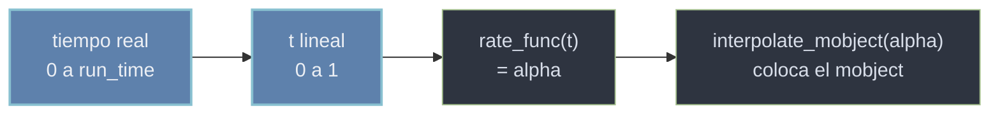

# Animation — la transformación en el tiempo

Una `Animation` describe **cómo cambia** uno o varios [[concepto_mobject|Mobjects]] entre el fotograma inicial y el final: aparecer, transformarse en otra cosa, girar, desvanecerse. Es la tercera pieza de la tríada de Manim, y la que aporta el **tiempo**. Conviene fijar una distinción que evita la mayoría de confusiones: la Animation **no es** el objeto, sino una **instrucción que opera sobre** un objeto. `Circle()` es un Mobject; `Create(Circle())` es una Animation que dice "dibuja este círculo progresivamente". Una animación, por sí sola, no hace nada: hay que **reproducirla** con `self.play(anim)` dentro del `construct` de la [[concepto_scene_construct|Scene]]. Ese `play` es lo único que genera fotogramas que se ven moverse; todo lo demás (`add`, `remove`) es instantáneo.

## Por qué existe

El cambio en el tiempo necesita describirse de forma **declarativa**: no quieres calcular tú, fotograma a fotograma, dónde está un objeto en el segundo 0.37 de su recorrido. Manim encapsula ese "cómo se pasa del estado A al estado B" en un objeto `Animation` que sabe **interpolar** entre ambos extremos. Tú solo declaras la intención (`Create`, `Transform`, `FadeOut`) y unos parámetros de tiempo, y el motor calcula cada fotograma intermedio. Por eso todas las animaciones comparten un tronco común (`Animation`) que define los parámetros temporales: una vez sabes que algo es una Animation, sabes que acepta `run_time` y `rate_func` sin mirar su documentación.

```python
# Una Animation describe un cambio; play() lo reproduce en el tiempo.
from manim import *

class QueEsUnaAnimation(Scene):
    def construct(self):
        c = Circle(color=BLUE)
        self.play(Create(c))               # Create: la Animation; play: la reproduce
        self.play(c.animate.shift(RIGHT*2)) # otra Animation (via .animate)
        self.play(FadeOut(c))              # una mas: desvanecer
        self.wait()
```

```bash
manim -pql archivo.py QueEsUnaAnimation      # -p reproduce, -ql = calidad baja (rapido)
```

Las tres líneas con `play` producen movimiento porque cada una reproduce una Animation; sin `play`, el objeto solo existiría estático.

## El modelo: parámetros comunes y cómo interpola

### Los parámetros que toda Animation hereda

Como todas las animaciones heredan de `Animation`, todas aceptan estos parámetros, sea cual sea su familia. Saberlos es controlar el ritmo de cualquier animación.

| Parámetro | Tipo | Defecto | Controla |
|-----------|------|---------|----------|
| `run_time` | float (seg) | `1.0` | cuánto **dura** la animación |
| `rate_func` | función | `smooth` | la **curva de velocidad** (acelera, frena, rebota); ver [[rate_functions]] |
| `lag_ratio` | float | `0.0` | el **desfase** entre los submobjects (0 = todos a la vez; >0 = en cascada) |
| `reverse_rate_function` | bool | `False` | reproduce la curva de velocidad al revés |

`run_time` y `rate_func` son los dos que tocarás constantemente: el primero alarga o acorta, el segundo cambia la *sensación* (un movimiento mecánico lineal frente a uno que arranca y frena suave).

### Por dentro: el alpha de 0 a 1

El mecanismo es más simple de lo que parece. Manim recorre la animación con un número `alpha` que va de **0 (estado inicial) a 1 (estado final)**. En cada fotograma llama a `interpolate_mobject(alpha)`, que coloca el mobject en el punto intermedio que corresponde a ese `alpha`. El tiempo real (los segundos de `run_time`) se convierte primero en un valor de 0 a 1 lineal, y la `rate_func` **reescala** ese valor: por eso `smooth` hace que el objeto vaya lento-rápido-lento aunque el tiempo avance uniforme.



La consecuencia útil: cambiar `rate_func` cambia **cómo se siente** la animación sin tocar ni el objeto ni la duración. `rate_func=linear` da un ritmo constante; `rate_func=there_and_back` va al estado final y vuelve; `rate_func=rush_into` arranca de golpe.

### Reproducir varias a la vez

Un solo `self.play` puede recibir **varias animaciones separadas por comas**, y las reproduce **simultáneamente** (todas comparten el mismo `run_time` del bloque). Eso cubre el caso simple "que pasen dos cosas al tiempo". Para encadenarlas (una tras otra) basta con poner varios `self.play` seguidos; para **escalonarlas en cascada** o controlar finamente el solape se usan los compositores [[AnimationGroup]] y [[LaggedStart]].

| Quiero… | Cómo |
|---------|------|
| dos animaciones **a la vez** | `self.play(anim1, anim2)` |
| una **tras** otra | dos `self.play` seguidos |
| varias en **cascada** (desfase) | `self.play(LaggedStart(a, b, c, lag_ratio=0.5))` |
| un grupo con control fino del solape | `self.play(AnimationGroup(a, b, lag_ratio=0.2))` |

## Las familias de animaciones

Las animaciones se agrupan por lo que le hacen al mobject. Conocer la familia te dice qué animación buscar.

| Familia | Qué hace | Clases típicas |
|---------|----------|----------------|
| **Creación** | el objeto aparece dibujándose | `Create`, `Write`, `DrawBorderThenFill`, `FadeIn` |
| **Transformación** | un objeto se convierte en otro | `Transform`, `ReplacementTransform`, `TransformMatchingTex` |
| **Movimiento** | el objeto se mueve o gira | `Rotate`, `MoveAlongPath`, `.animate.shift(...)` |
| **Indicación** | resaltar algo sin cambiarlo de forma | `Indicate`, `Flash`, `Wiggle`, `Circumscribe` |
| **Desaparición** | el objeto se va | `FadeOut`, `Uncreate`, `Unwrite` |

### Creación

`Create` traza la geometría progresivamente; `Write` está pensada para texto y fórmulas (las "escribe"); `FadeIn` la hace aparecer con un fundido.

### Transformación

Aquí está la distinción clave entre `Transform` y `ReplacementTransform`. `Transform(a, b)` morfa `a` para que **se vea** como `b`, pero el que queda en la escena sigue siendo `a` (con la apariencia de `b`); `ReplacementTransform(a, b)` **sustituye** `a` por `b` de verdad, dejando `b` en la escena. Para encadenar más transformaciones sobre el resultado, `ReplacementTransform` suele dar menos sorpresas.

### Movimiento, indicación y desaparición

`Rotate(mob, angle)` gira; `MoveAlongPath(mob, path)` lo lleva por una curva. `Indicate` y `Flash` llaman la atención sin alterar el objeto. `FadeOut` lo desvanece y lo retira de la escena.

## Ejemplos progresivos

### Nivel 1: una creación

La animación más básica: dibujar un objeto con `Create`.

```python
from manim import *

class UnaCreacion(Scene):
    def construct(self):
        s = Square(color=BLUE)
        self.play(Create(s))    # se dibuja el borde progresivamente
        self.wait()
```

```bash
manim -pql archivo.py UnaCreacion
```

### Nivel 2: una transformación A → B

Un círculo se convierte en un cuadrado. Con `ReplacementTransform`, lo que queda en escena es el cuadrado de verdad.

```python
from manim import *

class TransformacionAB(Scene):
    def construct(self):
        a = Circle(color=RED)
        b = Square(color=GREEN)
        self.play(Create(a))
        self.play(ReplacementTransform(a, b))   # a se convierte en b
        self.wait()
```

```bash
manim -pql archivo.py TransformacionAB
```

### Nivel 3: varias simultáneas y control de run_time

Dos animaciones en un mismo `play` ocurren a la vez; `run_time` fija que todo el bloque dure 3 segundos.

```python
from manim import *

class VariasALaVez(Scene):
    def construct(self):
        a = Circle(color=RED).shift(LEFT * 2)
        b = Square(color=GREEN).shift(RIGHT * 2)

        # las dos creaciones, simultaneas, en 3 segundos:
        self.play(Create(a), Create(b), run_time=3)
        # las dos se mueven al centro a la vez:
        self.play(a.animate.move_to(ORIGIN), b.animate.move_to(ORIGIN))
        self.wait()
```

```bash
manim -pql archivo.py VariasALaVez
```

### Nivel 4: cambiar la rate_func

La misma traslación con tres curvas de velocidad distintas: el `run_time` es igual, pero la *sensación* cambia por completo. La primera es lineal (mecánica), la segunda suave (arranca y frena), la tercera va y vuelve.

```python
from manim import *

class CambiarRitmo(Scene):
    def construct(self):
        a = Dot(color=RED).shift(LEFT * 4 + UP)
        b = Dot(color=GREEN).shift(LEFT * 4)
        c = Dot(color=BLUE).shift(LEFT * 4 + DOWN)
        self.add(a, b, c)

        self.play(
            a.animate.shift(RIGHT * 8),
            b.animate.shift(RIGHT * 8),
            c.animate.shift(RIGHT * 8),
            run_time=2,
            rate_func=linear,          # se aplica a todas; ver el contraste con smooth
        )
        self.wait()

        # ahora una sola, con la curva que va y vuelve:
        self.play(a.animate.shift(LEFT * 8), rate_func=there_and_back, run_time=2)
        self.wait()
```

```bash
manim -pql archivo.py CambiarRitmo
```

### Nivel 5: en cascada con LaggedStart

`LaggedStart` arranca cada animación con un desfase, produciendo el efecto de cascada que las comas (simultáneo) no dan.

```python
from manim import *

class EnCascada(Scene):
    def construct(self):
        puntos = VGroup(*[Dot().shift(RIGHT * i) for i in range(-3, 4)])
        # cada Dot aparece un poco despues que el anterior:
        self.play(LaggedStart(*[FadeIn(p) for p in puntos], lag_ratio=0.3))
        self.wait()
```

```bash
manim -pql archivo.py EnCascada
```

## Casos que fallan

| Error | Causa | Solución |
|-------|-------|----------|
| El objeto aparece de golpe, sin animarse | lo metiste con `self.add` en vez de `self.play(Create(...))` | reproduce una Animation con `self.play` |
| `self.play(Circle())` falla o no anima | pasaste un **Mobject** donde se espera una **Animation** | envuélvelo: `self.play(Create(Circle()))` |
| Tras un `Transform`, el objeto se comporta raro al reutilizarlo | `Transform(a, b)` deja `a` (con cara de `b`) en escena, no `b` | usa `ReplacementTransform(a, b)` si vas a seguir operando con `b` |
| Quería dos cosas en cascada y salen a la vez | las comas en `play` son **simultáneas** | usa `LaggedStart` o `AnimationGroup` con `lag_ratio>0` |
| `rate_func=smooth()` da error | `rate_func` espera la **función**, no su llamada | pásala sin paréntesis: `rate_func=smooth` |
| El cambio se aplica instantáneo pese al `play` | usaste `mob.shift(...)` directo en vez de `.animate` | `self.play(mob.animate.shift(...))` (ver [[concepto_animate_syntax]]) |
| La animación dura "demasiado poco/mucho" | no ajustaste `run_time` | pásalo: `self.play(anim, run_time=2)` |

## Relación con otros conceptos

- [[concepto_mobject]] — toda Animation opera **sobre** uno o varios Mobjects; sin objeto no hay animación.
- [[concepto_scene_construct]] — `self.play(...)` reproduce la Animation dentro del guion de la Scene.
- [[concepto_animate_syntax]] — la sintaxis `.animate` fabrica una Animation a partir de un método de Mobject.
- [[rate_functions]] — las curvas de velocidad que mapean el tiempo al `alpha` de la interpolación.
- [[AnimationGroup]] — compone varias animaciones en una sola, con control del solape.
- [[LaggedStart]] — reproduce animaciones en cascada con un desfase (`lag_ratio`).
